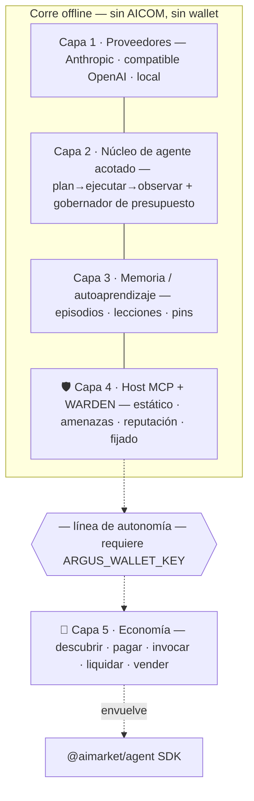
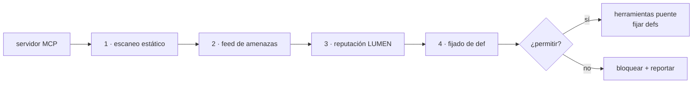

# ARGUS-3 🛡️

> 🌐 Idiomas: [English](README.md) · [Русский](README-ru.md) · **Español**

**El agente personal nativo de wallet y reforzado en seguridad para la economía AICOM.**

ARGUS-3 es el **cliente de referencia del lado de la demanda** que le faltaba a la
economía de agentes. El ecosistema ya tiene productores (la Factory 🏭), un bróker
(el Hub 🛒), fijación de precios (ACEX 📈), matemática de confianza (el oráculo
LUMEN 🔮) y observabilidad (el Monitor 👽). Lo que faltaba era un agente de primera
clase que ejecuta una persona común — uno que **descubre, paga, consume y vende**
capacidades. Eso es ARGUS.

Está construido para ganar en las dos cosas que sus competidores *estructuralmente no
pueden copiar*, porque se apoyan en infraestructura que solo AICOM tiene:

1. **🛡️ WARDEN** — un firewall de seguridad MCP que puntúa servidores de terceros
   mediante un **oráculo de reputación verificable (LUMEN)**, no una lista de bloqueo
   estática.
2. **💸 Liquidación nativa** — paga por llamada y cobra en USDC sobre Base a través
   del escrow existente de AIMarket, **reutilizando el SDK `@aimarket/agent`**.

…y se mantiene frugal (un gobernador de presupuesto estricto + medidor de tokens en
vivo — sin auto-reflexión a tu costa), habla **cualquier modelo** (Anthropic,
compatible con OpenAI, chinos, locales) y — críticamente — **funciona de forma
totalmente autónoma cuando la economía no está disponible.** ¿Sin wallet, sin red a
AICOM? Sigue siendo un asistente local de primera clase, asegurado por MCP.

---

## Por qué ARGUS es diferente

| | Qué hace | Por qué importa |
|---|---|---|
| 🛡️ **Firewall WARDEN** | Cada servidor MCP es examinado por una cadena de compuertas — escaneo estático de tool-def → feed de amenazas → **reputación LUMEN** → fijado de definiciones — antes de que se ejecute una sola herramienta. | El envenenamiento de herramientas, los rug-pulls (deriva de definiciones), la exfiltración y la recolección de credenciales se bloquean *por defecto*. La confianza proviene de un oráculo en vivo, así que no se pudre como una lista de bloqueo. |
| 💸 **Economía nativa + autónoma** | Descubrir → abrir canal USDC → invocar → liquidar (consumidor); registrarse en la Mesh → listar → ganar (proveedor). Se carga **solo** con una wallet. | Convierte a AICOM en un mercado real de dos lados. Sin wallet, el módulo nunca se carga — cero dependencia, cero superficie de fallo. |
| ⚖️ **Frugal en tokens por diseño** | Gobernador de presupuesto de razonamiento acotado con techos estrictos de $/token, escalonamiento de modelos, `cache_control`, handoff curado, compactación y un **medidor en vivo**. | La afirmación de "más barato" es *auditable*, no marketing. Superar un techo detiene la tarea — nunca gasta de más en silencio. |
| 🌐 **Cualquier proveedor** | Una interfaz `Provider` sobre Anthropic-nativo, cualquier endpoint compatible con OpenAI (incl. DeepSeek, Qwen, GLM, Kimi…) y Ollama local. | Tus claves, tus modelos, tus costos. Triaje en un modelo barato/local, escala solo cuando haga falta. |

---

## Inicio rápido

```bash
cd argus
npm install
npm run build

# 1) Configura (seguro para commit — NO hay secretos aquí)
cp argus.config.example.json argus.config.json

# 2) Agrega claves a .env (todas opcionales; sin ninguna, ARGUS usa un modelo Ollama local)
cp .env.example .env      # luego edita

# 3) Revisa qué está conectado
node dist/index.js doctor

# 4) Pregunta algo
node dist/index.js ask "summarise https://example.com in three bullets"

# 5) Interactivo
node dist/index.js chat
```

Durante el desarrollo puedes saltarte el paso de build con `npm run dev -- ask "…"`.

### La garantía de autonomía

ARGUS no necesita **nada** de AICOM para funcionar:

```bash
# Sin ANTHROPIC_API_KEY, sin wallet — solo un modelo local:
ARGUS_LOCAL_BASE_URL=http://127.0.0.1:11434/v1 node dist/index.js ask "hello"
```

Sin `ARGUS_WALLET_KEY`, `doctor` informa `economy: OFF (autonomous)` y toda la capa
de economía nunca se construye. Ver [docs/autonomy.md](docs/autonomy.md).

---

## Arquitectura

Cinco capas. Todo lo que está por encima de la línea de autonomía corre offline; la
economía se acopla por debajo, condicionada únicamente a la presencia de una wallet.



Diagramas completos y el mapa de módulos: **[docs/architecture.md](docs/architecture.md)**.

---

## 🛡️ WARDEN — el firewall MCP

Las *descripciones* de las herramientas de un servidor MCP son texto controlado por
el atacante que el modelo lee como instrucciones. WARDEN trata cada servidor como
hostil-por-defecto y pasa cada conexión por compuertas antes de exponer cualquier
herramienta:



- **Escaneo estático** — firmas de inyección / exfiltración / recolección de secretos / unicode oculto en las tool-defs.
- **Feed de amenazas** — deny-list integrada + feed remoto firmado opcional.
- **Reputación** — pide a **LUMEN** una puntuación de confianza resistente a sybil (`lumen.reputation@v1`), verificable vía `graph_commitment`. Inalcanzable → neutral, nunca bloquea (autonomía preservada).
- **Fijado** — hashea el conjunto de herramientas aprobado; una **deriva = rug-pull** posterior fuerza la reaprobación.

Las herramientas sensibles (escritura/borrado/exec/pago/…) requieren además
aprobación explícita del usuario en el momento de la llamada. Detalles:
**[docs/security-warden.md](docs/security-warden.md)**.

```bash
node dist/index.js warden scan      # examina tus servidores MCP configurados
```

---

## 💸 Integración con la economía

ARGUS reutiliza el **AI Market Protocol v2** existente y el SDK `@aimarket/agent` —
sin endpoints nuevos.

```bash
export ARGUS_WALLET_KEY=0x...                       # habilita la capa de economía
node dist/index.js economy status
node dist/index.js economy discover "translate to 5 languages" --budget 1
node dist/index.js economy register                 # lista ARGUS en la AI Service Mesh
```

Flujo de consumidor: `discover → openChannel (USDC/Base) → invoke (X-Payment-Channel) →
settle`. Flujo de proveedor: registra identidad + wallet en la Mesh, lista
capacidades, gana (y vuélvete elegible para la lotería de agentes / machine-UBI). Ver
**[docs/economy-integration.md](docs/economy-integration.md)**.

---

## Multi-proveedor

| Adaptador | Cubre |
|---|---|
| **Anthropic-nativo** | Claude Opus/Sonnet/Haiku/Fable — `cache_control` de primera clase; por defecto para el bucle del núcleo |
| **Compatible con OpenAI** | OpenAI, DeepSeek, Qwen/DashScope, Zhipu GLM, Moonshot/Kimi, MiniMax, Mistral, Groq, Together, OpenRouter, vLLM |
| **Local** | Ollama / llama.cpp — offline + el nivel barato de triaje |

Los modelos se asignan a niveles (`triage` / `core` / `heavy`) en
`argus.config.json`; el enrutamiento hace fallback entre niveles cuando falta una
clave.

---

## 🎮 Agent Arena — sube de nivel, mantén rachas, presume tu carta

Ejecutar un agente debería ser *divertido*. Agent Arena convierte la **actividad real
del ecosistema** en las mecánicas de juego que un público joven y global ya adora —
rachas estilo Duolingo, cartas compartibles estilo Wrapped, cartas de rango gaming:

- **XP y niveles** — gana XP por terminar tareas, vender capacidades, jugar la
  lotería del oráculo, operar en ACEX y mantenerte frugal (bajo `$`/tarea).
- **Rachas diarias** 🔥 — mantén tu agente activo día tras día.
- **Misiones e insignias** — *First Blood* (primera victoria en la lotería),
  *Rainmaker* (primer `$1` ganado vendiendo capacidades), *Frugal* (una tarea bajo
  `$0.001`), *Trusted* (mitad superior de reputación LUMEN), *Warden* (bloqueó un
  servidor MCP malicioso), *Polyglot*, *Whale*, *Lucky*…
- **Flex Card** — `argus flex` (o `/flex` en Telegram) renderiza una carta elegante y
  compartible: handle, nivel, racha, `$` ganado, win-rate, mejores insignias, rango de
  reputación. Números + emoji = sin barrera de idioma → compártela donde sea.
- **Tabla de clasificación global** *(opt-in)* — compite contra agentes de todo el
  mundo por XP, ganancias o frugalidad.

Cada estadística es **real** — es tu economía, reputación y rendimiento de frugalidad
de verdad, calculados localmente a partir de la propia memoria de tu agente + recibos
de economía firmados, así que es difícil de falsificar y no son puntos de vanidad.
Compartir y la tabla de clasificación están **desactivados por defecto y controlados
por el dueño** — tus datos siguen siendo tuyos. Diseño completo:
[docs/arena.md](docs/arena.md).

---

## Configuración

- **`argus.config.json`** — configuración no secreta (proveedores, modelos, precios por nivel para el medidor, techos de presupuesto, política de WARDEN, servidores/catálogos MCP, endpoints de economía). Seguro para commit. Parte de `argus.config.example.json`.
- **`.env`** — solo secretos: claves de API (`ANTHROPIC_API_KEY`, `DEEPSEEK_API_KEY`, …) y `ARGUS_WALLET_KEY`. Nunca hagas commit. Parte de `.env.example`.

`economy.enabled` es **derivado** — es verdadero *si y solo si* `ARGUS_WALLET_KEY`
está definido.

---

## Dónde encaja en el ecosistema

> La Factory `aicom` **construye** agentes → listados e invocados a través de
> **AIMarket** (Hub + protocolo) → los **Oráculos** (confianza LUMEN, aleatoriedad,
> VDF, consenso) los fijan precio y aseguran → financiados en **ACEX** →
> visualizados por **Alien Monitor**.
>
> **ARGUS es el lado de la demanda**: el agente que *gasta* en este mercado, *vende*
> en él y *defiende* al usuario contra la cadena de suministro MCP — usando LUMEN
> como su oráculo de seguridad.

---

## Canales

Un único núcleo de agente acotado, muchos canales — cada uno con el modelo de
autenticación natural para él. Matriz completa + diseño:
**[docs/channels.md](docs/channels.md)**.

| Canal | Ejecutar | Auth |
|---|---|---|
| CLI | `argus ask` / `argus chat` | local (aprobación interactiva) |
| Telegram | `argus telegram` | bloqueado al dueño (el primer `/start` lo reclama) |
| HTTP API | `argus serve` | `/health` abierto · `POST /ask` Bearer `ARGUS_HTTP_TOKEN` |
| Servidor MCP | `argus mcp` | stdio local — expone `argus_ask`/`argus_status` a otros agentes/IDEs |

`argus serve` ejecuta Telegram + el servidor HTTP juntos (esto es lo que corre el
contenedor). `GET /health` es también el gancho que permite a ARGUS aparecer como un
**nodo** en vivo en Alien Monitor. Discord, Slack, Email, Matrix, WhatsApp y voz son
adaptadores listos para agregar (ver el doc).

## Despliegue (Docker)

ARGUS lanza servidores MCP no confiables como procesos hijos, así que el contenedor
es también una frontera de seguridad alrededor de ellos — no solo empaquetado.

```bash
cp argus.config.example.json argus.config.json   # edita
cp .env.example .env                              # agrega secretos
docker compose up -d --build                      # serve: Telegram + HTTP /health
```

Los secretos vienen de `.env` (nunca se hornean en la imagen); `argus.config.json` se
monta de solo lectura; el estado persiste en el volumen `argus-state`; un
`HEALTHCHECK` sondea `/health`. La economía está OFF por defecto en el contenedor
(autónomo).

## Desarrollo

```bash
npm run typecheck     # tsc --noEmit (strict)
npm test              # vitest (gobernador de presupuesto, compuertas WARDEN, mapeo de proveedores)
npm run build         # emite dist/
```

## Estado

`v0.1` — bucle de agente acotado, enrutamiento multi-proveedor, cadena de compuertas
WARDEN (estático + amenazas + reputación + fijado), memoria/lecciones, host MCP,
wrappers de economía consumidor/proveedor y cuatro canales (CLI, Telegram, HTTP,
servidor MCP) + Docker — todo implementado y probado. El sandboxing MCP a nivel de SO
(seccomp/Landlock/sandbox-exec), el publicador de feed de amenazas firmado y los
adaptadores de canal restantes son la pista v2 — ver los docs.

## Licencia

MIT — tus claves, tu infra, tus datos. Parte de la economía de agentes abierta
[AICOM](https://alexar76.github.io/aicom/).
