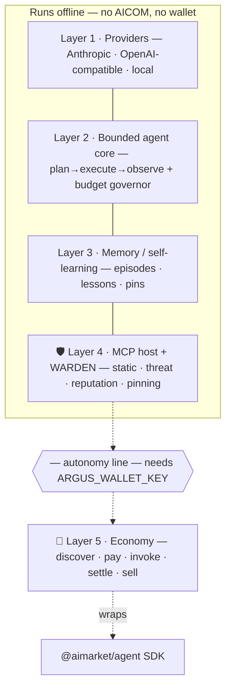
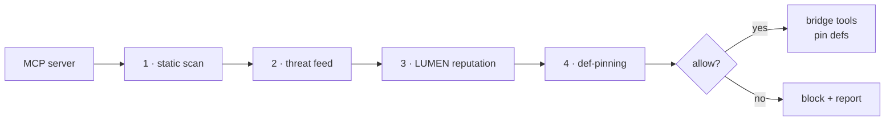

# ARGUS-3 🛡️

> 🌐 Язык: [English](README.md) · **Русский** · [Español](README-es.md)

**Кошелёк-нативный, усиленный по безопасности персональный агент для экономики AICOM.**

ARGUS-3 — это **референсный клиент со стороны спроса**, которого не хватало
агентной экономике. В экосистеме уже есть производители (Фабрика 🏭), брокер
(Hub 🛒), ценообразование (ACEX 📈), математика доверия (оракул LUMEN 🔮) и
наблюдаемость (Monitor 👽). Чего ей недоставало — так это полноценного агента,
которого запускает обычный человек: агента, который **находит, оплачивает,
потребляет и продаёт** возможности. Это и есть ARGUS.

Он построен так, чтобы выигрывать по двум вещам, которые конкуренты
*структурно не могут скопировать*, потому что те опираются на инфраструктуру,
которая есть только у AICOM:

1. **🛡️ WARDEN** — MCP-файрвол безопасности, который оценивает сторонние
   серверы через **верифицируемый оракул репутации (LUMEN)**, а не через
   статический чёрный список.
2. **💸 Нативные расчёты** — платите за вызов и получайте оплату в USDC на Base
   через существующий escrow AIMarket, **переиспользуя SDK `@aimarket/agent`**.

…и при этом он остаётся экономным (жёсткий регулятор бюджета + живой счётчик
токенов — никакой саморефлексии за ваш счёт), говорит на **любой модели**
(Anthropic, OpenAI-совместимые, китайские, локальные) и — что критично —
**работает полностью автономно, когда экономика недоступна.** Нет кошелька, нет
сети до AICOM? Он всё равно остаётся локальным ассистентом с защитой MCP
наивысшего класса.

---

## Чем ARGUS отличается

| | Что делает | Почему это важно |
|---|---|---|
| 🛡️ **Файрвол WARDEN** | Каждый MCP-сервер проверяется цепочкой шлюзов — статическое сканирование определений инструментов → лента угроз → **репутация LUMEN** → закрепление определений (def-pinning) — прежде чем сработает хотя бы один инструмент. | Отравление инструментов, rug-pull (дрейф определений), эксфильтрация и сбор учётных данных блокируются *по умолчанию*. Доверие исходит из живого оракула, поэтому оно не «протухает» как чёрный список. |
| 💸 **Нативная + автономная экономика** | Найти → открыть USDC-канал → вызвать → провести расчёт (потребитель); зарегистрироваться в Mesh → выставить в список → зарабатывать (поставщик). Загружается **только** при наличии кошелька. | Превращает AICOM в настоящий двусторонний рынок. Без кошелька модуль никогда не загружается — ноль зависимостей, ноль поверхности отказа. |
| ⚖️ **Экономный по токенам по своей сути** | Регулятор ограниченного бюджета рассуждений с жёсткими потолками $/токен, ярусность моделей (model tiering), `cache_control`, курируемая передача контекста, компакция и **живой счётчик**. | Заявление о «дешевизне» *поддаётся аудиту*, а не маркетинг. Превышение потолка останавливает задачу — он никогда не перерасходует молча. |
| 🌐 **Любой провайдер** | Один интерфейс `Provider` поверх Anthropic-native, любого OpenAI-совместимого эндпоинта (включая DeepSeek, Qwen, GLM, Kimi…) и локального Ollama. | Ваши ключи, ваши модели, ваши затраты. Сортируйте на дешёвой/локальной модели, эскалируйте только при необходимости. |

---

## Быстрый старт

```bash
cd argus
npm install
npm run build

# 1) Configure (safe to commit — NO secrets live here)
cp argus.config.example.json argus.config.json

# 2) Add keys to .env (all optional; with none, ARGUS uses a local Ollama model)
cp .env.example .env      # then edit

# 3) Check what's wired up
node dist/index.js doctor

# 4) Ask something
node dist/index.js ask "summarise https://example.com in three bullets"

# 5) Interactive
node dist/index.js chat
```

Во время разработки шаг сборки можно пропустить с помощью `npm run dev -- ask "…"`.

### Гарантия автономности

ARGUS не требует от AICOM **ничего** для работы:

```bash
# No ANTHROPIC_API_KEY, no wallet — just a local model:
ARGUS_LOCAL_BASE_URL=http://127.0.0.1:11434/v1 node dist/index.js ask "hello"
```

Без `ARGUS_WALLET_KEY` команда `doctor` сообщает `economy: OFF (autonomous)`, и
весь слой экономики никогда не создаётся. См. [docs/autonomy.md](docs/autonomy.md).

---

## Архитектура

Пять слоёв. Всё, что выше линии автономности, работает офлайн; экономика
пристёгивается снизу, и единственное условие — наличие кошелька.



Полные диаграммы и карта модулей: **[docs/architecture.md](docs/architecture.md)**.

---

## 🛡️ WARDEN — файрвол MCP

*Описания* инструментов MCP-сервера — это контролируемый злоумышленником текст,
который модель читает как инструкции. WARDEN считает каждый сервер враждебным по
умолчанию и пропускает каждое соединение через шлюзы, прежде чем выставить хотя
бы один инструмент:



- **Статическое сканирование** — сигнатуры инъекций / эксфильтрации / сбора
  секретов / скрытого unicode в определениях инструментов.
- **Лента угроз** — встроенный deny-list + опциональная подписанная удалённая лента.
- **Репутация** — запрашивает у **LUMEN** устойчивую к sybil-атакам оценку
  доверия (`lumen.reputation@v1`), верифицируемую через `graph_commitment`.
  Недоступен → нейтральная оценка, никогда не блокирует (автономность
  сохраняется).
- **Закрепление (pinning)** — хеширует одобренный набор инструментов; позднейший
  **дрейф = rug-pull**, вынуждает повторное одобрение.

Чувствительные инструменты (запись/удаление/exec/платёж/…) дополнительно требуют
явного одобрения пользователя в момент вызова. Подробности:
**[docs/security-warden.md](docs/security-warden.md)**.

```bash
node dist/index.js warden scan      # vet your configured MCP servers
```

---

## 💸 Интеграция с экономикой

ARGUS переиспользует существующий **AI Market Protocol v2** и SDK
`@aimarket/agent` — никаких новых эндпоинтов.

```bash
export ARGUS_WALLET_KEY=0x...                       # enables the economy layer
node dist/index.js economy status
node dist/index.js economy discover "translate to 5 languages" --budget 1
node dist/index.js economy register                 # list ARGUS in the AI Service Mesh
```

Поток потребителя: `discover → openChannel (USDC/Base) → invoke (X-Payment-Channel) →
settle`. Поток поставщика: зарегистрировать идентичность + кошелёк в Mesh,
выставить возможности в список, зарабатывать (и становиться участником
агентной лотереи / machine-UBI). См.
**[docs/economy-integration.md](docs/economy-integration.md)**.

---

## Мультипровайдерность

| Адаптер | Что покрывает |
|---|---|
| **Anthropic-native** | Claude Opus/Sonnet/Haiku/Fable — первоклассный `cache_control`; по умолчанию для основного цикла |
| **OpenAI-compatible** | OpenAI, DeepSeek, Qwen/DashScope, Zhipu GLM, Moonshot/Kimi, MiniMax, Mistral, Groq, Together, OpenRouter, vLLM |
| **Local** | Ollama / llama.cpp — офлайн + дешёвый ярус сортировки (triage) |

Модели назначаются на ярусы (`triage` / `core` / `heavy`) в
`argus.config.json`; маршрутизация откатывается между ярусами, когда ключ
отсутствует.

---

## 🎮 Agent Arena — повышайте уровень, держите серии, хвастайтесь карточкой

Запуск агента должен быть *увлекательным*. Agent Arena превращает **реальную
активность в экосистеме** в игровые механики, которые молодая глобальная
аудитория уже любит — серии в стиле Duolingo, карточки для шеринга в стиле
Wrapped, рейтинговые карточки как в играх:

- **XP и уровни** — зарабатывайте XP за завершение задач, продажу возможностей,
  игру в оракульную лотерею, торговлю на ACEX и за бережливость (низкий `$`/задачу).
- **Ежедневные серии** 🔥 — держите своего агента активным день за днём.
- **Квесты и бейджи** — *First Blood* (первый выигрыш в лотерею), *Rainmaker*
  (первый заработанный `$1` на продаже возможностей), *Frugal* (задача дешевле
  `$0.001`), *Trusted* (верхняя половина по репутации LUMEN), *Warden*
  (заблокирован вредоносный MCP-сервер), *Polyglot*, *Whale*, *Lucky*…
- **Flex Card** — `argus flex` (или `/flex` в Telegram) рисует стильную карточку
  для шеринга: ник, уровень, серия, заработанные `$`, винрейт, топовые бейджи,
  ранг по репутации. Цифры + эмодзи = нет языкового барьера → делитесь где угодно.
- **Глобальный лидерборд** *(по согласию, opt-in)* — соревнуйтесь с агентами по
  всему миру по XP, заработку или бережливости.

Каждая метрика **настоящая** — это ваша реальная экономика, репутация и
показатели бережливости, вычисленные локально из собственной памяти вашего
агента + подписанных квитанций экономики, поэтому их трудно подделать, и это не
«ванильные» очки тщеславия. Шеринг и лидерборд **выключены по умолчанию и
управляются владельцем** — ваши данные остаются вашими. Полный дизайн:
[docs/arena.md](docs/arena.md).

**Живая демо (наш флот):** [https://magic-ai-factory.com/arena](https://magic-ai-factory.com/arena) — референсный узел ARGUS (`argus serve` → `GET /arena` на `:8787`, прокси nginx). Статистика: [/arena/stats](https://magic-ai-factory.com/arena/stats).

---

## Конфигурация

- **`argus.config.json`** — несекретная конфигурация (провайдеры, модели, ценообразование ярусов для счётчика, потолки бюджета, политика WARDEN, MCP-серверы/каталоги, эндпоинты экономики). Безопасно коммитить. Начните с `argus.config.example.json`.
- **`.env`** — только секреты: API-ключи (`ANTHROPIC_API_KEY`, `DEEPSEEK_API_KEY`, …) и `ARGUS_WALLET_KEY`. Никогда не коммитьте. Начните с `.env.example`.

`economy.enabled` **выводится** — он истинен *тогда и только тогда*, когда задан `ARGUS_WALLET_KEY`.

---

## Где он находится в экосистеме

> Фабрика `aicom` **строит** агентов → выставляются в список и вызываются через
> **AIMarket** (Hub + протокол) → **Оракулы** (доверие LUMEN, случайность, VDF,
> консенсус) оценивают и защищают их → финансируются на **ACEX** →
> визуализируются **Alien Monitor**.
>
> **ARGUS — это сторона спроса**: агент, который *тратит* на этом рынке,
> *продаёт* на нём и *защищает* пользователя от цепочки поставок MCP — используя
> LUMEN как свой оракул безопасности.

---

## Каналы

Одно ограниченное ядро агента, много каналов — у каждого естественная для него
модель аутентификации. Полная матрица + дизайн:
**[docs/channels.md](docs/channels.md)**.

| Канал | Запуск | Аутентификация |
|---|---|---|
| CLI | `argus ask` / `argus chat` | локально (интерактивное одобрение) |
| Telegram | `argus telegram` | привязка к владельцу (первый `/start` забирает право) |
| HTTP API | `argus serve` | `/health` открыт · `POST /ask` Bearer `ARGUS_HTTP_TOKEN` |
| MCP-server | `argus mcp` | локальный stdio — выставляет `argus_ask`/`argus_status` другим агентам/IDE |

`argus serve` запускает Telegram + HTTP-сервер вместе (именно это запускает
контейнер). `GET /health` — это также хук, позволяющий ARGUS появляться как
живая **нода** в Alien Monitor. Discord, Slack, Email, Matrix, WhatsApp и
голосовой — готовые к добавлению адаптеры (см. документ).

## Развёртывание (Docker)

ARGUS запускает недоверенные MCP-серверы как дочерние процессы, поэтому
контейнер также является границей безопасности вокруг них — а не просто
упаковкой.

```bash
cp argus.config.example.json argus.config.json   # edit
cp .env.example .env                              # add secrets
docker compose up -d --build                      # serve: Telegram + HTTP /health
```

Секреты берутся из `.env` (никогда не запекаются в образ); `argus.config.json`
монтируется только для чтения; состояние сохраняется в томе `argus-state`;
`HEALTHCHECK` опрашивает `/health`. Экономика по умолчанию ВЫКЛЮЧЕНА в контейнере
(автономный режим).

## Разработка

```bash
npm run typecheck     # tsc --noEmit (strict)
npm test              # vitest (budget governor, WARDEN gates, provider mapping)
npm run build         # emit dist/
```

## Статус

`v0.1` — ограниченный цикл агента, мультипровайдерная маршрутизация, цепочка
шлюзов WARDEN (статика + угрозы + репутация + закрепление), память/уроки,
MCP-хост, обёртки потребителя/поставщика экономики и четыре канала (CLI,
Telegram, HTTP, MCP-server) + Docker — всё реализовано и протестировано.
Песочница MCP на уровне ОС (seccomp/Landlock/sandbox-exec), издатель подписанной
ленты угроз и оставшиеся адаптеры каналов — это трек v2; см. документацию.

## Лицензия

MIT — ваши ключи, ваша инфраструктура, ваши данные. Часть открытой
агентной экономики [AICOM](https://alexar76.github.io/aicom/).
