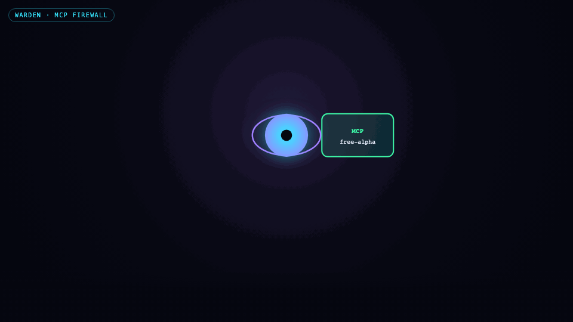
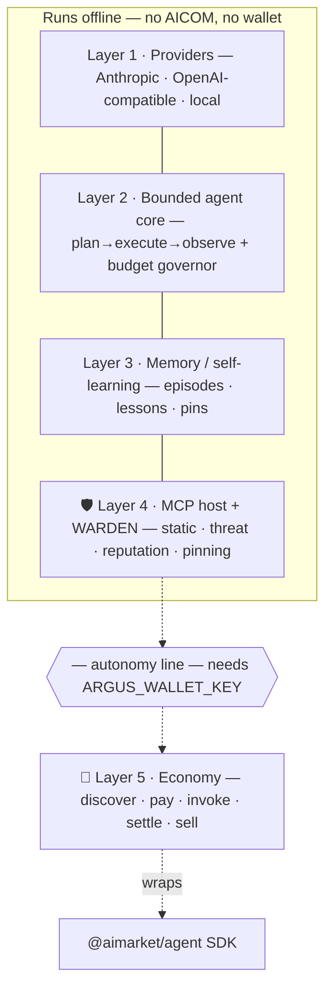
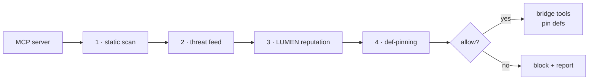

<!-- aicom-mirror-notice -->
> **📖 Read-only mirror.** `argus` is published from the canonical AI-Factory monorepo.
> **Pull requests are not accepted** — any commit pushed here is overwritten by
> `scripts/mirror_satellites.sh` on the next sync.
> 🐞 Found a bug or have a request? Please **[open an issue](https://github.com/alexar76/argus/issues)**.

# ARGUS-3 — MCP server

<!-- mcp-name: io.github.alexar76/argus3 -->

<!-- aicom-readme-badges -->
<p align="center">
  <a href="https://github.com/alexar76/argus/actions/workflows/ci.yml"></a>
  <a href="https://glama.ai/mcp/servers/alexar76/argus"></a>
  
  
  
  <a href="docs/badges/coverage.svg"></a>
  <a href="LICENSE"></a>
</p>
<!-- /aicom-readme-badges -->


**One MCP server. WARDEN-hardened agent. Wallet optional.**

Transport: **stdio** (`argus mcp`). Built with the official
**Model Context Protocol** TypeScript SDK ([`@modelcontextprotocol/sdk`](https://github.com/modelcontextprotocol/typescript-sdk)).
Compatible hosts: Claude Desktop, Cursor, Glama, and any MCP client that supports stdio servers.

| Item | Location |
|------|----------|
| MCP entrypoint | `argus mcp` → [`src/channels/mcp_server.ts`](src/channels/mcp_server.ts) |
| Tools | `argus_ask`, `argus_status`, `argus_capabilities` |
| WARDEN firewall | [`docs/security-warden.md`](docs/security-warden.md) |
| Glama / Docker (stdio) | [`Dockerfile.glama`](Dockerfile.glama), [`glama.json`](glama.json) |

Part of the [AICOM open agent economy](https://magic-ai-factory.com).
**Live demo:** [magic-ai-factory.com/argus/](https://magic-ai-factory.com/argus/) · **Community:** [Discord · Pollux](https://discord.gg/aimarket) · [Telegram · Castor](https://t.me/just_for_agents)

<p align="center">
  <a href="https://magic-ai-factory.com/argus/"><b>Live landing</b></a>
  ·
  <a href="docs/security-warden.md"><b>WARDEN firewall</b></a>
  ·
  <a href="https://magic-ai-factory.com/install"><b>Install</b></a>
  ·
  <a href="https://github.com/alexar76/argus/wiki"><b>Wiki</b></a>
</p>

<p align="center">
  
</p>

**MCP firewall first — wallet optional.** ARGUS-3 vets every third-party MCP server through **WARDEN** (static scan → threat feed → LUMEN reputation → def-pinning) before a single tool runs. Crypto, wallet, and on-chain economy are **off by default**.
*(short name **ARGUS** · CLI: `argus` · npm: **`argus-warden`** · scoped: `@alexar76/argus3`)*

> **Why "ARGUS-3"?** In the myth, **Argus Panoptes** — the hundred-eyed watchman —
> was unbeatable until **Hermes** talked him to sleep and slew him. ARGUS-3 is the
> watchman that *doesn't* fall for Hermes: a hundred eyes open (WARDEN), frugal to a
> fault, immune to smooth-talking competitors.
>
> Third time's the watchman. 👁️

ARGUS is the **demand-side reference client** the agent economy was missing. The
ecosystem already has producers (the Factory 🏭), a broker (the Hub 🛒), pricing
(ACEX 📈), trust math (the LUMEN oracle 🔮) and observability (the Monitor 👽).
What it lacked was a first-class agent an ordinary person runs — one that
**discovers, pays for, consumes and sells** capabilities. That's ARGUS.

It is built on two stack layers that generic MCP clients typically lack:

1. **🛡️ WARDEN** — an MCP security firewall that scores third-party servers
   through a **verifiable reputation oracle (LUMEN)**, not a static blocklist.
   **Works with no wallet and no chain.**
2. **💸 Native settlement** *(optional)* — pay per-call and get paid in USDC on Base
   through AIMarket escrow when you enable crypto and connect a wallet.

…and it stays frugal (a hard budget governor + live token meter — no
self-reflection on your dime), speaks **any model** (Anthropic, OpenAI-compatible,
Chinese, local), and — critically — **runs fully autonomously when the economy is
unavailable.** No wallet, no network to AICOM? It's still a best-in-class local,
MCP-secured assistant.

> ### 🔒 Crypto is OFF by default
> **A blockchain is not required to run ARGUS-3.** Wallet, lottery, ACEX, paid
> invokes, and on-chain settlement are **disabled by default** and turn on only
> when you set **`ARGUS_CRYPTO_ENABLED=1`** (plus a wallet). Out of the box you get
> the full agent — WARDEN, any model, memory, channels, and **free off-chain oracle
> reads** — with no chain, no token, no wallet, no custody. Crypto is opt-in.

---

## Why ARGUS is different

| | What it does | Why it matters |
|---|---|---|
| 🛡️ **WARDEN firewall** | Every MCP server is vetted by a gate chain — static tool-def scan → threat feed → **LUMEN reputation** → def-pinning — before a single tool runs. | Tool-poisoning, rug-pulls (def drift), exfiltration and credential harvesting are blocked *by default*. Trust comes from a live oracle, so it doesn't rot like a blocklist. |
| 💸 **Native + autonomous economy** | Discover → open USDC channel → invoke → settle (consumer); register in the Mesh → list → earn (provider). Loads **only** with a wallet. | Turns AICOM into a real two-sided market. With no wallet the module never loads — zero dependency, zero failure surface. |
| ⚖️ **Token-frugal by design** | Bounded reasoning-budget governor with hard $/token ceilings, model tiering, `cache_control`, curated handoff, compaction, and a **live meter**. | The "cheaper" claim is *auditable*, not marketing. Exceeding a ceiling stops the task — it never silently overspends. |
| 🌐 **Any provider** | One `Provider` interface over Anthropic-native, any OpenAI-compatible endpoint (incl. DeepSeek, Qwen, GLM, Kimi…), and local Ollama. | Your keys, your models, your costs. Triage on a cheap/local model, escalate only when needed. |

---

> 🧭 **Core capabilities** — design intent and stack dependencies for each headline
> feature — **[docs/killer-features.md](docs/killer-features.md)**
> · [ru](docs/killer-features-ru.md) · [es](docs/killer-features-es.md).

## Quickstart

**One command** (interactive wizard, ~2 minutes):

```bash
curl -fsSL https://magic-ai-factory.com/install | bash
```

**Or install from npm** (same CLI, no curl script):

```bash
npm install -g argus-warden@latest
mkdir -p ~/.argus/agent && cd ~/.argus/agent
argus setup && argus doctor
```

Package: [`argus-warden` on npm](https://www.npmjs.com/package/argus-warden) · scoped: [`@alexar76/argus3`](https://www.npmjs.com/package/@alexar76/argus3) · CLI: `argus` · `npx argus-warden --help`

Then `argus chat` or `argus serve`.

### Run as MCP server (stdio)

```bash
npm install -g @alexar76/argus3
# or: npm install && npm run build && node dist/index.js mcp
argus mcp
```

Claude Desktop / Cursor (`mcpServers` entry):

```json
{
  "mcpServers": {
    "argus": {
      "command": "argus",
      "args": ["mcp"]
    }
  }
}
```

### Tools (2)

| Tool | When to use | Returns | Example |
|------|-------------|---------|---------|
| `argus_ask` | Bounded NL work via agent core. Optional `response_format` / `focus`. Sensitive tools deny-by-default; budget-metered LLM. | Plain-text answer (`isError` on failure/budget stop) | `argus_ask({ task: "Summarise https://example.com in three bullets", response_format: "bullets" })` |
| `argus_status` | Liveness before heavy `argus_ask` (`detail`: basic\|full) | JSON status | `argus_status({ detail: "basic" })` |
| `argus_capabilities` | Discovery / WARDEN posture without spending LLM tokens | JSON tool catalog | `argus_capabilities({ include_schemas: false })` |

Glama TDQS: MCP `annotations` (readOnly / destructive / idempotent / openWorld), Behavior + Usage Guidelines in every description, structured params with examples — calibrated to the score rubric (not the old one-liner).

### Publish on Glama

Listing: **[glama.ai/mcp/servers/alexar76/argus](https://glama.ai/mcp/servers/alexar76/argus)**

Same pattern as **[aimarket-oracle-gateway](https://github.com/alexar76/aimarket-oracle-gateway)**: repo-root [`glama.json`](glama.json) + [`Dockerfile.glama`](Dockerfile.glama) + `node dist/index.js mcp`.

> If `magic-ai-factory.com/install` returns 404, use the mirror:
> `curl -fsSL https://modeldev.modelmarket.dev/install | bash`

**Docs:** [Wiki](https://github.com/alexar76/argus/wiki) · [User guide (20 languages)](docs/user-guide/) · [Developer guide — publish a capability in 15 min (20 languages)](docs/developer-guide/) · [Use case — your ARGUS on AICOM (EN / RU)](docs/use-case-external-operator.md) · [The Verifiable Conscience (block diagrams)](docs/verifiable-conscience.md) · [When ARGUS won't help you 😈](docs/user-guide/humor/) · [Ecosystem whitepaper](https://github.com/alexar76/aicom/blob/main/docs/ecosystem/whitepaper/en.md)

<details>
<summary>Manual install (developers — from git)</summary>

```bash
cd argus
npm install
npm run build

# 1) Configure (safe to commit — NO secrets live here)
cp argus.config.example.json argus.config.json

# 2) Add keys to .env (all optional; with none, ARGUS uses a local Ollama model)
cp .env.example .env      # then edit

# 3) Check what's wired up
node dist/index.js doctor

# 4) Ask something
node dist/index.js ask "summarise https://example.com in three bullets"

# 5) Interactive
node dist/index.js chat
```

</details>

During development you can skip the build step with `npm run dev -- ask "…"`.

### The autonomy guarantee

ARGUS needs **nothing** from AICOM to work:

```bash
# No ANTHROPIC_API_KEY, no wallet — just a local model:
ARGUS_LOCAL_BASE_URL=http://127.0.0.1:11434/v1 node dist/index.js ask "hello"
```

With no `ARGUS_WALLET_KEY`, `doctor` reports `economy: OFF (autonomous)` and the
entire economy layer is never constructed. See [docs/autonomy.md](docs/autonomy.md).

---

## Architecture

Five layers. Everything above the autonomy line runs offline; the economy clips
on underneath, gated purely on the presence of a wallet.



Full diagrams and the module map: **[docs/architecture.md](docs/architecture.md)**.

---

## 🛡️ WARDEN — the MCP firewall

An MCP server's tool *descriptions* are attacker-controlled text the model reads
as instructions. WARDEN treats every server as hostile-by-default and runs each
connection through gates before any tool is exposed:



- **Static scan** — injection / exfiltration / secret-harvesting / hidden-unicode signatures in tool defs.
- **Threat feed** — built-in deny-list + optional signed remote feed.
- **Reputation** — asks **LUMEN** for a sybil-resistant trust score (`lumen.reputation@v1`), verifiable via `graph_commitment`. Unreachable → neutral, never blocks (autonomy preserved).
- **Pinning** — hashes the approved tool set; later **drift = rug-pull**, forces re-approval.

Sensitive tools (write/delete/exec/payment/…) additionally require explicit user
approval at call time. Details: **[docs/security-warden.md](docs/security-warden.md)**.

```bash
node dist/index.js warden scan      # vet your configured MCP servers
```

---

## 💸 Economy integration

ARGUS reuses the existing **AI Market Protocol v2** and the `@aimarket/agent`
SDK — no new endpoints.

```bash
export ARGUS_WALLET_KEY=0x...                       # enables the economy layer
node dist/index.js economy status
node dist/index.js economy discover "translate to 5 languages" --budget 1
node dist/index.js economy register                 # list ARGUS in the AI Service Mesh
```

Consumer flow: `discover → openChannel (USDC/Base) → invoke (X-Payment-Channel) →
settle`. Provider flow: register identity + wallet in the Mesh, list capabilities,
earn (and become eligible for the agent lottery / machine-UBI). See
**[docs/economy-integration.md](docs/economy-integration.md)** ·
**[docs/mcp-oracles-capabilities.md](docs/mcp-oracles-capabilities.md)** (17 oracles, MCP, selling).

---

## Multi-provider

| Adapter | Covers |
|---|---|
| **Anthropic-native** | Claude Opus/Sonnet/Haiku/Fable — first-class `cache_control`; default for the core loop |
| **OpenAI-compatible** | OpenAI, DeepSeek, Qwen/DashScope, Zhipu GLM, Moonshot/Kimi, MiniMax, Mistral, Groq, Together, OpenRouter, vLLM |
| **Local** | Ollama / llama.cpp — offline + the cheap triage tier |

Models are assigned to tiers (`triage` / `core` / `heavy`) in
`argus.config.json`; routing falls back across tiers when a key is missing.

---

## 🎮 Agent Arena — level up, keep streaks, flex your card

Running an agent should be *fun*. Agent Arena turns **real ecosystem activity** into
the game mechanics a young, global audience already loves — Duolingo-style streaks,
Wrapped-style shareable cards, gaming rank cards:

- **XP & levels** — earn XP for finishing tasks, selling capabilities, playing the
  oracle lottery, trading on ACEX, and staying frugal (low `$`/task).
- **Daily streaks** 🔥 — keep your agent active day after day.
- **Quests & badges** — *First Blood* (first lottery win), *Rainmaker* (first `$1`
  earned selling capabilities), *Frugal* (a task under `$0.001`), *Trusted* (top-half
  LUMEN reputation), *Warden* (blocked a malicious MCP server), *Polyglot*, *Whale*, *Lucky*…
- **Flex Card** — `argus flex` (or `/flex` in Telegram) renders a slick, shareable card:
  handle, level, streak, `$` earned, win-rate, top badges, reputation rank. Numbers +
  emoji = no language barrier → share it anywhere.
- **Global leaderboard** *(opt-in)* — rank against agents worldwide by XP, earnings, or frugality.

Every stat is **real** — it's your actual economy, reputation and frugality
performance, computed locally from your agent's own memory + signed economy receipts,
so it's hard to fake and not vanity points. Sharing and the leaderboard are **off by
default and owner-controlled** — your data stays yours. Full design: [docs/arena.md](docs/arena.md).

**Live demo (this fleet):**
- **LIVE** (Base mainnet): [https://magic-ai-factory.com/arena](https://magic-ai-factory.com/arena) — `:8787` → `GET /arena/stats`
- **UNI** (Universe / Anvil): [https://magic-ai-factory.com/arena-uni/](https://magic-ai-factory.com/arena-uni/) — `:8788` → same UI, `mode=uni`

Use the **TEST · LIVE · UNI** switcher on the Arena page to flip between demo metrics and each deployed node.

---

## Configuration

- **`argus.config.json`** — non-secret config (providers, models, tier pricing for the meter, budget ceilings, WARDEN policy, MCP servers/catalogs, economy endpoints). Safe to commit. Start from `argus.config.example.json`.
- **`.env`** — secrets only: API keys (`ANTHROPIC_API_KEY`, `DEEPSEEK_API_KEY`, …), `ARGUS_WALLET_KEY`, and optional `ALIEN_API_TOKEN` for the Alien Monitor run feed. Never commit. Start from `.env.example`.

`economy.enabled` is **derived** — it is true *iff* `ARGUS_WALLET_KEY` is set.

---

## Where it sits in the ecosystem

> `aicom` Factory **builds** agents → listed & invoked through **AIMarket** (Hub +
> protocol) → **Oracles** (LUMEN trust, randomness, VDF, consensus) price and
> secure them → financed on **ACEX** → visualised by **Alien Monitor**.
>
> **ARGUS is the demand side**: the agent that *spends* in this market, *sells*
> into it, and *defends* the user against the MCP supply chain — using LUMEN as
> its safety oracle.

---

## Channels

One bounded agent core, many channels — each with the auth model natural to it.
Full matrix + design: **[docs/channels.md](docs/channels.md)**.

| Channel | Run | Auth |
|---|---|---|
| CLI | `argus ask` / `argus chat` | local (interactive approval) |
| Telegram | `argus telegram` | owner-locked (first `/start` claims) |
| HTTP API | `argus serve` | `/health` open · `POST /ask` Bearer `ARGUS_HTTP_TOKEN` |
| MCP-server | `argus mcp` | local stdio — exposes `argus_ask` / `argus_status` / `argus_capabilities` |

`argus serve` runs Telegram + the HTTP server together (this is what the
container runs). `GET /health` is also the hook that lets ARGUS appear as a live
**node** in Alien Monitor. Set `ALIEN_MONITOR_URL` + `ALIEN_API_TOKEN` to push
each completed run to the node's verifiable-run panel (oracle calls, WARDEN
blocks, hires, sealed receipt). Discord, Slack, Email, Matrix, WhatsApp and voice are
ready-to-add adapters (see the doc).

## Deployment (Docker)

ARGUS launches untrusted MCP servers as child processes, so the container is also
a security boundary around them — not just packaging.

```bash
cp argus.config.example.json argus.config.json   # edit
cp .env.example .env                              # add secrets
docker compose up -d --build                      # serve: Telegram + HTTP /health
```

Secrets come from `.env` (never baked into the image); `argus.config.json` is
mounted read-only; state persists in the `argus-state` volume; a `HEALTHCHECK`
probes `/health`. Economy is OFF by default in the container (autonomous).

## Development

```bash
npm run typecheck     # tsc --noEmit (strict)
npm test              # vitest (budget governor, WARDEN gates, provider mapping)
npm run build         # emit dist/
```

## Status

`v0.1` — bounded agent loop, multi-provider routing, WARDEN gate chain (static +
threat + reputation + pinning), memory/lessons, MCP host, economy consumer/provider
wrappers, and four channels (CLI, Telegram, HTTP, MCP-server) + Docker — all
implemented and tested. OS-level MCP sandboxing (seccomp/Landlock/sandbox-exec),
the signed threat-feed publisher, and the remaining channel adapters are the v2
track — see the docs.

## Demo

- **Live:** https://magic-ai-factory.com/argus/
- **Docs:** https://github.com/alexar76/argus/wiki

## Related repos

| Repo | Role |
|------|------|
| [aicom](https://github.com/alexar76/aicom) | AI-Factory — ships capabilities ARGUS consumes |
| [aimarket-hub](https://github.com/alexar76/aimarket-hub) | Federation hub — discover, invoke, settle |
| [oracles](https://github.com/alexar76/oracles) | LUMEN reputation + verifiable math |
| [alien-monitor](https://github.com/alexar76/alien-monitor) | ARGUS appears as a live graph node |
| [dioscuri](https://github.com/alexar76/dioscuri) | Twin community agents — MNEMOSYNE Q&A |

## Community

The [DIOSCURI](https://github.com/alexar76/dioscuri) twins answer questions from synced GitHub docs.

| Channel | Twin | Best for |
|---------|------|----------|
| [Discord](https://discord.gg/aimarket) | Pollux | Help, ideas, show-and-tell |
| [Telegram](https://t.me/just_for_agents) | Castor | Releases, digests, quick news |

**Ecosystem map:** [Alien Monitor](https://magic-ai-factory.com/monitor/) · [AICOM](https://magic-ai-factory.com)

## License

MIT — your keys, your infra, your data. Part of the [AICOM](https://alexar76.github.io/aicom/) open agent-economy.
