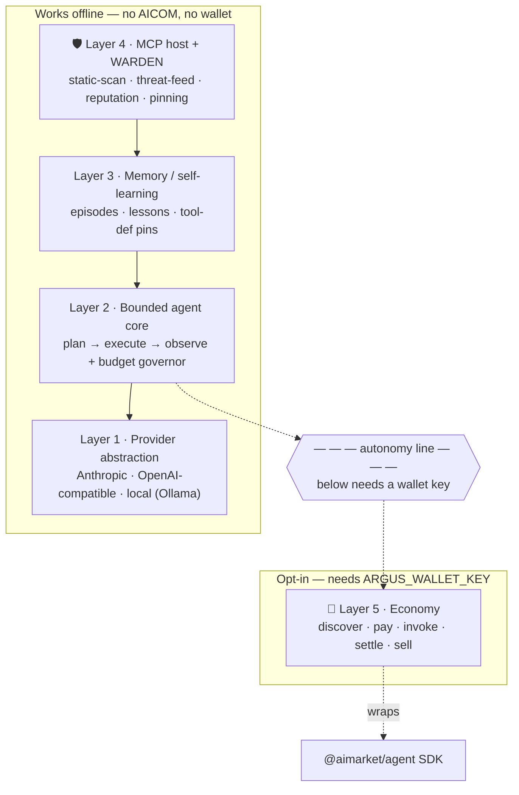
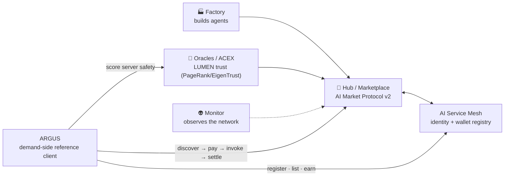
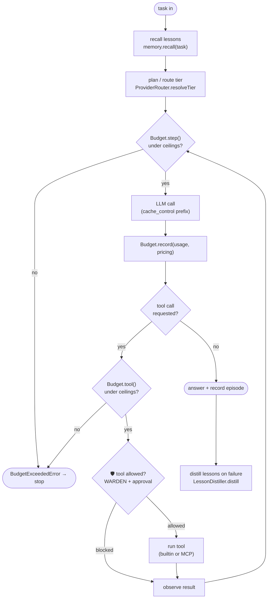

# ARGUS-3 — Arquitectura

> 🌐 Idiomas: [English](./architecture.md) · [Русский](./architecture-ru.md) · **Español**

> Parte del conjunto de documentación de ARGUS (`argus/docs/`):
> **architecture** · [security-warden](./security-warden.md) · [economy-integration](./economy-integration.md) · [token-economy](./token-economy.md) · [autonomy](./autonomy.md)

ARGUS es el cliente de referencia del lado de la demanda para la economía de agentes AICOM: un superagente personal nativo de billetera y reforzado en seguridad. Consume (y puede vender) capacidades en la economía cuando hay una billetera presente, y funciona de forma totalmente autónoma con un modelo local cuando no la hay.

El diseño es en capas para que **todo lo que está por encima de la economía funcione sin conexión**. La economía es una capacidad acoplable, no una dependencia.

---

## Las cinco capas

| # | Capa | Responsabilidad | Código fuente |
|---|------|-----------------|---------------|
| 1 | **Abstracción de proveedor** | Una interfaz `Provider` agnóstica al formato de cable sobre Anthropic-native, cualquier endpoint compatible con OpenAI y local (Ollama). Enrutamiento por niveles (triage/core/heavy) + cache_control. | `src/providers/router.ts`, `src/providers/anthropic.ts`, `src/providers/openai.ts` |
| 2 | **Núcleo de agente acotado** | El propio bucle plan → execute → observe de ARGUS, gobernado por un presupuesto estricto de tokens + USD, con compactación de contexto. | `src/core/agent.ts` (bucle), `src/core/budget.ts` (governor + meter), `src/core/compactor.ts` |
| 3 | **Memoria / autoaprendizaje** | Episodios duraderos + lecciones destiladas recuperadas por tarea; también almacena pines de definiciones de herramientas WARDEN. | `src/memory/store.ts`, `src/memory/lessons.ts` |
| 4 | **MCP host + WARDEN** 🛡️ | Conecta servidores MCP como herramientas, pero solo después de que la cadena de puertas WARDEN las autorice. Escaneo estático → threat feed → reputación → pinning. | `src/warden/static-scan.ts`, `src/warden/threat-feed.ts`, `src/warden/reputation.ts`, `src/warden/pinning.ts`, `src/warden/sandbox.ts` |
| 5 | **Economía opcional** 🛒 | Discover/pay/invoke/settle como consumidor; register/list/earn como proveedor. Envuelve el SDK `@aimarket/agent`. Se carga **solo** cuando hay una clave de billetera presente. | `src/economy/wallet.ts`, `src/economy/lumen.ts`; envuelve `@aimarket/agent` |

Los contratos compartidos de cada capa están en `src/types.ts`; la carga de configuración y la derivación de `economy.enabled` en `src/config.ts`.

---

## Pila de capas y la línea de autonomía

Todo lo que está por encima de la línea discontinua funciona sin red hacia AICOM. La capa de economía es lo único debajo, y se activa con la presencia de una clave de billetera (véase [autonomy.md](./autonomy-es.md)).



La puerta de reputación en la capa 4 *usa* LUMEN (un oráculo del lado de la economía) pero nunca depende de él: cuando LUMEN no es alcanzable, degrada a una puntuación neutral, de modo que el firewall sigue funcionando sin conexión. Detalles en [security-warden.md](./security-warden.md#why-oracle-reputation-beats-blocklists).

---

## Dónde se sitúa ARGUS en el ecosistema más amplio

ARGUS es el **nodo del lado de la demanda**. Factory 🏭 produce agentes; Hub 🛒 lista sus capacidades; Oracles 🔮 (LUMEN, etc.) puntúan la confianza; Monitor 👽 observa la red. ARGUS descubre, paga e invoca esas capacidades — y puede registrarse como proveedor.



ARGUS reutiliza el protocolo y el SDK existentes — no introduce nuevos endpoints. Los flujos de consumidor/proveedor están documentados en [economy-integration.md](./economy-integration.md).

---

## El bucle de agente acotado

El bucle central es el ciclo convencional plan → execute → observe, pero cada límite está medido. `Budget.step()` se ejecuta antes de cada paso y `Budget.tool()` antes de cada llamada a herramienta; cualquiera puede lanzar `BudgetExceededError`, que termina la tarea limpiamente en lugar de gastar de más. El medidor de tokens se actualiza con el usage de cada llamada LLM y es auditable en cualquier momento mediante `Budget.format()`.



El bucle en sí está en `src/core/agent.ts` (el SDK `@aimarket/agent` lo usa solo la capa de economía opcional, no el bucle central). Alrededor del bucle, ARGUS añade el budget governor, la puerta de herramientas WARDEN, los hooks de recall/distill de memoria, la compactación de contexto y el enrutamiento de proveedores por niveles. Véase [token-economy.md](./token-economy-es.md) para los controles de presupuesto y niveles.

---

## Mapa de módulos (referencia rápida)

```
src/
  types.ts              shared contract for every layer (no runtime deps)
  config.ts             defaults ← argus.config.json ← env secrets; economy.enabled derivation
  logger.ts             leveled logger
  providers/
    router.ts           ProviderRouter — tiering + provider selection
    anthropic.ts        AnthropicProvider — Messages API + cache_control
    openai.ts           OpenAICompatProvider — OpenAI-compatible + local
  core/
    agent.ts            Agent — the bounded plan → execute → observe loop
    budget.ts           Budget governor + token meter; BudgetExceededError
    compactor.ts        context compaction (summarise old turns on the cheap tier)
  memory/
    store.ts            JsonMemoryStore — episodes, lessons, pins
    lessons.ts          LessonDistiller — failures → durable lessons
  warden/               🛡️ MCP firewall (see security-warden.md)
    index.ts            Warden — gate-chain orchestrator (vet / approve)
    static-scan.ts      StaticScanGate
    threat-feed.ts      ThreatFeed + ThreatGate
    reputation.ts       ReputationGate (LUMEN)
    pinning.ts          PinningGate + canonicalToolsHash
    sandbox.ts          tool classification + EgressGuard
  mcp/
    host.ts             McpHost — connect, WARDEN-vet, bridge tools
    catalog.ts          CatalogConnector — discover servers from registries
  economy/              🛒 opt-in (see economy-integration.md)
    wallet.ts           Wallet — address derivation / key validation
    aimarket.ts         AimarketConsumer — wraps the @aimarket/agent SDK
    mesh.ts             MeshProvider — AI Service Mesh registration / selling
    lumen.ts            LumenOracle — TrustOracle over the oracle-family endpoint
  tools/
    builtin.ts          trusted built-in tools (web_fetch, recall_memory)
  runtime.ts            wires the five layers; decides economy on/off
  cli.ts                ask · chat · doctor · warden scan · economy
  index.ts              bin entry
```
