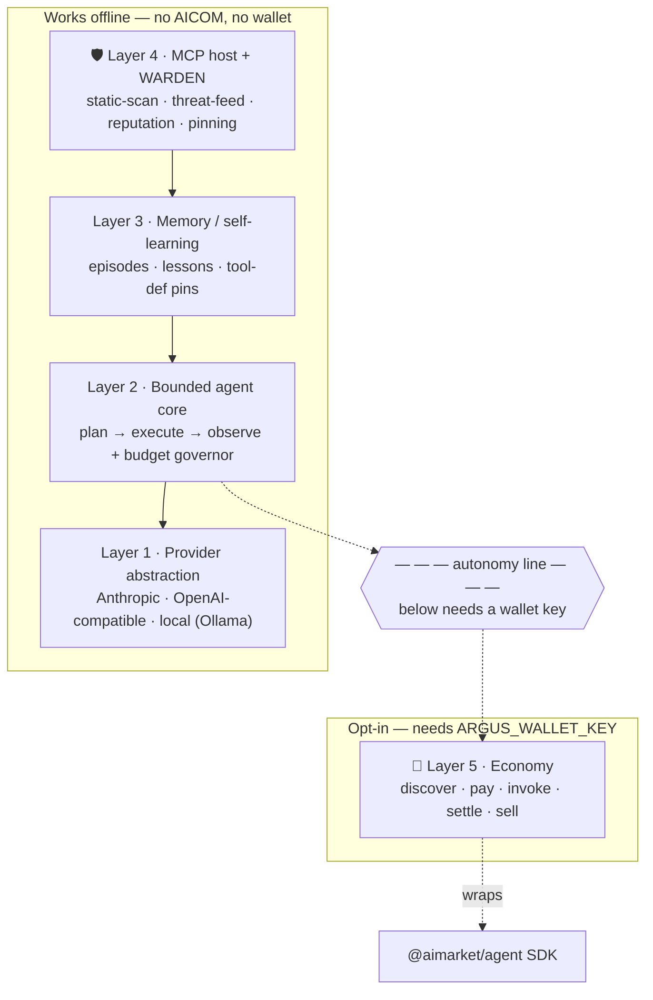
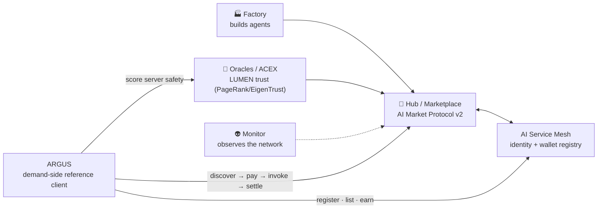
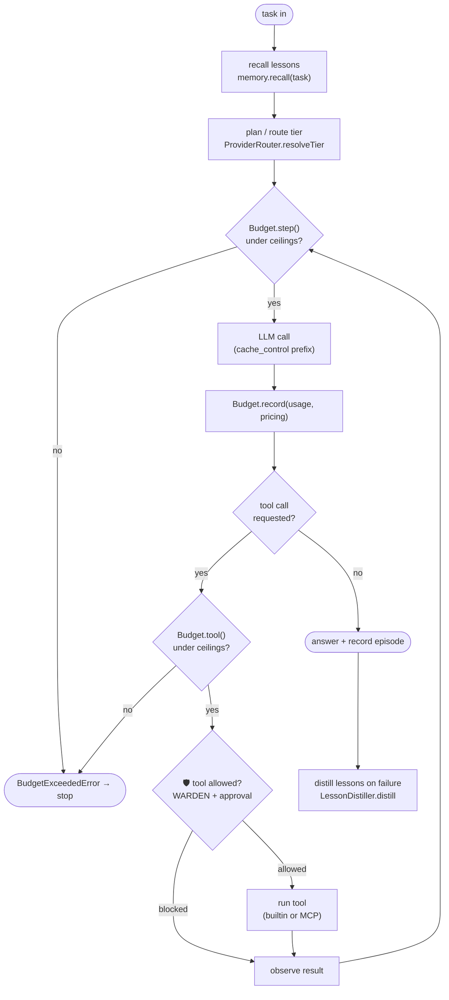

# ARGUS-3 — Архитектура

> 🌐 Язык: [English](./architecture.md) · **Русский** · [Español](./architecture-es.md)

> Часть набора документации ARGUS (`argus/docs/`):
> **architecture** · [security-warden](./security-warden.md) · [economy-integration](./economy-integration.md) · [token-economy](./token-economy.md) · [autonomy](./autonomy.md)

ARGUS — эталонный клиент на стороне спроса для агентной экономики AICOM: персональный суперагент с нативным кошельком и усиленной безопасностью. Он потребляет (и может продавать) возможности в экономике при наличии кошелька и работает полностью автономно на локальной модели, когда кошелька нет.

Архитектура слоистая: **всё выше экономики работает офлайн**. Экономика — это подключаемая возможность, а не зависимость.

---

## Пять слоёв

| # | Слой | Ответственность | Исходный код |
|---|------|-----------------|--------------|
| 1 | **Абстракция провайдера** | Единый wire-shape-agnostic интерфейс `Provider` поверх Anthropic-native, любого OpenAI-совместимого эндпоинта и локального (Ollama). Маршрутизация по уровням (triage/core/heavy) + cache_control. | `src/providers/router.ts`, `src/providers/anthropic.ts`, `src/providers/openai.ts` |
| 2 | **Ограниченное ядро агента** | Собственный цикл ARGUS plan → execute → observe, управляемый жёстким бюджетом токенов + USD, с компактификацией контекста. | `src/core/agent.ts` (цикл), `src/core/budget.ts` (governor + meter), `src/core/compactor.ts` |
| 3 | **Память / самообучение** | Долговременные эпизоды + дистиллированные уроки, извлекаемые для каждой задачи; также хранит пины определений инструментов WARDEN. | `src/memory/store.ts`, `src/memory/lessons.ts` |
| 4 | **MCP host + WARDEN** 🛡️ | Подключает MCP-серверы как инструменты, но только после прохождения цепочки ворот WARDEN. Статическое сканирование → threat feed → репутация → pinning. | `src/warden/static-scan.ts`, `src/warden/threat-feed.ts`, `src/warden/reputation.ts`, `src/warden/pinning.ts`, `src/warden/sandbox.ts` |
| 5 | **Опциональная экономика** 🛒 | Discover/pay/invoke/settle как потребитель; register/list/earn как поставщик. Оборачивает SDK `@aimarket/agent`. Загружается **только** при наличии ключа кошелька. | `src/economy/wallet.ts`, `src/economy/lumen.ts`; оборачивает `@aimarket/agent` |

Общие контракты для каждого слоя находятся в `src/types.ts`; загрузка конфигурации и вывод `economy.enabled` — в `src/config.ts`.

---

## Стек слоёв и линия автономии

Всё выше пунктирной линии работает без сети к AICOM. Слой экономики — единственное, что ниже, и он включается только при наличии ключа кошелька (см. [autonomy.md](./autonomy-ru.md)).



Ворота репутации в слое 4 *используют* LUMEN (оракул на стороне экономики), но никогда от него не зависят: когда LUMEN недоступен, система деградирует до нейтрального балла, и файрвол продолжает работать офлайн. Подробности в [security-warden.md](./security-warden.md#why-oracle-reputation-beats-blocklists).

---

## Место ARGUS в более широкой экосистеме

ARGUS — **узел на стороне спроса**. Factory 🏭 производит агентов; Hub 🛒 перечисляет их возможности; Oracles 🔮 (LUMEN и др.) оценивают доверие; Monitor 👽 наблюдает за сетью. ARGUS обнаруживает, оплачивает и вызывает эти возможности — и сам может зарегистрироваться как поставщик.



ARGUS переиспользует существующий протокол и SDK — новые эндпоинты не вводятся. Потоки потребителя/поставщика описаны в [economy-integration.md](./economy-integration.md).

---

## Ограниченный цикл агента

Ядро — обычный цикл plan → execute → observe, но каждая граница измеряется. `Budget.step()` выполняется перед каждым шагом, `Budget.tool()` — перед каждым вызовом инструмента; любой из них может выбросить `BudgetExceededError`, что корректно завершает задачу вместо перерасхода. Счётчик токенов обновляется по usage каждого вызова LLM и в любой момент доступен для аудита через `Budget.format()`.



Сам цикл находится в `src/core/agent.ts` (SDK `@aimarket/agent` используется только опциональным слоем экономики, не ядром). Вокруг цикла ARGUS добавляет budget governor, ворота инструментов WARDEN, хуки recall/distill памяти, компактификацию контекста и маршрутизацию провайдеров по уровням. См. [token-economy.md](./token-economy-ru.md) для рычагов бюджета и уровней.

---

## Карта модулей (краткий справочник)

```
src/
  types.ts              shared contract for every layer (no runtime deps)
  config.ts             defaults ← argus.config.json ← env secrets; economy.enabled derivation
  logger.ts             leveled logger
  providers/
    router.ts           ProviderRouter — tiering + provider selection
    anthropic.ts        AnthropicProvider — Messages API + cache_control
    openai.ts           OpenAICompatProvider — OpenAI-compatible + local
  core/
    agent.ts            Agent — the bounded plan → execute → observe loop
    budget.ts           Budget governor + token meter; BudgetExceededError
    compactor.ts        context compaction (summarise old turns on the cheap tier)
  memory/
    store.ts            JsonMemoryStore — episodes, lessons, pins
    lessons.ts          LessonDistiller — failures → durable lessons
  warden/               🛡️ MCP firewall (see security-warden.md)
    index.ts            Warden — gate-chain orchestrator (vet / approve)
    static-scan.ts      StaticScanGate
    threat-feed.ts      ThreatFeed + ThreatGate
    reputation.ts       ReputationGate (LUMEN)
    pinning.ts          PinningGate + canonicalToolsHash
    sandbox.ts          tool classification + EgressGuard
  mcp/
    host.ts             McpHost — connect, WARDEN-vet, bridge tools
    catalog.ts          CatalogConnector — discover servers from registries
  economy/              🛒 opt-in (see economy-integration.md)
    wallet.ts           Wallet — address derivation / key validation
    aimarket.ts         AimarketConsumer — wraps the @aimarket/agent SDK
    mesh.ts             MeshProvider — AI Service Mesh registration / selling
    lumen.ts            LumenOracle — TrustOracle over the oracle-family endpoint
  tools/
    builtin.ts          trusted built-in tools (web_fetch, recall_memory)
  runtime.ts            wires the five layers; decides economy on/off
  cli.ts                ask · chat · doctor · warden scan · economy
  index.ts              bin entry
```
