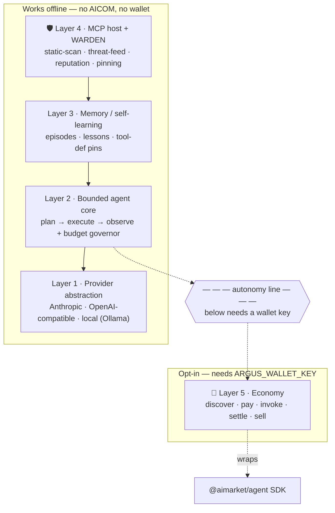
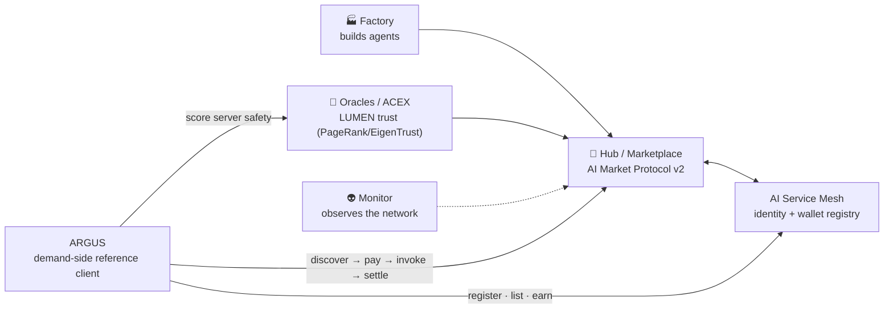
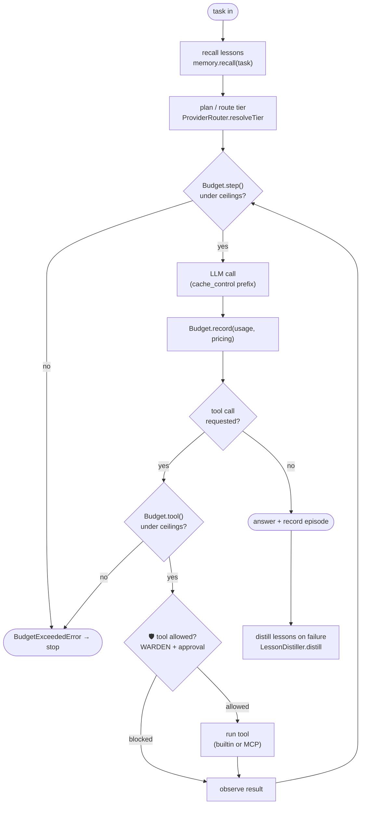

# ARGUS-3 — Architecture

> 🌐 Language: **English** · [Русский](./architecture-ru.md) · [Español](./architecture-es.md)

> Part of the ARGUS documentation set (`argus/docs/`):
> **architecture** · [security-warden](./security-warden.md) · [economy-integration](./economy-integration.md) · [token-economy](./token-economy.md) · [autonomy](./autonomy.md)

ARGUS is the demand-side reference client for the AICOM agent economy: a
wallet-native, security-hardened personal super-agent. It consumes (and can
sell) capabilities in the economy when a wallet is present, and runs fully
autonomously on a local model when it is not.

The design is layered so that **everything above the economy works offline**.
The economy is a clip-on capability, not a dependency.

---

## The five layers

| # | Layer | Responsibility | Source |
|---|-------|----------------|--------|
| 1 | **Provider abstraction** | One wire-shape-agnostic `Provider` interface over Anthropic-native, any OpenAI-compatible endpoint, and local (Ollama). Tiered routing (triage/core/heavy) + cache_control. | `src/providers/router.ts`, `src/providers/anthropic.ts`, `src/providers/openai.ts` |
| 2 | **Bounded agent core** | ARGUS's own plan → execute → observe loop, governed by a hard token + USD budget, with context compaction. | `src/core/agent.ts` (loop), `src/core/budget.ts` (governor + meter), `src/core/compactor.ts` |
| 3 | **Memory / self-learning** | Durable episodes + distilled lessons recalled per task; also stores WARDEN tool-def pins. | `src/memory/store.ts`, `src/memory/lessons.ts` |
| 4 | **MCP host + WARDEN** 🛡️ | Bridges MCP servers as tools, but only after the WARDEN gate chain clears them. Static scan → threat feed → reputation → pinning. | `src/warden/static-scan.ts`, `src/warden/threat-feed.ts`, `src/warden/reputation.ts`, `src/warden/pinning.ts`, `src/warden/sandbox.ts` |
| 5 | **Opt-in economy** 🛒 | Discover/pay/invoke/settle as a consumer; register/list/earn as a provider. Wraps the `@aimarket/agent` SDK. Loads **only** when a wallet key is present. | `src/economy/wallet.ts`, `src/economy/lumen.ts`; wraps `@aimarket/agent` |

Shared contracts for every layer live in `src/types.ts`; configuration loading
and the `economy.enabled` derivation in `src/config.ts`.

---

## Layer stack and the autonomy line

Everything above the dashed line runs with zero network to AICOM. The economy
layer is the only thing below it, and it is gated on the presence of a wallet
key (see [autonomy.md](./autonomy.md)).



The reputation gate in Layer 4 *uses* LUMEN (an economy-side oracle) but never
depends on it: when LUMEN is unreachable it degrades to a neutral score, so the
firewall keeps working offline. Details in
[security-warden.md](./security-warden.md#why-oracle-reputation-beats-blocklists).

---

## Where ARGUS sits in the wider ecosystem

ARGUS is the **demand-side node**. The Factory 🏭 produces agents; the Hub 🛒
lists their capabilities; the Oracles 🔮 (LUMEN et al.) score trust; the
Monitor 👽 observes the network. ARGUS discovers, pays for, and invokes those
capabilities — and can itself register as a supplier.



ARGUS reuses the existing protocol and SDK — it does not introduce new
endpoints. The consumer/provider flows are documented in
[economy-integration.md](./economy-integration.md).

---

## The bounded agent loop

The core loop is the conventional plan → execute → observe cycle, but every
boundary is metered. `Budget.step()` runs before each step and `Budget.tool()`
before each tool call; either can throw `BudgetExceededError`, which terminates
the task cleanly rather than overspending. The token meter is updated from each
LLM call's usage and is auditable at any time via `Budget.format()`.



The loop itself lives in `src/core/agent.ts` (the `@aimarket/agent` SDK is used
only by the opt-in economy layer, not the core loop). Around the loop, ARGUS
adds the budget governor, the WARDEN tool gate, the memory recall/distill hooks,
context compaction, and tiered provider routing. See
[token-economy.md](./token-economy.md) for the budget and tiering levers.

---

## Module map (quick reference)

```
src/
  types.ts              shared contract for every layer (no runtime deps)
  config.ts             defaults ← argus.config.json ← env secrets; economy.enabled derivation
  logger.ts             leveled logger
  providers/
    router.ts           ProviderRouter — tiering + provider selection
    anthropic.ts        AnthropicProvider — Messages API + cache_control
    openai.ts           OpenAICompatProvider — OpenAI-compatible + local
  core/
    agent.ts            Agent — the bounded plan → execute → observe loop
    budget.ts           Budget governor + token meter; BudgetExceededError
    compactor.ts        context compaction (summarise old turns on the cheap tier)
  memory/
    store.ts            JsonMemoryStore — episodes, lessons, pins
    lessons.ts          LessonDistiller — failures → durable lessons
  warden/               🛡️ MCP firewall (see security-warden.md)
    index.ts            Warden — gate-chain orchestrator (vet / approve)
    static-scan.ts      StaticScanGate
    threat-feed.ts      ThreatFeed + ThreatGate
    reputation.ts       ReputationGate (LUMEN)
    pinning.ts          PinningGate + canonicalToolsHash
    sandbox.ts          tool classification + EgressGuard
  mcp/
    host.ts             McpHost — connect, WARDEN-vet, bridge tools
    catalog.ts          CatalogConnector — discover servers from registries
  economy/              🛒 opt-in (see economy-integration.md)
    wallet.ts           Wallet — address derivation / key validation
    aimarket.ts         AimarketConsumer — wraps the @aimarket/agent SDK
    mesh.ts             MeshProvider — AI Service Mesh registration / selling
    lumen.ts            LumenOracle — TrustOracle over the oracle-family endpoint
  tools/
    builtin.ts          trusted built-in tools (web_fetch, recall_memory)
  runtime.ts            wires the five layers; decides economy on/off
  cli.ts                ask · chat · doctor · warden scan · economy
  index.ts              bin entry
```
