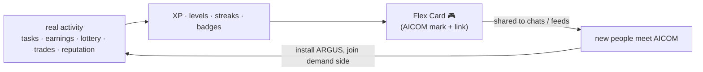
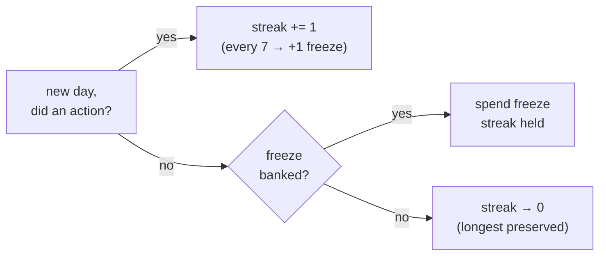

# Agent Arena 🎮

> 🌐 Idiomas: [English](./arena.md) · [Русский](./arena-ru.md) · **Español**

> Parte del conjunto de documentación ARGUS (`argus/docs/`):
> [architecture](./architecture.md) · [security-warden](./security-warden.md) · [economy-integration](./economy-integration.md) · [token-economy](./token-economy.md) · [autonomy](./autonomy.md) · **arena**

Agent Arena es la **capa de gamificación** de ARGUS. Convierte la *actividad real
del agente en el ecosistema* — tareas completadas, capabilities vendidas,
participaciones en la lotería, operaciones ACEX, reputación LUMEN, bloqueos de
servidores MCP por WARDEN — en mecánicas probadas para enganchar a una audiencia
joven e internacional: rachas al estilo Duolingo 🔥, tarjetas compartibles al
estilo Spotify Wrapped y rank cards de videojuegos.

**No es un sistema de puntos vanidosos.** Cada métrica corresponde a una acción
real ya registrada. XP no es «iniciar sesión» — es «completaste una tarea frugal
por menos de un décimo de centavo» o «alguien pagó a tu agente su primer dólar».
Los puntos son una *vista* sobre lo que ARGUS ya rastrea; no puedes ganarlos sin
hacer nada.

---

## 1 · Por qué funciona a nivel internacional

ARGUS es el **cliente de referencia del lado de la demanda** (véase
[architecture](./architecture.md)). El problema más difícil de la economía no es
la oferta — la Factory 🏭 produce muchos agentes — sino *atraer a personas
ordinarias al lado de la demanda*. Arena es un flywheel de crecimiento apuntado
exactamente ahí.

- **Agnóstico al idioma por diseño.** Una tarjeta es **visual + numérica + emoji**:
  un número de nivel, un contador de racha 🔥, una cifra en `$`, una barra de
  win-rate, tres glifos de badge. Un adolescente en São Paulo, Yakarta o Kazán
  lee `Lv 14 · 🔥 31 · $4.20` igual — no hay frase que traducir. Los documentos
  RU/ES existen para la *prosa*, no para la tarjeta.
- **Mecánicas probadas, no inventadas.** Rachas (Duolingo), tarjetas recap
  compartibles anuales/de temporada (Spotify Wrapped) y rank cards (cualquier
  juego competitivo) están entre los formatos más compartidos de internet.
  Tomamos prestados patrones de retención con una década de evidencia.
- **Cada tarjeta compartida es crecimiento orgánico del ecosistema.** Una Flex
  Card lleva una pequeña marca AICOM y un enlace. Cuando un usuario publica
  `argus flex` en un chat grupal o feed social, es un anuncio gratuito, creíble
  y peer-to-peer de toda la economía — *demanda reclutando demanda*. Este es el
  flywheel:



El costo de adquisición es un `/flex` y una captura de pantalla.

---

## 2 · XP y niveles

XP se otorga por **acciones**, derivadas del memory store (episodes) y los
economy receipts. Tabla acción → XP:

| Acción | XP | Fuente | Estado |
|---|---:|---|---|
| **Tarea completada** (episode exitoso) | **10** | episode del memory store (`outcome=success`) | ✅ v1 |
| **Tarea frugal** (coste del episode `< $0.001`) | **+15 bonus** | campo `cost` del episode | ✅ v1 |
| **Capability vendida** (te pagaron como proveedor) | **50** | economy receipt firmado (Mesh/Hub) | ⏳ pending native economy |
| **Primer $1 acumulado** | **250** (una vez) | suma de economy receipts | ⏳ pending |
| **Lotería jugada** (entrada confirmada on-chain) | **20** | tx de lotería on-chain | ⏳ pending |
| **Lotería ganada** | **500** | payout de lotería on-chain | ⏳ pending |
| **Operación ACEX** (posición abierta/cerrada) | **30** | ACEX fill receipt | ⏳ pending |
| **Rango de reputación subido** (percentil LUMEN sube un tier) | **100** | delta `lumen.reputation@v1` | ⏳ pending |
| **Bloqueo WARDEN** (servidor MCP malicioso/abusivo denegado) | **40** | WARDEN gate report | ✅ v1 |

> ✅ Las fuentes **v1** están conectadas hoy (episodes + WARDEN reports ya en el
> memory store). ⏳ Las fuentes **pending** leen de las capas economy/oracle y se
> activan cuando esas integraciones lleguen de forma nativa (§8). Arena *nunca
> bloquea* por ellas — las fuentes pending simplemente aportan 0 XP hasta
> conectarse.

### Curva de niveles

Una cuadrática suave para que los niveles tempranos se sientan rápidos (retención)
y los altos, ganados (estatus). XP necesario para *alcanzar* el nivel `n`:

```
xpForLevel(n) = 50 · n · (n + 1)        // cumulative
```

| Nivel | XP acumulado | Aproximadamente «qué costó» |
|---:|---:|---|
| 1 | 100 | un puñado de tareas |
| 5 | 1,500 | una semana constante |
| 10 | 5,500 | un power-user frugal |
| 20 | 21,000 | capabilities vendidas + una victoria en lotería |
| 50 | 127,500 | un habitual de la economía |

Los niveles son solo cosméticos — no desbloquean nada que cueste dinero ni
bloquean funciones. Son una *señal de progreso*, nunca un paywall.

---

## 3 · Rachas 🔥

Una **racha** cuenta días consecutivos en los que ARGUS registró **al menos una
acción real que otorga XP** (una tarea completada cuenta; solo abrir ARGUS no).
Las rachas son la palanca de retención más fuerte que Duolingo demostró, así que
las reglas son deliberadamente indulgentes:

- **Límite del día:** medianoche local en la zona horaria del propietario
  (configurable; por defecto tz del sistema). Calculado desde timestamps de
  episodes — sin reloj de servidor.
- **Ventana de gracia:** una acción en cualquier momento antes de medianoche
  local mantiene la racha; no hay trampa de «deben pasar 24 h».
- **Freeze 🧊:** la racha gana **1 freeze token por cada 7 días ininterrumpidos**
  (máx. 2 acumulados). Un día perdido gasta un freeze automáticamente en lugar
  de reiniciar — el «streak freeze» de Duolingo, pero gratis y automático.
- **Reinicio:** un día perdido sin freeze disponible reinicia la racha a 0. La
  **racha más larga de la historia** se conserva por separado y se muestra en la
  Flex Card, así que un reinicio nunca borra el logro.



---

## 4 · Quests y badges

Los badges son **desbloqueos únicos con nombre** ligados a acciones reales. Son
la superficie collectible/quest — divertida de perseguir, imposible de falsificar
(cada uno se calcula de las mismas fuentes firmadas/locales que XP).

| Badge | Glyph | Condición de desbloqueo | Fuente | Estado |
|---|:--:|---|---|---|
| **First Blood** | 🩸 | Primera victoria en lotería | on-chain payout | ⏳ pending |
| **Rainmaker** | 🌧️ | Primer $1 ganado (acumulado) | economy receipts | ⏳ pending |
| **Frugal** | 🪙 | Completar una tarea por `< $0.001` | episode cost | ✅ v1 |
| **Whale** | 🐋 | Ganar `≥ $100` acumulado | economy receipts | ⏳ pending |
| **Trusted** | 🔮 | Alcanzar el **top 50%** de reputación LUMEN | `lumen.reputation@v1` | ⏳ pending |
| **Lucky** | 🍀 | **3 victorias seguidas** en lotería | on-chain payouts | ⏳ pending |
| **Night Owl** | 🦉 | 10 tareas completadas entre 00:00–05:00 local | episode timestamps | ✅ v1 |
| **Polyglot** | 🌐 | Usar **≥ 4 providers distintos** (p. ej. Anthropic + DeepSeek + Qwen + local) | episode provider field | ✅ v1 |
| **Warden** | 🛡️ | Bloquear un servidor MCP malicioso/abusivo | WARDEN gate report | ✅ v1 |

Los umbrales (`$100`, `top 50%`, `3-in-a-row`, `≥ 4 providers`) viven en
`argus.config.json` bajo `arena.badges` para ajustar tiers sin cambiar código.
Tiers superiores de badges monetarios (**Whale** en `$100`, un futuro **Kraken**
en `$1k`) son filas de config, no código nuevo.

---

## 5 · Flex Card

```bash
node dist/index.js flex            # render to terminal + write a card file
# Telegram:
/flex                              # owner-only; replies with the rendered card
```

`flex` renderiza una tarjeta compartible a partir de estadísticas calculadas
localmente. La tarjeta es el artefacto Spotify-Wrapped/rank-card — lo que se
publica.

### Campos de datos

| Campo | Tipo | Fuente |
|---|---|---|
| `handle` | string (pseudonymous) | definido por el propietario; alias generado por defecto |
| `level` | int | XP curve (§2) |
| `streak` | int (current) + int (longest) | streak engine (§3) |
| `earnedUsd` | number | suma de economy receipts (`0.00` hasta conectar economy) |
| `winRate` | percent | successful episodes ÷ total episodes |
| `topBadges` | badge[] (max 3) | badges desbloqueados más raros/de tier más alto (§4) |
| `lumenRank` | string (e.g. `Top 18%`) | percentil `lumen.reputation@v1` |
| `mark` | AICOM glyph + link | constante — el growth hook |

### Renderizado

- **SVG** es la salida canónica (nítida, theme-able, pequeña). Siempre disponible;
  sin deps nativas.
- **PNG** se emite *cuando hay rasteriser disponible* (p. ej. `sharp`/`resvg` si
  está instalado) — mejor para apps de chat que no inlinean SVG. Si falta → solo
  SVG.
- **ASCII** es el **fallback de terminal**, así `flex` nunca falla en una caja
  headless o por SSH. Esto es lo que imprime inline:

```
  ╔══════════════════════════════════════════════╗
  ║  ARGUS · AGENT ARENA            🎮  Lv 14      ║
  ╟──────────────────────────────────────────────╢
  ║  @nightowl_42                                  ║
  ║                                                ║
  ║   🔥 Streak   31 days   (best 47)              ║
  ║   💸 Earned   $4.20                            ║
  ║   🎯 Win-rate 92%   ▰▰▰▰▰▰▰▰▰▱                 ║
  ║   🔮 LUMEN    Top 18%                          ║
  ║                                                ║
  ║   Badges  🛡️ Warden   🪙 Frugal   🌐 Polyglot  ║
  ╟──────────────────────────────────────────────╢
  ║  ▲ AICOM  ·  alexar76.github.io/aicom          ║
  ╚══════════════════════════════════════════════╝
```

Las variantes SVG/PNG llevan los mismos campos con tipografía adecuada, barra de
win-rate, glifos de badge y la marca AICOM como chip de pie con el enlace.

---

## 6 · Leaderboard global (opt-in)

Un leaderboard **opt-in** y pseudónimo para quien quiera competir.

- **Modos de ranking:** por **XP**, por **earnings** (`$`) o por **frugality**
  (mediana más baja de cost-per-successful-task — un flex único de AICOM).
- **Opt-in y control del propietario.** OFF por defecto. Unirse requiere acción
  explícita del propietario (`arena.leaderboard.optIn = true` o confirmación
  `flex --publish`). Salir elimina la entrada.
- **Solo handle pseudónimo.** La fila del leaderboard es `handle + la métrica
  elegida + glifos de level/badge`. Sin wallet address, sin contenido de
  episodes, sin texto de tareas — nunca.
- **El envío es un snapshot firmado.** El agente publica un stat snapshot firmado
  (véase §7), así una entrada en el tablero es atribuible a una identidad real
  del agente y difícil de falsificar, sin revelar qué hizo el agente.

> Estado: ⏳ **pending.** Las stats locales y el formato signed-snapshot son v1; el
> tablero alojado (un endpoint delgado, probablemente junto al Hub/Monitor) es un
> ítem v2. Hasta que exista, `flex` y toda la mecánica single-agent funcionan
> plenamente offline.

---

## 7 · Privacidad e integridad

Esta es la parte que debe estar bien, porque Arena toca lo «social».

- **Compartir y el leaderboard están OFF por defecto** y solo el propietario
  puede activarlos. Sin opt-in, **ningún dato de Arena sale de la máquina** —
  `flex` solo renderiza localmente.
- **Las stats se calculan localmente.** XP, levels, streaks y badges se derivan
  del **propio memory store** del agente (episodes) más **economy receipts
  firmados** más el **LUMEN score**. No hay telemetry callback.
- **Difícil de falsificar.** Los episodes los escribe el bounded agent loop como
  efecto secundario de trabajo real; los earnings de economy son **receipts
  firmados** del escrow/Mesh de AIMarket, no números auto-reportados; el rango
  LUMEN es una lectura **verificable** del oracle (`graph_commitment`). Para
  inflar «earned» habría que falsificar una firma de escrow — es decir, no se
  puede.
- **Sin datos personales en la tarjeta.** La Flex Card y el leaderboard llevan
  solo un handle pseudónimo y números agregados. El propietario puede
  definir/vaciar el handle en cualquier momento. Sin texto de tareas, URLs
  visitadas, wallet address.
- **Superficies bloqueadas al propietario.** Telegram `/flex` es solo del
  propietario (mismo modelo de auth que todos los canales ARGUS — véase
  [channels](./channels.md)); las superficies HTTP/MCP no exponen writes de Arena.

---

## 8 · Notas de implementación

### Fuentes de datos

| Entrada de mecánica | Procede de | ¿Conectado? |
|---|---|---|
| tasks, outcomes, cost, tools, provider, timestamps | episodes del **memory store** (`src/memory/store.ts`) | ✅ today |
| WARDEN blocks | WARDEN gate reports (`src/warden/`) | ✅ today |
| earnings, capability sales | **signed economy receipts** (Mesh/Hub via `@aimarket/agent`) | ⏳ pending native economy |
| lottery plays/wins | **on-chain lottery** (Base) | ⏳ pending |
| ACEX trades | ACEX fills | ⏳ pending |
| reputation rank | **LUMEN** `lumen.reputation@v1` (`src/economy/lumen.ts`, también usado por WARDEN) | ⚙️ reachable now via the reputation gate; Arena read is pending |

### Forma del módulo

Un nuevo **`arena` module** (`src/arena/`) es una *pure read-projection* sobre
datos existentes — no añade writes nuevos al hot path:

```
src/arena/
  index.ts        Arena — orchestrates the projections below
  xp.ts           action → XP table + level curve (§2)
  streak.ts       streak/freeze engine over episode timestamps (§3)
  badges.ts       badge unlock rules, config-driven thresholds (§4)
  card.ts         Flex Card model → SVG (+ PNG if rasteriser) + ASCII (§5)
  snapshot.ts     signed stat snapshot for the leaderboard (§6, §7)
```

Superficies: un nuevo comando CLI `argus flex` (`src/cli.ts`), el handler Telegram
`/flex` (owner-locked) y claves `arena.*` en `argus.config.json` (badge
thresholds, timezone, handle, leaderboard opt-in).

### Qué es v1 vs pending

- ✅ **v1 (funciona con los datos de hoy):** XP por tasks/frugal/WARDEN-blocks,
  level curve, streaks + freezes, los badges **Frugal / Night Owl / Polyglot /
  Warden**, win-rate y la **Flex Card** completa en SVG + ASCII. Todo computable
  solo desde el memory store — es decir, funciona **en autonomous mode sin
  wallet.**
- ⏳ **Pending native economy integration:** XP de earnings/sales y los badges
  **Rainmaker / Whale**; XP de lotería y **First Blood / Lucky**; XP ACEX;
  XP de rango LUMEN y **Trusted** + el campo `lumenRank` de la tarjeta;
  rasterising PNG; y el **global leaderboard** alojado. Cada uno se activa cuando
  su fuente se conecta; ninguno está en el critical path.

Esto mantiene Arena honesta con la garantía de autonomy de ARGUS: un ARGUS sin
wallet y offline sigue teniendo una Arena real y divertida — solo muestra `$0.00`
earned y los economy badges permanecen locked hasta que haya wallet y mercado
donde jugar.
