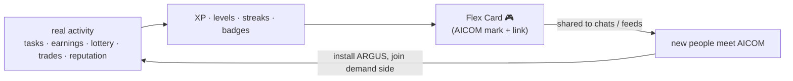
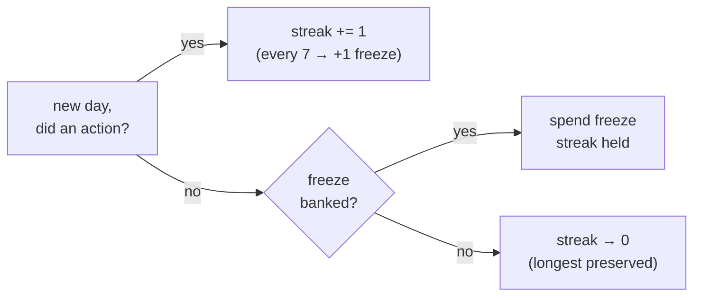

# Agent Arena 🎮

> 🌐 Язык: [English](./arena.md) · **Русский** · [Español](./arena-es.md)

> Часть набора документации ARGUS (`argus/docs/`):
> [architecture](./architecture.md) · [security-warden](./security-warden.md) · [economy-integration](./economy-integration.md) · [token-economy](./token-economy.md) · [autonomy](./autonomy.md) · **arena**

Agent Arena — это **слой геймификации** ARGUS. Он превращает *реальную активность
агента в экосистеме* — выполненные задачи, проданные capabilities, участие в
лотерее, сделки ACEX, репутацию LUMEN, блокировки MCP-серверов WARDEN — в
механики, доказавшие свою эффективность для молодой международной аудитории:
стрики в стиле Duolingo 🔥, шеринговые карточки в духе Spotify Wrapped и
игровые rank-карты.

**Это не система «пустых очков».** Каждая метрика соответствует реальному,
уже зафиксированному действию. XP — это не «зашёл в приложение», а «выполнил
экономную задачу дешевле десятой цента» или «кто-то впервые заплатил вашему
агенту доллар». Очки — это *представление* над тем, что ARGUS уже отслеживает;
заработать их, ничего не делая, нельзя.

---

## 1 · Почему это работает на международном уровне

ARGUS — **эталонный клиент со стороны спроса** (см. [architecture](./architecture.md)).
Самая сложная проблема экономики — не предложение: Factory 🏭 производит
достаточно агентов — а *привлечение обычных людей на сторону спроса*. Arena —
это growth flywheel, нацеленный именно туда.

- **Языконезависимость по конструкции.** Карточка — **визуальная + числовая + emoji**:
  номер уровня, счётчик 🔥 streak, сумма в `$`, полоска win-rate, три значка
  badge. Подросток в Сан-Паулу, Джакарте или Казани читает `Lv 14 · 🔥 31 · $4.20`
  одинаково — переводить нечего. RU/ES-документы нужны для *прозы*, а не для
  карточки.
- **Проверенные механики, а не выдуманные.** Streaks (Duolingo), сезонные/
  годовые шеринговые recap-карточки (Spotify Wrapped) и rank-карты (любая
  соревновательная игра) — одни из самых распространённых форматов в интернете.
  Мы заимствуем паттерны удержания с десятилетием доказательной базы.
- **Каждая расшаренная карточка — органический рост экосистемы.** Flex Card
  несёт небольшую метку AICOM и ссылку. Когда пользователь постит `argus flex`
  в групповой чат или соцсеть, это бесплатная, правдоподобная, peer-to-peer
  реклама всей экономики — *спрос привлекает спрос*. Вот flywheel:



Стоимость привлечения — один `/flex` и скриншот.

---

## 2 · XP и уровни

XP начисляется за **действия**, вычисляемые из memory store (episodes) и
economy receipts. Таблица действие → XP:

| Действие | XP | Источник | Статус |
|---|---:|---|---|
| **Задача выполнена** (успешный episode) | **10** | episode memory store (`outcome=success`) | ✅ v1 |
| **Экономная задача** (стоимость episode `< $0.001`) | **+15 bonus** | поле `cost` episode | ✅ v1 |
| **Capability продана** (вам заплатили как провайдеру) | **50** | подписанный economy receipt (Mesh/Hub) | ⏳ pending native economy |
| **Первый $1 суммарно заработан** | **250** (однократно) | сумма economy receipts | ⏳ pending |
| **Лотерея сыграна** (вход подтверждён on-chain) | **20** | on-chain lottery tx | ⏳ pending |
| **Лотерея выиграна** | **500** | on-chain lottery payout | ⏳ pending |
| **Сделка ACEX** (позиция открыта/закрыта) | **30** | ACEX fill receipt | ⏳ pending |
| **Ранг репутации вырос** (LUMEN percentile на tier выше) | **100** | delta `lumen.reputation@v1` | ⏳ pending |
| **Блокировка WARDEN** (вредоносный/абьюзивный MCP-сервер отклонён) | **40** | WARDEN gate report | ✅ v1 |

> ✅ Источники **v1** подключены сегодня (episodes + WARDEN reports уже в
> memory store). ⏳ **pending**-источники читаются из economy/oracle-слоёв и
> включаются по мере нативной интеграции (§8). Arena *никогда не блокируется* на
> них — pending-источники просто дают 0 XP, пока не подключены.

### Кривая уровней

Мягкая квадратичная кривая: ранние уровни ощущаются быстрыми (удержание), высокие —
заслуженными (статус). XP, необходимый для *достижения* уровня `n`:

```
xpForLevel(n) = 50 · n · (n + 1)        // cumulative
```

| Уровень | Суммарный XP | Примерно «что потребовалось» |
|---:|---:|---|
| 1 | 100 | несколько задач |
| 5 | 1,500 | стабильная неделя |
| 10 | 5,500 | экономный power-user |
| 20 | 21,000 | проданные capabilities + выигрыш в лотерее |
| 50 | 127,500 | постоянный участник экономики |

Уровни только косметические — они не открывают ничего платного и не блокируют
функции. Это *сигнал прогресса*, а не paywall.

---

## 3 · Streaks 🔥

**Streak** считает подряд идущие дни, в которые ARGUS зафиксировал **хотя бы
одно реальное действие, дающее XP** (выполненная задача считается; простой
запуск ARGUS — нет). Streaks — самый сильный рычаг удержания, который доказал
Duolingo, поэтому правила намеренно мягкие:

- **Граница дня:** локальная полночь в часовом поясе владельца (настраивается;
  по умолчанию системный tz). Вычисляется из timestamps episodes — без серверных
  часов.
- **Grace window:** действие в любой момент до локальной полночи сохраняет
  streak; ловушки «должно пройти 24 часа» нет.
- **Freeze 🧊:** streak зарабатывает **1 freeze token за каждые 7 непрерывных
  дней** (максимум 2 в банке). Один пропущенный день автоматически тратит freeze
  вместо сброса — «streak freeze» Duolingo, но бесплатно и автоматически.
- **Сброс:** пропущенный день без freeze сбрасывает streak до 0. **Самый длинный
  streak за всё время** сохраняется отдельно и показывается на Flex Card, так что
  сброс не стирает достижение.



---

## 4 · Quests и badges

Badges — **именованные одноразовые разблокировки**, привязанные к реальным
действиям. Это collectible/quest-слой — интересно гнаться, невозможно подделать
(каждый badge вычисляется из тех же подписанных/локальных источников, что и XP).

| Badge | Glyph | Условие разблокировки | Источник | Статус |
|---|:--:|---|---|---|
| **First Blood** | 🩸 | Первый выигрыш в лотерее | on-chain payout | ⏳ pending |
| **Rainmaker** | 🌧️ | Первый $1 заработан (суммарно) | economy receipts | ⏳ pending |
| **Frugal** | 🪙 | Задача выполнена за `< $0.001` | episode cost | ✅ v1 |
| **Whale** | 🐋 | Заработано `≥ $100` суммарно | economy receipts | ⏳ pending |
| **Trusted** | 🔮 | Попадание в **top 50%** LUMEN reputation | `lumen.reputation@v1` | ⏳ pending |
| **Lucky** | 🍀 | **3 победы подряд** в лотерее | on-chain payouts | ⏳ pending |
| **Night Owl** | 🦉 | 10 задач выполнено между 00:00–05:00 local | episode timestamps | ✅ v1 |
| **Polyglot** | 🌐 | Использовано **≥ 4 разных provider** (напр. Anthropic + DeepSeek + Qwen + local) | episode provider field | ✅ v1 |
| **Warden** | 🛡️ | Заблокирован вредоносный/абьюзивный MCP-сервер | WARDEN gate report | ✅ v1 |

Пороги (`$100`, `top 50%`, `3-in-a-row`, `≥ 4 providers`) живут в
`argus.config.json` под `arena.badges`, чтобы tiers можно было настраивать без
изменения кода. Высшие tiers денежных badges (**Whale** при `$100`, будущий
**Kraken** при `$1k`) — строки конфига, а не новый код.

---

## 5 · Flex Card

```bash
node dist/index.js flex            # render to terminal + write a card file
# Telegram:
/flex                              # owner-only; replies with the rendered card
```

`flex` рендерит одну шеринговую карточку из локально вычисленной статистики.
Карточка — артефакт в духе Spotify Wrapped/rank-card — то, что постят.

### Поля данных

| Поле | Тип | Источник |
|---|---|---|
| `handle` | string (pseudonymous) | задаёт владелец; по умолчанию сгенерированный alias |
| `level` | int | XP curve (§2) |
| `streak` | int (current) + int (longest) | streak engine (§3) |
| `earnedUsd` | number | сумма economy receipts (`0.00` пока economy не подключена) |
| `winRate` | percent | successful episodes ÷ total episodes |
| `topBadges` | badge[] (max 3) | самые редкие/высшие unlocked badges (§4) |
| `lumenRank` | string (e.g. `Top 18%`) | percentile `lumen.reputation@v1` |
| `mark` | AICOM glyph + link | константа — growth hook |

### Рендеринг

- **SVG** — канонический вывод (чёткий, theme-able, компактный). Всегда доступен;
  без нативных зависимостей.
- **PNG** генерируется *при наличии rasteriser* (напр. `sharp`/`resvg`, если
  установлен) — лучше для чат-приложений без inline SVG. Если нет → только SVG.
- **ASCII** — **terminal fallback**, чтобы `flex` никогда не падал на headless
  машине или по SSH. Именно это печатается inline:

```
  ╔══════════════════════════════════════════════╗
  ║  ARGUS · AGENT ARENA            🎮  Lv 14      ║
  ╟──────────────────────────────────────────────╢
  ║  @nightowl_42                                  ║
  ║                                                ║
  ║   🔥 Streak   31 days   (best 47)              ║
  ║   💸 Earned   $4.20                            ║
  ║   🎯 Win-rate 92%   ▰▰▰▰▰▰▰▰▰▱                 ║
  ║   🔮 LUMEN    Top 18%                          ║
  ║                                                ║
  ║   Badges  🛡️ Warden   🪙 Frugal   🌐 Polyglot  ║
  ╟──────────────────────────────────────────────╢
  ║  ▲ AICOM  ·  alexar76.github.io/aicom          ║
  ╚══════════════════════════════════════════════╝
```

SVG/PNG-варианты несут те же поля с типографикой, полоской win-rate, glyph
badges и меткой AICOM в footer chip со ссылкой.

---

## 6 · Глобальный leaderboard (opt-in)

Псевдонимный **opt-in** leaderboard для тех, кто хочет соревноваться.

- **Режимы ранжирования:** по **XP**, по **earnings** (`$`) или по **frugality**
  (минимальная медиана cost-per-successful-task — уникальный AICOM flex).
- **Opt-in и контроль владельца.** По умолчанию ВЫКЛ. Вход требует явного действия
  владельца (`arena.leaderboard.optIn = true` или подтверждение `flex --publish`).
  Выход удаляет запись.
- **Только псевдонимный handle.** Строка leaderboard — `handle + выбранная
  метрика + glyph level/badge`. Никакого wallet address, содержимого episodes,
  текста задач — никогда.
- **Отправка — подписанный snapshot.** Агент публикует подписанный stat snapshot
  (см. §7), так что запись на доске привязана к реальной identity агента и её
  сложно подделать, не раскрывая, что агент делал.

> Статус: ⏳ **pending.** Локальная статистика и формат signed-snapshot — v1;
> hosted board (тонкий endpoint, вероятно рядом с Hub/Monitor) — v2 track item.
> Пока его нет, `flex` и вся single-agent механика работают полностью offline.

---

## 7 · Privacy и integrity

Это та часть, которую нужно сделать правильно, потому что Arena касается
«социального».

- **Sharing и leaderboard по умолчанию ВЫКЛ** и включаются только владельцем.
  Без opt-in **никакие данные Arena не покидают машину** — `flex` просто рендерит
  локально.
- **Статистика вычисляется локально.** XP, levels, streaks и badges выводятся из
  **собственного memory store** агента (episodes) плюс **подписанные economy
  receipts** плюс **LUMEN score**. Нет telemetry callback.
- **Сложно подделать.** Episodes пишет bounded agent loop как побочный эффект
  реальной работы; economy earnings — **подписанные receipts** из AIMarket
  escrow/Mesh, а не self-reported числа; LUMEN rank — **верифицируемое** oracle
  reading (`graph_commitment`). Чтобы раздуть «earned», нужно подделать подпись
  escrow — т.е. нельзя.
- **Нет персональных данных на карточке.** Flex Card и leaderboard несут только
  псевдонимный handle и агрегаты. Владелец может задать/очистить handle в любой
  момент. Нет текста задач, посещённых URL, wallet address.
- **Поверхности, заблокированные владельцем.** Telegram `/flex` — только для
  владельца (та же auth-модель, что у всех каналов ARGUS — см. [channels](./channels.md));
  HTTP/MCP-поверхности не экспонируют Arena writes.

---

## 8 · Заметки по реализации

### Источники данных

| Вход механики | Откуда | Подключено? |
|---|---|---|
| tasks, outcomes, cost, tools, provider, timestamps | episodes **memory store** (`src/memory/store.ts`) | ✅ today |
| WARDEN blocks | WARDEN gate reports (`src/warden/`) | ✅ today |
| earnings, capability sales | **signed economy receipts** (Mesh/Hub via `@aimarket/agent`) | ⏳ pending native economy |
| lottery plays/wins | **on-chain lottery** (Base) | ⏳ pending |
| ACEX trades | ACEX fills | ⏳ pending |
| reputation rank | **LUMEN** `lumen.reputation@v1` (`src/economy/lumen.ts`, также используется WARDEN) | ⚙️ reachable now via the reputation gate; Arena read is pending |

### Форма модуля

Новый **`arena` module** (`src/arena/`) — *pure read-projection* над существующими
данными; не добавляет новых writes в hot path:

```
src/arena/
  index.ts        Arena — orchestrates the projections below
  xp.ts           action → XP table + level curve (§2)
  streak.ts       streak/freeze engine over episode timestamps (§3)
  badges.ts       badge unlock rules, config-driven thresholds (§4)
  card.ts         Flex Card model → SVG (+ PNG if rasteriser) + ASCII (§5)
  snapshot.ts     signed stat snapshot for the leaderboard (§6, §7)
```

Поверхности: новая CLI-команда `argus flex` (`src/cli.ts`), Telegram `/flex`
handler (owner-locked) и ключи `arena.*` в `argus.config.json` (badge thresholds,
timezone, handle, leaderboard opt-in).

### Что v1 vs pending

- ✅ **v1 (работает на сегодняшних данных):** XP за tasks/frugal/WARDEN-blocks,
  level curve, streaks + freezes, badges **Frugal / Night Owl / Polyglot / Warden**,
  win-rate и полная **Flex Card** в SVG + ASCII. Всё вычисляется из memory store
  alone — т.е. работает **в autonomous mode без wallet.**
- ⏳ **Pending native economy integration:** earnings/sales XP и badges
  **Rainmaker / Whale**; lottery XP и **First Blood / Lucky**; ACEX XP;
  LUMEN-rank XP и **Trusted** + поле `lumenRank` на карточке; PNG rasterising;
  и hosted **global leaderboard**. Каждый пункт включается при подключении
  источника; ни один не на critical path.

Это сохраняет честность Arena с гарантией autonomy ARGUS: wallet-less, offline
ARGUS всё равно имеет реальную, fun Arena — просто показывает `$0.00` earned, а
economy badges остаются locked, пока нет wallet и рынка для игры.
