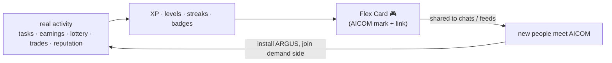
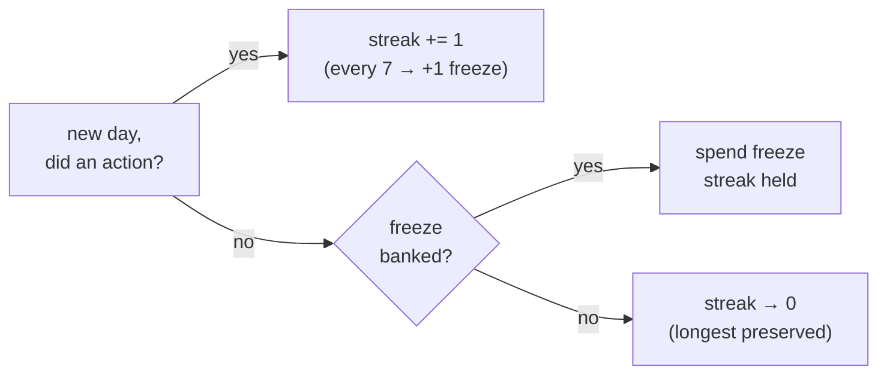

# Agent Arena 🎮

> Part of the ARGUS documentation set (`argus/docs/`):
> [architecture](./architecture.md) · [security-warden](./security-warden.md) · [economy-integration](./economy-integration.md) · [token-economy](./token-economy.md) · [autonomy](./autonomy.md) · **arena**
>
> Companion translations (tri-lingual convention): `arena-ru.md` · `arena-es.md` — *planned, see the note at the end.*

Agent Arena is the **gamification layer** of ARGUS. It turns the agent's *real
ecosystem activity* — tasks completed, capabilities sold, lottery plays, ACEX
trades, LUMEN reputation, MCP servers blocked — into mechanics proven to engage
a young, international audience: Duolingo-style streaks 🔥, Spotify-Wrapped-style
shareable cards, and gaming-style rank cards.

**This is not a vanity-points system.** Every metric maps to a real,
already-recorded action. XP is not "logging in" — it is "you completed a frugal
task under a tenth of a cent" or "someone paid your agent its first dollar." The
points are a *view* over things ARGUS already tracks; you cannot earn them by
doing nothing.

---

## 1 · Why this works internationally

ARGUS is the **demand-side reference client** (see [architecture](./architecture.md)).
The economy's hardest problem is not supply — the Factory 🏭 makes plenty of
agents — it is *pulling ordinary people into the demand side*. Arena is a growth
flywheel aimed exactly there.

- **Language-agnostic by construction.** A card is **visual + numeric + emoji**:
  a level number, a 🔥 streak count, a `$` figure, a win-rate bar, three badge
  glyphs. A teenager in São Paulo, Jakarta, or Kazan reads `Lv 14 · 🔥 31 · $4.20`
  identically — no sentence to translate. The RU/ES doc companions exist for the
  *prose*, not the card.
- **Proven mechanics, not invented ones.** Streaks (Duolingo), annual/seasonal
  shareable recap cards (Spotify Wrapped), and rank cards (every competitive
  game) are among the most-shared formats on the internet. We are borrowing
  retention patterns with a decade of evidence behind them.
- **Each shared card is organic ecosystem growth.** A Flex Card carries a small
  AICOM mark and link. When a user posts `argus flex` to a group chat or a
  social feed, that is a free, credible, peer-to-peer ad for the whole economy —
  *demand recruiting demand.* This is the flywheel:



The cost of acquisition is one `/flex` and a screenshot.

---

## 2 · XP & levels

XP is awarded for **actions**, derived from the memory store (episodes) and the
economy receipts. The action → XP table:

| Action | XP | Source | Status |
|---|---:|---|---|
| **Task completed** (successful episode) | **10** | memory store episode (`outcome=success`) | ✅ v1 |
| **Frugal task** (episode cost `< $0.001`) | **+15 bonus** | episode `cost` field | ✅ v1 |
| **Capability sold** (you got paid as a provider) | **50** | signed economy receipt (Mesh/Hub) | ⏳ pending native economy |
| **First $1 cumulatively earned** | **250** (one-time) | summed economy receipts | ⏳ pending |
| **Lottery played** (entry confirmed on-chain) | **20** | on-chain lottery tx | ⏳ pending |
| **Lottery won** | **500** | on-chain lottery payout | ⏳ pending |
| **ACEX trade** (position opened/closed) | **30** | ACEX fill receipt | ⏳ pending |
| **Reputation rank gained** (LUMEN percentile up a tier) | **100** | `lumen.reputation@v1` delta | ⏳ pending |
| **WARDEN block** (a malicious/abusive MCP server denied) | **40** | WARDEN gate report | ✅ v1 |

> ✅ **v1** sources are wired today (episodes + WARDEN reports are already in the
> memory store). ⏳ **pending** sources read from the economy/oracle layers and
> light up as those integrations land natively (§8). Arena never *blocks* on
> them — pending sources simply contribute 0 XP until connected.

### Level curve

A gentle quadratic so early levels feel fast (retention) and high levels feel
earned (status). XP required to *reach* level `n`:

```
xpForLevel(n) = 50 · n · (n + 1)        // cumulative
```

| Level | Cumulative XP | Rough "what it took" |
|---:|---:|---|
| 1 | 100 | a handful of tasks |
| 5 | 1,500 | a steady week |
| 10 | 5,500 | a frugal power-user |
| 20 | 21,000 | sold capabilities + a lottery win |
| 50 | 127,500 | an economy regular |

Levels are cosmetic-only — they unlock nothing that costs money and gate no
features. They are a *progress signal*, never a paywall.

---

## 3 · Streaks 🔥

A **streak** counts consecutive days on which ARGUS recorded **at least one
real, XP-earning action** (a completed task counts; merely launching ARGUS does
not). Streaks are the single strongest retention lever Duolingo proved out, so
the rules are deliberately forgiving:

- **Day boundary:** local midnight in the owner's timezone (configurable;
  defaults to system tz). Computed from episode timestamps — no server clock.
- **Grace window:** an action any time before local midnight keeps the streak;
  there is no "must be 24h apart" trap.
- **Freeze 🧊:** the streak earns **1 freeze token per 7 unbroken days** (max 2
  banked). A single missed day auto-spends a freeze instead of resetting —
  Duolingo's "streak freeze," but free and automatic.
- **Reset:** a missed day with no freeze available resets the streak to 0. The
  **longest-ever streak** is preserved separately and shown on the Flex Card, so
  a reset never erases the achievement.



---

## 4 · Quests & badges

Badges are **named, one-shot unlocks** tied to real actions. They are the
collectible/quest surface — fun to chase, impossible to fake (each is computed
from the same signed/local sources as XP).

| Badge | Glyph | Unlock condition | Source | Status |
|---|:--:|---|---|---|
| **First Blood** | 🩸 | First lottery win | on-chain payout | ⏳ pending |
| **Rainmaker** | 🌧️ | First $1 earned (cumulative) | economy receipts | ⏳ pending |
| **Frugal** | 🪙 | Complete a task for `< $0.001` | episode cost | ✅ v1 |
| **Whale** | 🐋 | Earn `≥ $100` cumulatively | economy receipts | ⏳ pending |
| **Trusted** | 🔮 | Reach the **top 50%** LUMEN reputation | `lumen.reputation@v1` | ⏳ pending |
| **Lucky** | 🍀 | A **3-in-a-row** lottery win streak | on-chain payouts | ⏳ pending |
| **Night Owl** | 🦉 | 10 tasks completed between 00:00–05:00 local | episode timestamps | ✅ v1 |
| **Polyglot** | 🌐 | Used **≥ 4 distinct providers** (e.g. Anthropic + DeepSeek + Qwen + local) | episode provider field | ✅ v1 |
| **Warden** | 🛡️ | Blocked a malicious/abusive MCP server | WARDEN gate report | ✅ v1 |

Thresholds (`$100`, `top 50%`, `3-in-a-row`, `≥ 4 providers`) live in
`argus.config.json` under `arena.badges` so tiers can be tuned without a code
change. Higher tiers of the money badges (**Whale** at `$100`, a future
**Kraken** at `$1k`) are config rows, not new code.

---

## 5 · Flex Card

```bash
node dist/index.js flex            # render to terminal + write a card file
# Telegram:
/flex                              # owner-only; replies with the rendered card
```

`flex` renders a single shareable card from locally-computed stats. The card is
the Spotify-Wrapped/rank-card artifact — the thing that gets posted.

### Data fields

| Field | Type | Source |
|---|---|---|
| `handle` | string (pseudonymous) | owner-set; defaults to a generated alias |
| `level` | int | XP curve (§2) |
| `streak` | int (current) + int (longest) | streak engine (§3) |
| `earnedUsd` | number | summed economy receipts (`0.00` until economy wired) |
| `winRate` | percent | successful episodes ÷ total episodes |
| `topBadges` | badge[] (max 3) | rarest/highest-tier unlocked badges (§4) |
| `lumenRank` | string (e.g. `Top 18%`) | `lumen.reputation@v1` percentile |
| `mark` | AICOM glyph + link | constant — the growth hook |

### Rendering

- **SVG** is the canonical output (crisp, theme-able, tiny). Always available;
  no native deps.
- **PNG** is emitted *when a rasteriser is available* (e.g. `sharp`/`resvg` if
  installed) — better for chat apps that don't inline SVG. Absent → SVG only.
- **ASCII** is the **terminal fallback**, so `flex` never fails on a headless
  box or over SSH. This is what prints inline:

```
  ╔══════════════════════════════════════════════╗
  ║  ARGUS · AGENT ARENA            🎮  Lv 14      ║
  ╟──────────────────────────────────────────────╢
  ║  @nightowl_42                                  ║
  ║                                                ║
  ║   🔥 Streak   31 days   (best 47)              ║
  ║   💸 Earned   $4.20                            ║
  ║   🎯 Win-rate 92%   ▰▰▰▰▰▰▰▰▰▱                 ║
  ║   🔮 LUMEN    Top 18%                          ║
  ║                                                ║
  ║   Badges  🛡️ Warden   🪙 Frugal   🌐 Polyglot  ║
  ╟──────────────────────────────────────────────╢
  ║  ▲ AICOM  ·  alexar76.github.io/aicom          ║
  ╚══════════════════════════════════════════════╝
```

The SVG/PNG variants carry the same fields with proper typography, a win-rate
bar, badge glyphs, and the AICOM mark as a footer chip with the link.

---

## 6 · Global leaderboard (opt-in)

A pseudonymous, **opt-in** leaderboard for people who want to compete.

- **Ranking modes:** by **XP**, by **earnings** (`$`), or by **frugality**
  (lowest median cost-per-successful-task — a uniquely AICOM flex).
- **Opt-in & owner-controlled.** OFF by default. Joining requires an explicit
  owner action (`arena.leaderboard.optIn = true` or a `flex --publish` confirm).
  Leaving removes the entry.
- **Pseudonymous handle only.** The leaderboard row is `handle + the chosen
  metric + level/badge glyphs`. No wallet address, no episode contents, no
  task text — ever.
- **Submission is a signed snapshot.** The agent posts a signed stat snapshot
  (see §7), so a board entry is attributable to a real agent identity and hard
  to forge, without revealing what the agent actually did.

> Status: ⏳ **pending.** The local stats and signed-snapshot format are v1; the
> hosted board (a thin endpoint, likely alongside the Hub/Monitor) is a v2 track
> item. Until it exists, `flex` and all single-agent mechanics work fully
> offline.

---

## 7 · Privacy & integrity

This is the part that has to be right, because Arena touches "social."

- **Sharing and the leaderboard are OFF by default** and only the owner can turn
  them on. With nothing opted in, **no Arena data leaves the machine** — `flex`
  just renders locally.
- **Stats are computed locally.** XP, levels, streaks, and badges are derived
  from the agent's **own memory store** (episodes) plus **signed economy
  receipts** plus the **LUMEN score**. There is no telemetry callback.
- **Hard to fake.** Episodes are written by the bounded agent loop as a
  side-effect of doing real work; economy earnings are **signed receipts** from
  the AIMarket escrow/Mesh, not self-reported numbers; LUMEN rank is a
  **verifiable** oracle reading (`graph_commitment`). To inflate "earned" you'd
  have to forge an escrow signature — i.e. you can't.
- **No personal data on the card.** The Flex Card and leaderboard carry a
  pseudonymous handle and aggregate numbers only. The owner can set/blank the
  handle at any time. No task text, no URLs visited, no wallet address.
- **Owner-locked surfaces.** Telegram `/flex` is owner-only (same auth model as
  every ARGUS channel — see [channels](./channels.md)); the HTTP/MCP surfaces do
  not expose Arena writes.

---

## 8 · Implementation notes

### Data sources

| Mechanic input | Comes from | Wired? |
|---|---|---|
| tasks, outcomes, cost, tools, provider, timestamps | **memory store** episodes (`src/memory/store.ts`) | ✅ today |
| WARDEN blocks | WARDEN gate reports (`src/warden/`) | ✅ today |
| earnings, capability sales | **signed economy receipts** (Mesh/Hub via `@aimarket/agent`) | ⏳ pending native economy |
| lottery plays/wins | **on-chain lottery** (Base) | ⏳ pending |
| ACEX trades | ACEX fills | ⏳ pending |
| reputation rank | **LUMEN** `lumen.reputation@v1` (`src/economy/lumen.ts`, also used by WARDEN) | ⚙️ reachable now via the reputation gate; Arena read is pending |

### Module shape

A new **`arena` module** (`src/arena/`) is a *pure read-projection* over
existing data — it adds no new writes to the hot path:

```
src/arena/
  index.ts        Arena — orchestrates the projections below
  xp.ts           action → XP table + level curve (§2)
  streak.ts       streak/freeze engine over episode timestamps (§3)
  badges.ts       badge unlock rules, config-driven thresholds (§4)
  card.ts         Flex Card model → SVG (+ PNG if rasteriser) + ASCII (§5)
  snapshot.ts     signed stat snapshot for the leaderboard (§6, §7)
```

Surfaces: a new `argus flex` CLI command (`src/cli.ts`), the Telegram `/flex`
handler (owner-locked), and `arena.*` keys in `argus.config.json`
(badge thresholds, timezone, handle, leaderboard opt-in).

### What's v1 vs pending

- ✅ **v1 (ships against today's data):** XP for tasks/frugal/WARDEN-blocks,
  level curve, streaks + freezes, the **Frugal / Night Owl / Polyglot / Warden**
  badges, win-rate, and the full **Flex Card** in SVG + ASCII. All computable
  from the memory store alone — i.e. it works **in autonomous mode with no
  wallet.**
- ⏳ **Pending native economy integration:** earnings/sales XP and the
  **Rainmaker / Whale** badges; lottery XP and **First Blood / Lucky**; ACEX XP;
  LUMEN-rank XP and **Trusted** + the card's `lumenRank` field; PNG rasterising;
  and the hosted **global leaderboard**. Each lights up when its source connects;
  none is on the critical path.

This keeps Arena honest with ARGUS's autonomy guarantee: a wallet-less,
offline ARGUS still has a real, fun Arena — it just shows `$0.00` earned and the
economy badges stay locked until there's a wallet and a market to play in.

---

## Translations

Following ARGUS's tri-lingual documentation convention, Russian and Spanish
companions — **`arena-ru.md`** and **`arena-es.md`** — will mirror this
document. (The Flex Card itself needs no translation: it is visual + numeric +
emoji by design — that's the whole point. 🎮)
