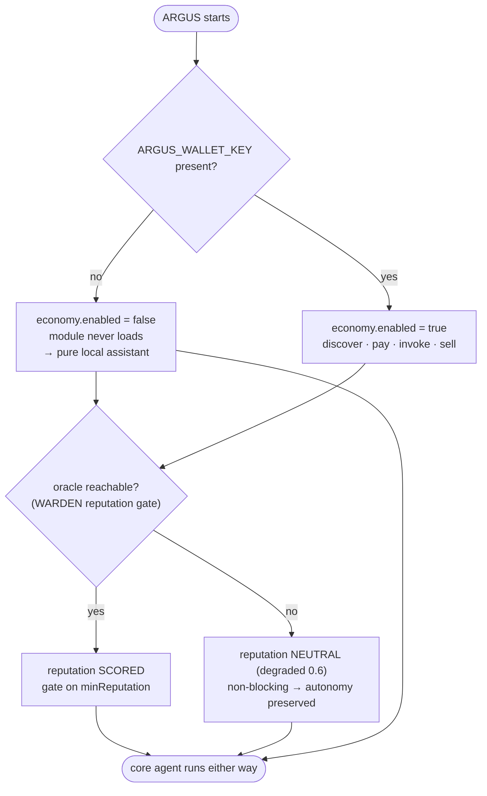

# Autonomía — la garantía de independencia

> 🌐 Idiomas: [English](./autonomy.md) · [Русский](./autonomy-ru.md) · **Español**

> Parte del conjunto de documentación de ARGUS (`argus/docs/`):
> [architecture](./architecture-es.md) · [security-warden](./security-warden.md) · [economy-integration](./economy-integration.md) · [token-economy](./token-economy-es.md) · **autonomy**

ARGUS es *nativo* de la economía, no *dependiente* de ella. La garantía: con **cero billetera y cero red hacia AICOM**, ARGUS sigue siendo un agente personal completo y reforzado en seguridad. La economía es un módulo acoplable que activa capacidades extra cuando hay una billetera presente — nunca puede convertirse en un requisito previo para que el agente funcione.

Esto se aplica estructuralmente (véase [architecture.md](./architecture-es.md#layer-stack-and-the-autonomy-line) para la línea de autonomía y [economy-integration.md](./economy-integration.md#staying-autonomous) para el interruptor), no por convención.

---

## Qué funciona sin economía / sin red

Capas 1–4. Todo lo que está por encima de la línea de autonomía.

| Capacidad | Se activa gracias a | Código fuente |
|------------|---------------------|---------------|
| **Razonamiento con modelo local** | Un proveedor `local` (Ollama por defecto, `http://127.0.0.1:11434/v1`) no necesita clave ni red. | `src/providers/openai.ts`, `src/providers/router.ts` |
| **El bucle completo del agente** | Plan → execute → observe con el budget governor se ejecuta íntegramente en local. | `src/core/agent.ts`, `src/core/budget.ts` |
| **Herramientas integradas + MCP** | El MCP host conecta herramientas locales independientemente del estado de la economía. | `src/types.ts` (`Tool`, `ToolSource`) |
| **🛡️ WARDEN static-scan** | Escaneo regex puramente local de descripciones/esquemas de herramientas — sin red. | `src/warden/static-scan.ts` |
| **🛡️ WARDEN threat-feed builtins** | La lista de denegación integrada es el suelo siempre presente; el feed remoto es opcional. | `src/warden/threat-feed.ts` |
| **🛡️ WARDEN pinning** | Instantáneas sha256 de definiciones de herramientas + detección de deriva, almacenadas localmente. | `src/warden/pinning.ts`, `src/memory/store.ts` |
| **🛡️ Runtime sandbox** | Clasificación de herramientas sensibles + lista blanca de egress. | `src/warden/sandbox.ts` |
| **Memoria + autoaprendizaje** | Episodios y lecciones destiladas viven en `~/.argus`; recall y destilación son locales. | `src/memory/store.ts`, `src/memory/lessons.ts` |
| **Medidor de tokens** | La contabilidad de costes es aritmética local sobre precios configurados. | `src/core/budget.ts` |

Así, sin nada configurado, ARGUS funciona contra un modelo local, aloja herramientas MCP detrás de WARDEN, recuerda y aprende — un asistente autónomo completo.

---

## Qué se activa adicionalmente con una billetera

Capa 5, solo cuando `ARGUS_WALLET_KEY` está presente.

| Capacidad añadida | Requiere |
|-------------------|----------|
| **Consumo de capacidades de pago** | Billetera → discover → open USDC channel → invoke → settle (véase [economy-integration.md](./economy-integration.md)). |
| **Venta de habilidades** | Billetera → registro en AI Service Mesh → list `SellableCapability` → earn. |
| **Puntuación de reputación LUMEN** 🔮 | Endpoint oracle-family alcanzable. **Degrada a neutral cuando no es alcanzable, por lo que nunca bloquea la autonomía.** |

La puerta de reputación es el caso sutil: es una entrada del lado de la economía *usada por el firewall sin conexión*. Está cableada para que el firewall siga funcionando sin ella — una puntuación baja es orientativa bajo la política por defecto, y un oráculo inalcanzable produce una puntuación neutral `degraded` (`0.6`, `REPUTATION_UNAVAILABLE`) en lugar de un bloqueo. Véase [security-warden.md](./security-warden.md#why-oracle-reputation-beats-blocklists).

---

## Los dos interruptores

Dos condiciones independientes deciden qué está activo. Ninguna puede desactivar el núcleo del agente.

### Tabla de decisiones

| `ARGUS_WALLET_KEY` | Oracle reachable | Economy | Reputation gate | Core agent (loop, tools, WARDEN, memory) |
|:---:|:---:|:---:|:---:|:---:|
| absent | n/a | off (module never loads) | neutral / degraded | ✅ runs |
| present | no | on | neutral (`0.6`, non-blocking) | ✅ runs |
| present | yes | on | scored vs `minReputation` | ✅ runs |

El interruptor de economía se deriva únicamente de la clave de billetera en `loadConfig()` (`src/config.ts`): `economy.enabled = Boolean(walletKey)`. El interruptor de reputación es la alcanzabilidad del oráculo, manejada dentro de `LumenOracle` (`src/economy/lumen.ts`) y `ReputationGate` (`src/warden/reputation.ts`), que ambos devuelven un resultado neutral `degraded` ante un fallo. La fila inferior de la tabla — el núcleo del agente — es **siempre** `✅`.
