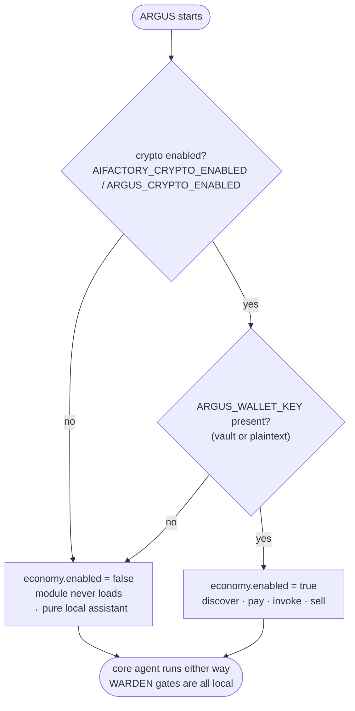

# Autonomía — la garantía de independencia

> 🌐 Idiomas: [English](./autonomy.md) · [Русский](./autonomy-ru.md) · **Español**

> Parte del conjunto de documentación de ARGUS (`argus/docs/`):
> [architecture](./architecture-es.md) · [security-warden](./security-warden.md) · [economy-integration](./economy-integration.md) · [token-economy](./token-economy-es.md) · **autonomy**

ARGUS es *nativo* de la economía, no *dependiente* de ella. La garantía: con **cero billetera y cero red hacia AICOM**, ARGUS sigue siendo un agente personal completo y reforzado en seguridad. La economía es un módulo acoplable que activa capacidades extra cuando hay una billetera presente — nunca puede convertirse en un requisito previo para que el agente funcione.

Esto se aplica estructuralmente (véase [architecture.md](./architecture-es.md#pila-de-capas-y-la-línea-de-autonomía) para la línea de autonomía y [economy-integration.md](./economy-integration.md#staying-autonomous) para el interruptor), no por convención.

---

## Qué funciona sin economía / sin red

Capas 1–4. Todo lo que está por encima de la línea de autonomía.

| Capacidad | Se activa gracias a | Código fuente |
|------------|---------------------|---------------|
| **Razonamiento con modelo local** | Un proveedor `local` (Ollama por defecto, `http://127.0.0.1:11434/v1`) no necesita clave ni red. | `src/providers/openai.ts`, `src/providers/router.ts` |
| **El bucle completo del agente** | Plan → execute → observe con el budget governor se ejecuta íntegramente en local. | `src/core/agent.ts`, `src/core/budget.ts` |
| **Herramientas integradas + MCP** | El MCP host conecta herramientas locales independientemente del estado de la economía. | `src/types.ts` (`Tool`, `ToolSource`) |
| **🛡️ WARDEN static-scan** | Escaneo regex puramente local de nombres/descripciones/esquemas de herramientas — sin red. | `@aimarket/warden/src/static-scan.ts` |
| **🛡️ WARDEN threat-feed builtins** | La lista de denegación integrada es el suelo siempre presente; el feed remoto es opcional. | `@aimarket/warden/src/threat-feed.ts` |
| **🛡️ WARDEN puerta origin** | Que un servidor fuera declarado bajo `mcp.servers` o descubierto desde un catálogo es un hecho que ARGUS ya tiene — sin oráculo y sin red. | `@aimarket/warden/src/origin.ts` |
| **🛡️ WARDEN pinning** | Instantáneas sha256 de definiciones de herramientas + detección de deriva, almacenadas localmente. | `@aimarket/warden/src/pinning.ts`, `src/memory/store.ts` |
| **🛡️ Runtime sandbox** | Clasificación de herramientas sensibles + lista blanca de egress. | `@aimarket/warden/src/sandbox.ts` |
| **Memoria + autoaprendizaje** | Episodios y lecciones destiladas viven en `~/.argus`; recall y destilación son locales. | `src/memory/store.ts`, `src/memory/lessons.ts` |
| **Medidor de tokens** | La contabilidad de costes es aritmética local sobre precios configurados. | `src/core/budget.ts` |

Así, sin nada configurado, ARGUS funciona contra un modelo local, aloja herramientas MCP detrás de WARDEN, recuerda y aprende — un asistente autónomo completo.

---

## Qué se activa adicionalmente con una billetera

Capa 5, solo cuando `ARGUS_WALLET_KEY` está presente.

| Capacidad añadida | Requiere |
|-------------------|----------|
| **Consumo de capacidades de pago** | Billetera → discover → open USDC channel → invoke → settle (véase [economy-integration.md](./economy-integration.md)). |
| **Venta de habilidades** | Billetera → registro en AI Service Mesh → list `SellableCapability` → earn. |
| **Puntuación de reputación LUMEN** 🔮 | Billetera → `argus passport` pide a LUMEN que puntúe tu dirección. **Hoy no es obtenible:** `scoreEntity` se llama sin aristas de confianza, y LUMEN necesita un grafo de confianza que ningún despliegue publica, así que el passport imprime `unattested`, sin puntuación y sin rango. |

WARDEN ya no toma ninguna entrada del lado de la economía. Su tercera puerta es la puerta **origin**, que lee de dónde vino la declaración de un servidor — tu `mcp.servers`, o una entrada de `mcp.catalogs` — y no necesita oráculo ni red. La puerta de reputación que ocupaba ese slot ya no existe; véase [security-warden.md](./security-warden.md#the-origin-gate-and-the-reputation-gate-that-used-to-be-here).

---

## Los dos interruptores

Dos condiciones independientes deciden qué está activo. Ninguna puede desactivar el núcleo del agente.

```mermaid
flowchart TD
  START([ARGUS starts]) --> C{"crypto enabled?<br/>AIFACTORY_CRYPTO_ENABLED / ARGUS_CRYPTO_ENABLED"}
  C -- "no" --> OFF["economy.enabled = false<br/>module never loads<br/>→ pure local assistant"]
  C -- "yes" --> W{"ARGUS_WALLET_KEY present?<br/>(vault or plaintext)"}
  W -- "no" --> OFF
  W -- "yes" --> ON["economy.enabled = true<br/>discover · pay · invoke · sell"]

  OFF --> CORE
  ON --> CORE([core agent runs either way<br/>WARDEN gates are all local])
```

### Tabla de decisiones

| Crypto flag | `ARGUS_WALLET_KEY` | Economy | WARDEN gate chain | Core agent (loop, tools, WARDEN, memory) |
|:---:|:---:|:---:|:---:|:---:|
| off | n/a | off (module never loads) | static · threat · origin · pinning | ✅ runs |
| on | absent | off (module never loads) | static · threat · origin · pinning | ✅ runs |
| on | present | on | static · threat · origin · pinning | ✅ runs |

Ambos interruptores se resuelven en `loadConfig()` (`src/config.ts`): `economy.enabled = merged.cryptoEnabled && Boolean(walletKey)`. La columna de WARDEN no varía, porque ninguna puerta llega a la red: la cadena es la misma con la economía encendida o apagada. La fila inferior de la tabla — el núcleo del agente — es **siempre** `✅`.
