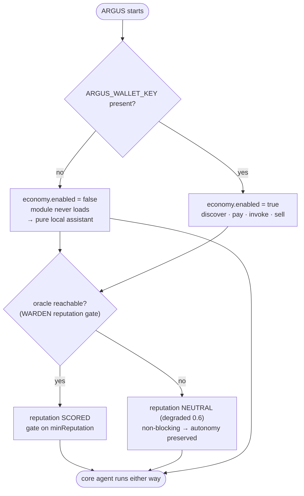

# Автономия — гарантия независимости

> 🌐 Язык: [English](./autonomy.md) · **Русский** · [Español](./autonomy-es.md)

> Часть набора документации ARGUS (`argus/docs/`):
> [architecture](./architecture-ru.md) · [security-warden](./security-warden.md) · [economy-integration](./economy-integration.md) · [token-economy](./token-economy-ru.md) · **autonomy**

ARGUS *нативен* для экономики, но не *зависит* от неё. Гарантия: при **нулевом кошельке и нулевой сети к AICOM** ARGUS остаётся полноценным, усиленным в безопасности персональным агентом. Экономика — подключаемый модуль, который включает дополнительные возможности при наличии кошелька — она никогда не может стать обязательным условием работы агента.

Это обеспечено структурно (см. [architecture.md](./architecture-ru.md#layer-stack-and-the-autonomy-line) для линии автономии и [economy-integration.md](./economy-integration.md#staying-autonomous) для переключателя), а не соглашением.

---

## Что работает без экономики / без сети

Слои 1–4. Всё выше линии автономии.

| Возможность | Включается благодаря | Исходный код |
|-------------|----------------------|--------------|
| **Локальное рассуждение модели** | Провайдер `local` (по умолчанию Ollama, `http://127.0.0.1:11434/v1`) не требует ключа и сети. | `src/providers/openai.ts`, `src/providers/router.ts` |
| **Полный цикл агента** | Plan → execute → observe с budget governor выполняется полностью локально. | `src/core/agent.ts`, `src/core/budget.ts` |
| **Встроенные + MCP-инструменты** | MCP host подключает локальные инструменты независимо от состояния экономики. | `src/types.ts` (`Tool`, `ToolSource`) |
| **🛡️ WARDEN static-scan** | Чисто локальное regex-сканирование описаний/схем инструментов — без сети. | `src/warden/static-scan.ts` |
| **🛡️ WARDEN threat-feed builtins** | Встроенный deny-list — всегда присутствующий минимум; удалённый feed опционален. | `src/warden/threat-feed.ts` |
| **🛡️ WARDEN pinning** | sha256-снимки определений инструментов + обнаружение дрейфа, хранятся локально. | `src/warden/pinning.ts`, `src/memory/store.ts` |
| **🛡️ Runtime sandbox** | Классификация чувствительных инструментов + egress allowlist. | `src/warden/sandbox.ts` |
| **Память + самообучение** | Эпизоды и дистиллированные уроки живут в `~/.argus`; recall и дистилляция локальны. | `src/memory/store.ts`, `src/memory/lessons.ts` |
| **Счётчик токенов** | Учёт стоимости — локальная арифметика по настроенным ценам. | `src/core/budget.ts` |

Таким образом, без какой-либо конфигурации ARGUS работает на локальной модели, размещает MCP-инструменты за WARDEN, запоминает и учится — полноценный автономный ассистент.

---

## Что дополнительно включается с кошельком

Слой 5, только при наличии `ARGUS_WALLET_KEY`.

| Добавленная возможность | Требует |
|-------------------------|---------|
| **Платное потребление возможностей** | Кошелёк → discover → open USDC channel → invoke → settle (см. [economy-integration.md](./economy-integration.md)). |
| **Продажа навыков** | Кошелёк → регистрация в AI Service Mesh → list `SellableCapability` → earn. |
| **Оценка репутации LUMEN** 🔮 | Достижимость oracle-family эндпоинта. **Деградирует до нейтрального при недоступности, поэтому никогда не блокирует автономию.** |

Ворота репутации — тонкий случай: это вход со стороны экономики, *используемый офлайн-файрволом*. Они подключены так, что файрвол продолжает работать без него — низкий балл при политике по умолчанию носит рекомендательный характер, а недоступный оракул даёт нейтральный `degraded` балл (`0.6`, `REPUTATION_UNAVAILABLE`) вместо блокировки. См. [security-warden.md](./security-warden.md#why-oracle-reputation-beats-blocklists).

---

## Два переключателя

Два независимых условия определяют, что активно. Ни одно не может отключить ядро агента.

### Таблица решений

| `ARGUS_WALLET_KEY` | Oracle reachable | Economy | Reputation gate | Core agent (loop, tools, WARDEN, memory) |
|:---:|:---:|:---:|:---:|:---:|
| absent | n/a | off (module never loads) | neutral / degraded | ✅ runs |
| present | no | on | neutral (`0.6`, non-blocking) | ✅ runs |
| present | yes | on | scored vs `minReputation` | ✅ runs |

Переключатель экономики выводится исключительно из ключа кошелька в `loadConfig()` (`src/config.ts`): `economy.enabled = Boolean(walletKey)`. Переключатель репутации — достижимость оракула, обрабатывается внутри `LumenOracle` (`src/economy/lumen.ts`) и `ReputationGate` (`src/warden/reputation.ts`), которые оба возвращают нейтральный `degraded` результат при сбое. Нижняя строка таблицы — ядро агента — **всегда** `✅`.
