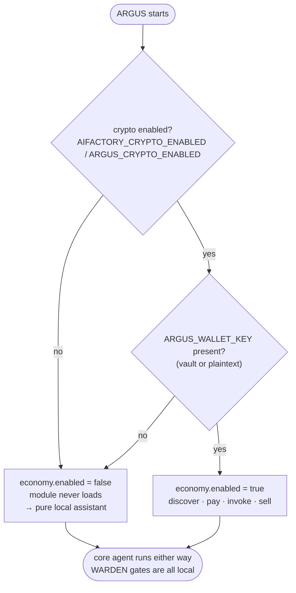

# Автономия — гарантия независимости

> 🌐 Язык: [English](./autonomy.md) · **Русский** · [Español](./autonomy-es.md)

> Часть набора документации ARGUS (`argus/docs/`):
> [architecture](./architecture-ru.md) · [security-warden](./security-warden.md) · [economy-integration](./economy-integration.md) · [token-economy](./token-economy-ru.md) · **autonomy**

ARGUS *нативен* для экономики, но не *зависит* от неё. Гарантия: при **нулевом кошельке и нулевой сети к AICOM** ARGUS остаётся полноценным, усиленным в безопасности персональным агентом. Экономика — подключаемый модуль, который включает дополнительные возможности при наличии кошелька — она никогда не может стать обязательным условием работы агента.

Это обеспечено структурно (см. [architecture.md](./architecture-ru.md#стек-слоёв-и-линия-автономии) для линии автономии и [economy-integration.md](./economy-integration.md#staying-autonomous) для переключателя), а не соглашением.

---

## Что работает без экономики / без сети

Слои 1–4. Всё выше линии автономии.

| Возможность | Включается благодаря | Исходный код |
|-------------|----------------------|--------------|
| **Локальное рассуждение модели** | Провайдер `local` (по умолчанию Ollama, `http://127.0.0.1:11434/v1`) не требует ключа и сети. | `src/providers/openai.ts`, `src/providers/router.ts` |
| **Полный цикл агента** | Plan → execute → observe с budget governor выполняется полностью локально. | `src/core/agent.ts`, `src/core/budget.ts` |
| **Встроенные + MCP-инструменты** | MCP host подключает локальные инструменты независимо от состояния экономики. | `src/types.ts` (`Tool`, `ToolSource`) |
| **🛡️ WARDEN static-scan** | Чисто локальное regex-сканирование имён/описаний/схем инструментов — без сети. | `@aimarket/warden/src/static-scan.ts` |
| **🛡️ WARDEN threat-feed builtins** | Встроенный deny-list — всегда присутствующий минимум; удалённый feed опционален. | `@aimarket/warden/src/threat-feed.ts` |
| **🛡️ WARDEN origin gate** | Объявлен ли сервер в `mcp.servers` или найден в каталоге — факт, которым ARGUS уже располагает: без оракула и без сети. | `@aimarket/warden/src/origin.ts` |
| **🛡️ WARDEN pinning** | sha256-снимки определений инструментов + обнаружение дрейфа, хранятся локально. | `@aimarket/warden/src/pinning.ts`, `src/memory/store.ts` |
| **🛡️ Runtime sandbox** | Классификация чувствительных инструментов + egress allowlist. | `@aimarket/warden/src/sandbox.ts` |
| **Память + самообучение** | Эпизоды и дистиллированные уроки живут в `~/.argus`; recall и дистилляция локальны. | `src/memory/store.ts`, `src/memory/lessons.ts` |
| **Счётчик токенов** | Учёт стоимости — локальная арифметика по настроенным ценам. | `src/core/budget.ts` |

Таким образом, без какой-либо конфигурации ARGUS работает на локальной модели, размещает MCP-инструменты за WARDEN, запоминает и учится — полноценный автономный ассистент.

---

## Что дополнительно включается с кошельком

Слой 5, только при наличии `ARGUS_WALLET_KEY`.

| Добавленная возможность | Требует |
|-------------------------|---------|
| **Платное потребление возможностей** | Кошелёк → discover → open USDC channel → invoke → settle (см. [economy-integration.md](./economy-integration.md)). |
| **Продажа навыков** | Кошелёк → регистрация в AI Service Mesh → list `SellableCapability` → earn. |
| **Оценка репутации LUMEN** 🔮 | Кошелёк → `argus passport` просит LUMEN оценить ваш адрес. **Сегодня получить нельзя:** `scoreEntity` вызывается без рёбер доверия, а LUMEN нужен граф доверия, который не публикует ни одна инсталляция, поэтому passport печатает `unattested` — без score и без ранга. |

WARDEN больше не принимает никаких входов со стороны экономики. Его третий шлюз — **origin**: он читает, откуда взялось объявление сервера (из вашего `mcp.servers` или из записи в `mcp.catalogs`), и не требует ни оракула, ни сети. Шлюза репутации, стоявшего в этом слоте, больше нет; см. [security-warden.md](./security-warden-ru.md#шлюз-origin--и-шлюз-репутации-который-стоял-здесь-раньше).

---

## Два переключателя

Два независимых условия определяют, что активно. Ни одно не может отключить ядро агента.

```mermaid
flowchart TD
  START([ARGUS starts]) --> C{"crypto enabled?<br/>AIFACTORY_CRYPTO_ENABLED / ARGUS_CRYPTO_ENABLED"}
  C -- "no" --> OFF["economy.enabled = false<br/>module never loads<br/>→ pure local assistant"]
  C -- "yes" --> W{"ARGUS_WALLET_KEY present?<br/>(vault or plaintext)"}
  W -- "no" --> OFF
  W -- "yes" --> ON["economy.enabled = true<br/>discover · pay · invoke · sell"]

  OFF --> CORE
  ON --> CORE([core agent runs either way<br/>WARDEN gates are all local])
```

### Таблица решений

| Crypto flag | `ARGUS_WALLET_KEY` | Economy | Цепочка шлюзов WARDEN | Core agent (loop, tools, WARDEN, memory) |
|:---:|:---:|:---:|:---:|:---:|
| off | n/a | off (module never loads) | static · threat · origin · pinning | ✅ runs |
| on | absent | off (module never loads) | static · threat · origin · pinning | ✅ runs |
| on | present | on | static · threat · origin · pinning | ✅ runs |

Оба переключателя разрешаются в `loadConfig()` (`src/config.ts`): `economy.enabled = merged.cryptoEnabled && Boolean(walletKey)`. Колонка WARDEN не меняется, потому что ни один шлюз не выходит в сеть: цепочка одна и та же, включена экономика или нет. Нижняя строка таблицы — ядро агента — **всегда** `✅`.
