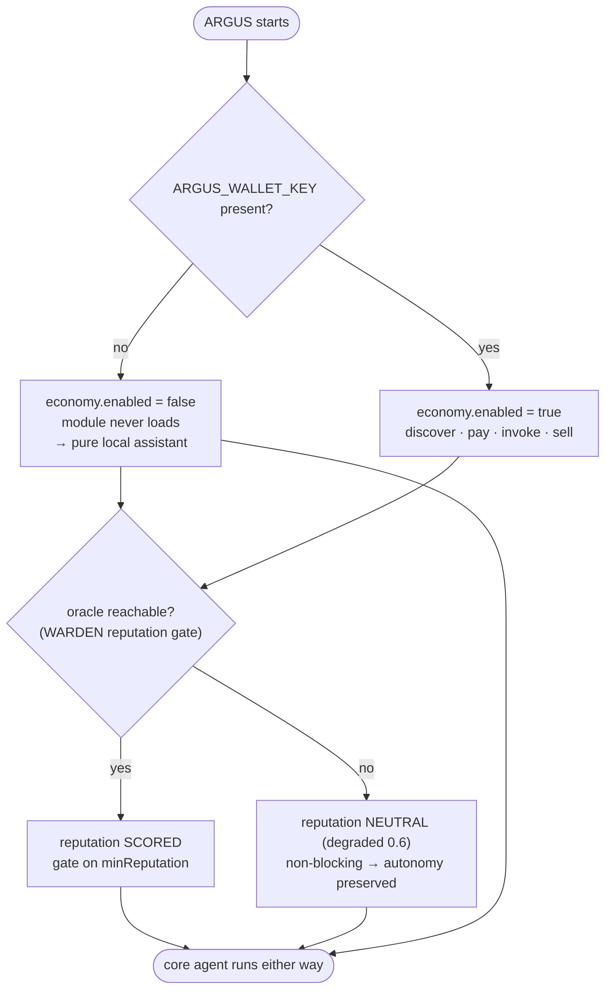

# Autonomy — the independence guarantee

> 🌐 Language: **English** · [Русский](./autonomy-ru.md) · [Español](./autonomy-es.md)

> Part of the ARGUS documentation set (`argus/docs/`):
> [architecture](./architecture.md) · [security-warden](./security-warden.md) · [economy-integration](./economy-integration.md) · [token-economy](./token-economy.md) · **autonomy**

ARGUS is economy-*native*, not economy-*dependent*. The guarantee: with **zero
wallet and zero network to AICOM**, ARGUS is still a complete, security-hardened
personal agent. The economy is a clip-on that lights up extra capabilities when
a wallet is present — it can never become a prerequisite for the agent working.

This is enforced structurally (see
[architecture.md](./architecture.md#layer-stack-and-the-autonomy-line) for the
autonomy line and [economy-integration.md](./economy-integration.md#staying-autonomous)
for the switch), not by convention.

---

## What works with zero economy / zero network

Layers 1–4. Everything above the autonomy line.

| Capability | Lights up because | Source |
|------------|-------------------|--------|
| **Local model reasoning** | A `local` provider (Ollama by default, `http://127.0.0.1:11434/v1`) needs no key and no network. | `src/providers/openai.ts`, `src/providers/router.ts` |
| **The full agent loop** | Plan → execute → observe with the budget governor runs entirely locally. | `src/core/agent.ts`, `src/core/budget.ts` |
| **Built-in + MCP tools** | The MCP host bridges local tools regardless of economy state. | `src/types.ts` (`Tool`, `ToolSource`) |
| **🛡️ WARDEN static-scan** | Pure-local regex scan of tool descriptions/schemas — no network. | `src/warden/static-scan.ts` |
| **🛡️ WARDEN threat-feed builtins** | The built-in deny-list is the always-present floor; the remote feed is optional. | `src/warden/threat-feed.ts` |
| **🛡️ WARDEN pinning** | sha256 tool-def snapshots + drift detection, stored locally. | `src/warden/pinning.ts`, `src/memory/store.ts` |
| **🛡️ Runtime sandbox** | Sensitive-tool classification + egress allowlist. | `src/warden/sandbox.ts` |
| **Memory + self-learning** | Episodes and distilled lessons live in `~/.argus`; recall and distillation are local. | `src/memory/store.ts`, `src/memory/lessons.ts` |
| **Token meter** | Cost accounting is local arithmetic over configured pricing. | `src/core/budget.ts` |

So with nothing configured, ARGUS runs against a local model, hosts MCP tools
behind WARDEN, remembers and learns — a complete autonomous assistant.

---

## What additionally lights up with a wallet

Layer 5, only when `ARGUS_WALLET_KEY` is present.

| Added capability | Requires |
|------------------|----------|
| **Paid capability consumption** | Wallet → discover → open USDC channel → invoke → settle (see [economy-integration.md](./economy-integration.md)). |
| **Selling skills** | Wallet → register in the AI Service Mesh → list `SellableCapability` → earn. |
| **LUMEN reputation scoring** 🔮 | Oracle-family endpoint reachable. **Degrades to neutral when unreachable, so it never blocks autonomy.** |

The reputation gate is the subtle case: it is an economy-side input *used by the
offline firewall*. It is wired so the firewall keeps working without it — a low
score is advisory under the default policy, and an unreachable oracle yields a
`degraded` neutral score (`0.6`, `REPUTATION_UNAVAILABLE`) rather than a block.
See [security-warden.md](./security-warden.md#why-oracle-reputation-beats-blocklists).

---

## The two switches

Two independent conditions decide what is active. Neither can disable the core
agent.

### Decision table

| `ARGUS_WALLET_KEY` | Oracle reachable | Economy | Reputation gate | Core agent (loop, tools, WARDEN, memory) |
|:---:|:---:|:---:|:---:|:---:|
| absent | n/a | off (module never loads) | neutral / degraded | ✅ runs |
| present | no | on | neutral (`0.6`, non-blocking) | ✅ runs |
| present | yes | on | scored vs `minReputation` | ✅ runs |

The economy switch is derived purely from the wallet key in
`loadConfig()` (`src/config.ts`): `economy.enabled = Boolean(walletKey)`. The
reputation switch is the oracle's reachability, handled inside `LumenOracle`
(`src/economy/lumen.ts`) and `ReputationGate` (`src/warden/reputation.ts`),
which both return a neutral `degraded` result on failure. The bottom row of the
table — the core agent — is **always** `✅`.
