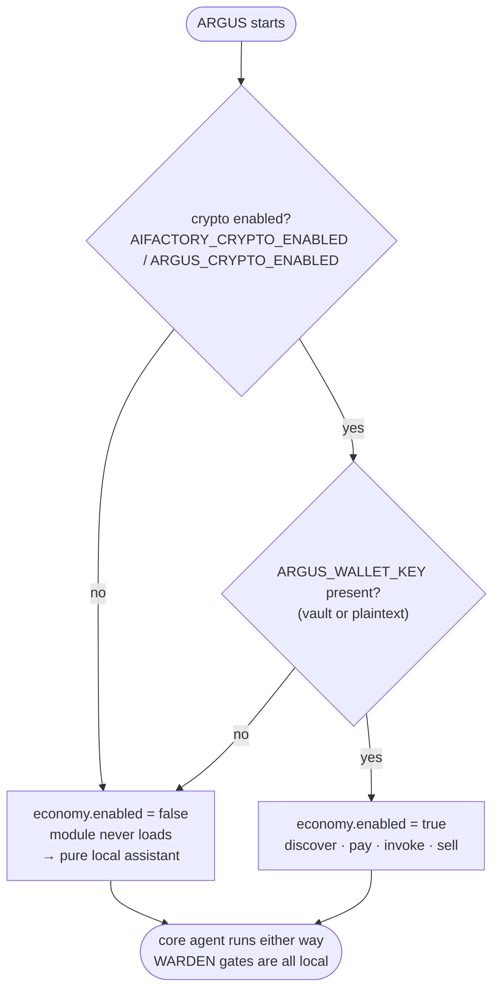

# Autonomy — the independence guarantee

> 🌐 Language: **English** · [Русский](./autonomy-ru.md) · [Español](./autonomy-es.md)

> Part of the ARGUS documentation set (`argus/docs/`):
> [architecture](./architecture.md) · [security-warden](./security-warden.md) · [economy-integration](./economy-integration.md) · [token-economy](./token-economy.md) · **autonomy**

ARGUS is economy-*native*, not economy-*dependent*. The guarantee: with **zero
wallet and zero network to AICOM**, ARGUS is still a complete, security-hardened
personal agent. The economy is a clip-on that lights up extra capabilities when
a wallet is present — it can never become a prerequisite for the agent working.

This is enforced structurally (see
[architecture.md](./architecture.md#layer-stack-and-the-autonomy-line) for the
autonomy line and [economy-integration.md](./economy-integration.md#staying-autonomous)
for the switch), not by convention.

---

## What works with zero economy / zero network

Layers 1–4. Everything above the autonomy line.

| Capability | Lights up because | Source |
|------------|-------------------|--------|
| **Local model reasoning** | A `local` provider (Ollama by default, `http://127.0.0.1:11434/v1`) needs no key and no network. | `src/providers/openai.ts`, `src/providers/router.ts` |
| **The full agent loop** | Plan → execute → observe with the budget governor runs entirely locally. | `src/core/agent.ts`, `src/core/budget.ts` |
| **Built-in + MCP tools** | The MCP host bridges local tools regardless of economy state. | `src/types.ts` (`Tool`, `ToolSource`) |
| **🛡️ WARDEN static-scan** | Pure-local regex scan of tool names/descriptions/schemas — no network. | `@aimarket/warden/src/static-scan.ts` |
| **🛡️ WARDEN threat-feed builtins** | The built-in deny-list is the always-present floor; the remote feed is optional. | `@aimarket/warden/src/threat-feed.ts` |
| **🛡️ WARDEN origin gate** | Whether a server was declared under `mcp.servers` or discovered from a catalog is a fact ARGUS already holds — no oracle, no network. | `@aimarket/warden/src/origin.ts` |
| **🛡️ WARDEN pinning** | sha256 tool-def snapshots + drift detection, stored locally. | `@aimarket/warden/src/pinning.ts`, `src/memory/store.ts` |
| **🛡️ Runtime sandbox** | Sensitive-tool classification + egress allowlist. | `@aimarket/warden/src/sandbox.ts` |
| **Memory + self-learning** | Episodes and distilled lessons live in `~/.argus`; recall and distillation are local. | `src/memory/store.ts`, `src/memory/lessons.ts` |
| **Token meter** | Cost accounting is local arithmetic over configured pricing. | `src/core/budget.ts` |

So with nothing configured, ARGUS runs against a local model, hosts MCP tools
behind WARDEN, remembers and learns — a complete autonomous assistant.

---

## What additionally lights up with a wallet

Layer 5, only when `ARGUS_WALLET_KEY` is present.

| Added capability | Requires |
|------------------|----------|
| **Paid capability consumption** | Wallet → discover → open USDC channel → invoke → settle (see [economy-integration.md](./economy-integration.md)). |
| **Selling skills** | Wallet → register in the AI Service Mesh → list `SellableCapability` → earn. |
| **LUMEN reputation scoring** 🔮 | Wallet → `argus passport` asks LUMEN to score your address. **Not obtainable today:** `scoreEntity` is called with no trust edges, and LUMEN needs a trust graph no deployment publishes, so the passport prints `unattested` — no score, no rank. |

WARDEN no longer takes any economy-side input at all. Its third gate is
**origin**: it reads where a server declaration came from (your `mcp.servers`,
or an `mcp.catalogs` entry) and needs neither an oracle nor a network. The
reputation gate that used to sit in that slot is gone — see
[security-warden.md](./security-warden.md#the-origin-gate-and-the-reputation-gate-that-used-to-be-here).

---

## The two switches

Two independent conditions decide what is active. Neither can disable the core
agent.

```mermaid
flowchart TD
  START([ARGUS starts]) --> C{"crypto enabled?<br/>AIFACTORY_CRYPTO_ENABLED / ARGUS_CRYPTO_ENABLED"}
  C -- "no" --> OFF["economy.enabled = false<br/>module never loads<br/>→ pure local assistant"]
  C -- "yes" --> W{"ARGUS_WALLET_KEY present?<br/>(vault or plaintext)"}
  W -- "no" --> OFF
  W -- "yes" --> ON["economy.enabled = true<br/>discover · pay · invoke · sell"]

  OFF --> CORE
  ON --> CORE([core agent runs either way<br/>WARDEN gates are all local])
```

### Decision table

| Crypto flag | `ARGUS_WALLET_KEY` | Economy | WARDEN gate chain | Core agent (loop, tools, WARDEN, memory) |
|:---:|:---:|:---:|:---:|:---:|
| off | n/a | off (module never loads) | static · threat · origin · pinning | ✅ runs |
| on | absent | off (module never loads) | static · threat · origin · pinning | ✅ runs |
| on | present | on | static · threat · origin · pinning | ✅ runs |

Both switches resolve in `loadConfig()` (`src/config.ts`):
`economy.enabled = merged.cryptoEnabled && Boolean(walletKey)`. The WARDEN
column does not vary, because no gate reaches the network: the chain is the same
whether the economy is on or off. The bottom row of the table — the core agent —
is **always** `✅`.
