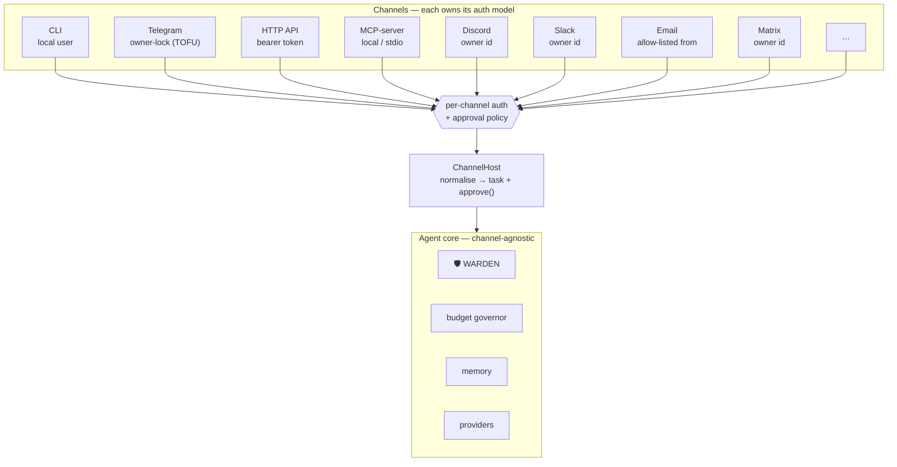
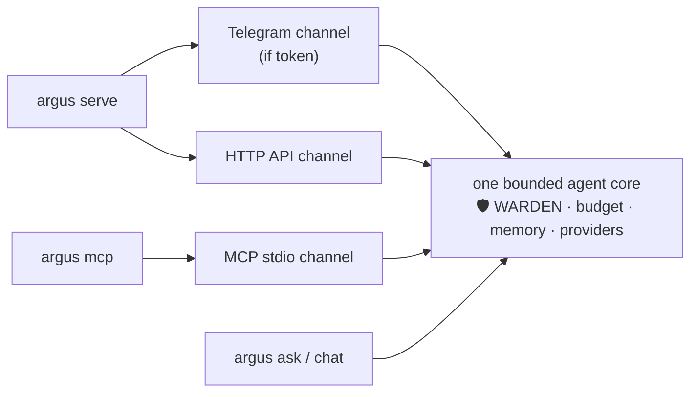
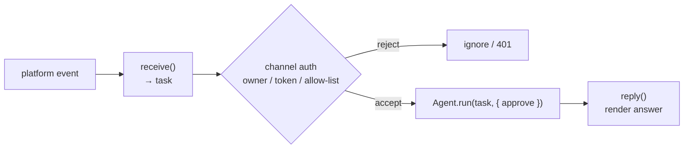

# ARGUS-3 — Canales

> 🌐 Idiomas: [English](./channels.md) · [Русский](./channels-ru.md) · **Español**

> Parte del conjunto de documentación de ARGUS (`argus/docs/`):
> [architecture](./architecture.md) · [security-warden](./security-warden.md) · [economy-integration](./economy-integration.md) · [token-economy](./token-economy.md) · [autonomy](./autonomy.md) · **channels**

ARGUS es **un núcleo de agente acotado con muchas bocas.** El mismo bucle plan → execute →
observe — gobernado por WARDEN 🛡️, el budget governor, memory y el provider router — responde
a un desarrollador en la CLI, a ti en Telegram, a un frontend web por HTTP y a otro agente por
MCP. El núcleo no sabe ni le importa por qué canal llegó una tarea; solo conoce la **política
de aprobación** que vino adjunta.

La elección deliberada aquí: **cada canal posee el modelo auth/owner natural para él.** Un
esquema auth universal sería demasiado débil para un endpoint HTTP público o demasiado pesado
para una CLI local. Así, la CLI confía en el usuario local, Telegram reclama un owner en el
primer contacto, HTTP lleva un bearer token y MCP se apoya en la trust boundary stdio local del
host. El núcleo del agente permanece idéntico; solo cambia la puerta delante de él.



Cada canal confluye en el mismo `ChannelHost`, que normaliza el mensaje entrante
en una cadena `task` más un callback `approve()`, luego llama a
`Agent.run(task, { approve })`. El callback de aprobación es donde vive el carácter del canal:
los canales interactivos pueden preguntar al humano; los no interactivos
deny-by-default. WARDEN revisa cada MCP tool **independientemente del canal** —
el canal decide *quién puede preguntar*, WARDEN decide *qué puede ejecutarse*.

---

## Matriz de canales

| Canal | Estado | Modelo owner / Auth | Dependencias externas | Mejor para | Encaje en el ecosistema |
|---|---|---|---|---|---|
| **CLI** | SHIPPED | Usuario local (aprobación interactiva en terminal) | none | dev / scripts / cron | n/a |
| **Telegram** | SHIPPED | Owner-lock, trust-on-first-use — el primer `/start` reclama el bot (`ARGUS_TELEGRAM_OWNER_ID` anula), persisted; sensitive tools requieren `/yes` en chat | bot token | asistente móvil personal | high |
| **HTTP API** | SHIPPED *(this release)* | `GET /health` y `GET /status` abiertos (sin secreto); `POST /ask` requiere `Bearer ARGUS_HTTP_TOKEN`; sensitive tools default-deny | none (built-in `node:http`) | automatización, frontends web, health monitoring; sustrato para voice/web | high — `/health` es cómo ARGUS aparece como nodo para Alien Monitor 👽 |
| **MCP-server** | SHIPPED *(this release)* | Local / stdio; expone tools `argus_ask` y `argus_status`; sensitive tools default-deny | MCP client (Claude Desktop, Cursor, otros agentes) | ser **usado como herramienta** por otros agentes / IDEs; rol economy provider | highest — así ARGUS vende su capability en el mesh / hub 🛒 |
| **Discord** | PLANNED | Owner-lock por Discord user id | bot token | comunidades / personal | high |
| **Slack** | PLANNED | Owner-lock por Slack user id (Socket Mode) | app token | trabajo / equipos | high |
| **Email (IMAP/SMTP)** | PLANNED | Allow-listed from-address | mailbox creds | async, universal, sin lock-in de plataforma | medium |
| **Matrix** | PLANNED | Owner-lock por Matrix id | homeserver creds | descentralizado / privacy (ethos self-hosted) | high |
| **WhatsApp** | PLANNED | Allow-listed number (Cloud API) | Meta app | alcance masivo | medium |
| **Voice** (notas de voz Telegram → STT, o Twilio phone) | PLANNED | Sobre Telegram / HTTP | STT provider | manos libres | medium |
| **Web chat widget** | PLANNED | Sobre HTTP `/ask` + token | none (reuse `aimarket-widget`) | incrustar en sitios | medium |
| **Economy / Mesh** (ARGUS invocado como capability de pago) | PLANNED | Escrow-paid invoke vía Hub | wallet | ser contratado por otros agentes | highest — el bucle demand↔supply nativo |

Los canales PLANNED no son re-arquitecturas especulativas: cada uno es otro
adapter que cumple el mismo contrato `receive → Agent.run → reply` (ver
[Añadir un canal](#añadir-un-canal)). Los dos canales de este release —
**HTTP API** y **MCP-server** — se detallan a continuación.

---

## Los dos nuevos canales en detalle

### HTTP API 🛒

Una superficie HTTP mínima sobre la biblioteca estándar (`node:http` — sin dependencia
de framework). Se divide limpiamente en un **plano de observabilidad abierto** y un
**plano de trabajo cerrado**.

| Method & path | Auth | Propósito |
|---|---|---|
| `GET /health` | open (no secret) | liveness + node identity — monitor visibility hook |
| `GET /status` | open (no secret) | richer state (budget meter, economy on/off, configured channels) |
| `POST /ask` | `Bearer ARGUS_HTTP_TOKEN` | ejecutar una tarea por el agent core |

`GET /health` devuelve un JSON compacto y estable:

```json
{
  "status": "ok",
  "agent": "argus",
  "version": "0.1.0",
  "model": "claude-sonnet",
  "economy": "off",
  "uptimeSec": 1042
}
```

`POST /ask` toma `{"task": "..."}` y devuelve la respuesta junto al budget
meter y el outcome del run:

```json
{
  "answer": "…",
  "meter": { "tokensIn": 1280, "tokensOut": 412, "usd": 0.0041 },
  "outcome": "completed"
}
```

**Configuración.** El canal HTTP se controla con `config.http { enabled, port }`
en `argus.config.json`, con overrides de entorno:

- `ARGUS_HTTP_PORT` — puerto de escucha (por defecto **8787**)
- `ARGUS_HTTP_TOKEN` — el bearer secret requerido por `POST /ask` (vive en `.env`, never committed)

Si `ARGUS_HTTP_TOKEN` no está definido, `POST /ask` se rechaza — el work plane
falla cerrado en lugar de servir un agente sin autenticar. El observability
plane (`/health`, `/status`) no lleva secreto por diseño: solo expone
datos de liveness no sensibles.

**Ejemplos.**

```bash
# Open — no auth. This is what a monitor polls.
curl -s http://127.0.0.1:8787/health

# Gated — bearer token required.
curl -s http://127.0.0.1:8787/ask \
  -H "Authorization: Bearer $ARGUS_HTTP_TOKEN" \
  -H "Content-Type: application/json" \
  -d '{"task":"summarise https://example.com in three bullets"}'
```

**Por qué importa `/health`.** Es el **node-visibility hook** de ARGUS. El endpoint
abierto y sin secreto `/health` es exactamente la forma que Alien Monitor 👽
consulta para descubrir y renderizar un nodo en el mapa de red. Al enviarlo, una
instancia ARGUS deja de ser un cliente privado y se convierte en *participante visible*
en el ecosistema — observable sin exponer nunca la capacidad de ejecutar tareas. El canal
HTTP también es el **sustrato** sobre el que montan los canales voice y web-widget
planificados: ambos terminan en un `POST /ask`.

### MCP-server mode 🔮

```bash
argus mcp
```

Esto ejecuta ARGUS como **stdio MCP server**, exponiendo dos tools a cualquier MCP
client:

- `argus_ask({ task })` — ejecutar una tarea por el agent core completo y devolver la respuesta.
- `argus_status()` — reportar budget meter, model y economy state.

La trust boundary es la stdio pipe local: el MCP host lanzó el proceso, así que
el caller es el usuario local o un agente en el que el usuario ya confía. Las sensitive tools
permanecen **deny-by-default** en este canal no interactivo — no hay humano para
prompt, así que el sensitive-tool gate de WARDEN rechaza en lugar de adivinar.

Fragmento de config para Claude Desktop / generic MCP client:

```json
{
  "mcpServers": {
    "argus": {
      "command": "node",
      "args": ["dist/index.js", "mcp"]
    }
  }
}
```

**Por qué es el canal nuevo más importante.** MCP-server mode hace a ARGUS
**composable** — otro agente, un IDE o un desktop assistant puede llamar
`argus_ask` igual que ARGUS llama a cualquier otro MCP tool. Esta es la
**ruta provider / «sell capability»**: el mecanismo por el que la capability de ARGUS
se ofrece *en* el mesh y el Hub 🛒, el lado supply del bucle demand↔supply. El canal
planificado **Economy / Mesh** es el mismo rol provider con escrow-paid invocation
encima (ver [economy-integration.md](./economy-integration.md)).

---

## Ejecutar canales

| Comando | Qué ejecuta |
|---|---|
| `argus serve` | Telegram (si hay bot token) **y** HTTP API juntos, en un proceso |
| `argus mcp` | el MCP stdio server (un server, hablando con su host por stdin/stdout) |
| `docker compose up` | el default del contenedor — ejecuta `serve` |



**Un agent core acotado se comparte** entre lo que esté en ejecución. `serve`
multiplexa Telegram y HTTP sobre el mismo core in-process; `mcp` expone ese
mismo core por stdio. No hay agent por canal, ni budget governor duplicado,
ni segundo memory store — solo distintas puertas frontales. **Cada tarea
lleva la approval policy de su canal**, así un HTTP `POST /ask` corre con
sensitive tools deny-by-default mientras la misma tarea en `argus chat` puede
preguntarte de forma interactiva.

Para despliegue en contenedor (`docker compose up` → `serve`), ver la nota Deployment.

---

## Nota de seguridad 🛡️

La seguridad de canales descansa en una separación clara de responsabilidades:

- **Owner-gating es per-channel y está integrado.** Cada adapter es responsable de
  demostrar *quién* habla — la CLI confía en el usuario local, Telegram owner-lock
  en el primer `/start`, HTTP requiere el bearer token, MCP se apoya en la
  stdio boundary local. No hay auth global channel-agnostic; cada canal usa
  el modelo apropiado a su threat surface.
- **WARDEN revisa cada MCP tool independientemente del canal.** La autenticación responde
  *quién puede preguntar*; WARDEN responde *qué puede ejecutarse*. La cadena static → threat → reputation
  → pinning corre igual venga la tarea del terminal o de un HTTP caller remoto. Poseer el canal
  nunca compra un pase por el firewall.
- **Sensitive tools son deny-by-default en canales no interactivos.** En HTTP
  y MCP no hay humano en el loop, así que las tools write/delete/exec/payment-class
  se rechazan en lugar de auto-aprobarse. En canales **interactivos** (Telegram,
  CLI) las mismas tools requieren confirmación explícita — un `/yes` en chat en
  Telegram, un prompt en terminal en la CLI — antes de ejecutarse.

El resultado: un endpoint HTTP público o un MCP server compartido puede ser útil sin
ser peligroso. Las tools más potentes simplemente no son alcanzables desde un canal
que no puede obtener consentimiento humano en tiempo real.

---

## Añadir un canal

Añadir un canal es pequeño y autocontenido. Un adapter hace tres cosas:

1. **`receive`** — aceptar el evento entrante de la plataforma y normalizarlo en una
   cadena `task` (más contexto).
2. **`Agent.run(task, { approve })`** — llamar al agent core compartido, pasando un
   callback `approve()` que codifica la approval policy de este canal
   (prompt interactivo, o deny-by-default para superficies no interactivas).
3. **`reply`** — renderizar la respuesta del agente al formato de la plataforma.



**El modelo auth es responsabilidad del adapter** — decide si owner-lock, bearer token
o allow-list de dirección, y aporta la policy `approve()`. Todo después de `Agent.run` —
WARDEN, budget governor, memory, provider routing — se hereda sin cambios del único bounded core. Un
nuevo canal añade una puerta frontal; nunca bifurca el agente.
