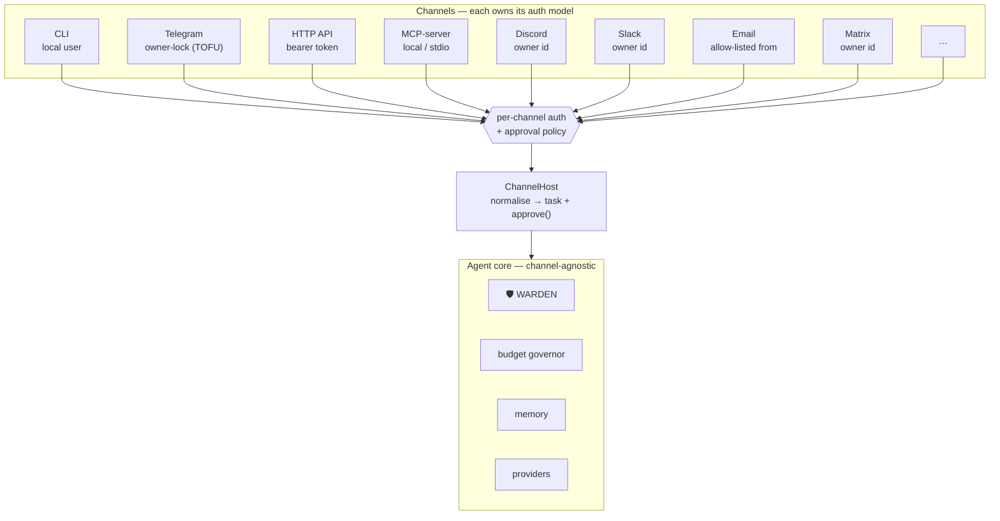
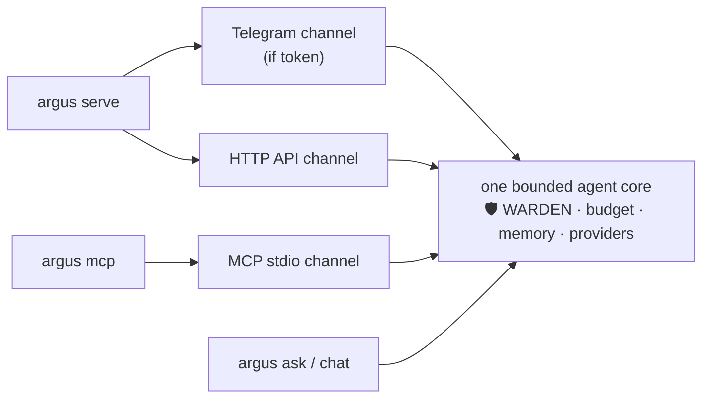
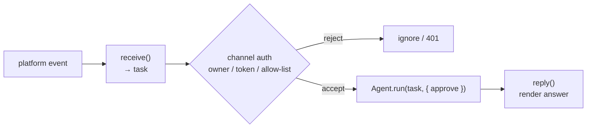

# ARGUS-3 — Каналы

> 🌐 Язык: [English](./channels.md) · **Русский** · [Español](./channels-es.md)

> Часть набора документации ARGUS (`argus/docs/`):
> [architecture](./architecture.md) · [security-warden](./security-warden.md) · [economy-integration](./economy-integration.md) · [token-economy](./token-economy.md) · [autonomy](./autonomy.md) · **channels**

ARGUS — это **одно ограниченное ядро агента с множеством «ртов».** Тот же цикл plan → execute →
observe — под управлением WARDEN 🛡️, budget governor, memory и provider router — отвечает
разработчику в CLI, вам в Telegram, веб-фронтенду по HTTP и другому агенту через MCP. Ядро не
знает и не заботится, через какой канал пришла задача; оно знает только **политику одобрения**,
прикреплённую к ней.

Сознательный выбор здесь: **каждый канал владеет моделью auth/owner, естественной для него.**
Универсальная схема auth была бы либо слишком слабой для публичного HTTP endpoint, либо слишком
тяжёлой для локального CLI. Поэтому CLI доверяет локальному пользователю, Telegram закрепляет
owner при первом контакте, HTTP несёт bearer token, а MCP опирается на локальную stdio trust
boundary хоста. Ядро агента остаётся идентичным; меняется только шлюз перед ним.



Каждый канал сходится в один и тот же `ChannelHost`, который нормализует входящее
сообщение в строку `task` плюс callback `approve()`, затем вызывает
`Agent.run(task, { approve })`. Callback одобрения — там, где проявляется характер канала:
интерактивные каналы могут спросить человека; неинтерактивные — deny-by-default. WARDEN
проверяет каждый MCP tool **независимо от канала** — канал решает *кто может спросить*,
WARDEN решает *что может выполниться*.

---

## Матрица каналов

| Канал | Статус | Модель owner / Auth | Внешние зависимости | Лучше всего для | Соответствие экосистеме |
|---|---|---|---|---|---|
| **CLI** | SHIPPED | Локальный пользователь (интерактивное одобрение в терминале) | none | dev / scripts / cron | n/a |
| **Telegram** | SHIPPED | Owner-lock, trust-on-first-use — первый `/start` закрепляет бота (`ARGUS_TELEGRAM_OWNER_ID` переопределяет), persisted; sensitive tools требуют in-chat `/yes` | bot token | персональный мобильный ассистент | high |
| **HTTP API** | SHIPPED *(this release)* | `GET /health` и `GET /status` открыты (без секрета); `POST /ask` требует `Bearer ARGUS_HTTP_TOKEN`; sensitive tools default-deny | none (built-in `node:http`) | автоматизация, веб-фронтенды, health monitoring; субстрат для voice/web | high — `/health` — как ARGUS появляется как узел для Alien Monitor 👽 |
| **MCP-server** | SHIPPED *(this release)* | Local / stdio; экспортирует tools `argus_ask` и `argus_status`; sensitive tools default-deny | MCP client (Claude Desktop, Cursor, другие агенты) | быть **инструментом** для других агентов / IDE; роль economy provider | highest — так ARGUS продаёт capability в mesh / hub 🛒 |
| **Discord** | PLANNED | Owner-lock по Discord user id | bot token | сообщества / личное | high |
| **Slack** | PLANNED | Owner-lock по Slack user id (Socket Mode) | app token | работа / команды | high |
| **Email (IMAP/SMTP)** | PLANNED | Allow-listed from-address | mailbox creds | async, универсально, без привязки к платформе | medium |
| **Matrix** | PLANNED | Owner-lock по Matrix id | homeserver creds | децентрализованно / privacy (self-hosted ethos) | high |
| **WhatsApp** | PLANNED | Allow-listed number (Cloud API) | Meta app | массовый охват | medium |
| **Voice** (голосовые Telegram → STT, или Twilio phone) | PLANNED | На базе Telegram / HTTP | STT provider | hands-free | medium |
| **Web chat widget** | PLANNED | На базе HTTP `/ask` + token | none (reuse `aimarket-widget`) | встраивание в сайты | medium |
| **Economy / Mesh** (ARGUS как платная capability) | PLANNED | Escrow-paid invoke через Hub | wallet | быть нанятым другими агентами | highest — нативный demand↔supply loop |

PLANNED каналы — не спекулятивные re-architecture: каждый — ещё один adapter с тем же
контрактом `receive → Agent.run → reply` (см. [Добавить канал](#добавить-канал)). Два канала
этого релиза — **HTTP API** и **MCP-server** — описаны ниже.

---

## Два новых канала подробно

### HTTP API 🛒

Минимальная HTTP-поверхность на стандартной библиотеке (`node:http` — без framework
dependency). Чисто разделена на **открытую observability plane** и **закрытую work plane**.

| Method & path | Auth | Назначение |
|---|---|---|
| `GET /health` | open (no secret) | liveness + node identity — monitor visibility hook |
| `GET /status` | open (no secret) | richer state (budget meter, economy on/off, configured channels) |
| `POST /ask` | `Bearer ARGUS_HTTP_TOKEN` | выполнить задачу через agent core |

`GET /health` возвращает компактный стабильный JSON:

```json
{
  "status": "ok",
  "agent": "argus",
  "version": "0.1.0",
  "model": "claude-sonnet",
  "economy": "off",
  "uptimeSec": 1042
}
```

`POST /ask` принимает `{"task": "..."}` и возвращает ответ вместе с budget
meter и outcome запуска:

```json
{
  "answer": "…",
  "meter": { "tokensIn": 1280, "tokensOut": 412, "usd": 0.0041 },
  "outcome": "completed"
}
```

**Конфигурация.** HTTP channel управляется `config.http { enabled, port }`
в `argus.config.json`, с env overrides:

- `ARGUS_HTTP_PORT` — порт прослушивания (по умолчанию **8787**)
- `ARGUS_HTTP_TOKEN` — bearer secret для `POST /ask` (в `.env`, never committed)

Если `ARGUS_HTTP_TOKEN` не задан, `POST /ask` отклоняется — work plane
fail closed, а не неаутентифицированный агент. Observability plane
(`/health`, `/status`) по задумке без секрета: только non-sensitive liveness data.

**Примеры.**

```bash
# Open — no auth. This is what a monitor polls.
curl -s http://127.0.0.1:8787/health

# Gated — bearer token required.
curl -s http://127.0.0.1:8787/ask \
  -H "Authorization: Bearer $ARGUS_HTTP_TOKEN" \
  -H "Content-Type: application/json" \
  -d '{"task":"summarise https://example.com in three bullets"}'
```

**Почему важен `/health`.** Это **node-visibility hook** ARGUS. Открытый,
без секрета `/health` — именно та форма, которую Alien Monitor 👽 опрашивает,
чтобы обнаружить и отрисовать узел на карте сети. С ним инстанс ARGUS
перестаёт быть приватным клиентом и становится *видимым участником*
экосистемы — observable без возможности запускать задачи. HTTP channel также
**субстрат** для planned voice и web-widget: оба заканчиваются в `POST /ask`.

### MCP-server mode 🔮

```bash
argus mcp
```

Запускает сам ARGUS как **stdio MCP server**, экспортируя два tool любому MCP
client:

- `argus_ask({ task })` — выполнить задачу через полный agent core и вернуть ответ.
- `argus_status()` — budget meter, model и economy state.

Trust boundary — локальная stdio pipe: MCP host запустил процесс, значит
caller — локальный пользователь или агент, которому пользователь уже доверяет. Sensitive tools
остаются **deny-by-default** на неинтерактивном канале — нет человека для
prompt, поэтому sensitive-tool gate WARDEN отказывает, а не угадывает.

Фрагмент конфига Claude Desktop / generic MCP client:

```json
{
  "mcpServers": {
    "argus": {
      "command": "node",
      "args": ["dist/index.js", "mcp"]
    }
  }
}
```

**Почему это самый важный новый канал.** MCP-server mode делает ARGUS
**composable** — другой агент, IDE или desktop assistant может вызвать
`argus_ask` так же, как ARGUS вызывает любой другой MCP tool. Это
**provider / «sell capability» path**: механизм, которым capability ARGUS
предлагается *в* mesh и Hub 🛒, supply side demand↔supply loop. Planned
**Economy / Mesh** channel — та же provider role с escrow-paid invocation
поверх (см. [economy-integration.md](./economy-integration.md)).

---

## Запуск каналов

| Команда | Что запускает |
|---|---|
| `argus serve` | Telegram (если задан bot token) **и** HTTP API вместе, в одном процессе |
| `argus mcp` | MCP stdio server (один server, общение с host через stdin/stdout) |
| `docker compose up` | default контейнера — запускает `serve` |



**Одно ограниченное agent core разделяется** всем запущенным. `serve`
мультиплексирует Telegram и HTTP на тот же in-process core; `mcp` экспортирует
тот же core через stdio. Нет per-channel agent, нет дублированного budget
governor, нет второго memory store — только разные front doors. **Каждая задача
несёт approval policy своего канала**, поэтому HTTP `POST /ask` выполняется с
deny-by-default sensitive tools, а та же задача в `argus chat` может
интерактивно спросить вас.

Для container deployment (`docker compose up` → `serve`) см. Deployment note.

---

## Заметка по безопасности 🛡️

Безопасность каналов опирается на чёткое разделение ответственности:

- **Owner-gating per-channel и встроен.** Каждый adapter доказывает *кто*
  говорит — CLI доверяет локальному пользователю, Telegram owner-lock
  при первом `/start`, HTTP требует bearer token, MCP опирается на локальную
  stdio boundary. Нет глобального channel-agnostic auth; каждый канал использует
  модель, подходящую его threat surface.
- **WARDEN проверяет каждый MCP tool независимо от канала.** Аутентификация отвечает
  *кто может спросить*; WARDEN — *что может выполниться*. Цепочка static → threat → reputation
  → pinning идентична, пришла задача из терминала или с удалённого HTTP caller. Владение каналом
  никогда не даёт проход через firewall.
- **Sensitive tools deny-by-default на неинтерактивных каналах.** На HTTP
  и MCP нет человека в loop, поэтому write/delete/exec/payment-class tools
  отклоняются, а не auto-approved. На **интерактивных** каналах (Telegram,
  CLI) те же tools требуют явного подтверждения — in-chat `/yes` в
  Telegram, terminal prompt в CLI — перед выполнением.

Итог: публичный HTTP endpoint или shared MCP server может быть полезен без
опасности. Самые мощные tools просто недоступны с канала,
который не может получить real-time human consent.

---

## Добавить канал

Добавление канала — небольшое и самодостаточное. Adapter делает три вещи:

1. **`receive`** — принять inbound event платформы и нормализовать в
   строку `task` (плюс контекст).
2. **`Agent.run(task, { approve })`** — вызвать shared agent core, передав
   callback `approve()`, кодирующий approval policy канала
   (интерактивный prompt или deny-by-default для неинтерактивных поверхностей).
3. **`reply`** — отрендерить ответ агента в формат платформы.



**Модель auth — ответственность adapter** — owner-lock, bearer token или
allow-list address, и policy `approve()`. Всё после `Agent.run` — WARDEN, budget governor,
memory, provider routing — наследуется без изменений от одного bounded core. Новый
канал добавляет front door; он никогда не форкает агента.
