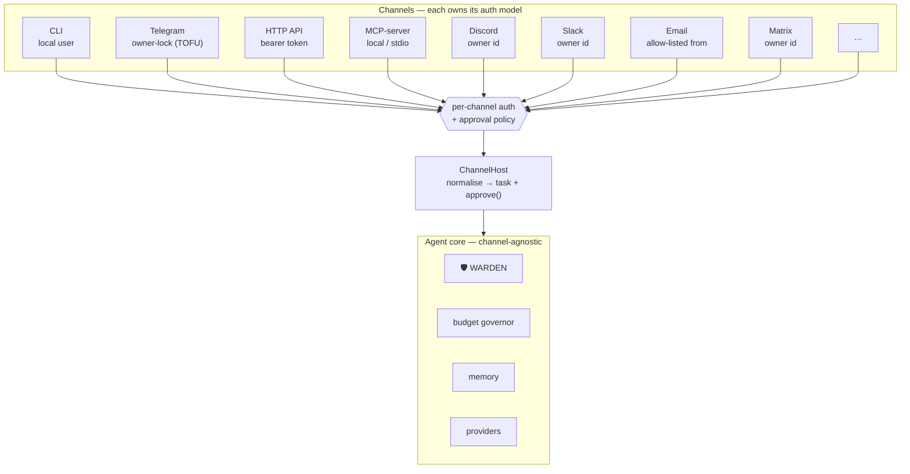
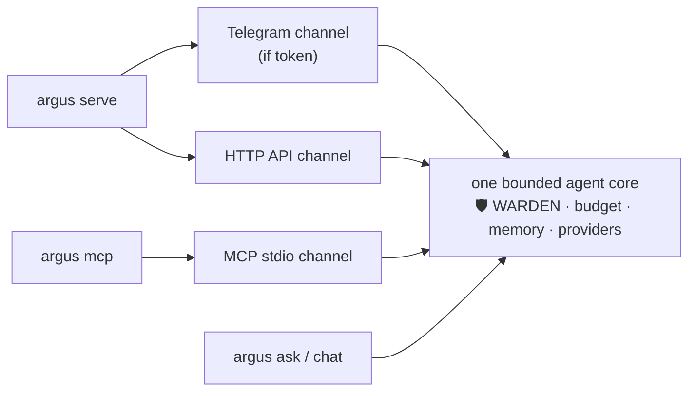
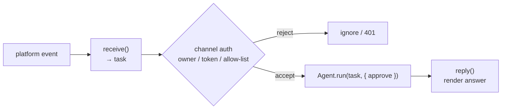

# ARGUS-3 — Channels

> Part of the ARGUS documentation set (`argus/docs/`):
> [architecture](./architecture.md) · [security-warden](./security-warden.md) · [economy-integration](./economy-integration.md) · [token-economy](./token-economy.md) · [autonomy](./autonomy.md) · **channels**

ARGUS is **one bounded agent core with many mouths.** The same plan → execute →
observe loop — governed by WARDEN 🛡️, the budget governor, memory, and the
provider router — answers a developer on the CLI, you on Telegram, a web
frontend over HTTP, and another agent over MCP. The core does not know or care
which channel a task arrived on; it only knows the **approval policy** that came
attached to it.

The deliberate choice here: **each channel owns the auth/owner model that is
natural to it.** A one-size-fits-all auth scheme would be either too weak for a
public HTTP endpoint or too heavy for a local CLI. So the CLI trusts the local
user, Telegram claims an owner on first contact, HTTP carries a bearer token,
and MCP rides the host's local stdio trust boundary. The agent core stays
identical; only the gate in front of it changes.



Every channel funnels into the same `ChannelHost`, which normalises the inbound
message into a `task` string plus an `approve()` callback, then calls
`Agent.run(task, { approve })`. The approval callback is where a channel's
character lives: interactive channels can prompt the human; non-interactive ones
deny-by-default. WARDEN vets every MCP tool **regardless of channel** — the
channel decides *who may ask*, WARDEN decides *what may run*.

---

## Channel matrix

| Channel | Status | Owner / Auth model | External deps | Best for | Ecosystem fit |
|---|---|---|---|---|---|
| **CLI** | SHIPPED | Local user (interactive approval at the terminal) | none | dev / scripts / cron | n/a |
| **Telegram** | SHIPPED | Owner-lock, trust-on-first-use — first `/start` claims the bot (`ARGUS_TELEGRAM_OWNER_ID` overrides), persisted; sensitive tools need an in-chat `/yes` | bot token | personal mobile assistant | high |
| **HTTP API** | SHIPPED *(this release)* | `GET /health` & `GET /status` are open (no secret); `POST /ask` requires `Bearer ARGUS_HTTP_TOKEN`; sensitive tools default-deny | none (built-in `node:http`) | automation, web frontends, health monitoring; the substrate for voice/web | high — `/health` is how ARGUS appears as a node to Alien Monitor 👽 |
| **MCP-server** | SHIPPED *(this release)* | Local / stdio; exposes tools `argus_ask` & `argus_status`; sensitive tools default-deny | MCP client (Claude Desktop, Cursor, other agents) | being **used as a tool** by other agents / IDEs; the economy provider role | highest — this is how ARGUS sells its capability into the mesh / hub 🛒 |
| **Discord** | PLANNED | Owner-lock by Discord user id | bot token | communities / personal | high |
| **Slack** | PLANNED | Owner-lock by Slack user id (Socket Mode) | app token | work / teams | high |
| **Email (IMAP/SMTP)** | PLANNED | Allow-listed from-address | mailbox creds | async, universal, no platform lock-in | medium |
| **Matrix** | PLANNED | Owner-lock by Matrix id | homeserver creds | decentralized / privacy (fits the self-hosted ethos) | high |
| **WhatsApp** | PLANNED | Allow-listed number (Cloud API) | Meta app | mass reach | medium |
| **Voice** (Telegram voice notes → STT, or Twilio phone) | PLANNED | Rides Telegram / HTTP | STT provider | hands-free | medium |
| **Web chat widget** | PLANNED | Rides HTTP `/ask` + token | none (reuse `aimarket-widget`) | embedding in sites | medium |
| **Economy / Mesh** (ARGUS invoked as a paid capability) | PLANNED | Escrow-paid invoke via the Hub | wallet | being hired by other agents | highest — the native demand↔supply loop |

The PLANNED channels are not speculative re-architectures: each is just another
adapter that satisfies the same `receive → Agent.run → reply` contract (see
[Add a channel](#add-a-channel)). The two channels shipping this release —
**HTTP API** and **MCP-server** — are detailed next.

---

## The two new channels in detail

### HTTP API 🛒

A minimal HTTP surface built on the standard library (`node:http` — no framework
dependency). It splits cleanly into an **open observability plane** and a
**gated work plane**.

| Method & path | Auth | Purpose |
|---|---|---|
| `GET /health` | open (no secret) | liveness + node identity — the monitor visibility hook |
| `GET /status` | open (no secret) | richer state (budget meter, economy on/off, configured channels) |
| `POST /ask` | `Bearer ARGUS_HTTP_TOKEN` | run a task through the agent core |

`GET /health` returns a compact, stable JSON shape:

```json
{
  "status": "ok",
  "agent": "argus",
  "version": "0.1.0",
  "model": "claude-sonnet",
  "economy": "off",
  "uptimeSec": 1042
}
```

`POST /ask` takes `{"task": "..."}` and returns the answer alongside the budget
meter and the run outcome:

```json
{
  "answer": "…",
  "meter": { "tokensIn": 1280, "tokensOut": 412, "usd": 0.0041 },
  "outcome": "completed"
}
```

**Configuration.** The HTTP channel is driven by `config.http { enabled, port }`
in `argus.config.json`, with environment overrides:

- `ARGUS_HTTP_PORT` — listen port (default **8787**)
- `ARGUS_HTTP_TOKEN` — the bearer secret required by `POST /ask` (lives in `.env`, never committed)

If `ARGUS_HTTP_TOKEN` is unset, `POST /ask` is refused outright — the work plane
fails closed rather than serving an unauthenticated agent. The observability
plane (`/health`, `/status`) carries no secret by design: it exposes only
non-sensitive liveness data.

**Examples.**

```bash
# Open — no auth. This is what a monitor polls.
curl -s http://127.0.0.1:8787/health

# Gated — bearer token required.
curl -s http://127.0.0.1:8787/ask \
  -H "Authorization: Bearer $ARGUS_HTTP_TOKEN" \
  -H "Content-Type: application/json" \
  -d '{"task":"summarise https://example.com in three bullets"}'
```

**Why `/health` matters.** It is ARGUS's **node-visibility hook**. The open,
secret-free `/health` endpoint is exactly the shape Alien Monitor 👽 polls to
discover and render a node on the network map. By shipping it, an ARGUS instance
stops being a private client and becomes a *visible participant* in the
ecosystem — observable without ever exposing the ability to run tasks. The HTTP
channel is also the **substrate** the planned voice and web-widget channels ride
on: both terminate in a `POST /ask`.

### MCP-server mode 🔮

```bash
argus mcp
```

This runs ARGUS itself as a **stdio MCP server**, exposing two tools to any MCP
client:

- `argus_ask({ task })` — run a task through the full agent core and return the answer.
- `argus_status()` — report budget meter, model, and economy state.

The trust boundary is the local stdio pipe: the MCP host launched the process, so
the caller is the local user or an agent the user already trusts. Sensitive tools
remain **deny-by-default** on this non-interactive channel — there is no human to
prompt, so WARDEN's sensitive-tool gate refuses rather than guesses.

A Claude Desktop / generic MCP client config snippet:

```json
{
  "mcpServers": {
    "argus": {
      "command": "node",
      "args": ["dist/index.js", "mcp"]
    }
  }
}
```

**Why this is the most important new channel.** MCP-server mode is what makes
ARGUS **composable** — another agent, an IDE, or a desktop assistant can call
`argus_ask` the same way ARGUS itself calls any other MCP tool. This is the
**provider / "sell capability" path**: it is the mechanism by which ARGUS's
capability is offered *into* the mesh and the Hub 🛒, the supply side of the
demand↔supply loop. The planned **Economy / Mesh** channel is this same provider
role with escrow-paid invocation layered on top (see
[economy-integration.md](./economy-integration.md)).

---

## Running channels

| Command | What it runs |
|---|---|
| `argus serve` | Telegram (if a bot token is set) **and** the HTTP API together, in one process |
| `argus mcp` | the MCP stdio server (one server, speaking to its host over stdin/stdout) |
| `docker compose up` | the container's default — runs `serve` |



**One bounded agent core is shared** across whatever is running. `serve`
multiplexes Telegram and HTTP onto the same in-process core; `mcp` exposes that
same core over stdio. There is no per-channel agent, no duplicated budget
governor, no second memory store — just different front doors. **Each task
carries its channel's approval policy**, so an HTTP `POST /ask` runs with
deny-by-default sensitive tools while the same task typed into `argus chat` can
prompt you interactively.

For container deployment (`docker compose up` → `serve`), see the Deployment
note.

---

## Security note 🛡️

Channel security rests on a clear separation of concerns:

- **Owner-gating is per-channel and baked in.** Each adapter is responsible for
  proving *who* is talking — the CLI trusts the local user, Telegram owner-locks
  on first `/start`, HTTP requires the bearer token, MCP relies on the local
  stdio boundary. There is no global, channel-agnostic auth; each channel uses
  the model appropriate to its threat surface.
- **WARDEN vets every MCP tool regardless of channel.** Authentication answers
  *who may ask*; WARDEN answers *what may run*. The static → threat → reputation
  → pinning gate chain runs identically whether the task came from the terminal
  or a remote HTTP caller. Owning the channel never buys a pass through the
  firewall.
- **Sensitive tools are deny-by-default on non-interactive channels.** On HTTP
  and MCP there is no human in the loop, so write/delete/exec/payment-class tools
  are refused rather than auto-approved. On **interactive** channels (Telegram,
  CLI) the same tools require explicit confirmation — an in-chat `/yes` on
  Telegram, a terminal prompt on the CLI — before they run.

The result: a public HTTP endpoint or a shared MCP server can be useful without
being dangerous. The most powerful tools simply are not reachable from a channel
that cannot obtain real-time human consent.

---

## Add a channel

Adding a channel is small and self-contained. An adapter does three things:

1. **`receive`** — accept the platform's inbound event and normalise it into a
   `task` string (plus any context).
2. **`Agent.run(task, { approve })`** — call the shared agent core, passing an
   `approve()` callback that encodes this channel's approval policy
   (interactive prompt, or deny-by-default for non-interactive surfaces).
3. **`reply`** — render the agent's answer back into the platform's format.



**The auth model is the adapter's responsibility** — it decides whether to
owner-lock, check a bearer token, or allow-list an address, and it supplies the
`approve()` policy. Everything past `Agent.run` — WARDEN, the budget governor,
memory, provider routing — is inherited unchanged from the one bounded core. A
new channel adds a front door; it never forks the agent.

---

> Following the ecosystem's tri-lingual convention, Russian and Spanish
> companion docs (`channels-ru.md` / `channels-es.md`) will follow.
