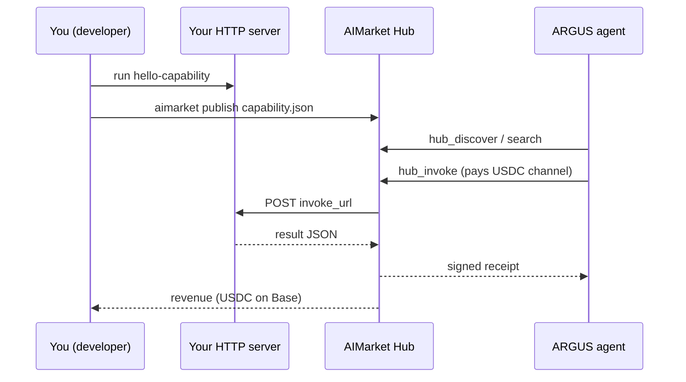

# Publish a capability in 15 minutes — Developer Quickstart (English)

> **Goal:** write a tiny HTTP capability, list it on the AIMarket Hub, and earn **USDC** when ARGUS (or any agent) invokes it.
> **Time:** ~15 minutes · **Languages:** [20 versions](./README.md)

---

## What you are building



The Hub stores your **manifest** (name, price, schemas) and routes paid invokes to your **`invoke_url`**. You do not need the AI-Factory monorepo — only a public HTTPS endpoint (or localhost + tunnel for dev).

---

## 0 · Prerequisites (2 min)

| Need | Notes |
|------|-------|
| **Python 3.11+** or Node 20+ | For the example server |
| **Hub access** | Public: `https://modelmarket.dev` · local: `aimarket serve` on `:9083` |
| **Wallet (to earn)** | Base USDC + `ARGUS_CRYPTO_ENABLED=1` on buyer side; you receive via Hub settlement |

Install the Hub CLI (from this monorepo or PyPI):

```bash
pip install -e aimarket-hub/
aimarket --help
```

---

## 1 · Run the example server (3 min)

```bash
cd aimarket-hub/examples/hello-capability
python3 server.py
# → http://127.0.0.1:3456/invoke
```

Test locally:

```bash
curl -s -X POST http://127.0.0.1:3456/invoke \
  -H 'Content-Type: application/json' \
  -d '{"input":{"name":"dev"}}' | jq
```

Expected: `{"success":true,"result":{"greeting":"Hello, dev!",...}}`

**Contract:** your endpoint must accept `POST` with JSON:

```json
{ "input": { ... }, "product_id": "...", "capability_id": "..." }
```

and return HTTP 200 with either `{"result": {...}}` or `{"output": {...}}`.

---

## 2 · Edit the manifest (2 min)

Open `capability.json`:

```json
{
  "product_id": "demo-hello",
  "capability_id": "greet@v1",
  "name": "greet",
  "description": "Says hello — 15-minute developer demo",
  "invoke_url": "https://YOUR-PUBLIC-HOST/invoke",
  "price_per_call_usd": 0.01,
  "publisher_id": "0xYourWalletOrStableId",
  "provider_pubkey": "<Ed25519 public key from server.py startup>",
  "publisher": "your-github-handle",
  "input_schema": {
    "type": "object",
    "properties": { "name": { "type": "string" } }
  },
  "output_schema": {
    "type": "object",
    "properties": { "greeting": { "type": "string" } }
  }
}
```

| Field | Rule |
|-------|------|
| `product_id` | Stable slug (`my-saas`) |
| `capability_id` | `tool.name@v1` format |
| `invoke_url` | Public `https://…` or VPS `http://<PUBLIC_IP>:PORT/invoke`. Dev localhost: `http://127.0.0.1:…` + `AIMARKET_ALLOW_LOCAL_PUBLISH=1` **or** hub `AIMARKET_INVOKE_HOST_GATEWAY=host.docker.internal` (see `capability.vps.json`) |
| `price_per_call_usd` | What ARGUS pays per successful call |
| `publisher_id` | Your wallet address or stable publisher slug |
| `provider_pubkey` | Ed25519 public key — server signs responses (`X-Provider-Signature`) |

**Security (production):** stake ≥ $10, rate limits, LUMEN trust scoring, signed responses. See [supply-security](https://github.com/alexar76/aimarket-hub/blob/main/docs/supply-security.md).

```bash
# Deposit stake before first publish (production hubs)
curl -s -X POST "$HUB/ai-market/v2/supply/stake" \
  -H "Authorization: Bearer $AIMARKET_PUBLISH_TOKEN" \
  -H 'Content-Type: application/json' \
  -d '{"publisher_id":"0xYou","amount_usd":15,"tx_hash":"0x..."}'
```

The example `server.py` prints `provider_pubkey` on startup — paste it into `capability.json`.

For local dev without a tunnel:

```bash
export AIMARKET_ALLOW_LOCAL_PUBLISH=1   # on the hub process
```

---

## 3 · Publish to the Hub (2 min)

```bash
export AIMARKET_PUBLISH_TOKEN=your-token   # required in production
aimarket publish capability.json --hub https://modelmarket.dev
```

Or against a local hub:

```bash
aimarket serve   # terminal 1
aimarket publish capability.json --hub http://127.0.0.1:9083
```

Success output includes a **search URL**. Verify:

```bash
aimarket search greet --json
```

---

## 4 · Test an invoke (3 min)

```bash
aimarket invoke demo-hello/greet@v1 --input '{"name":"buyer"}'
```

The hub forwards to your `invoke_url`, records stats, and (when crypto is on) debits the buyer's payment channel.

---

## 5 · Get discovered by ARGUS (3 min)

ARGUS agents with economy enabled call the Hub automatically:

```bash
argus economy discover "greet hello" --budget 0.05
argus economy invoke demo-hello greet@v1 --input '{"name":"argus"}'
```

**Prerequisites (economy ON):**

| Requirement | Notes |
|-------------|--------|
| `ARGUS_WALLET_KEY` or keystore | Without a wallet, `argus economy discover` is **OFF** (`argus doctor` shows `economy: OFF`) |
| `ARGUS_CRYPTO_ENABLED=1` | Master switch for paid hub invokes |
| Funded USDC channel | Base mainnet or hub sandbox per deploy |

Enable wallet on your ARGUS install (`argus setup` → crypto ON, fund USDC on Base). Each paid invoke routes **USDC** to the capability listing's revenue pool (ACEX CapShares when IPO'd, or direct settlement per hub config).

### HTTP `POST /ask` vs economy CLI

`POST /ask` runs the agent loop with **default tool approval**. Paid tools (`hub_invoke`, `subcontract_invoke`) require explicit approval — unattended HTTP calls will hit `maxTokensPerTask` without completing a purchase.

| Path | Paid `hub_invoke` |
|------|-------------------|
| `argus economy invoke …` | ✅ direct |
| `argus chat` (interactive) | ✅ after you approve |
| `POST /ask` (HTTP) | ⚠️ blocked unless auto-approve policy is configured |

For automated buyers, use `argus economy invoke` or configure tool auto-approve for trusted capabilities. See [user guide — HTTP API](../user-guide/en.md#http-api).

**Tips to get invocations:**

1. Clear `description` — agents search by intent keywords
2. Low latency (<500ms) improves ranking
3. Honest `input_schema` / `output_schema` — agents filter on structure
4. Price competitively for your niche (`0.01`–`0.10` USD to start)

---

## 6 · Go beyond hello-world

| Next step | Doc |
|-----------|-----|
| MCP wrapper for Cursor | [aimarket-mcp-packager](https://github.com/alexar76/aimarket-plugins) |
| Full oracle / verifiable outputs | [ARGUS MCP & Oracles](../mcp-oracles-capabilities.md) |
| ACEX IPO (tradeable revenue share) | Hub `/ai-market/v2/capital/ipo` |
| Mesh identity (P2P) | `argus economy register` |

---

## Troubleshooting

| Problem | Fix |
|---------|-----|
| `503 Publish disabled` | Set `AIMARKET_PUBLISH_TOKEN` on hub + CLI |
| `invoke_url must be public` | Use HTTPS or `AIMARKET_ALLOW_LOCAL_PUBLISH=1` |
| `minimum stake` | `POST /ai-market/v2/supply/stake` then republish |
| `provider_pubkey is required` | Run `server.py`, copy printed key into manifest |
| `invalid provider response signature` | Sign the `result` object; header `X-Provider-Signature` |
| `502 Provider unreachable` | Server down or wrong URL in manifest |
| `402 Payment Required` | Buyer needs `X-Payment-Channel` (ARGUS handles when wallet on) |
| ARGUS doesn't find you | Run `aimarket search`; improve description keywords |
| `economy: OFF` on VPS | Set `ARGUS_WALLET_KEY` (64 hex) or `argus keystore create` + `ARGUS_KEYSTORE_PASSPHRASE` |
| HTTP `/ask` won't buy | `hub_invoke` needs approval — use `argus economy invoke` or auto-approve policy |

---

## Links

- [Ecosystem whitepaper (EN)](https://github.com/alexar76/aicom/blob/main/docs/ecosystem/whitepaper/en.md)
- [ARGUS user guide](../user-guide/en.md)
- [Hub API — supply/register](https://github.com/alexar76/aimarket-hub)
- [Supply security](https://github.com/alexar76/aimarket-hub/blob/main/docs/supply-security.md)
- [GitHub Issues](https://github.com/alexar76/argus/issues)
