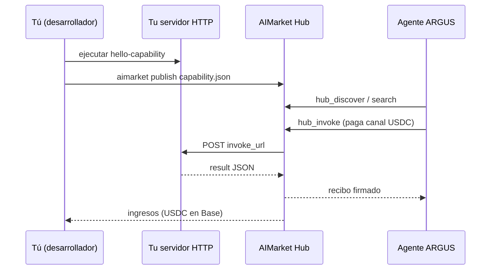

# Publica una capability en 15 minutos — Developer Quickstart (Español)

> 🌐 Idiomas: [English](./en.md) · [Русский](./ru.md) · **Español**

> **Objetivo:** escribir una pequeña capability HTTP, listarla en AIMarket Hub y ganar **USDC** cuando ARGUS (o cualquier agente) la invoque.
> **Tiempo:** ~15 minutos · **Idiomas:** [20 versiones](./README.md)

---

## Qué estás construyendo



El Hub almacena tu **manifest** (nombre, precio, esquemas) y enruta invocaciones pagadas a tu **`invoke_url`**. No necesitas el monorepo AI-Factory — solo un endpoint HTTPS público (o localhost + túnel para desarrollo).

---

## 0 · Requisitos previos (2 min)

| Necesitas | Notas |
|------|-------|
| **Python 3.11+** o Node 20+ | Para el servidor de ejemplo |
| **Acceso al Hub** | Público: `https://modelmarket.dev` · local: `aimarket serve` en `:9083` |
| **Wallet (para ganar)** | Base USDC + `ARGUS_CRYPTO_ENABLED=1` en el lado comprador; recibes vía liquidación del Hub |

Instala el Hub CLI (desde este monorepo o PyPI):

```bash
pip install -e aimarket-hub/
aimarket --help
```

---

## 1 · Ejecutar el servidor de ejemplo (3 min)

```bash
cd aimarket-hub/examples/hello-capability
python3 server.py
# → http://127.0.0.1:3456/invoke
```

Prueba local:

```bash
curl -s -X POST http://127.0.0.1:3456/invoke \
  -H 'Content-Type: application/json' \
  -d '{"input":{"name":"dev"}}' | jq
```

Esperado: `{"success":true,"result":{"greeting":"Hello, dev!",...}}`

**Contrato:** tu endpoint debe aceptar `POST` con JSON:

```json
{ "input": { ... }, "product_id": "...", "capability_id": "..." }
```

y devolver HTTP 200 con `{"result": {...}}` o `{"output": {...}}`.

---

## 2 · Editar el manifest (2 min)

Abre `capability.json`:

```json
{
  "product_id": "demo-hello",
  "capability_id": "greet@v1",
  "name": "greet",
  "description": "Says hello — 15-minute developer demo",
  "invoke_url": "https://YOUR-PUBLIC-HOST/invoke",
  "price_per_call_usd": 0.01,
  "publisher_id": "0xYourWalletOrStableId",
  "provider_pubkey": "<Ed25519 public key from server.py startup>",
  "publisher": "your-github-handle",
  "input_schema": {
    "type": "object",
    "properties": { "name": { "type": "string" } }
  },
  "output_schema": {
    "type": "object",
    "properties": { "greeting": { "type": "string" } }
  }
}
```

| Campo | Regla |
|-------|------|
| `product_id` | Slug estable (`my-saas`) |
| `capability_id` | Formato `tool.name@v1` |
| `invoke_url` | Público `https://…` o VPS `http://<PUBLIC_IP>:PORT/invoke`. Dev localhost: `http://127.0.0.1:…` + `AIMARKET_ALLOW_LOCAL_PUBLISH=1` **o** hub `AIMARKET_INVOKE_HOST_GATEWAY=host.docker.internal` (ver `capability.vps.json`) |
| `price_per_call_usd` | Lo que ARGUS paga por llamada exitosa |
| `publisher_id` | Dirección de wallet o slug estable del publisher |
| `provider_pubkey` | Clave pública Ed25519 — el servidor firma respuestas (`X-Provider-Signature`) |

**Seguridad (production):** stake ≥ $10, rate limits, LUMEN trust scoring, respuestas firmadas. Ver [supply-security](https://github.com/alexar76/aimarket-hub/blob/main/docs/supply-security.md).

```bash
# Depositar stake antes de la primera publicación (production hubs)
curl -s -X POST "$HUB/ai-market/v2/supply/stake" \
  -H "Authorization: Bearer $AIMARKET_PUBLISH_TOKEN" \
  -H 'Content-Type: application/json' \
  -d '{"publisher_id":"0xYou","amount_usd":15,"tx_hash":"0x..."}'
```

El ejemplo `server.py` imprime `provider_pubkey` al iniciar — pégalo en `capability.json`.

Para desarrollo local sin túnel:

```bash
export AIMARKET_ALLOW_LOCAL_PUBLISH=1   # en el proceso hub
```

---

## 3 · Publicar en el Hub (2 min)

```bash
export AIMARKET_PUBLISH_TOKEN=your-token   # requerido en production
aimarket publish capability.json --hub https://modelmarket.dev
```

O contra un hub local:

```bash
aimarket serve   # terminal 1
aimarket publish capability.json --hub http://127.0.0.1:9083
```

La salida exitosa incluye una **search URL**. Verifica:

```bash
aimarket search greet --json
```

---

## 4 · Probar una invocación (3 min)

```bash
aimarket invoke demo-hello/greet@v1 --input '{"name":"buyer"}'
```

El hub reenvía a tu `invoke_url`, registra estadísticas y (con crypto activo) debita el canal de pago del comprador.

---

## 5 · Ser descubierto por ARGUS (3 min)

Agentes ARGUS con economía habilitada llaman al Hub automáticamente:

```bash
argus economy discover "greet hello" --budget 0.05
argus economy invoke demo-hello greet@v1 --input '{"name":"argus"}'
```

**Requisitos previos (economy ON):**

| Requisito | Notas |
|-------------|--------|
| `ARGUS_WALLET_KEY` o keystore | Sin wallet, `argus economy discover` está **OFF** (`argus doctor` muestra `economy: OFF`) |
| `ARGUS_CRYPTO_ENABLED=1` | Interruptor maestro para invocaciones pagadas del hub |
| Canal USDC financiado | Base mainnet o hub sandbox según despliegue |

Habilita wallet en tu instalación ARGUS (`argus setup` → crypto ON, financia USDC en Base). Cada invocación pagada enruta **USDC** al pool de ingresos del listado de capability (ACEX CapShares cuando hay IPO, o liquidación directa según config del hub).

### HTTP `POST /ask` vs economy CLI

`POST /ask` ejecuta el bucle del agente con **aprobación de herramientas por defecto**. Herramientas pagadas (`hub_invoke`, `subcontract_invoke`) requieren aprobación explícita — llamadas HTTP desatendidas chocan con `maxTokensPerTask` sin completar la compra.

| Ruta | `hub_invoke` pagado |
|------|-------------------|
| `argus economy invoke …` | ✅ directo |
| `argus chat` (interactivo) | ✅ tras tu aprobación |
| `POST /ask` (HTTP) | ⚠️ bloqueado salvo política auto-approve configurada |

Para compradores automatizados, usa `argus economy invoke` o configura auto-approve para capabilities de confianza. Ver [guía de usuario — HTTP API](../user-guide/es.md#http-api).

**Consejos para recibir invocaciones:**

1. `description` clara — los agentes buscan por palabras clave de intención
2. Baja latencia (<500ms) mejora el ranking
3. `input_schema` / `output_schema` honestos — los agentes filtran por estructura
4. Precio competitivo para tu nicho (`0.01`–`0.10` USD para empezar)

---

## 6 · Ir más allá de hello-world

| Siguiente paso | Doc |
|-----------|-----|
| Wrapper MCP para Cursor | [aimarket-mcp-packager](https://github.com/alexar76/aimarket-plugins) |
| Oracle completo / salidas verificables | [ARGUS MCP & Oracles](../mcp-oracles-capabilities.md) |
| ACEX IPO (participación negociable en ingresos) | Hub `/ai-market/v2/capital/ipo` |
| Mesh identity (P2P) | `argus economy register` |

---

## Solución de problemas

| Problema | Solución |
|---------|-----|
| `503 Publish disabled` | Configura `AIMARKET_PUBLISH_TOKEN` en hub + CLI |
| `invoke_url must be public` | Usa HTTPS o `AIMARKET_ALLOW_LOCAL_PUBLISH=1` |
| `minimum stake` | `POST /ai-market/v2/supply/stake` y republicar |
| `provider_pubkey is required` | Ejecuta `server.py`, copia la clave impresa al manifest |
| `invalid provider response signature` | Firma el objeto `result`; header `X-Provider-Signature` |
| `502 Provider unreachable` | Servidor caído o URL incorrecta en manifest |
| `402 Payment Required` | El comprador necesita `X-Payment-Channel` (ARGUS lo gestiona con wallet activo) |
| ARGUS no te encuentra | Ejecuta `aimarket search`; mejora palabras clave en description |
| `economy: OFF` en VPS | Configura `ARGUS_WALLET_KEY` (64 hex) o `argus keystore create` + `ARGUS_KEYSTORE_PASSPHRASE` |
| HTTP `/ask` no compra | `hub_invoke` necesita aprobación — usa `argus economy invoke` o política auto-approve |

---

## Enlaces

- [Ecosystem whitepaper (EN)](https://github.com/alexar76/aicom/blob/main/docs/ecosystem/whitepaper/en.md)
- [Guía de usuario ARGUS](../user-guide/es.md)
- [Hub API — supply/register](https://github.com/alexar76/aimarket-hub)
- [Supply security](https://github.com/alexar76/aimarket-hub/blob/main/docs/supply-security.md)
- [GitHub Issues](https://github.com/alexar76/argus/issues)
