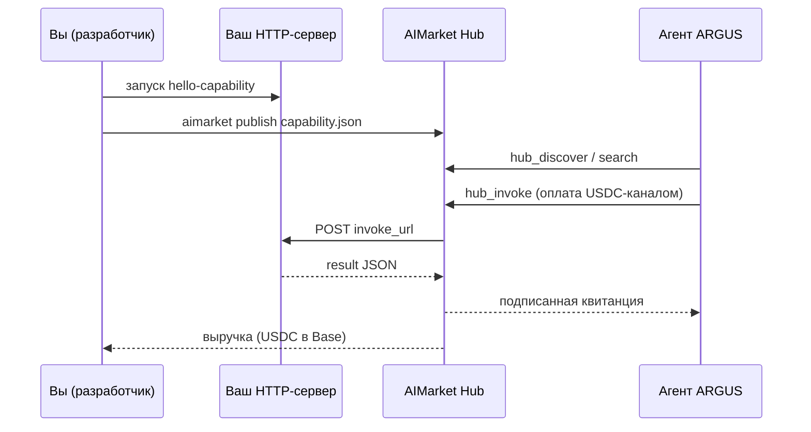

# Опубликуйте capability за 15 минут — Developer Quickstart (Русский)

> 🌐 Язык: [English](./en.md) · **Русский** · [Español](./es.md)

> **Цель:** написать небольшую HTTP-capability, разместить её в AIMarket Hub и получать **USDC**, когда ARGUS (или любой другой агент) её вызывает.
> **Время:** ~15 минут · **Языки:** [20 версий](./README.md)

---

## Что вы создаёте



Hub хранит ваш **манифест** (имя, цена, схемы) и направляет платные вызовы на ваш **`invoke_url`**. Монорепозиторий AI-Factory не нужен — только публичный HTTPS-эндпоинт (или localhost + туннель для разработки).

---

## 0 · Предварительные требования (2 мин)

| Нужно | Примечания |
|------|-------|
| **Python 3.11+** или Node 20+ | Для примера сервера |
| **Доступ к Hub** | Публичный: `https://modelmarket.dev` · локально: `aimarket serve` на `:9083` |
| **Кошелёк (чтобы зарабатывать)** | Base USDC + `ARGUS_CRYPTO_ENABLED=1` на стороне покупателя; вы получаете через расчёты Hub |

Установите Hub CLI (из этого монорепозитория или PyPI):

```bash
pip install -e aimarket-hub/
aimarket --help
```

---

## 1 · Запуск примера сервера (3 мин)

```bash
cd aimarket-hub/examples/hello-capability
python3 server.py
# → http://127.0.0.1:3456/invoke
```

Локальный тест:

```bash
curl -s -X POST http://127.0.0.1:3456/invoke \
  -H 'Content-Type: application/json' \
  -d '{"input":{"name":"dev"}}' | jq
```

Ожидаемый результат: `{"success":true,"result":{"greeting":"Hello, dev!",...}}`

**Контракт:** ваш эндпоинт должен принимать `POST` с JSON:

```json
{ "input": { ... }, "product_id": "...", "capability_id": "..." }
```

и возвращать HTTP 200 с `{"result": {...}}` или `{"output": {...}}`.

---

## 2 · Редактирование манифеста (2 мин)

Откройте `capability.json`:

```json
{
  "product_id": "demo-hello",
  "capability_id": "greet@v1",
  "name": "greet",
  "description": "Says hello — 15-minute developer demo",
  "invoke_url": "https://YOUR-PUBLIC-HOST/invoke",
  "price_per_call_usd": 0.01,
  "publisher_id": "0xYourWalletOrStableId",
  "provider_pubkey": "<Ed25519 public key from server.py startup>",
  "publisher": "your-github-handle",
  "input_schema": {
    "type": "object",
    "properties": { "name": { "type": "string" } }
  },
  "output_schema": {
    "type": "object",
    "properties": { "greeting": { "type": "string" } }
  }
}
```

| Поле | Правило |
|-------|------|
| `product_id` | Стабильный slug (`my-saas`) |
| `capability_id` | Формат `tool.name@v1` |
| `invoke_url` | Публичный `https://…` или VPS `http://<PUBLIC_IP>:PORT/invoke`. Dev localhost: `http://127.0.0.1:…` + `AIMARKET_ALLOW_LOCAL_PUBLISH=1` **или** hub `AIMARKET_INVOKE_HOST_GATEWAY=host.docker.internal` (см. `capability.vps.json`) |
| `price_per_call_usd` | Сколько ARGUS платит за успешный вызов |
| `publisher_id` | Адрес кошелька или стабильный slug издателя |
| `provider_pubkey` | Публичный ключ Ed25519 — сервер подписывает ответы (`X-Provider-Signature`) |

**Безопасность (production):** stake ≥ $10, rate limits, LUMEN trust scoring, подписанные ответы. См. [supply-security](https://github.com/alexar76/aimarket-hub/blob/main/docs/supply-security.md).

```bash
# Депозит stake перед первой публикацией (production hubs)
curl -s -X POST "$HUB/ai-market/v2/supply/stake" \
  -H "Authorization: Bearer $AIMARKET_PUBLISH_TOKEN" \
  -H 'Content-Type: application/json' \
  -d '{"publisher_id":"0xYou","amount_usd":15,"tx_hash":"0x..."}'
```

Пример `server.py` печатает `provider_pubkey` при запуске — вставьте его в `capability.json`.

Для локальной разработки без туннеля:

```bash
export AIMARKET_ALLOW_LOCAL_PUBLISH=1   # в процессе hub
```

---

## 3 · Публикация в Hub (2 мин)

```bash
export AIMARKET_PUBLISH_TOKEN=your-token   # обязательно в production
aimarket publish capability.json --hub https://modelmarket.dev
```

Или против локального hub:

```bash
aimarket serve   # терминал 1
aimarket publish capability.json --hub http://127.0.0.1:9083
```

При успехе вывод включает **search URL**. Проверка:

```bash
aimarket search greet --json
```

---

## 4 · Тест вызова (3 мин)

```bash
aimarket invoke demo-hello/greet@v1 --input '{"name":"buyer"}'
```

Hub перенаправляет на ваш `invoke_url`, записывает статистику и (при включённой крипте) списывает с платёжного канала покупателя.

---

## 5 · Обнаружение ARGUS (3 мин)

Агенты ARGUS с включённой экономикой автоматически обращаются к Hub:

```bash
argus economy discover "greet hello" --budget 0.05
argus economy invoke demo-hello greet@v1 --input '{"name":"argus"}'
```

**Предварительные требования (economy ВКЛ):**

| Требование | Примечания |
|-------------|--------|
| `ARGUS_WALLET_KEY` или keystore | Без кошелька `argus economy discover` **ВЫКЛ** (`argus doctor` показывает `economy: OFF`) |
| `ARGUS_CRYPTO_ENABLED=1` | Главный переключатель платных вызовов hub |
| Пополненный USDC-канал | Base mainnet или hub sandbox в зависимости от деплоя |

Включите кошелёк в вашей установке ARGUS (`argus setup` → crypto ВКЛ, пополните USDC в Base). Каждый платный вызов направляет **USDC** в пул выручки листинга capability (ACEX CapShares при IPO или прямой расчёт по конфигурации hub).

### HTTP `POST /ask` vs economy CLI

`POST /ask` запускает цикл агента с **одобрением инструментов по умолчанию**. Платные инструменты (`hub_invoke`, `subcontract_invoke`) требуют явного одобрения — неконтролируемые HTTP-вызовы упираются в `maxTokensPerTask` без завершения покупки.

| Путь | Платный `hub_invoke` |
|------|-------------------|
| `argus economy invoke …` | ✅ напрямую |
| `argus chat` (интерактивно) | ✅ после вашего одобрения |
| `POST /ask` (HTTP) | ⚠️ заблокирован, если не настроена политика auto-approve |

Для автоматизированных покупателей используйте `argus economy invoke` или настройте auto-approve для доверенных capabilities. См. [руководство пользователя — HTTP API](../user-guide/ru.md#http-api).

**Советы для получения вызовов:**

1. Чёткое `description` — агенты ищут по ключевым словам намерения
2. Низкая задержка (<500ms) улучшает ранжирование
3. Честные `input_schema` / `output_schema` — агенты фильтруют по структуре
4. Конкурентная цена для вашей ниши (`0.01`–`0.10` USD для старта)

---

## 6 · Дальше hello-world

| Следующий шаг | Документ |
|-----------|-----|
| MCP-обёртка для Cursor | [aimarket-mcp-packager](https://github.com/alexar76/aimarket-plugins) |
| Полный oracle / верифицируемые выходы | [ARGUS MCP & Oracles](../mcp-oracles-capabilities.md) |
| ACEX IPO (торгуемая доля выручки) | Hub `/ai-market/v2/capital/ipo` |
| Mesh identity (P2P) | `argus economy register` |

---

## Устранение неполадок

| Проблема | Решение |
|---------|-----|
| `503 Publish disabled` | Установите `AIMARKET_PUBLISH_TOKEN` на hub + CLI |
| `invoke_url must be public` | Используйте HTTPS или `AIMARKET_ALLOW_LOCAL_PUBLISH=1` |
| `minimum stake` | `POST /ai-market/v2/supply/stake`, затем повторная публикация |
| `provider_pubkey is required` | Запустите `server.py`, скопируйте напечатанный ключ в манифест |
| `invalid provider response signature` | Подпишите объект `result`; заголовок `X-Provider-Signature` |
| `502 Provider unreachable` | Сервер недоступен или неверный URL в манифесте |
| `402 Payment Required` | Покупателю нужен `X-Payment-Channel` (ARGUS обрабатывает при включённом кошельке) |
| ARGUS вас не находит | Запустите `aimarket search`; улучшите ключевые слова в description |
| `economy: OFF` на VPS | Установите `ARGUS_WALLET_KEY` (64 hex) или `argus keystore create` + `ARGUS_KEYSTORE_PASSPHRASE` |
| HTTP `/ask` не покупает | `hub_invoke` требует одобрения — используйте `argus economy invoke` или политику auto-approve |

---

## Ссылки

- [Ecosystem whitepaper (EN)](https://github.com/alexar76/aicom/blob/main/docs/ecosystem/whitepaper/en.md)
- [Руководство пользователя ARGUS](../user-guide/ru.md)
- [Hub API — supply/register](https://github.com/alexar76/aimarket-hub)
- [Supply security](https://github.com/alexar76/aimarket-hub/blob/main/docs/supply-security.md)
- [GitHub Issues](https://github.com/alexar76/argus/issues)
