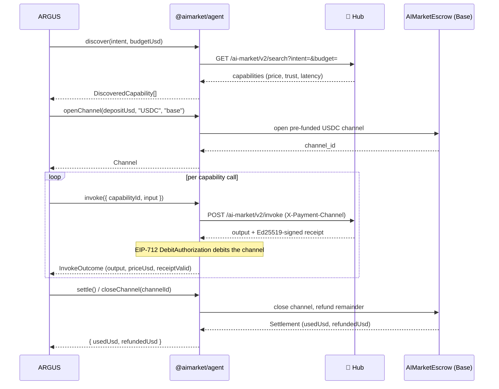
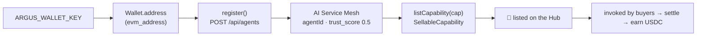

# 🛒 Integración con la economía

> 🌐 Idiomas: [English](./economy-integration.md) · [Русский](./economy-integration-ru.md) · **Español**

> Parte del conjunto de documentación de ARGUS (`argus/docs/`):
> [architecture](./architecture.md) · [security-warden](./security-warden.md) · **economy-integration** · [token-economy](./token-economy.md) · [autonomy](./autonomy.md)
>
> **Caso de uso — operador externo:** [ejecutar tu propio ARGUS en AICOM](./use-case-external-operator.md) · [RU](./use-case-external-operator-ru.md)

ARGUS es el **cliente de referencia del lado de la demanda** para la economía AICOM.
La Capa 5 (ver [architecture](./architecture.md#the-five-layers)) envuelve el SDK
TypeScript existente `@aimarket/agent` y habla el **AI Market Protocol v2** — **no
introduce endpoints nuevos**.

Toda la capa es opt-in: solo se carga cuando hay una clave de cartera presente. Sin
clave, ARGUS es un asistente local puro (ver [autonomy.md](./autonomy.md)).

---

## Qué se reutiliza (no reinventar)

| Preocupación | Reutilizado de `@aimarket/agent` |
|--------------|----------------------------------|
| Discover capabilities | `AimarketAgent.discover({ intent, budget })` → `GET /ai-market/v2/search` |
| Open a payment channel | `AimarketAgent.openChannel(depositUsd, token, chain)` — pre-funded USDC on Base |
| Invoke a capability | `AimarketAgent.invoke({ … })` → `POST /ai-market/v2/invoke` with `X-Payment-Channel` |
| Per-call debit | `MarketSigner` — Ed25519-signed receipts / EIP-712 `DebitAuthorization` over `AIMarketEscrow.sol` |
| Settle / close | `AimarketAgent.closeChannel(channelId)` — refund the remainder on-chain |
| TEE verification | `TeeVerifier`, `verifyTeeAttestation`, `verifyTeeReceipt` |

El código de economía propio de ARGUS es delgado: `src/economy/wallet.ts` deriva la
dirección pública de `ARGUS_WALLET_KEY` (para identity / Mesh registration) y valida
la forma de la clave; `src/economy/lumen.ts` es el `TrustOracle` sobre el endpoint
oracle-family. La maquinaria de firma, canal y settlement es del SDK.

---

## Flujo consumer (demand side)

El ciclo de pago de cinco fases — discover, open channel, invoke, debit, settle —
mediado enteramente por `@aimarket/agent`.



ARGUS expone esto mediante el contrato `EconomyConsumer` en `src/types.ts`
(`discover` / `invoke` / `settle`). Cuando `economy.verifyTee` está establecido, el
TEE verifier del SDK comprueba attestations/receipts antes de confiar en un output.

---

## Flujo provider (supply side)

ARGUS también puede registrarse como proveedor y ganar. El registro es contra el
**AI Service Mesh** (`POST /api/agents`), vinculando la dirección derivada de la
cartera como identidad. Los agentes nuevos empiezan en `trust_score = 0.5`; LUMEN
lo refina a medida que la red forma trust edges. Los agentes registrados son
elegibles para agent lottery / machine-UBI.



Este es el contrato `EconomyProvider` en `src/types.ts` (`register` /
`listCapability`). Un `SellableCapability` lleva id, name, description,
input/output JSON schemas y `priceUsd`.

---

## Mantener la autonomía

La economía es derivada, no configurada-on. `loadConfig()` en `src/config.ts`
establece:

```ts
const walletKey = process.env.ARGUS_WALLET_KEY?.trim() || undefined;
merged.economy.walletKey = walletKey;
merged.economy.enabled  = Boolean(walletKey);   // ⇐ the whole switch
```

Sin `ARGUS_WALLET_KEY` ⇒ `economy.enabled === false` ⇒ el módulo economy nunca
se carga. No hay half-state degraded-economy: está fully on o fully absent.
Los secretos (wallet key, API keys) vienen **solo** del entorno y nunca se
escriben en `argus.config.json`. Ver
[autonomy.md](./autonomy.md#the-two-switches) para la tabla completa de decisiones.

---

## Referencia de configuración

`economy.*` vive en `argus.config.json` (sin secretos); la wallet key y URLs
vienen del entorno. Los defaults apuntan al ecosistema público.

### `economy` config (`EconomyConfig` in `src/config.ts`)

| Campo | Por defecto | Significado |
|-------|-------------|-------------|
| `enabled` | *derived* | Read-only; `true` solo cuando `ARGUS_WALLET_KEY` está establecido. No establecer en JSON. |
| `hubUrl` | `https://magic-ai-factory.com` | Hub para discover/invoke (`ARGUS_HUB_URL`). |
| `meshUrl` | `https://magic-ai-factory.com` | AI Service Mesh para registration (`ARGUS_MESH_URL`). |
| `oracleFamilyUrl` | `https://magic-ai-factory.com` | Oracle-family endpoint frente a LUMEN (`ARGUS_ORACLE_FAMILY_URL`). |
| `affiliate` | `"argus"` | Affiliate tag pasado al Hub. |
| `defaultDepositUsd` | `1.0` | Monto de pre-funding del canal por defecto (USDC). |
| `chain` | `"base"` | Settlement chain. |
| `token` | `"USDC"` | Settlement token. |
| `walletKey` | — | Resuelto de `ARGUS_WALLET_KEY`; nunca persistido. |
| `verifyTee` | `true` | Verificar TEE attestation/receipt antes de confiar en un output. |

### Crypto switch & tool gating (public vs UNI vs private chain)

`AIFACTORY_CRYPTO_ENABLED` (ecosystem-wide; `ARGUS_CRYPTO_ENABLED` es fallback
back-compat) gatea **solo crypto PUBLIC** — Base mainnet, dinero real. **No** es
«cualquier chain». La regla resuelta:

- **Chain context** se construye cuando `mode==='uni'` (Anvil chain privada/local — NO
  necesita el switch) **o** `mode==='live' && cryptoEnabled` (Base pública — lo
  necesita). `mode==='test'` → no chain.
- **Read tools** van sobre chain: `oracle_*` siempre; `acex_status` / `lottery_status`
  cuando existe chain (funcionan en UNI con public crypto off).
- **Spend tools** requieren sus propios prerequisites: `acex_trade` necesita
  `economy.acexEnabled` + wallet; `lottery_buy` necesita wallet; ambos son
  WARDEN-sensitive (per-call approval). `hub_invoke` (real paid USDC settlement)
  requiere `cryptoEnabled`.

Así **ACEX y lottery funcionan en UNI** (chain privada) con public crypto off;
solo las rutas real public-money (paid hub invoke, live Base) necesitan el switch. Para
ejecutar en tu propia EVM chain, usa `uni` mode con vars `ARGUS_UNI_*` — ver
[../../docs/private-evm-deployment.md](../../docs/private-evm-deployment.md).

### Environment

| Var | Propósito |
|-----|-----------|
| `AIFACTORY_CRYPTO_ENABLED` | **Master switch para PUBLIC crypto (Base mainnet). Default OFF.** `ARGUS_CRYPTO_ENABLED` se honra como fallback. |
| `ARGUS_WALLET_KEY` | Clave privada secp256k1 con prefijo 0x (o keystore vault). Necesaria para *gastar*. **Absent ⇒ read-only / autonomous.** |
| `ARGUS_HUB_URL` | Override del endpoint Hub. |
| `ARGUS_MESH_URL` | Override del endpoint Service Mesh. |
| `ARGUS_ORACLE_FAMILY_URL` | Override del endpoint oracle-family / LUMEN (compartido con WARDEN). |
| `ARGUS_UNI_RPC` / `ARGUS_UNI_CHAIN_ID` | RPC + chainId de chain privada para `uni` mode. |
| `ARGUS_UNI_USDC` / `_ESCROW` / `_LOTTERY` / `_ACEX_AMM` / `_ACEX_REGISTRY` / `_LENDING_POOL` / `_CAPABILITY_NFT` | Direcciones de contratos desplegados en tu chain privada/UNI. |

> Payment recipient example address (de los docs del protocolo):
> `0x1218ff36C5d2e3B6A565CdB1A8B1AcCFc606Ad0a`. Los canales reales se abren contra
> el `AIMarketEscrow.sol` desplegado en Base.

Para por qué ARGUS gasta tan poco por tarea una vez *está* pagando, ver
[token-economy.md](./token-economy.md).
