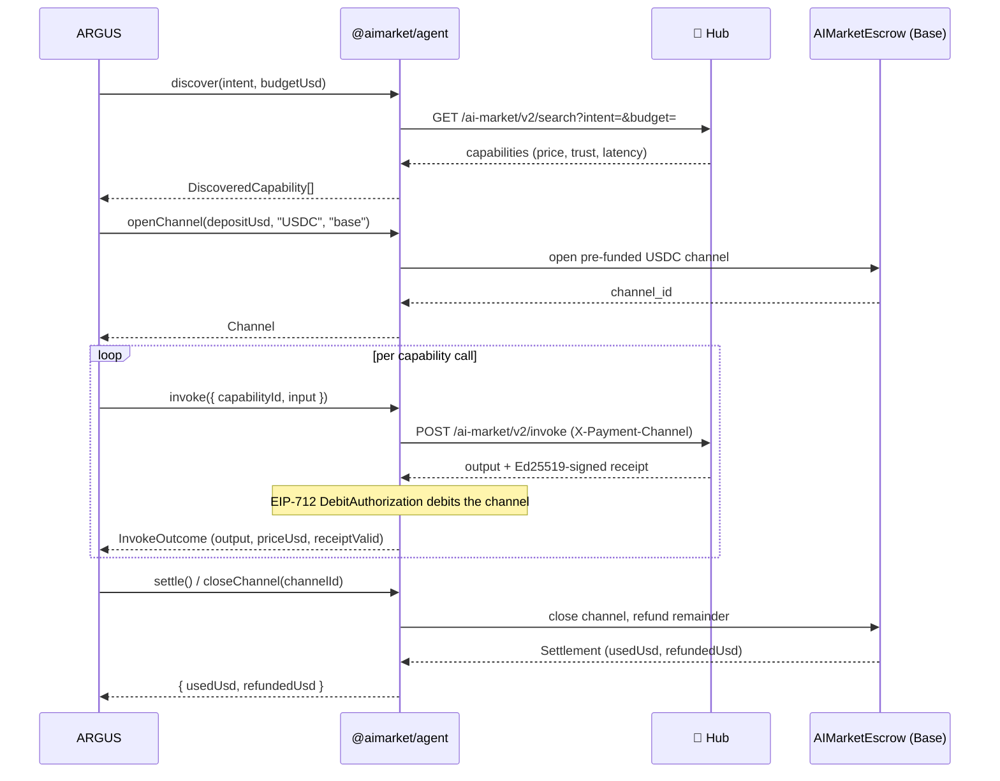
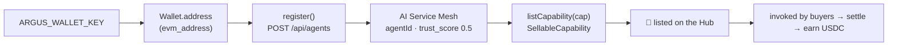

# 🛒 Интеграция с экономикой

> 🌐 Язык: [English](./economy-integration.md) · **Русский** · [Español](./economy-integration-es.md)

> Часть набора документации ARGUS (`argus/docs/`):
> [architecture](./architecture.md) · [security-warden](./security-warden.md) · **economy-integration** · [token-economy](./token-economy.md) · [autonomy](./autonomy.md)
>
> **Use case — сторонний оператор:** [свой ARGUS на AICOM](./use-case-external-operator.md) · [RU](./use-case-external-operator-ru.md) · [ES](./use-case-external-operator-es.md)

ARGUS — **референсный demand-side клиент** экономики AICOM. Слой 5
(см. [architecture](./architecture.md#the-five-layers)) оборачивает существующий
TypeScript SDK `@aimarket/agent` и говорит на **AI Market Protocol v2** — он
**не вводит новых endpoints**.

Весь слой opt-in: загружается только при наличии ключа кошелька. Без
ключа ARGUS — чистый локальный ассистент (см. [autonomy.md](./autonomy.md)).

---

## Что переиспользуется (не изобретать заново)

| Задача | Переиспользуется из `@aimarket/agent` |
|---------|-------------------------------|
| Discover capabilities | `AimarketAgent.discover({ intent, budget })` → `GET /ai-market/v2/search` |
| Open a payment channel | `AimarketAgent.openChannel(depositUsd, token, chain)` — pre-funded USDC on Base |
| Invoke a capability | `AimarketAgent.invoke({ … })` → `POST /ai-market/v2/invoke` with `X-Payment-Channel` |
| Per-call debit | `MarketSigner` — Ed25519-signed receipts / EIP-712 `DebitAuthorization` over `AIMarketEscrow.sol` |
| Settle / close | `AimarketAgent.closeChannel(channelId)` — refund the remainder on-chain |
| TEE verification | `TeeVerifier`, `verifyTeeAttestation`, `verifyTeeReceipt` |

Собственный economy-код ARGUS тонкий: `src/economy/wallet.ts` выводит публичный
address из `ARGUS_WALLET_KEY` (для identity / Mesh registration) и валидирует
форму ключа; `src/economy/lumen.ts` — `TrustOracle` над oracle-family
endpoint. Signing, channel и settlement machinery — у SDK.

---

## Consumer flow (demand side)

Пятичастный платный цикл — discover, open channel, invoke, debit, settle —
посредством `@aimarket/agent`.



ARGUS экспортирует это через контракт `EconomyConsumer` в `src/types.ts`
(`discover` / `invoke` / `settle`). Когда задан `economy.verifyTee`, TEE verifier SDK
проверяет attestations/receipts перед доверием output.

---

## Provider flow (supply side)

ARGUS может также регистрироваться как поставщик и зарабатывать. Регистрация в
**AI Service Mesh** (`POST /api/agents`), привязка wallet-derived address как
identity. Новые агенты стартуют с `trust_score = 0.5`; LUMEN уточняет по мере
формирования trust edges в сети. Зарегистрированные агенты eligible для agent lottery
/ machine-UBI.



Это контракт `EconomyProvider` в `src/types.ts` (`register` /
`listCapability`). `SellableCapability` несёт id, name, description,
input/output JSON schemas и `priceUsd`.

---

## Сохранение автономности

Экономика derived, не configured-on. `loadConfig()` в `src/config.ts`
устанавливает:

```ts
const walletKey = process.env.ARGUS_WALLET_KEY?.trim() || undefined;
merged.economy.walletKey = walletKey;
merged.economy.enabled  = Boolean(walletKey);   // ⇐ the whole switch
```

Нет `ARGUS_WALLET_KEY` ⇒ `economy.enabled === false` ⇒ economy module никогда
не загружается. Нет degraded-economy half-state: полностью on или полностью absent.
Секреты (wallet key, API keys) приходят **только** из environment и
никогда не пишутся в `argus.config.json`. См.
[autonomy.md](./autonomy.md#the-two-switches) для полной таблицы решений.

---

## Справочник конфигурации

`economy.*` живёт в `argus.config.json` (без секретов); wallet key и URLs
из environment. Defaults нацелены на публичную экосистему.

### `economy` config (`EconomyConfig` in `src/config.ts`)

| Поле | По умолчанию | Значение |
|-------|---------|---------|
| `enabled` | *derived* | Read-only; `true` только когда задан `ARGUS_WALLET_KEY`. Не задавать в JSON. |
| `hubUrl` | `https://magic-ai-factory.com` | Hub для discover/invoke (`ARGUS_HUB_URL`). |
| `meshUrl` | `https://magic-ai-factory.com` | AI Service Mesh для registration (`ARGUS_MESH_URL`). |
| `oracleFamilyUrl` | `https://magic-ai-factory.com` | Oracle-family endpoint перед LUMEN (`ARGUS_ORACLE_FAMILY_URL`). |
| `affiliate` | `"argus"` | Affiliate tag для Hub. |
| `defaultDepositUsd` | `1.0` | Default channel pre-funding amount (USDC). |
| `chain` | `"base"` | Settlement chain. |
| `token` | `"USDC"` | Settlement token. |
| `walletKey` | — | Из `ARGUS_WALLET_KEY`; never persisted. |
| `verifyTee` | `true` | Verify TEE attestation/receipt перед доверием output. |

### Crypto switch & tool gating (public vs UNI vs private chain)

`AIFACTORY_CRYPTO_ENABLED` (ecosystem-wide; `ARGUS_CRYPTO_ENABLED` — back-compat
fallback) гейтит **PUBLIC** crypto only — Base mainnet, real money. Это **не**
«любая chain». Resolved rule:

- **Chain context** строится когда `mode==='uni'` (private/local Anvil chain —
  switch НЕ нужен) **или** `mode==='live' && cryptoEnabled` (public Base — нужен
  он). `mode==='test'` → no chain.
- **Read tools** на chain: `oracle_*` всегда; `acex_status` / `lottery_status`
  когда chain существует (работают в UNI с public crypto off).
- **Spend tools** требуют свои prerequisites: `acex_trade` нужны
  `economy.acexEnabled` + wallet; `lottery_buy` нужен wallet; оба
  WARDEN-sensitive (per-call approval). `hub_invoke` (real paid USDC settlement)
  требует `cryptoEnabled`.

Итого **ACEX и lottery работают в UNI** (private chain) с public crypto off;
только real public-money paths (paid hub invoke, live Base) нуждаются в switch. Для
своей EVM chain — `uni` mode с `ARGUS_UNI_*` vars — см.
[../../docs/private-evm-deployment.md](../../docs/private-evm-deployment.md).

### Environment

| Var | Назначение |
|-----|---------|
| `AIFACTORY_CRYPTO_ENABLED` | **Master switch для PUBLIC crypto (Base mainnet). Default OFF.** `ARGUS_CRYPTO_ENABLED` honoured как fallback. |
| `ARGUS_WALLET_KEY` | 0x-prefixed secp256k1 private key (или keystore vault). Нужен чтобы *тратить*. **Absent ⇒ read-only / autonomous.** |
| `ARGUS_HUB_URL` | Override Hub endpoint. |
| `ARGUS_MESH_URL` | Override Service Mesh endpoint. |
| `ARGUS_ORACLE_FAMILY_URL` | Override oracle-family / LUMEN endpoint (shared with WARDEN). |
| `ARGUS_UNI_RPC` / `ARGUS_UNI_CHAIN_ID` | Private-chain RPC + chainId для `uni` mode. |
| `ARGUS_UNI_USDC` / `_ESCROW` / `_LOTTERY` / `_ACEX_AMM` / `_ACEX_REGISTRY` / `_LENDING_POOL` / `_CAPABILITY_NFT` | Deployed contract addresses на private/UNI chain. |

> Пример payment recipient address (из protocol docs):
> `0x1218ff36C5d2e3B6A565CdB1A8B1AcCFc606Ad0a`. Real channels открываются против
> deployed `AIMarketEscrow.sol` on Base.

Почему ARGUS тратит так мало per task когда *платит*, см.
[token-economy.md](./token-economy.md).
