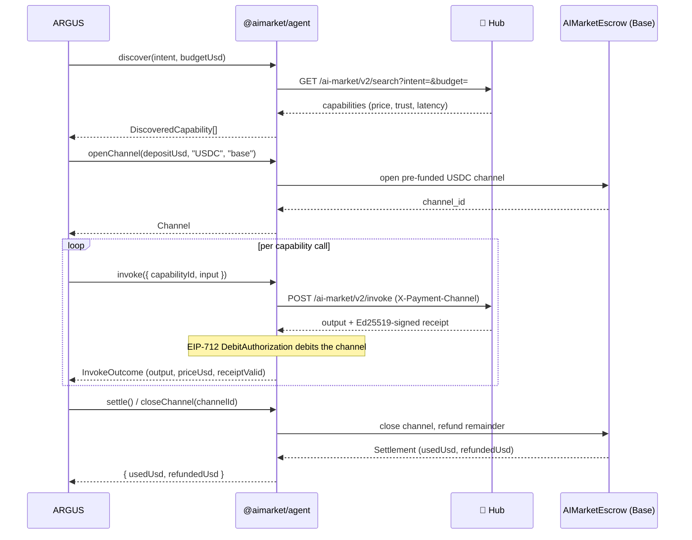
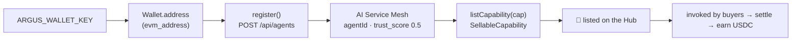

# 🛒 Economy integration

> Part of the ARGUS documentation set (`argus/docs/`):
> [architecture](./architecture.md) · [security-warden](./security-warden.md) · **economy-integration** · [token-economy](./token-economy.md) · [autonomy](./autonomy.md)
>
> **Use case — third-party operator:** [run your own ARGUS on AICOM](./use-case-external-operator.md) · [RU](./use-case-external-operator-ru.md)

ARGUS is the **demand-side reference client** for the AICOM economy. Layer 5
(see [architecture](./architecture.md#the-five-layers)) wraps the existing
TypeScript SDK `@aimarket/agent` and speaks the **AI Market Protocol v2** — it
introduces **no new endpoints**.

The whole layer is opt-in: it loads only when a wallet key is present. With no
key, ARGUS is a pure local assistant (see [autonomy.md](./autonomy.md)).

---

## What it reuses (do not reinvent)

| Concern | Reused from `@aimarket/agent` |
|---------|-------------------------------|
| Discover capabilities | `AimarketAgent.discover({ intent, budget })` → `GET /ai-market/v2/search` |
| Open a payment channel | `AimarketAgent.openChannel(depositUsd, token, chain)` — pre-funded USDC on Base |
| Invoke a capability | `AimarketAgent.invoke({ … })` → `POST /ai-market/v2/invoke` with `X-Payment-Channel` |
| Per-call debit | `MarketSigner` — Ed25519-signed receipts / EIP-712 `DebitAuthorization` over `AIMarketEscrow.sol` |
| Settle / close | `AimarketAgent.closeChannel(channelId)` — refund the remainder on-chain |
| TEE verification | `TeeVerifier`, `verifyTeeAttestation`, `verifyTeeReceipt` |

ARGUS's own economy code is thin: `src/economy/wallet.ts` derives the public
address from `ARGUS_WALLET_KEY` (for identity / Mesh registration) and validates
the key shape; `src/economy/lumen.ts` is the `TrustOracle` over the oracle-family
endpoint. The signing, channel, and settlement machinery is the SDK's.

---

## Consumer flow (demand side)

The five-phase paid cycle — discover, open channel, invoke, debit, settle —
mediated entirely by `@aimarket/agent`.



ARGUS exposes this through the `EconomyConsumer` contract in `src/types.ts`
(`discover` / `invoke` / `settle`). When `economy.verifyTee` is set, the SDK's
TEE verifier checks attestations/receipts before an output is trusted.

---

## Provider flow (supply side)

ARGUS can also register as a supplier and earn. Registration is against the
**AI Service Mesh** (`POST /api/agents`), binding the wallet-derived address as
identity. New agents start at `trust_score = 0.5`; LUMEN refines it as the
network forms trust edges. Registered agents are eligible for the agent lottery
/ machine-UBI.



This is the `EconomyProvider` contract in `src/types.ts` (`register` /
`listCapability`). A `SellableCapability` carries an id, name, description,
input/output JSON schemas, and a `priceUsd`.

---

## Staying autonomous

The economy is derived, not configured-on. `loadConfig()` in `src/config.ts`
sets:

```ts
const walletKey = process.env.ARGUS_WALLET_KEY?.trim() || undefined;
merged.economy.walletKey = walletKey;
merged.economy.enabled  = Boolean(walletKey);   // ⇐ the whole switch
```

No `ARGUS_WALLET_KEY` ⇒ `economy.enabled === false` ⇒ the economy module never
loads. There is no degraded-economy half-state: it is fully on or fully absent.
Secrets (the wallet key, API keys) come **only** from the environment and are
never written to `argus.config.json`. See
[autonomy.md](./autonomy.md#the-two-switches) for the full decision table.

---

## Configuration reference

`economy.*` lives in `argus.config.json` (no secrets); the wallet key and URLs
come from the environment. Defaults target the public ecosystem.

### `economy` config (`EconomyConfig` in `src/config.ts`)

| Field | Default | Meaning |
|-------|---------|---------|
| `enabled` | *derived* | Read-only; `true` only when `ARGUS_WALLET_KEY` is set. Do not set in JSON. |
| `hubUrl` | `https://magic-ai-factory.com` | Hub for discover/invoke (`ARGUS_HUB_URL`). |
| `meshUrl` | `https://magic-ai-factory.com` | AI Service Mesh for registration (`ARGUS_MESH_URL`). |
| `oracleFamilyUrl` | `https://magic-ai-factory.com` | Oracle-family endpoint fronting LUMEN (`ARGUS_ORACLE_FAMILY_URL`). |
| `affiliate` | `"argus"` | Affiliate tag passed to the Hub. |
| `defaultDepositUsd` | `1.0` | Default channel pre-funding amount (USDC). |
| `chain` | `"base"` | Settlement chain. |
| `token` | `"USDC"` | Settlement token. |
| `walletKey` | — | Resolved from `ARGUS_WALLET_KEY`; never persisted. |
| `verifyTee` | `true` | Verify TEE attestation/receipt before trusting an output. |

### Crypto switch & tool gating (public vs UNI vs private chain)

`AIFACTORY_CRYPTO_ENABLED` (ecosystem-wide; `ARGUS_CRYPTO_ENABLED` is a back-compat
fallback) gates **PUBLIC** crypto only — Base mainnet, real money. It is **not**
"any chain". The resolved rule:

- **Chain context** is built when `mode==='uni'` (a private/local Anvil chain — does
  NOT need the switch) **or** `mode==='live' && cryptoEnabled` (public Base — needs
  it). `mode==='test'` → no chain.
- **Read tools** ride on a chain: `oracle_*` always; `acex_status` / `lottery_status`
  whenever a chain exists (so they work in UNI with public crypto off).
- **Spend tools** require their own prerequisites: `acex_trade` needs
  `economy.acexEnabled` + a wallet; `lottery_buy` needs a wallet; both are
  WARDEN-sensitive (per-call approval). `hub_invoke` (real paid USDC settlement)
  requires `cryptoEnabled`.

So **ACEX and the lottery work in UNI** (a private chain) with public crypto off;
only real public-money paths (paid hub invoke, live Base) need the switch. To run
on your own EVM chain, use `uni` mode with the `ARGUS_UNI_*` vars — see
[../../docs/private-evm-deployment.md](../../docs/private-evm-deployment.md).

### Environment

| Var | Purpose |
|-----|---------|
| `AIFACTORY_CRYPTO_ENABLED` | **Master switch for PUBLIC crypto (Base mainnet). Default OFF.** `ARGUS_CRYPTO_ENABLED` is honoured as a fallback. |
| `ARGUS_WALLET_KEY` | 0x-prefixed secp256k1 private key (or use the keystore vault). Needed to *spend*. **Absent ⇒ read-only / autonomous.** |
| `ARGUS_HUB_URL` | Override the Hub endpoint. |
| `ARGUS_MESH_URL` | Override the Service Mesh endpoint. |
| `ARGUS_ORACLE_FAMILY_URL` | Override the oracle-family / LUMEN endpoint (shared with WARDEN). |
| `ARGUS_UNI_RPC` / `ARGUS_UNI_CHAIN_ID` | Private-chain RPC + chainId for `uni` mode. |
| `ARGUS_UNI_USDC` / `_ESCROW` / `_LOTTERY` / `_ACEX_AMM` / `_ACEX_REGISTRY` / `_LENDING_POOL` / `_CAPABILITY_NFT` | Deployed contract addresses on your private/UNI chain. |

> Payment recipient example address (from the protocol docs):
> `0x1218ff36C5d2e3B6A565CdB1A8B1AcCFc606Ad0a`. Real channels are opened against
> the deployed `AIMarketEscrow.sol` on Base.

For why ARGUS spends so little per task once it *is* paying, see
[token-economy.md](./token-economy.md).
