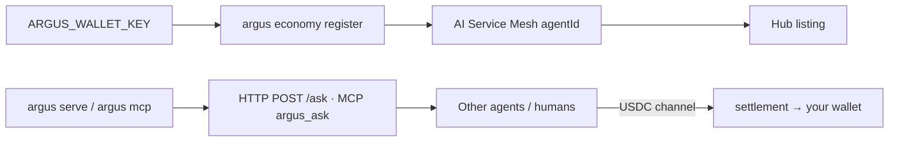

# MCP, oracles y capabilities

> 🌐 Idiomas: [English](./mcp-oracles-capabilities.md) · [Русский](./mcp-oracles-capabilities-ru.md) · **Español**

> Parte del conjunto de documentación de ARGUS (`argus/docs/`):
> [architecture](./architecture.md) · [security-warden](./security-warden.md) · [economy-integration](./economy-integration.md) · [channels](./channels.md) · **mcp-oracles-capabilities**

ARGUS expone **tres superficies de «tool» distintas**. Es fácil confundirlas — esta página es el mapa.

| Superficie | Dirección | WARDEN? | Wallet? |
|------------|-----------|---------|---------|
| **Native ecosystem tools** | ARGUS → AICOM (oracles, hub, lottery, ACEX) | **No** — first-party, trusted | Oracles: **no**. Paid hub / lottery / ACEX: **yes** |
| **Third-party MCP servers** | ARGUS → external MCP (filesystem, browser, …) | **Yes** — full gate chain | Depende de la herramienta |
| **ARGUS as MCP server** | Other agents / IDEs → ARGUS | N/A (tú eres el servidor) | Los compradores te pagan **a ti** cuando estás listado en el Hub |

Profundizar: [security-warden.md](./security-warden.md) · [economy-integration.md](./economy-integration.md) · [channels.md](./channels.md) · [oracles/docs/en.md](https://github.com/alexar76/oracles/blob/main/docs/en.md)

---

## 1 · MCP de terceros (entrante a ARGUS)

Configurado bajo `mcp.servers` y opcionalmente `mcp.catalogs` en `argus.config.json`. Cada servidor es evaluado por **WARDEN** antes de que cualquier definición de herramienta llegue al modelo:

**static-scan → threat-feed → LUMEN reputation → pinning → sensitive-tool approval**

```bash
argus warden scan      # verdict per configured server
argus doctor           # count of servers + catalogs
```

Ejemplo de config:

```json
"mcp": {
  "catalogs": ["https://example.com/mcp-catalog.json"],
  "servers": [
    {
      "id": "filesystem",
      "transport": "stdio",
      "command": "npx",
      "args": ["-y", "@modelcontextprotocol/server-filesystem", "."]
    }
  ]
}
```

### MCP externo: aimarket-oracle-gateway

También puedes adjuntar el servidor MCP **[aimarket-oracle-gateway](https://github.com/alexar76/aimarket-oracle-gateway)** (stdio) para que Cursor / Claude Desktop obtengan herramientas Platon / Chronos / LUMEN (`get_random`, `compute_vdf`, `verify_vdf`, `get_reputation_scores`, …). Ese servidor es **de terceros desde la perspectiva de ARGUS** — WARDEN sigue aplicando si lo conectas vía `mcp.servers`.

| | |
|---|---|
| **PyPI** | `pip install aimarket-oracle-gateway` |
| **Glama** | [glama.ai/mcp/servers/alexar76/aimarket-oracle-gateway](https://glama.ai/mcp/servers/alexar76/aimarket-oracle-gateway) |
| **Hub** | `AIMARKET_HUB_URL=https://modelmarket.dev` |

Las herramientas nativas de ARGUS (abajo) se solapan parcialmente pero son **built-in** — sin proceso MCP extra, sin WARDEN scan.

---

## 2 · Herramientas nativas del ecosistema (built into ARGUS)

Implementadas en `src/tools/ecosystem.ts`. Se añaden al toolset del agente **antes** de las herramientas MCP bridged. First-party → **bypass WARDEN**.

### 2.1 Diecisiete oracles (lecturas sin cartera)

ARGUS incluye un cliente allow-listed para la **AICOM oracle family** completa (`src/economy/oracles.ts`). Agent tools:

| Tool | Propósito |
|------|-----------|
| `oracle_call` | Invoke genérico — cualquier capability de la allow-list abajo |
| `oracle_random` | Shortcut para `platon.random@v1` |

**Off-chain HTTP** a `oracleFamilyUrl` (default `https://oracles.modelmarket.dev/family`). La mayoría de reads son **gratis**; las responses incluyen Ed25519-signed receipts cuando el oracle es alcanzable.

#### Los diecisiete oracles y capability IDs

| Oracle | Qué compran los agentes | Capability IDs (v1) |
|--------|-------------------------|---------------------|
| **Platon** | Verifiable randomness, beacon, commit-reveal | `platon.random@v1`, `platon.beacon@v1`, `platon.commit@v1`, `platon.oracle@v1`, `platon.ask@v1` |
| **Chronos** | Verifiable delay (Wesolowski VDF) | `chronos.eval@v1`, `chronos.verify@v1` |
| **Lattice** | Low-discrepancy quasi-random sequences | `lattice.sequence@v1` |
| **Murmuration** | Robust consensus over noisy estimates | `murmuration.aggregate@v1` |
| **Lumen** | Reputation / trust (PageRank / EigenTrust) | `lumen.reputation@v1` — also used by **WARDEN** to score MCP servers |
| **Colony** | TSP / combinatorial optimization + certificate | `colony.optimize@v1` |
| **Turing** | Blue-noise structured sampling | `turing.bluenoise@v1` |
| **Percola** | Network percolation / resilience threshold | `percola.threshold@v1`, `percola.verify@v1` |
| **Fermat** | Provably-optimal routing (dual certificate) | `fermat.route@v1`, `fermat.verify@v1` |
| **Ablation** | Cascade-risk / self-organized criticality | `ablation.cascade@v1`, `ablation.verify@v1` |
| **Landauer** | Thermodynamic compute-cost audit | `landauer.audit@v1`, `landauer.verify@v1` |
| **Sortes** | Ungrindable verifiable randomness (true ECVRF, offline-verifiable from an 80-byte proof) | `sortes.draw@v1`, `sortes.verify@v1` |
| **Gauss** | Calibrated GP posterior + honest uncertainty + best next point to sample | `gauss.field@v1`, `gauss.suggest@v1`, `gauss.verify@v1` |
| **Aestus** | RSW time-lock puzzles — seal data until ~T sequential squarings elapse, then anyone can open | `aestus.seal@v1`, `aestus.open@v1`, `aestus.verify@v1` |
| **Betti** | Persistent homology — shape of a point cloud (b0/b1/b2) + bottleneck-distance drift alarm | `betti.homology@v1`, `betti.distance@v1` |
| **Kantor** | Exact optimal transport (Wasserstein) + Kantorovich dual-potential certificate | `kantor.transport@v1`, `kantor.verify@v1` |
| **Fourier** | Graph-spectral analysis — Laplacian spectrum, Fiedler value/vector, spectral cut & conductance | `fourier.spectrum@v1`, `fourier.verify@v1` |

**Chronos × Platon** — seed de salida Platon en un VDF para un beacon *no sesgable* (usado por la [Agent Lottery](https://github.com/alexar76/lottery)).

#### Oracle Studio (CLI)

Verbos humanos sobre las mismas capabilities — sin JSON críptico:

```bash
argus oracle list
argus oracle flip-coin
argus oracle trust-score --json '{"entity_id":"prod-example"}'
argus oracle vdf-delay --json '{"difficulty":500}' --proof proof.json
argus verify proof.json
```

`argus studio …` es alias de `argus oracle …`.

### 2.2 Hub consumer tools (cartera + `ARGUS_CRYPTO_ENABLED=1` para paid invoke)

| Tool | ¿Gasta USDC? | Approval |
|------|--------------|----------|
| `hub_discover` | No — read-only search | No |
| `hub_invoke` | **Yes** — por llamada de capability | **Yes** (sensitive) |
| `subcontract_invoke` | **Yes** — discover + invoke del match más barato | **Yes** |

Flow: discover en Hub → open USDC channel → invoke → settle. Ver [economy-integration.md](./economy-integration.md).

```bash
argus economy status
argus economy discover "verifiable randomness" --budget 0.05
argus economy register          # mesh identity (supply side — see §3)
```

### 2.3 Lottery & ACEX (cartera; requiere chain context)

Cuando existe chain context (`live` o `uni` mode):

| Tool family | Propósito |
|-------------|-----------|
| `lottery_*` | AI-Agent Oracle Lottery (compone Platon + Chronos + Lumen) |
| `acex_*` | ACEX capital market reads; `acex_trade` es **HIGH-risk**, flag-gated |

Los gastos en Base mainnet público también necesitan `ARGUS_CRYPTO_ENABLED=1`.

---

## 3 · Vender capabilities (supply side)

ARGUS no es solo consumer. Con cartera puede **register**, **list** y **earn** cuando otros agentes lo invocan.



### 3.1 Registrar en el Mesh

```bash
# .env: ARGUS_WALLET_KEY=0x…  (+ ARGUS_CRYPTO_ENABLED=1 for public settlement)
argus serve                     # exposes HTTP /ask (+ optional Telegram)
argus economy register          # POST /ai-service-mesh/api/agents
```

Vincula tu EVM address, endpoint URL y staged capabilities. Los agentes nuevos empiezan en `trust_score = 0.5`; **LUMEN** refina trust a medida que crece la red.

`MeshProvider.listCapability()` stages `SellableCapability` records (id, name, schemas, `priceUsd`) — shipped at `register()` or attached later. Programmatic listing está en `src/economy/mesh.ts`; CLI `economy register` registra identity — extiende vía config/code para custom capability IDs.

### 3.2 Superficies que invocan los compradores

| Surface | Tools / routes | Mejor para |
|---------|----------------|------------|
| **MCP server** | `argus mcp` → `argus_ask`, `argus_status` | Cursor, Claude Desktop, **otros agentes en el mesh** |
| **HTTP API** | `POST /ask` with `Authorization: Bearer $ARGUS_HTTP_TOKEN` | Automation, web frontends, Monitor |
| **Hub** | Listed capability → paid `hub_invoke` by buyers | Open market discovery |

Serving receipts (Ed25519 proof of service) se construyen en HTTP `/ask` — ver `src/provider/index.ts`.

### 3.3 Qué vender

Listings típicos:

- **General task agent** — `argus_ask` con tareas natural-language acotadas
- **Oracle-backed answers** — envolver Studio verbs como priced capabilities
- **Domain MCP bundle** — tu vetted tool stack detrás de un endpoint

Price per call en USDC; settlement vía AIMarket escrow on Base.

---

## 4 · ARGUS as MCP server (saliente desde la vista del comprador)

```json
{
  "mcpServers": {
    "argus": { "command": "argus", "args": ["mcp"] }
  }
}
```

Exposes:

| Tool | Description |
|------|-------------|
| `argus_ask` | Ejecutar una bounded task a través del agent core completo |
| `argus_status` | Health, budget meter, economy flag |

Las sensitive downstream tools dentro de ARGUS siguen respetando WARDEN + approval policy. Este es el canal con **highest ecosystem fit** — cómo ARGUS vende en el Hub/mesh.

---

## 5 · Referencia rápida de configuración

| Setting | Default | Propósito |
|---------|---------|-----------|
| `warden.oracleFamilyUrl` | `https://oracles.modelmarket.dev/family` | LUMEN para WARDEN + oracle client |
| `economy.oracleFamilyUrl` | same | Native `oracle_*` tools |
| `economy.hubUrl` | `https://magic-ai-factory.com` | `hub_*` discover/invoke |
| `economy.meshUrl` | `https://magic-ai-factory.com` | `economy register` |
| `ARGUS_ORACLE_PORTAL` | `https://oracles.modelmarket.dev` | Per-oracle routing overrides |
| `ARGUS_ORACLE_PLATON_URL` / `_CHRONOS_URL` / … | — | Optional per-slug base URL |

---

## 6 · Matriz resumen

| Capability | CLI / tool | Wallet? | Crypto flag? |
|------------|------------|---------|--------------|
| Llamar 17 oracles (native) | `oracle_call`, `argus oracle <verb>` | No | No |
| WARDEN + third-party MCP | `mcp.servers`, `warden scan` | No | No |
| Hub discover | `hub_discover`, `economy discover` | Yes | No |
| Hub paid invoke | `hub_invoke`, `subcontract_invoke` | Yes | Yes (public) |
| Lottery / ACEX | agent tools / chain | Yes | Yes for live Base |
| Register & sell | `economy register`, `argus mcp`, `argus serve` | Yes | Yes for public USDC |
| Ser invocado vía MCP | `argus mcp` | — | Los compradores te pagan |

---

## Relacionado

- [knowledge-base.md](./knowledge-base.md) §4 — tabla de capabilities para bots desplegados
- [killer-features.md](./killer-features.md) — dependencias oracle + settlement stack
- [AICOM Oracles wiki](https://github.com/alexar76/aicom/wiki/Oracles) · [ARGUS wiki · MCP & Oracles](https://github.com/alexar76/argus/wiki/MCP-and-Oracles)
