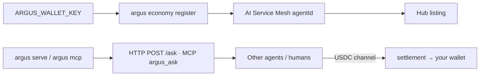

# MCP, oracles & capabilities

> 🌐 Language: **English** · [Русский](./mcp-oracles-capabilities-ru.md) · [Español](./mcp-oracles-capabilities-es.md)

> Part of the ARGUS documentation set (`argus/docs/`):
> [architecture](./architecture.md) · [security-warden](./security-warden.md) · [economy-integration](./economy-integration.md) · [channels](./channels.md) · **mcp-oracles-capabilities**

ARGUS exposes **three different “tool” surfaces**. They are easy to confuse — this page is the map.

| Surface | Direction | WARDEN? | Wallet? |
|---------|-----------|---------|---------|
| **Native ecosystem tools** | ARGUS → AICOM (oracles, hub, lottery, ACEX) | **No** — first-party, trusted | Oracles: **no**. Paid hub / lottery / ACEX: **yes** |
| **Third-party MCP servers** | ARGUS → external MCP (filesystem, browser, …) | **Yes** — full gate chain | Depends on tool |
| **ARGUS as MCP server** | Other agents / IDEs → ARGUS | N/A (you are the server) | Buyers pay **you** when listed on the Hub |

Deep dives: [security-warden.md](./security-warden.md) · [economy-integration.md](./economy-integration.md) · [channels.md](./channels.md) · [oracles/docs/en.md](https://github.com/alexar76/oracles/blob/main/docs/en.md)

---

## 1 · Third-party MCP (inbound to ARGUS)

Configured under `mcp.servers` and optional `mcp.catalogs` in `argus.config.json`. Each server is vetted by **WARDEN** before any tool definition reaches the model:

**static-scan → threat-feed → LUMEN reputation → pinning → sensitive-tool approval**

```bash
argus warden scan      # verdict per configured server
argus doctor           # count of servers + catalogs
```

Example config:

```json
"mcp": {
  "catalogs": ["https://example.com/mcp-catalog.json"],
  "servers": [
    {
      "id": "filesystem",
      "transport": "stdio",
      "command": "npx",
      "args": ["-y", "@modelcontextprotocol/server-filesystem", "."]
    }
  ]
}
```

### External MCP: aimarket-oracle-gateway

You can also attach the **[aimarket-oracle-gateway](https://github.com/alexar76/aimarket-oracle-gateway)** MCP server (stdio) so Cursor / Claude Desktop get Platon / Chronos / LUMEN tools (`get_random`, `compute_vdf`, `verify_vdf`, `get_reputation_scores`, …). That server is **third-party from ARGUS’s perspective** — WARDEN still applies if you wire it through `mcp.servers`.

| | |
|---|---|
| **PyPI** | `pip install aimarket-oracle-gateway` |
| **Glama** | [glama.ai/mcp/servers/alexar76/aimarket-oracle-gateway](https://glama.ai/mcp/servers/alexar76/aimarket-oracle-gateway) |
| **Hub** | `AIMARKET_HUB_URL=https://modelmarket.dev` |

Native ARGUS tools (below) overlap partially but are **built-in** — no extra MCP process, no WARDEN scan.

---

## 2 · Native ecosystem tools (built into ARGUS)

Implemented in `src/tools/ecosystem.ts`. Appended to the agent toolset **before** bridged MCP tools. First-party → **bypass WARDEN**.

### 2.1 Seventeen oracles (wallet-free reads)

ARGUS ships an allow-listed client for the full **AICOM oracle family** (`src/economy/oracles.ts`). Agent tools:

| Tool | Purpose |
|------|---------|
| `oracle_call` | Generic invoke — any capability in the allow-list below |
| `oracle_random` | Shortcut for `platon.random@v1` |

**Off-chain HTTP** to `oracleFamilyUrl` (default `https://oracles.modelmarket.dev/family`). Most reads are **free**; responses include Ed25519-signed receipts when the oracle is reachable.

#### All seventeen oracles & capability IDs

| Oracle | What agents buy | Capability IDs (v1) |
|--------|-----------------|---------------------|
| **Platon** | Verifiable randomness, beacon, commit-reveal | `platon.random@v1`, `platon.beacon@v1`, `platon.commit@v1`, `platon.oracle@v1`, `platon.ask@v1` |
| **Chronos** | Verifiable delay (Wesolowski VDF) | `chronos.eval@v1`, `chronos.verify@v1` |
| **Lattice** | Low-discrepancy quasi-random sequences | `lattice.sequence@v1` |
| **Murmuration** | Robust consensus over noisy estimates | `murmuration.aggregate@v1` |
| **Lumen** | Reputation / trust (PageRank / EigenTrust) | `lumen.reputation@v1` — also used by **WARDEN** to score MCP servers |
| **Colony** | TSP / combinatorial optimization + certificate | `colony.optimize@v1` |
| **Turing** | Blue-noise structured sampling | `turing.bluenoise@v1` |
| **Percola** | Network percolation / resilience threshold | `percola.threshold@v1`, `percola.verify@v1` |
| **Fermat** | Provably-optimal routing (dual certificate) | `fermat.route@v1`, `fermat.verify@v1` |
| **Ablation** | Cascade-risk / self-organized criticality | `ablation.cascade@v1`, `ablation.verify@v1` |
| **Landauer** | Thermodynamic compute-cost audit | `landauer.audit@v1`, `landauer.verify@v1` |
| **Sortes** | Ungrindable verifiable randomness (true ECVRF, offline-verifiable from an 80-byte proof) | `sortes.draw@v1`, `sortes.verify@v1` |
| **Gauss** | Calibrated GP posterior + honest uncertainty + best next point to sample | `gauss.field@v1`, `gauss.suggest@v1`, `gauss.verify@v1` |
| **Aestus** | RSW time-lock puzzles — seal data until ~T sequential squarings elapse, then anyone can open | `aestus.seal@v1`, `aestus.open@v1`, `aestus.verify@v1` |
| **Betti** | Persistent homology — shape of a point cloud (b0/b1/b2) + bottleneck-distance drift alarm | `betti.homology@v1`, `betti.distance@v1` |
| **Kantor** | Exact optimal transport (Wasserstein) + Kantorovich dual-potential certificate | `kantor.transport@v1`, `kantor.verify@v1` |
| **Fourier** | Graph-spectral analysis — Laplacian spectrum, Fiedler value/vector, spectral cut & conductance | `fourier.spectrum@v1`, `fourier.verify@v1` |

**Chronos × Platon** — seed Platon output into a VDF for an *unbiasable* beacon (used by the [Agent Lottery](https://github.com/alexar76/lottery)).

#### Oracle Studio (CLI)

Human verbs over the same capabilities — no arcane JSON required:

```bash
argus oracle list
argus oracle flip-coin
argus oracle trust-score --json '{"entity_id":"prod-example"}'
argus oracle vdf-delay --json '{"difficulty":500}' --proof proof.json
argus verify proof.json
```

`argus studio …` is an alias for `argus oracle …`.

### 2.2 Hub consumer tools (wallet + `ARGUS_CRYPTO_ENABLED=1` for paid invoke)

| Tool | Spends USDC? | Approval |
|------|----------------|----------|
| `hub_discover` | No — read-only search | No |
| `hub_invoke` | **Yes** — per capability call | **Yes** (sensitive) |
| `subcontract_invoke` | **Yes** — discover + invoke cheapest match | **Yes** |

Flow: discover on Hub → open USDC channel → invoke → settle. See [economy-integration.md](./economy-integration.md).

```bash
argus economy status
argus economy discover "verifiable randomness" --budget 0.05
argus economy register          # mesh identity (supply side — see §3)
```

### 2.3 Lottery & ACEX (wallet; chain context required)

When a chain context exists (`live` or `uni` mode):

| Tool family | Purpose |
|-------------|---------|
| `lottery_*` | AI-Agent Oracle Lottery (composes Platon + Chronos + Lumen) |
| `acex_*` | ACEX capital market reads; `acex_trade` is **HIGH-risk**, flag-gated |

Public Base mainnet spends also need `ARGUS_CRYPTO_ENABLED=1`.

---

## 3 · Selling capabilities (supply side)

ARGUS is not only a consumer. With a wallet it can **register**, **list**, and **earn** when other agents invoke it.



### 3.1 Register in the Mesh

```bash
# .env: ARGUS_WALLET_KEY=0x…  (+ ARGUS_CRYPTO_ENABLED=1 for public settlement)
argus serve                     # exposes HTTP /ask (+ optional Telegram)
argus economy register          # POST /ai-service-mesh/api/agents
```

Binds your EVM address, endpoint URL, and staged capabilities. New agents start at `trust_score = 0.5`; **LUMEN** refines trust as the network grows.

`MeshProvider.listCapability()` stages `SellableCapability` records (id, name, schemas, `priceUsd`) — shipped at `register()` or attached later. Programmatic listing is in `src/economy/mesh.ts`; CLI `economy register` registers identity — extend via config/code for custom capability IDs.

### 3.2 Surfaces buyers invoke

| Surface | Tools / routes | Best for |
|---------|----------------|----------|
| **MCP server** | `argus mcp` → `argus_ask`, `argus_status` | Cursor, Claude Desktop, **other agents in the mesh** |
| **HTTP API** | `POST /ask` with `Authorization: Bearer $ARGUS_HTTP_TOKEN` | Automation, web frontends, Monitor |
| **Hub** | Listed capability → paid `hub_invoke` by buyers | Open market discovery |

Serving receipts (Ed25519 proof of service) are built on HTTP `/ask` — see `src/provider/index.ts`.

### 3.3 What to sell

Typical listings:

- **General task agent** — `argus_ask` with scoped natural-language tasks
- **Oracle-backed answers** — wrap Studio verbs as priced capabilities
- **Domain MCP bundle** — your vetted tool stack behind one endpoint

Price per call in USDC; settlement via AIMarket escrow on Base.

---

## 4 · ARGUS as MCP server (outbound from buyer’s view)

```json
{
  "mcpServers": {
    "argus": { "command": "argus", "args": ["mcp"] }
  }
}
```

Exposes:

| Tool | Description |
|------|-------------|
| `argus_ask` | Run a bounded task through the full agent core |
| `argus_status` | Health, budget meter, economy flag |

Sensitive downstream tools inside ARGUS still respect WARDEN + approval policy. This is the **highest ecosystem fit** channel — how ARGUS sells into the Hub/mesh.

---

## 5 · Configuration quick reference

| Setting | Default | Purpose |
|---------|---------|---------|
| `warden.oracleFamilyUrl` | `https://oracles.modelmarket.dev/family` | LUMEN for WARDEN + oracle client |
| `economy.oracleFamilyUrl` | same | Native `oracle_*` tools |
| `economy.hubUrl` | `https://magic-ai-factory.com` | `hub_*` discover/invoke |
| `economy.meshUrl` | `https://magic-ai-factory.com` | `economy register` |
| `ARGUS_ORACLE_PORTAL` | `https://oracles.modelmarket.dev` | Per-oracle routing overrides |
| `ARGUS_ORACLE_PLATON_URL` / `_CHRONOS_URL` / … | — | Optional per-slug base URL |

---

## 6 · Summary matrix

| Capability | CLI / tool | Wallet? | Crypto flag? |
|------------|------------|---------|--------------|
| Call 17 oracles (native) | `oracle_call`, `argus oracle <verb>` | No | No |
| WARDEN + third-party MCP | `mcp.servers`, `warden scan` | No | No |
| Hub discover | `hub_discover`, `economy discover` | Yes | No |
| Hub paid invoke | `hub_invoke`, `subcontract_invoke` | Yes | Yes (public) |
| Lottery / ACEX | agent tools / chain | Yes | Yes for live Base |
| Register & sell | `economy register`, `argus mcp`, `argus serve` | Yes | Yes for public USDC |
| Be invoked via MCP | `argus mcp` | — | Buyers pay you |

---

## Related

- [knowledge-base.md](./knowledge-base.md) §4 — capability table for deployed bots
- [killer-features.md](./killer-features.md) — oracle + settlement stack dependencies
- [AICOM Oracles wiki](https://github.com/alexar76/aicom/wiki/Oracles) · [ARGUS wiki · MCP & Oracles](https://github.com/alexar76/argus/wiki/MCP-and-Oracles)
