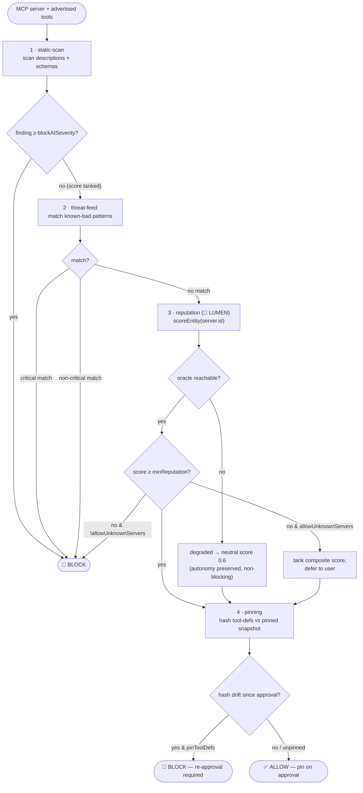
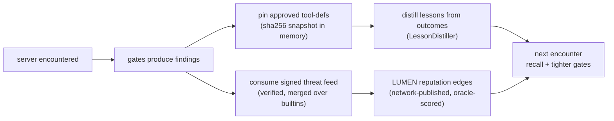

# 🛡️ WARDEN — el firewall MCP

> 🌐 Idiomas: [English](./security-warden.md) · [Русский](./security-warden-ru.md) · **Español**

> Parte del conjunto de documentación de ARGUS (`argus/docs/`):
> [architecture](./architecture.md) · **security-warden** · [economy-integration](./economy-integration.md) · [token-economy](./token-economy.md) · [autonomy](./autonomy.md)

Los servidores MCP son código de terceros que inyecta **texto controlable por un atacante**
(nombres de herramientas, descripciones, esquemas de entrada) directamente en el contexto
del modelo como instrucciones de confianza, y luego ejecuta herramientas en la máquina y
la cartera del usuario. WARDEN es la puerta que cada servidor MCP debe cruzar antes de que
un solo token de sus definiciones de herramientas llegue al modelo o se ejecute una sola
herramienta.

WARDEN forma parte de la Capa 4 en la [arquitectura](./architecture.md#the-five-layers)
y funciona completamente offline — su única entrada adyacente a la economía, la reputación
LUMEN, degrada a neutral en lugar de fallar cerrado.

---

## Modelo de amenazas

| Amenaza | Cómo se ve | Puerta que la detecta |
|---------|------------|----------------------|
| **Envenenamiento de herramientas / prompt injection** | Directivas imperativas ocultas en la *descripción* de una herramienta o esquema («ignore previous instructions», etiquetas `<system>`, «do not tell the user»). | static-scan |
| **Rug-pull / deriva de tool-def** | Un servidor anuncia herramientas benignas al aprobar, luego intercambia silenciosamente una definición envenenada. | pinning |
| **Sombreado entre servidores** | La descripción de una herramienta intenta redirigir u anular las herramientas de otro servidor («instead of X, call Y»). | static-scan (firmas de inyección) + pinning por servidor |
| **Exfiltración silenciosa** | Descripciones que instruyen al modelo a POST/forward/upload resultados a una URL externa. | static-scan (firmas de exfil) + `EgressGuard` en runtime |
| **Recolección de secretos / credenciales** | Campos de esquema o prosa que piden API keys, claves privadas, frases semilla, `.env`, `~/.ssh`. | static-scan (firmas de secretos) + builtins de threat-feed |
| **Actor conocido malo** | Un servidor que coincide con un patrón malicioso conocido (lectura de clave SSH, `rm -rf`, fork bomb, crypto-drainer, typosquat). | threat-feed |
| **Reputación baja/inexistente** | Un servidor de aspecto *limpio* sin confianza en la red. | reputation (LUMEN) |

---

## La cadena de puertas

Las puertas se ejecutan en orden. Cada una devuelve findings más un score por puerta en `[0,1]`;
una puerta puede declararse **fatal** para cortocircuitar y bloquear inmediatamente.
El veredicto compuesto solo permite si no se disparó ningún bloqueo fatal y ningún finding
alcanza `policy.blockAtSeverity`.



`sandbox.ts` aplica dos complementos en runtime a la cadena: `classifyTools()`
marca herramientas que coinciden con `sensitiveToolPatterns` como que requieren
aprobación, y `EgressGuard` aplica una allowlist de hosts salientes para que una
herramienta que se coló aún no pueda exfiltrar a un host arbitrario.

---

## Por qué la reputación del oracle supera a las blocklists

Una blocklist estática solo conoce a los actores malos que alguien ya catalogó. Es
ciega ante un servidor malicioso recién publicado y de aspecto limpio, y es una lista
curada única en la que cada defensor debe confiar y mantener al día.

La puerta de reputación consulta al **LUMEN oracle** (🔮 PageRank / EigenTrust sobre
el grafo de confianza del service mesh) la posición del servidor. Es confianza *ganada,
verificable y derivada de la red*:

- **Detecta la novedad.** Un servidor envenenado completamente nuevo no tiene aristas
  de confianza entrantes, así que obtiene un score bajo aunque ninguna blocklist haya
  oído hablar de él.
- **Verificable, no afirmada.** Cada resultado `lumen.reputation@v1` viaja en un
  receipt firmado de oracle-core cuyo `input_hash` compromete el grafo exacto puntuado,
  así que cualquiera puede re-ejecutar la power-iteration de PageRank y reproducir el
  score en lugar de aceptarlo por fe.
- **Difícil de falsificar.** Falsificar un score alto significa fabricar aristas de
  confianza desde nodos reputables en una red oracle con una capa de settlement debajo —
  no editar un archivo de texto. La replicación requiere la misma red oracle y capa
  de settlement.

El threat-feed (blocklist) y la reputación son complementarios: el feed responde
*«¿es este un actor malo conocido?»*; la reputación responde *«¿tiene este servidor
alguna posición en absoluto?»*. WARDEN ejecuta ambos.

Críticamente, la reputación es **consultiva para la autonomía**: si LUMEN no es
alcanzable, la puerta devuelve un score neutral `degraded` (`0.6`) y un finding info
`REPUTATION_UNAVAILABLE`, nunca un bloqueo. Ver [autonomy.md](./autonomy.md#the-two-switches).

---

## WardenPolicy

Definida en `src/types.ts` (`WardenPolicy`), valores por defecto en `src/config.ts`, y
sobrescribible en `argus.config.json` bajo `warden`.

| Campo | Tipo | Por defecto | Significado |
|-------|------|-------------|-------------|
| `minReputation` | `number` (0..1) | `0.25` | Servidores con score LUMEN por debajo se marcan; fatal solo cuando `allowUnknownServers` es `false`. |
| `blockAtSeverity` | `Severity` | `"high"` | Cualquier finding en o por encima de esta severity bloquea toda la conexión. |
| `sensitiveToolPatterns` | `string[]` | `["*delete*","*write*","*exec*","*shell*","*payment*","*transfer*","*email*","*send*"]` | Patrones glob para herramientas que siempre requieren aprobación explícita por llamada del usuario. |
| `allowUnknownServers` | `boolean` | `true` | Permitir conectar a servidores sin reputación aún (scores bajos hunden el compuesto pero difieren al usuario en lugar de hard-block). Establecer `false` para fail-closed. |
| `pinToolDefs` | `boolean` | `true` | Requerir re-aprobación cuando cambia el hash de tool-def tras el pinning (defensa rug-pull). |

`threatFeedUrl` (opcional, de `ARGUS_THREAT_FEED_URL`) y `oracleFamilyUrl`
(endpoint LUMEN) están en `WardenConfig` junto a la policy.

---

## El bucle de seguridad auto-aprendizaje — alcance honesto

WARDEN mejora con el tiempo mediante **mecanismos acotados y testeables** — no un
agente que «recorre internet». Concretamente:



Qué significa y qué no significa:

- **Threat feed es solo pull y firmado.** ARGUS obtiene un feed al que *tú* lo
  apuntas; la deny-list integrada es el piso y una caída del feed, non-200 o payload
  malformado se traga en silencio (`ThreatFeed.load`) para que las herramientas de
  seguridad nunca derriben una conexión ni debiliten los builtins.
- **Las aristas de reputación se publican en la red, no se auto-afirman.** La confianza
  viene del grafo puntuado de LUMEN, con `graph_commitment` para verificación. ARGUS
  lee scores; no puede acuñar su propia confianza.
- **Los pins son locales y deterministas.** Un sha256 sobre el conjunto canónico de
  tool-def (sorted, key-stable) detecta deriva; nada sale de la máquina.
- **Las lessons están acotadas.** `LessonDistiller` deduplica por topic y limita
  lessons nuevas por run — acumula consejo recuperable, no toca pesos del modelo.

Todo aquí es determinista y testeable con unit tests. No hay rastreo autónomo de red,
no hay policy auto-modificante, no hay proceso en background ilimitado.

---

## Códigos de findings

`WardenFinding.code` es un código de máquina estable (ver `src/types.ts`). Códigos por puerta:

| Código | Puerta | Severity (típica) | Significado |
|--------|--------|-------------------|-------------|
| `TOOL_DEF_INJECTION` | static-scan | medium–critical | Directiva imperativa/de inyección en descripción o esquema («ignore previous», `<system>`, «do not tell the user»). |
| `TOOL_DEF_EXFIL` | static-scan | high–critical | Frases que instruyen al modelo a send/post/upload resultados a un destino externo. |
| `TOOL_DEF_SECRET_REQUEST` | static-scan | medium–critical | Pide API keys, claves privadas, frases semilla, contraseñas, `.env` o `~/.ssh`. |
| `TOOL_DEF_DATA_URL` | static-scan | high | Esquema URL `data:…;base64,` o `javascript:` embebido en texto. |
| `TOOL_DEF_BASE64_BLOB` | static-scan | high | Fragmento largo tipo base64 — posible payload oculto / instrucciones codificadas. |
| `TOOL_DEF_HIDDEN_UNICODE` | static-scan | high | Caracteres zero-width / bidi / BOM que ocultan texto de revisión humana. |
| `THREAT_SSH_KEY_READ` | threat-feed | critical | El servidor referencia `~/.ssh` o `id_rsa`. |
| `THREAT_DESTRUCTIVE_CMD` | threat-feed | critical | Comando realiza borrado recursivo destructivo (`rm -rf`). |
| `THREAT_FORK_BOMB` | threat-feed | critical | Comando contiene shell fork bomb. |
| `THREAT_CRYPTO_DRAINER` | threat-feed | critical | Palabra clave wallet-drainer / fund-sweep en identidad del servidor. |
| `THREAT_SEED_PHRASE` | threat-feed | high | Referencias a frases semilla de cartera. |
| `THREAT_ENV_EXFIL` | threat-feed | critical | Referencias a exfiltrar archivos de entorno. |
| `THREAT_TYPOSQUAT` | threat-feed | medium–high | Nombre imita un servidor de referencia oficial (`offical-mcp`, `filesytem`, …). |
| `REPUTATION_OK` | reputation | info | Score LUMEN cumple `minReputation`. |
| `REPUTATION_LOW` | reputation | high | Score LUMEN por debajo de `minReputation` (fatal cuando `allowUnknownServers` es `false`). |
| `REPUTATION_UNAVAILABLE` | reputation | info | Oracle inalcanzable; se procede con score neutral, autonomía preservada. |
| `TOOL_DEF_UNPINNED` | pinning | info | Primer contacto — aún no hay snapshot; se fijará al aprobar. |
| `TOOL_DEF_DRIFT` | pinning | high | Tool-defs cambiaron desde la aprobación; posible rug-pull, re-aprobación requerida (fatal cuando `pinToolDefs` es `true`). |

Las severity se ordenan `info < low < medium < high < critical`; la puerta static-scan
puntúa `1 − penalty(worst severity)`, así que un solo finding hunde el score sin
necesariamente cortar la conexión.

## Cartera en reposo: el vault cifrado

WARDEN defiende el *runtime*; el **keystore vault** defiende el *secreto de la cartera*
en reposo. Cuando crypto está habilitado, ARGUS necesita una clave privada — y el peor
lugar para ella es un `ARGUS_WALLET_KEY` en texto plano en `.env`, donde cualquier backup,
log scrape o shoulder-surf la filtra para siempre.

El vault almacena seed + key cifrados con **AES-256-GCM** bajo una clave derivada de
una passphrase vía **scrypt** (`N=2¹⁵, r=8, p=1`). El texto plano nunca se escribe a
disco: se descifra en memoria solo cuando se necesita una cartera, y solo se expone la
dirección pública.

```
argus keystore create            # new seed, or --import an existing one
argus keystore address           # print the public address (never the secret)
```

- Archivo: `~/.argus/keystore.json`, escrito **mode 600**. Solo contiene ciphertext GCM,
  salt, IV, auth tag y (como conveniencia) la dirección pública.
- Desbloqueo: establecer `ARGUS_KEYSTORE_PASSPHRASE` (env var o secret manager) en runtime.
  `.env` entonces solo tiene la passphrase, no la clave.
- **Fail-safe by design:** passphrase incorrecta/ausente, o archivo manipulado (fallo auth GCM),
  deja la cartera *bloqueada* — `resolveWalletKey()` devuelve `undefined` y la economía
  simplemente permanece **off**. ARGUS nunca crashea y nunca recurre a una clave sin protección.
- **Orden de resolución:** vault (descifrado) → `ARGUS_WALLET_KEY` en texto plano (dev /
  legacy). El vault siempre gana cuando está presente.
- `argus doctor` reporta el estado de almacenamiento de la cartera: `🔒 encrypted vault`,
  `vault — LOCKED`, `⚠ plaintext`, o `none`.

Para migración de servidor no interactiva, `argus keystore create` corre headless desde
`ARGUS_KEYSTORE_PASSPHRASE` + `ARGUS_WALLET_MNEMONIC`/`ARGUS_WALLET_KEY`; elimina las
vars en texto plano de `.env` después.

> El vault importa incluso con WARDEN: WARDEN detiene a un *servidor MCP malicioso*
> pidiendo tu seed, pero no puede proteger una clave que dejaste en texto plano en disco.
> Los dos son complementarios — uno guarda la puerta principal, el otro la caja fuerte.

---

## Limitaciones (honestas) — aún no es un firewall de producción

La revisión externa (~7.5/10) es justa: WARDEN es **fuerte contra el envenenamiento MCP
de manual**, pero **dos meses son insuficientes** para ataques sofisticados y dirigidos.
Rastreado como Factory [KI-9](../../docs/known-issues.md#ki-9--argus-warden-vs-sophisticated-mcp-attacks).

| Brecha | Qué puede salir mal | Mitigación hoy |
|--------|---------------------|----------------|
| **Inyección ofuscada** | Homoglyphs Unicode, zero-width joins, base64 en descripciones de esquema pueden evadir firmas estáticas | Aprobación humana en herramientas sensibles; endurecer `blockAtSeverity`; fixtures red-team en CI |
| **Deriva post-aprobación** | Pinning detecta cambio de hash de tool-def — no **cambio de comportamiento** con el mismo hash (binario malicioso del servidor) | Re-vet periódico; preferir versiones fijadas del servidor; ejecutar MCP en sandbox |
| **Bypass del lado del modelo** | WARDEN limpia *definiciones* de herramientas; el **LLM** aún puede seguir poison en contenido de usuario o turnos previos | ARGUS system prompt + budget limits; no tratar el vet como cura total de prompt injection |
| **Exfil solo en runtime** | Herramienta limpia al vet time, exfiltra por red al invocar | Allowlist `EgressGuard`; bloquear `*fetch*` a hosts desconocidos |
| **LUMEN inalcanzable** | Puerta reputation → **neutral 0.6** (autonomía preservada, no fail-closed) | Establecer `allowUnknownServers: false` para alta seguridad; requerir alcanzabilidad LUMEN |
| **Servidores desconocidos permitidos** | Policy por defecto puede permitir servidores de baja reputación con advertencia | Preset alta seguridad: denegar unknown + requerir aprobación de pin |
| **Cadenas multi-hop** | Salida del servidor A alimenta servidor B; ataque compuesto abarca herramientas | Limitar MCP fan-out; WARDEN por servidor, no análisis de composición cross-chain |

**Perfil de alta seguridad (operador):**

```json
{
  "warden": {
    "allowUnknownServers": false,
    "minReputation": 0.5,
    "blockAtSeverity": "medium",
    "pinToolDefs": true
  }
}
```

**Corpus red-team:** `argus/test/adversarial-warden.test.ts` — documenta al menos una clase
de evasión conocida; expandir bajo KI-9.

**Public MCP benchmark (2026-07-16):** [EN](./warden-scan-report.md) · [RU](./warden-scan-report-ru.md) · [ES](./warden-scan-report-es.md) — 10 servers,
one row each (8 allow · 1 blocked · 1 unreachable).

Ver también [`docs/ecosystem-maturity-review.en.md`](../../docs/ecosystem-maturity-review.en.md).
