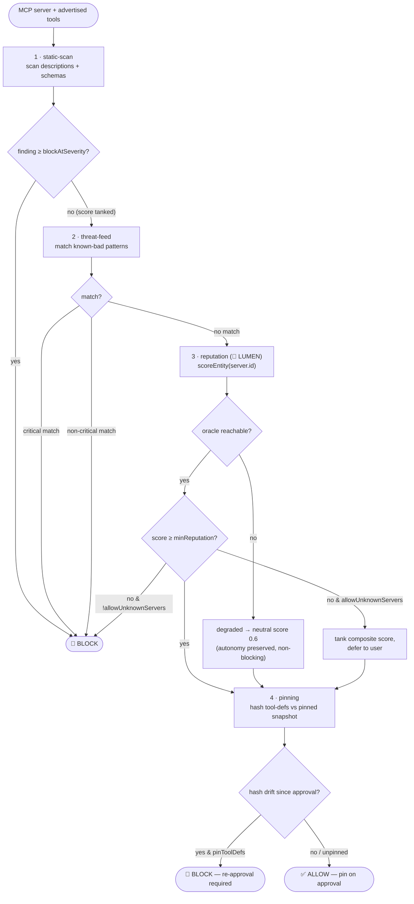
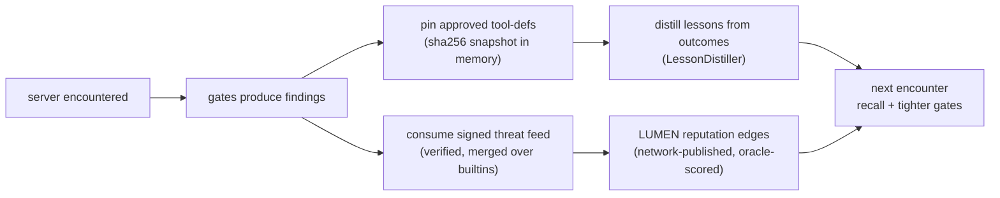

# 🛡️ WARDEN — MCP-файрвол

> 🌐 Язык: [English](./security-warden.md) · **Русский** · [Español](./security-warden-es.md)

> Часть набора документации ARGUS (`argus/docs/`):
> [architecture](./architecture.md) · **security-warden** · [economy-integration](./economy-integration.md) · [token-economy](./token-economy.md) · [autonomy](./autonomy.md)

MCP-серверы — это сторонний код, который внедряет **управляемый атакующим текст**
(имена инструментов, описания, схемы ввода) прямо в контекст модели как
доверенные инструкции, а затем выполняет инструменты на машине и в кошельке
пользователя. WARDEN — это шлюз, который должен пройти каждый MCP-сервер, прежде
чем хотя бы один токен его определений инструментов попадёт в модель или
выполнится хотя бы один инструмент.

WARDEN входит в Слой 4 [архитектуры](./architecture.md#the-five-layers)
и работает полностью офлайн — его единственный вход, связанный с экономикой,
репутация LUMEN, деградирует до нейтрального значения, а не блокирует работу.

---

## Модель угроз

| Угроза | Как выглядит | Шлюз, который её перехватывает |
|--------|--------------|--------------------------------|
| **Отравление инструментов / prompt injection** | Императивные директивы, скрытые в *описании* инструмента или схеме («ignore previous instructions», теги `<system>`, «do not tell the user»). | static-scan |
| **Rug-pull / дрифт определений инструментов** | Сервер рекламирует безобидные инструменты при одобрении, затем тихо подменяет их отравленным определением. | pinning |
| **Межсерверное затенение** | Описание инструмента одного сервера пытается перенаправить или переопределить инструменты другого сервера («instead of X, call Y»). | static-scan (сигнатуры инъекций) + pinning на сервер |
| **Тихая эксфильтрация** | Описания, инструктирующие модель POST/forward/upload результатов на внешний URL. | static-scan (сигнатуры эксфильтрации) + `EgressGuard` в runtime |
| **Сбор секретов / учётных данных** | Поля схемы или текст, запрашивающие API-ключи, приватные ключи, seed-фразы, `.env`, `~/.ssh`. | static-scan (сигнатуры секретов) + встроенные правила threat-feed |
| **Известный злоумышленник** | Сервер, совпадающий с известным вредоносным паттерном (чтение SSH-ключей, `rm -rf`, fork bomb, crypto-drainer, typosquat). | threat-feed |
| **Низкий/отсутствующий рейтинг** | Визуально «чистый» сервер без доверия в сети. | reputation (LUMEN) |

---

## Цепочка шлюзов

Шлюзы выполняются по порядку. Каждый возвращает findings и per-gate score в `[0,1]`;
шлюз может объявить себя **fatal**, чтобы немедленно прервать и заблокировать.
Составной вердикт разрешает подключение только если не сработала fatal-блокировка
и ни одно finding не достигает `policy.blockAtSeverity`.



`sandbox.ts` обеспечивает два runtime-дополнения к цепочке: `classifyTools()`
помечает инструменты, совпадающие с `sensitiveToolPatterns`, как требующие
одобрения, а `EgressGuard` применяет allowlist исходящих хостов, чтобы
инструмент, проскочивший через шлюзы, всё равно не мог эксфильтрировать данные
на произвольный хост.

---

## Почему репутация oracle лучше blocklist

Статический blocklist знает только злоумышленников, уже занесённых в каталог.
Он слеп к свежевыпущенному, визуально чистому вредоносному серверу и представляет
собой единый курируемый список, которому каждый защитник должен доверять и
который нужно постоянно обновлять.

Шлюз reputation запрашивает у **LUMEN oracle** (🔮 PageRank / EigenTrust по
графу доверия service mesh) рейтинг сервера. Это *заработанное, верифицируемое,
сетевое* доверие:

- **Ловит новизну.** Совершенно новый отравленный сервер не имеет входящих
  рёбер доверия, поэтому получает низкий score, даже если blocklist о нём не
  слышал.
- **Верифицируемо, а не декларируется.** Каждый результат `lumen.reputation@v1`
  сопровождается подписанным receipt oracle-core, чей `input_hash` фиксирует
  точный граф, по которому считался score, — любой может перезапустить
  power-iteration PageRank и воспроизвести score, а не принимать его на веру.
- **Сложно подделать.** Подделка высокого score означает создание рёбер доверия
  от репутабельных узлов в oracle-сети со слоем settlement под ней — а не
  редактирование текстового файла. Репликация требует той же oracle-сети и
  settlement layer.

Threat-feed (blocklist) и reputation дополняют друг друга: feed отвечает на
вопрос *«это известный злоумышленник?»*; reputation — *«есть ли у этого сервера
хоть какой-то рейтинг?»*. WARDEN запускает оба.

Критически важно: reputation **консультативен для автономности**: если LUMEN
недоступен, шлюз возвращает `degraded` нейтральный score (`0.6`) и info-finding
`REPUTATION_UNAVAILABLE`, но никогда не блокирует. См. [autonomy.md](./autonomy.md#the-two-switches).

---

## WardenPolicy

Определена в `src/types.ts` (`WardenPolicy`), значения по умолчанию в `src/config.ts`,
переопределяется в `argus.config.json` в секции `warden`.

| Поле | Тип | По умолчанию | Значение |
|------|-----|--------------|----------|
| `minReputation` | `number` (0..1) | `0.25` | Серверы с LUMEN score ниже этого помечаются; fatal только когда `allowUnknownServers` = `false`. |
| `blockAtSeverity` | `Severity` | `"high"` | Любое finding на этой severity или выше блокирует всё подключение. |
| `sensitiveToolPatterns` | `string[]` | `["*delete*","*write*","*exec*","*shell*","*payment*","*transfer*","*email*","*send*"]` | Glob-паттерны для инструментов, всегда требующих явного per-call одобрения пользователя. |
| `allowUnknownServers` | `boolean` | `true` | Разрешить подключение к серверам без репутации (низкие scores снижают composite, но решение откладывается пользователю вместо hard-block). Установите `false` для fail-closed. |
| `pinToolDefs` | `boolean` | `true` | Требовать повторное одобрение при изменении hash определений инструментов после pinning (защита от rug-pull). |

`threatFeedUrl` (опционально, из `ARGUS_THREAT_FEED_URL`) и `oracleFamilyUrl`
(LUMEN endpoint) находятся в `WardenConfig` рядом с policy.

---

## Петля самообучения безопасности — честно об ограничениях

WARDEN улучшается со временем через **ограниченные, тестируемые механизмы** — не
через агента, который «бродит по интернету». Конкретно:



Что это означает и что не означает:

- **Threat feed — только pull и подписан.** ARGUS загружает feed, на который
  *вы* указываете; встроенный deny-list — это пол, а сбой feed, non-200 или
  malformed payload проглатываются молча (`ThreatFeed.load`), чтобы security-
  инструменты никогда не роняли подключение и не ослабляли builtins.
- **Рёбра репутации публикуются сетью, а не самоутверждаются.** Доверие приходит
  из scored-графа LUMEN с `graph_commitment` для верификации. ARGUS читает
  scores; он не может чеканить собственное доверие.
- **Pins локальны и детерминированы.** sha256 по каноническому набору tool-def
  (sorted, key-stable) обнаруживает дрифт; ничего не покидает машину.
- **Lessons ограничены.** `LessonDistiller` дедуплицирует по topic и ограничивает
  число новых lessons за run — накапливает извлекаемые советы, не трогая веса
  модели.

Всё здесь детерминировано и покрыто unit-тестами. Нет автономного сетевого
сканирования, нет самомодифицирующейся policy, нет неограниченного фонового
процесса.

---

## Коды findings

`WardenFinding.code` — стабильный машинный код (см. `src/types.ts`). Коды по шлюзам:

| Код | Шлюз | Severity (типичная) | Значение |
|-----|------|---------------------|----------|
| `TOOL_DEF_INJECTION` | static-scan | medium–critical | Императивная/injection-директива в описании или схеме («ignore previous», `<system>`, «do not tell the user»). |
| `TOOL_DEF_EXFIL` | static-scan | high–critical | Формулировки, инструктирующие модель send/post/upload результатов на внешний адрес. |
| `TOOL_DEF_SECRET_REQUEST` | static-scan | medium–critical | Запрос API-ключей, приватных ключей, seed-фраз, паролей, `.env` или `~/.ssh`. |
| `TOOL_DEF_DATA_URL` | static-scan | high | URL-схема `data:…;base64,` или `javascript:` в тексте. |
| `TOOL_DEF_BASE64_BLOB` | static-scan | high | Длинный base64-подобный фрагмент — возможная скрытая нагрузка / закодированные инструкции. |
| `TOOL_DEF_HIDDEN_UNICODE` | static-scan | high | Zero-width / bidi / BOM символы, скрывающие текст от человеческого review. |
| `THREAT_SSH_KEY_READ` | threat-feed | critical | Сервер ссылается на `~/.ssh` или `id_rsa`. |
| `THREAT_DESTRUCTIVE_CMD` | threat-feed | critical | Команда выполняет деструктивное рекурсивное удаление (`rm -rf`). |
| `THREAT_FORK_BOMB` | threat-feed | critical | Команда содержит shell fork bomb. |
| `THREAT_CRYPTO_DRAINER` | threat-feed | critical | Ключевое слово wallet-drainer / fund-sweep в идентичности сервера. |
| `THREAT_SEED_PHRASE` | threat-feed | high | Ссылки на seed-фразы кошелька. |
| `THREAT_ENV_EXFIL` | threat-feed | critical | Ссылки на эксфильтрацию environment-файлов. |
| `THREAT_TYPOSQUAT` | threat-feed | medium–high | Имя имитирует официальный reference-сервер (`offical-mcp`, `filesytem`, …). |
| `REPUTATION_OK` | reputation | info | LUMEN score соответствует `minReputation`. |
| `REPUTATION_LOW` | reputation | high | LUMEN score ниже `minReputation` (fatal когда `allowUnknownServers` = `false`). |
| `REPUTATION_UNAVAILABLE` | reputation | info | Oracle недоступен; продолжаем с нейтральным score, автономность сохранена. |
| `TOOL_DEF_UNPINNED` | pinning | info | Первый контакт — snapshot ещё нет; будет закреплён при одобрении. |
| `TOOL_DEF_DRIFT` | pinning | high | Tool-defs изменились после одобрения; возможный rug-pull, требуется повторное одобрение (fatal когда `pinToolDefs` = `true`). |

Severity ранжируется `info < low < medium < high < critical`; шлюз static-scan
считает score `1 − penalty(worst severity)`, поэтому одно finding снижает score,
не обязательно разрывая подключение.

## Кошелёк в покое: зашифрованный vault

WARDEN защищает *runtime*; **keystore vault** защищает *секрет кошелька*
в покое. Когда crypto включена, ARGUS нужен приватный ключ — и худшее место
для него — plaintext `ARGUS_WALLET_KEY` в `.env`, где любой backup, log scrape
или shoulder-surf утекает навсегда.

Vault хранит seed + key, зашифрованные **AES-256-GCM** под ключом,
полученным из passphrase через **scrypt** (`N=2¹⁵, r=8, p=1`). Plaintext
никогда не записывается на диск: расшифровывается в память только когда
кошелёк реально нужен, и наружу показывается только публичный адрес.

```
argus keystore create            # new seed, or --import an existing one
argus keystore address           # print the public address (never the secret)
```

- Файл: `~/.argus/keystore.json`, запись **mode 600**. Содержит только GCM-
  ciphertext, salt, IV, auth tag и (для удобства) публичный адрес.
- Разблокировка: установите `ARGUS_KEYSTORE_PASSPHRASE` (env var или secret manager)
  в runtime. В `.env` тогда только passphrase, не ключ.
- **Fail-safe by design:** неверный/отсутствующий passphrase или подменённый
  файл (GCM auth failure) оставляет кошелёк *заблокированным* — `resolveWalletKey()`
  возвращает `undefined`, и экономика просто остаётся **выключенной**. ARGUS
  никогда не падает и никогда не откатывается к незащищённому ключу.
- **Порядок разрешения:** vault (расшифрованный) → plaintext `ARGUS_WALLET_KEY`
  (dev / legacy). Vault всегда побеждает, когда присутствует.
- `argus doctor` сообщает состояние хранения кошелька: `🔒 encrypted vault`,
  `vault — LOCKED`, `⚠ plaintext`, или `none`.

Для неинтерактивной миграции сервера `argus keystore create` работает headless
из `ARGUS_KEYSTORE_PASSPHRASE` + `ARGUS_WALLET_MNEMONIC`/`ARGUS_WALLET_KEY`;
после этого удалите plaintext vars из `.env`.

> Vault важен даже с WARDEN: WARDEN останавливает *вредоносный MCP-сервер*,
> просящий ваш seed, но не может защитить ключ, оставленный в plaintext на диске.
> Они дополняют друг друга — один охраняет парадную дверь, другой — сейф.

---

## Ограничения (честно) — пока не production firewall

Внешний обзор (~7.5/10) справедлив: WARDEN **силён против учебникового MCP poisoning**,
но **двух месяцев недостаточно** для sophisticated targeted attacks. Отслеживается как Factory
[KI-9](../../docs/known-issues.md#ki-9--argus-warden-vs-sophisticated-mcp-attacks).

| Пробел | Что может пойти не так | Митигация сегодня |
|--------|------------------------|-------------------|
| **Обфусцированная инъекция** | Unicode homoglyphs, zero-width joins, base64 в описаниях схем могут обойти static signatures | Человеческое одобрение sensitive tools; ужесточить `blockAtSeverity`; red-team fixtures в CI |
| **Дрифт после одобрения** | Pinning ловит изменение hash tool-def — но не **изменение поведения** при том же hash (вредоносный бинарник сервера) | Периодический re-vet; предпочитать pinned версии серверов; запускать MCP в sandbox |
| **Model-side bypass** | WARDEN пропускает *определения* инструментов; **LLM** всё ещё может следовать poison в user content или prior turns | ARGUS system prompt + budget limits; не считать vet panacea от prompt injection |
| **Runtime-only exfil** | Инструмент чист при vet time, эксфильтрирует по сети при invoke | `EgressGuard` allowlist; блокировать `*fetch*` на unknown hosts |
| **LUMEN недоступен** | Шлюз reputation → **neutral 0.6** (автономность сохранена, не fail-closed) | Установите `allowUnknownServers: false` для high-security; требуйте доступность LUMEN |
| **Unknown servers allowed** | Policy по умолчанию может разрешать low-reputation серверы с предупреждением | High-security preset: deny unknown + require pin approval |
| **Multi-hop chains** | Выход сервера A питает сервер B; composite attack охватывает инструменты | Ограничить MCP fan-out; WARDEN per server, не cross-chain composition analysis |

**High-security profile (оператор):**

```json
{
  "warden": {
    "allowUnknownServers": false,
    "minReputation": 0.5,
    "blockAtSeverity": "medium",
    "pinToolDefs": true
  }
}
```

**Red-team corpus:** `argus/test/adversarial-warden.test.ts` — документирует как минимум один известный
класс evasion; расширять под KI-9.

**Public MCP benchmark (2026-07-16):** [EN](./warden-scan-report.md) · [RU](./warden-scan-report-ru.md) · [ES](./warden-scan-report-es.md) — 10 servers,
one row each (8 allow · 1 blocked · 1 unreachable).

См. также [`docs/ecosystem-maturity-review.en.md`](../../docs/ecosystem-maturity-review.en.md).
