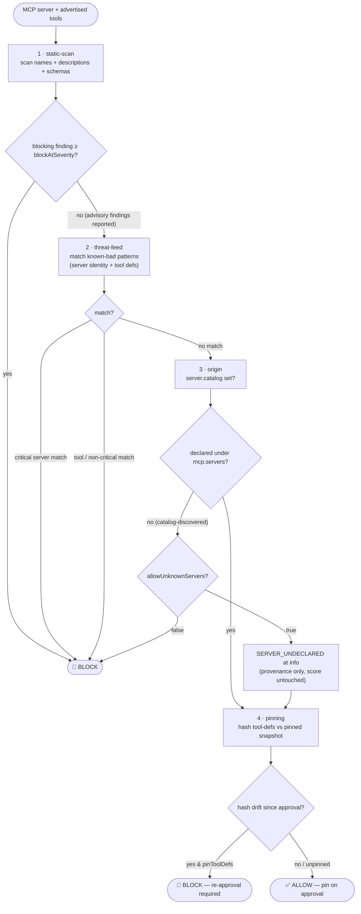
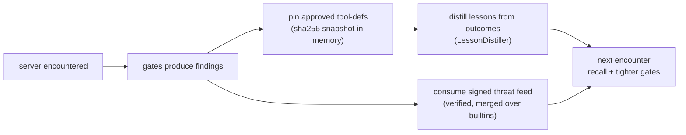

# 🛡️ WARDEN — MCP-файрвол

> 🌐 Язык: [English](./security-warden.md) · **Русский** · [Español](./security-warden-es.md)

> Часть набора документации ARGUS (`argus/docs/`):
> [architecture](./architecture.md) · **security-warden** · [economy-integration](./economy-integration.md) · [token-economy](./token-economy.md) · [autonomy](./autonomy.md)

MCP-серверы — это сторонний код, который внедряет **управляемый атакующим текст**
(имена инструментов, описания, схемы ввода) прямо в контекст модели как
доверенные инструкции, а затем выполняет инструменты на машине и в кошельке
пользователя. WARDEN — это шлюз, который должен пройти каждый MCP-сервер, прежде
чем хотя бы один токен его определений инструментов попадёт в модель или
выполнится хотя бы один инструмент.

WARDEN входит в Слой 4 [архитектуры](./architecture.md#the-five-layers)
и решает целиком по локальным данным: по заявленным определениям инструментов, по
вашей конфигурации и по pin-store. Ни один шлюз не открывает сокет во время
проверки. Единственный сетевой вход, который у него вообще может быть, — это
подписанная лента угроз, и только если вы её настроите: по умолчанию не
загружается ничего.

> **Где живёт код.** WARDEN поставляется отдельным пакетом,
> **[`@aimarket/warden`](https://github.com/alexar76/warden)** (ноль рантайм-зависимостей), и ARGUS
> зависит от него с точной версией. Этот документ описывает файрвол так, как его запускает ARGUS;
> собственная документация пакета покрывает таблицу гейтов, контракт feed и встраивание в другой
> хост.

---

## Модель угроз

| Угроза | Как выглядит | Шлюз, который её перехватывает |
|--------|--------------|--------------------------------|
| **Отравление инструментов / prompt injection** | Императивные директивы, скрытые в *описании* инструмента или схеме («ignore previous instructions», теги `<system>`, «do not tell the user»). | static-scan |
| **Rug-pull / дрифт определений инструментов** | Сервер рекламирует безобидные инструменты при одобрении, затем тихо подменяет их отравленным определением. | pinning |
| **Межсерверное затенение** | Описание инструмента одного сервера пытается перенаправить или переопределить инструменты другого сервера («instead of X, call Y»). | pinning на сервер + сигнатуры инъекций static-scan. Важно: сама формулировка «instead of» — **advisory** (`TOOL_DEF_IMPERATIVE`) и сама по себе не блокирует: это обычный английский. Блокирует перенаправление, сформулированное как указание модели. |
| **Тихая эксфильтрация** | Описания, инструктирующие модель POST/forward/upload результатов на внешний URL. | static-scan (сигнатуры эксфильтрации) + `EgressGuard` в runtime |
| **Сбор секретов / учётных данных** | Проза, инструктирующая модель *пойти и прочитать* учётные данные — «read the user's `api_key` from the `.env` file», — или схема, требующая материал, который никогда не бывает легитимным параметром: приватный ключ, seed-фразу, `~/.ssh`. | static-scan (`TOOL_DEF_SECRET_HARVEST`, `TOOL_DEF_SECRET_REQUEST`) + встроенные правила threat-feed |
| **Известный злоумышленник** | Известный вредоносный паттерн в идентичности/команде сервера (чтение SSH-ключей, `rm -rf`, fork bomb, typosquat) **или** в одном из объявленных определений инструментов (drainer-keyword, путь к учётным данным). | threat-feed |
| **Необъявленный сервер** | Визуально «чистый» сервер, который ARGUS видел только в удалённом каталоге, — локально за него ничто не поручилось. | origin |

---

## Цепочка шлюзов

Шлюзы выполняются по порядку — **static-scan → threat-feed → origin → pinning**.
Каждый возвращает findings и per-gate score в `[0,1]`; шлюз может объявить себя
**fatal**, чтобы немедленно прервать и заблокировать. Составной вердикт разрешает
подключение только если не сработала fatal-блокировка и ни одно *блокирующее*
finding не достигает `policy.blockAtSeverity`: advisory-findings сообщаются, но
никогда не учитываются (см. [block vs advise](#правила-static-scan-block-vs-advise)).


```mermaid
flowchart TD
  IN([MCP server + advertised tools]) --> SS["1 · static-scan<br/>scan names + descriptions + schemas"]
  SS --> SSF{"blocking finding ≥ blockAtSeverity?"}
  SSF -- "yes" --> BLOCK([🛑 BLOCK])
  SSF -- "no (advisory findings reported)" --> TF["2 · threat-feed<br/>match known-bad patterns<br/>(server identity + tool defs)"]
  TF --> TFF{"match?"}
  TFF -- "critical server match" --> BLOCK
  TFF -- "tool / non-critical match" --> BLOCK
  TFF -- "no match" --> ORG["3 · origin<br/>server.catalog set?"]
  ORG --> ORGD{"declared under mcp.servers?"}
  ORGD -- "yes" --> PIN["4 · pinning<br/>hash tool-defs vs pinned snapshot"]
  ORGD -- "no (catalog-discovered)" --> ORGP{"allowUnknownServers?"}
  ORGP -- "false" --> BLOCK
  ORGP -- "true" --> NOTE["SERVER_UNDECLARED at info<br/>(provenance only, score untouched)"]
  NOTE --> PIN
  PIN --> PINF{"hash drift since approval?"}
  PINF -- "yes & pinToolDefs" --> DRIFTBLOCK([🛑 BLOCK — re-approval required])
  PINF -- "no / unpinned" --> ALLOW([✅ ALLOW — pin on approval])
```

`sandbox.ts` обеспечивает два runtime-дополнения к цепочке: `classifyTools()`
помечает инструменты, совпадающие с `sensitiveToolPatterns`, как требующие
одобрения, а `EgressGuard` применяет allowlist исходящих хостов, чтобы
инструмент, проскочивший через шлюзы, всё равно не мог эксфильтрировать данные
на произвольный хост.

---

## Правила static-scan: block vs advise

У каждого правила static-scan есть **tier**, и именно tier — а не severity —
решает, может ли finding блокировать вообще:

| Tier | Что означает | Эффект |
|------|--------------|--------|
| `block` | У формулировки нет правдоподобного безобидного прочтения внутри определения инструмента. | Блокирует на `policy.blockAtSeverity`, как любое другое finding; обрушивает score шлюза. |
| `advise` | Формулировка легитимно встречается в честных определениях инструментов. | **Сообщается, никогда не блокирует и никогда не стоит инструмента (не отправляет его в `blockedTools`) — при любом `blockAtSeverity`** — и исключается из score. |

Advisory-finding передаётся «по проводу» как `WardenFinding.advisory: true`. Всё,
что потребляет findings, обязано учитывать этот флаг: фильтрация по одной только
severity будет показывать разрешённые подключения как заблокированные.

Tier сделан отдельным полем, а не низкой severity, сознательно. Severity отвечает
на вопрос *насколько это заслуживает внимания*; tier — на вопрос *дефект ли это
вообще*. Выражать «это не дефект» понижением severity значило бы, что такие
findings снова начнут блокировать в тот момент, когда оператор ужесточит порог, —
а именно это и делает оператор, заботящийся о безопасности.

**Зачем нужно разделение.** В ruleset v1 был один tier, поэтому *имя параметра* с
учётными данными весило столько же, сколько «ignore all previous instructions».
Сервер в стиле GitHub, у которого `create_issue` принимает `api_key` и упоминает
personal access token, получал score `0.40`, отправлял `create_issue` в
`blockedTools`, и всё подключение отвергалось при `blockAtSeverity: "high"` по
умолчанию. Отвергалось большинство реальных MCP-серверов — а именно так сканер и
выключают целиком. То есть сканер не «агрессивен по замыслу», он калиброван: он
блокирует то, у чего нет безобидного прочтения, а на то, что честные серверы
легитимно содержат, лишь обращает внимание.

Понижение одних только «секретных» существительных открыло бы дыру, поэтому вместе
с ним появилось новое блокирующее правило `TOOL_DEF_SECRET_HARVEST`: без него
*«read the user's api_key from the .env file»* проходило бы всякий раз, когда рядом
нет injection-фразы. **Различитель — глагол, а не существительное.** Объявить
входной параметр с учётными данными — нормально («requires a personal access token
with repo scope»); инструктировать модель пойти и прочитать такие данные — нет.

Правило эксфильтрации ужесточено тем же способом. `send|post|forward|relay … to`
теперь требует **внешнего адресата** — URL или host с точкой. Без такой привязки
оно совпадало с «Send the message to the recipient» в любом честном инструменте
для почты или webhook.

Одно правило вне static-scan тоже advisory: `TOOL_DEF_UNPINNED` (шлюз pinning).
При `blockAtSeverity: "info"` это информационное finding блокировало *любой*
сервер при первом контакте, а поскольку `Warden.approve()` выполняется только
после успешного `vet()`, pin, который снял бы проблему, невозможно было создать
никогда. Первый контакт должен оставаться возможным при любом пороге.

### Какая таблица правил дала вердикт

Один и тот же сервер получает разный score под разными таблицами правил, и без
способа назвать таблицу *«сервер стал хуже»* и *«изменились правила»*
неотличимы. Поэтому ruleset представляется сам:

- `STATIC_SCAN_RULESET_VERSION` — монотонная строка версии, увеличивается при
  **любом** изменении таблицы.
- `staticScanRuleset()` — вся таблица: `code`, `severity`, `tier`, `source` и
  `flags` регулярного выражения, чтобы третья сторона могла воспроизвести ровно
  то же правило.
- `staticScanRulesetRef()` — только идентичность: `{ version, digest }`.
- Каждый `WardenVerdict` теперь несёт `rulesets.staticScan = { version, digest }`.

Digest — это `sha256-<base64>` по **канонической форме RFC 8785**
(`@aimarket/warden/src/jcs.ts` — та же канонизация, что у подписи feed и у pin, а не вторая
сериализация) от отсортированной таблицы правил. Сортировка идёт по **кодовым
единицам**, никогда не `localeCompare`: digest — это межмашинный идентификатор, а
зависящая от локали коллация давала бы для одной и той же таблицы разный digest на
иначе сконфигурированном хосте — ровно то расхождение, для обнаружения которого
digest и существует. Читайте эту пару из вердикта или из
`staticScanRulesetRef()`, а не прописывайте её в коде; на момент написания
актуальная таблица — версия `2`, digest
`sha256-pah/sT4IeIgSUCGKcmaIXIc7Cpr+j9RIJxJ5ERixrVo=`.

**Набор правил v3 сканирует имя инструмента.** Каждое правило теперь объявляет свои
`surfaces` — имя инструмента, его `description`, его `inputSchema` — и 17 из 25 включают
имя. До v3 имя не сканировалось вообще ничем, поэтому инъекционная фраза, zero-width
символ или base64-блоб в первом поле, которое читает модель, не попадали в отчёт. Три
правила, завязанные на существительное (`TOOL_DEF_SECRET_REQUEST`,
`TOOL_DEF_CREDENTIAL_PARAM`, `TOOL_DEF_ENV_REFERENCE`), намеренно не работают по имени:
имя — это идентификатор, `sign_with_private_key` — правдоподобный инструмент, и его
блокировка была бы ошибкой калибровки v1, повторённой на новой поверхности.

---

## Шлюз origin — и шлюз репутации, который стоял здесь раньше

Статический blocklist знает только злоумышленников, уже занесённых в каталог.
Он слеп к свежевыпущенному, визуально чистому вредоносному серверу. Третий шлюз —
это ответ WARDEN на вопрос *«а кто вообще говорит, что этот сервер должен здесь
быть?»*, и отвечает он на него по локальным фактам:

- **Объявлен** — сервер перечислен в `mcp.servers` вашей конфигурации. За него
  поручился оператор; шлюз ничего не сообщает и ставит score `1`.
- **Обнаружен в каталоге** — ARGUS узнал о сервере из удалённого каталога в
  `mcp.catalogs`, поэтому `CatalogConnector.normalize` установил
  `McpServerRef.catalog`. Локально за него не поручился никто. Это единственный
  вид «неизвестного» сервера.

При `allowUnknownServers: false` сервер, обнаруженный в каталоге, блокируется с
`SERVER_UNDECLARED` (severity `high`, fatal); объявленный сервер допускается
*всегда*, поэтому fail-closed по-прежнему оставляет способ подключиться. При
значении по умолчанию `true` тот же код сообщается на уровне `info`, а composite
score не затрагивается: происхождение из каталога — это происхождение, а не
дефект.

Шлюзу не нужна сеть, он доступен всегда и не может привести к взаимной
блокировке. А вот применение того же правила через pin-store — могло бы:
`Warden.approve()` выполняется только после успешного `vet()`, и команды
одобрения «в обход» не существует, поэтому при строгой политике pin невозможно
было бы создать никогда.

> **Примечание — шлюз репутации удалён.** В слоте 3 раньше стоял шлюз, который
> спрашивал у оракула LUMEN ранг по PageRank. Он вызывал `scoreEntity(server.id)`,
> ни разу не передав рёбра доверия, а `LumenOracle.scoreEntity` при пустых рёбрах
> возвращает нейтральное значение по умолчанию, не доходя до `fetch`, — то есть
> запрос не выполнялся никогда, ветка с реальным score была недостижима в
> production, composite score постоянно умножался на константу `0.6`, и каждому
> подключению сообщалось, что оракул недоступен. При `allowUnknownServers: false`
> шлюз блокировал **любой** сервер, потому что поручиться нельзя было ни за
> один. Вместе с ним ушли `minReputation` и коды `REPUTATION_*`. См. раздел
> *Unreleased* в CHANGELOG.

---

## WardenPolicy

Определена в `src/types.ts` (`WardenPolicy`), значения по умолчанию в `src/config.ts`,
переопределяется в `argus.config.json` в секции `warden`.

| Поле | Тип | По умолчанию | Значение |
|------|-----|--------------|----------|
| `blockAtSeverity` | `Severity` | `"high"` | Любое **блокирующее** finding на этой severity или выше блокирует всё подключение. Advisory-findings не учитываются никогда, при любом значении. |
| `sensitiveToolPatterns` | `string[]` | `["*delete*","*write*","*exec*","*shell*","*payment*","*transfer*","*email*","*send*"]` | Glob-паттерны для инструментов, всегда требующих явного per-call одобрения пользователя. |
| `allowUnknownServers` | `boolean` | `true` | Разрешить подключение к серверам, которых оператор никогда не объявлял, — то есть к серверам, обнаруженным по записи из `mcp.catalogs` и несущим `McpServerRef.catalog`. `false` — это fail-closed: подключаться могут только серверы, перечисленные в `mcp.servers`, и они могут это всегда, поэтому fail-closed остаётся работоспособным. |
| `pinToolDefs` | `boolean` | `true` | Требовать повторное одобрение при изменении hash определений инструментов после pinning (защита от rug-pull). |

Конфигурация, в которой всё ещё задан удалённый `minReputation`, продолжает
загружаться; значение игнорируется.

`WardenConfig` держит рядом с policy настройки, не относящиеся к ней:
`oracleFamilyUrl` и тройку параметров threat-feed. Ни один шлюз не читает
`oracleFamilyUrl` — на него указывает `LumenOracle` в runtime (его использует
команда `argus passport`), и его печатает `argus doctor`:

| Поле | Env | По умолчанию | Значение |
|------|-----|--------------|----------|
| `threatFeedUrl` | `ARGUS_THREAT_FEED_URL` | **нет** | Endpoint подписанного feed. Не задан → удалённый feed не загружается вообще. |
| `feedPublicKey` | `ARGUS_THREAT_FEED_PUBKEY` | **нет** | Ed25519-ключ издателя (hex SPKI DER). Не задан → заданный feed URL *отвергается*, а не принимается на доверии. |
| `feedMaxAgeMs` | `ARGUS_THREAT_FEED_MAX_AGE_MS` | `86400000` (24 ч) | Окно свежести для подписанного timestamp feed. |

---

## Шлюз threat-feed: по умолчанию только builtins, подписанный feed — если вы его настроите

**Из коробки этот шлюз — это встроенный deny-list и больше ничего.** И
`threatFeedUrl`, и `feedPublicKey` по умолчанию `undefined`, поэтому стандартный
ARGUS сопоставляет **11 захардкоженных паттернов** из `@aimarket/warden/src/threat-feed.ts` —
это фиксированный пол, а не живая разведка. Ничего не загружается, и ничто не
обязано быть доступным. Такой дефолт выбран сознательно: endpoint feed, вшитый в
поставляемый конфиг, стал бы единой точкой доверия для каждой установки, а ARGUS не
публикует собственный feed (сторона издателя — работа v2-трека, как и сказано в README).

Относитесь к builtins как к тому, чем они являются: пол, который ловит учебные
случаи. Ничто в цепочке не масштабируется на новизну так, как это делала бы живая
разведка: свежий, никем ещё не виденный сервер закрывает статический сканер — он
совпадает с *формой* отравления, а не с именем, которое кто-то уже занёс в
каталог, — плюс pinning определений инструментов, когда вы сервер уже одобрили.
Если этого мало, направьте шлюз на feed, которому доверяете.

### С чем сопоставляется каждый паттерн

Threat-запись несёт `scope`, потому что две поверхности не равноценны:

| Поверхность | Поля | Какие записи по ней сопоставляются |
|-------------|------|------------------------------------|
| **Идентичность сервера** | `id`, `name`, `url`, `command`, `args` — конфиг, который написали *вы* | `scope: "server"` и `scope: "any"` |
| **Определения инструментов** | `name`, `description`, `inputSchema` — текст, который выбрал *сервер* | `scope: "tool"` и `scope: "any"` (по умолчанию) |

Почему граница проведена именно так:

- `*rm -rf*`, fork bomb и три typosquat-паттерна имеют scope **`server`**. Это
  сигнатуры командной строки и идентичности: они значимы в `server.command`/`args`
  или в имени сервера, а в прозе с той же вероятностью окажутся документацией, а не
  атакой — описание самого security-инструмента вполне может содержать `rm -rf` и
  `offical-mcp`.
- `*~/.ssh*`, `*id_rsa*`, `*seed*phrase*`, `*drain*wallet*`, `*sweep*funds*` и
  `*.env*exfil*` имеют scope **`any`**. В имени инструмента, описании или схеме
  ввода это ровно та форма отравления инструментов, которую ищет и static-scan, так
  что ограничение их локальным конфигом сделало бы их почти нестреляющими.
- Запись из удалённого feed без `scope` трактуется как `any`; нераспознанное
  значение `scope` отбрасывает запись, а не расширяет её.

Совпадение по определению инструмента несёт `tool` в finding, поэтому вердикт
называет виновный инструмент, а `blockedTools` его изолирует. **Атрибуция по
инструменту сужает вину, а не policy** — подключение всё равно блокируется, когда
severity достигает `blockAtSeverity`. Единственное отличие в поведении: critical по
*идентичности сервера* — fatal и обрывает цепочку, а critical по одному инструменту
позволяет остальным шлюзам доработать, чтобы вердикт перечислил все проблемы, а не
только первую.

### Если вы всё же настраиваете feed

Формат — `{ records: ThreatRecord[], timestamp: number, signature: string }`:

- `signature` — hex Ed25519 по **канонической форме RFC 8785 (JCS)** от
  `{records, timestamp}`, в профиле §4 спецификации AWR (`awr/SPEC.md` в монорепо
  AICOM — та же канонизация, что используют AWR-receipt; реализация ARGUS —
  `@aimarket/warden/src/jcs.ts`, сверена с conformance-векторами AWR). Подпись по выводу
  `JSON.stringify` здесь *не* пройдёт проверку — эти байты зависят от порядка
  ключей в том объекте, который случайно оказался у издателя, поэтому один и тот же
  логический feed можно подписать, а затем не суметь верифицировать. Канонические
  байты делают подпись утверждением о документе, а не о его форматировании.
- `timestamp` — epoch в **миллисекундах** и **обязателен**.

Каждая проверка fail-closed и оставляет встроенный пол нетронутым:

| Отвергается когда | Почему |
|-------------------|--------|
| `feedPublicKey` не настроен | Неподписанный feed — это канал *инъекции* threat-записей. |
| Подпись неверна или любой байт изменён после подписания | То же. |
| В теле дублирующееся имя поля, нецелочисленный числовой литерал или невалидный JSON | Не парсер должен решать, какие байты были подписаны (`AWR-CANON-001/004/005`). |
| `timestamp` отсутствует или не целое | Свежесть проверить нельзя, поэтому она и не предполагается. |
| Снимок старше `feedMaxAgeMs` | Иначе тот, кто раздаёт URL, может вечно проигрывать снимок месячной давности и молча стирать все добавленные с тех пор записи. Подпись говорит, *кто* написал документ, но никогда — *когда его вам выдали*. |
| Снимок датирован более чем на 5 мин в будущее | Датировка «вперёд» иначе проходила бы проверку свежести столько, сколько заявлено в дате. |
| Тело больше 512 КБ, non-200, timeout (10 с), ошибка транспорта | Отказы доступности никогда не должны ослаблять пол или ломать проверку подключения. |

Свежесть проверяется *после* верификации подписи: до этого timestamp — просто
число, которое выбрал атакующий. Обратите внимание на сознательный контраст с
AWR-документами, где возраст — это policy, а не валидность (AWR SPEC §11.3): старый
work receipt остаётся истинным утверждением о прошлом, а старый deny-list — ложное
утверждение о настоящем.

---

## Петля самообучения безопасности — честно об ограничениях

WARDEN улучшается со временем через **ограниченные, тестируемые механизмы** — не
через агента, который «бродит по интернету». Конкретно:


```mermaid
flowchart LR
  ENCOUNTER["server encountered"] --> SCAN["gates produce findings"]
  SCAN --> PIN["pin approved tool-defs<br/>(sha256 snapshot in memory)"]
  SCAN --> FEED["consume signed threat feed<br/>(verified, merged over builtins)"]
  PIN --> LESSON["distill lessons from outcomes<br/>(LessonDistiller)"]
  LESSON --> NEXT["next encounter<br/>recall + tighter gates"]
  FEED --> NEXT
```

Что это означает и что не означает:

- **Threat feed — только pull, подписан, свеж — и отсутствует, пока вы его не
  настроите.** ARGUS не поставляет ни URL feed, ни ключ издателя, поэтому по
  умолчанию этот шаг петли не даёт ничего, и весь шлюз — встроенный deny-list. Когда
  feed *настроен*, ARGUS загружает только то, на что указали *вы*, проверяет
  Ed25519-подпись по каноническим байтам и отвергает снимок старше 24 ч, чтобы
  проигранный старый feed не мог стереть более новые записи. Любой сбой — outage,
  non-200, malformed payload, плохая подпись, устаревший timestamp — гасится на
  уровне warn (`ThreatFeed.load`), чтобы security-инструменты никогда не роняли
  подключение и не ослабляли builtins.
- **Происхождение — локальный факт, а не заявление.** Шлюз origin читает, откуда
  взялось объявление сервера: из вашей конфигурации или из каталога, который вы
  сами настроили. Он никого не спрашивает, и его ответ ничем нельзя
  «переубедить».
- **Изменения правил видны.** Каждый вердикт несёт версию и digest ruleset
  static-scan, поэтому повторное сканирование с другим результатом можно отнести
  либо к серверу, либо к правилам, а не угадывать.
- **Pins локальны и воспроизводимы.** sha256 по каноническому набору tool-def в
  форме RFC 8785 — инструменты отсортированы по имени в порядке **кодовых единиц
  UTF-16** (никогда не `localeCompare`, чей результат зависит от локали хоста и
  версии ICU), и все ключи объектов отсортированы так же — обнаруживает дрифт;
  ничего не покидает машину. Этот digest цитируется в receipt и перепроверяется
  `argus verify`, поэтому он обязан быть воспроизводимым реализацией, отличной от
  этой. Схема инструмента с нецелым числом не имеет канонической формы в этом
  профиле и *отвергается*, а не хешируется: см. `TOOL_DEF_UNCANONICAL` ниже.
  (Замечание про обновление: переход на каноническую форму изменил digest для
  наборов инструментов, чьи имена различаются только регистром или диакритикой, так
  что pin, снятый до этого изменения, может один раз сообщить о дрифте и запросить
  повторное одобрение.)
- **Lessons ограничены.** `LessonDistiller` дедуплицирует по topic и ограничивает
  число новых lessons за run — накапливает извлекаемые советы, не трогая веса
  модели.

Всё здесь детерминировано и покрыто unit-тестами. Нет автономного сетевого
сканирования, нет самомодифицирующейся policy, нет неограниченного фонового
процесса.

---

## Коды findings

`WardenFinding.code` — стабильный машинный код (см. `src/types.ts`). Колонка
**Tier** — та, что решает вопрос блокировки: см.
[block vs advise](#правила-static-scan-block-vs-advise). Коды по шлюзам:

| Код | Шлюз | Tier | Severity (типичная) | Значение |
|-----|------|------|---------------------|----------|
| `TOOL_DEF_INJECTION` | static-scan | block | high–critical | Injection-директива, адресованная модели, в описании или схеме («ignore previous», «disregard prior instructions», `<system>`, «do not tell the user», «without telling the user» — либо определение инструмента, спорящее с *system prompt*). |
| `TOOL_DEF_EXFIL` | static-scan | block | high–critical | Формулировки, инструктирующие модель эксфильтрировать или send/post/forward/relay/upload результаты **на внешнего адресата** — URL или host с точкой. Именно привязка к адресату не даёт «send the message to the recipient» попасть под этот код. |
| `TOOL_DEF_SECRET_HARVEST` | static-scan | block | critical | *Глагол*, направленный на учётные данные: read/extract/retrieve/fetch/obtain/dump/reveal/collect/harvest/grab/copy/print применительно к `api_key`, token, credential, password, secret, `.env` или environment variable. Объявить входной параметр с учётными данными нормально; инструктировать модель пойти и достать их — нет. |
| `TOOL_DEF_SECRET_REQUEST` | static-scan | block | critical | Требует материал, который никогда не бывает легитимным параметром инструмента: `private_key`, seed-фраза / `mnemonic`, `~/.ssh` / `id_rsa`. |
| `TOOL_DEF_DATA_URL` | static-scan | block | high | URL-схема `data:…;base64,` или `javascript:` в тексте. |
| `TOOL_DEF_BASE64_BLOB` | static-scan | block | high | Длинный base64-подобный фрагмент — возможная скрытая нагрузка / закодированные инструкции. |
| `TOOL_DEF_HIDDEN_UNICODE` | static-scan | block | high | Zero-width / bidi / BOM символы, скрывающие текст от человеческого review. |
| `TOOL_DEF_CREDENTIAL_PARAM` | static-scan | **advise** | low (medium для `password`) | Обычное имя параметра с учётными данными — `api_key`, `credentials`/`access_token`/`bearer token`, `secret`, `password`. Стоит показать; не дефект. |
| `TOOL_DEF_ENV_REFERENCE` | static-scan | **advise** | medium | Упоминает `.env` или environment variables — обычная проза про настройку. |
| `TOOL_DEF_IMPERATIVE` | static-scan | **advise** | low (`you must`), info (`instead of`) | Обычный английский, который встречается рядом с реальным отравлением, но сам по себе — шум («You must supply a subject.»). |
| `THREAT_SSH_KEY_READ` | threat-feed | block | critical | Сервер ссылается на `~/.ssh` или `id_rsa`. |
| `THREAT_DESTRUCTIVE_CMD` | threat-feed | block | critical | Команда выполняет деструктивное рекурсивное удаление (`rm -rf`). |
| `THREAT_FORK_BOMB` | threat-feed | block | critical | Команда содержит shell fork bomb. |
| `THREAT_CRYPTO_DRAINER` | threat-feed | block | critical | Ключевое слово wallet-drainer / fund-sweep в идентичности сервера. |
| `THREAT_SEED_PHRASE` | threat-feed | block | high | Ссылки на seed-фразы кошелька. |
| `THREAT_ENV_EXFIL` | threat-feed | block | critical | Ссылки на эксфильтрацию environment-файлов. |
| `THREAT_TYPOSQUAT` | threat-feed | block | medium–high | Имя имитирует официальный reference-сервер (`offical-mcp`, `filesytem`, …). |
| `SERVER_UNDECLARED` | origin | block | info \| high | Сервер обнаружен по записи из `mcp.catalogs`, а не объявлен в `mcp.servers`. `info` (только происхождение, score не затрагивается), когда `allowUnknownServers` = `true`; `high` и fatal, когда `false`. |
| `TOOL_DEF_UNCANONICAL` | pinning | block | medium–high | У tool-defs нет канонической формы RFC 8785 (нецелое число в схеме), поэтому воспроизводимый pin снять нельзя. `medium` при первом контакте; `high` + fatal, когда pin уже есть, поскольку непроверяемый закреплённый набор неотличим от дрифта — иначе сервер мог бы обезоружить защиту от rug-pull, добавив одно дробное число. |
| `TOOL_DEF_UNPINNED` | pinning | **advise** | info | Первый контакт — snapshot ещё нет; будет закреплён при одобрении. Advisory по необходимости: сервер при первом контакте не может быть ничем, кроме unpinned, а блокировка по этому коду делала первый контакт невозможным при `blockAtSeverity: "info"`. |
| `TOOL_DEF_DRIFT` | pinning | block | high | Tool-defs изменились после одобрения; возможный rug-pull, требуется повторное одобрение (fatal когда `pinToolDefs` = `true`). |

Severity ранжируется `info < low < medium < high < critical`; шлюз static-scan
считает score `1 − penalty(worst blocking severity)`, поэтому одно блокирующее
finding обрушивает score, не обязательно разрывая подключение, тогда как
advisory-findings его не трогают. Чистый сервер, о котором нечего сообщить,
выходит из цепочки со score `0.9`: `static 1 × threat 1 × origin 1 × pinning
0.9`, где последний множитель — `TOOL_DEF_UNPINNED` при первом контакте.

Findings `THREAT_*` несут `tool`, когда совпадение пришло из определения
инструмента, и не несут его, когда из идентичности сервера — см.
[с чем сопоставляется каждый паттерн](#с-чем-сопоставляется-каждый-паттерн).

## Кошелёк в покое: зашифрованный vault

WARDEN защищает *runtime*; **keystore vault** защищает *секрет кошелька*
в покое. Когда crypto включена, ARGUS нужен приватный ключ — и худшее место
для него — plaintext `ARGUS_WALLET_KEY` в `.env`, где любой backup, log scrape
или shoulder-surf утекает навсегда.

Vault хранит seed + key, зашифрованные **AES-256-GCM** под ключом,
полученным из passphrase через **scrypt** (`N=2¹⁵, r=8, p=1`). Plaintext
никогда не записывается на диск: расшифровывается в память только когда
кошелёк реально нужен, и наружу показывается только публичный адрес.

```
argus keystore create            # new seed, or --import an existing one
argus keystore address           # print the public address (never the secret)
```

- Файл: `~/.argus/keystore.json`, запись **mode 600**. Содержит только GCM-
  ciphertext, salt, IV, auth tag и (для удобства) публичный адрес.
- Разблокировка: установите `ARGUS_KEYSTORE_PASSPHRASE` (env var или secret manager)
  в runtime. В `.env` тогда только passphrase, не ключ.
- **Fail-safe by design:** неверный/отсутствующий passphrase или подменённый
  файл (GCM auth failure) оставляет кошелёк *заблокированным* — `resolveWalletKey()`
  возвращает `undefined`, и экономика просто остаётся **выключенной**. ARGUS
  никогда не падает и никогда не откатывается к незащищённому ключу.
- **Порядок разрешения:** vault (расшифрованный) → plaintext `ARGUS_WALLET_KEY`
  (dev / legacy). Vault всегда побеждает, когда присутствует.
- `argus doctor` сообщает состояние хранения кошелька: `🔒 encrypted vault`,
  `vault — LOCKED`, `⚠ plaintext`, или `none`.

Для неинтерактивной миграции сервера `argus keystore create` работает headless
из `ARGUS_KEYSTORE_PASSPHRASE` + `ARGUS_WALLET_MNEMONIC`/`ARGUS_WALLET_KEY`;
после этого удалите plaintext vars из `.env`.

> Vault важен даже с WARDEN: WARDEN останавливает *вредоносный MCP-сервер*,
> просящий ваш seed, но не может защитить ключ, оставленный в plaintext на диске.
> Они дополняют друг друга — один охраняет парадную дверь, другой — сейф.

---

## Ограничения (честно) — пока не production firewall

Внешний обзор (~7.5/10) справедлив: WARDEN **силён против учебникового MCP poisoning**,
но **двух месяцев недостаточно** для sophisticated targeted attacks. Отслеживается как Factory
[KI-9](https://github.com/alexar76/aicom/blob/main/docs/known-issues.md#ki-9--argus-warden-vs-sophisticated-mcp-attacks).

| Пробел | Что может пойти не так | Митигация сегодня |
|--------|------------------------|-------------------|
| **Обфусцированная инъекция** | Unicode homoglyphs, zero-width joins, base64 в описаниях схем могут обойти static signatures | Человеческое одобрение sensitive tools; ужесточить `blockAtSeverity`; red-team fixtures в CI |
| **Дрифт после одобрения** | Pinning ловит изменение hash tool-def — но не **изменение поведения** при том же hash (вредоносный бинарник сервера) | Периодический re-vet; предпочитать pinned версии серверов; запускать MCP в sandbox |
| **Model-side bypass** | WARDEN пропускает *определения* инструментов; **LLM** всё ещё может следовать poison в user content или prior turns | ARGUS system prompt + budget limits; не считать vet panacea от prompt injection |
| **Runtime-only exfil** | Инструмент чист при vet time, эксфильтрирует по сети при invoke | `EgressGuard` allowlist; блокировать `*fetch*` на unknown hosts |
| **Advisory-findings никогда не блокируют** | Так и задумано: имя параметра с учётными данными, упоминание `.env` или «you must» сообщаются и затем игнорируются решением. Вредоносный сервер, у которого *единственная* примета — одна из этих, по такому основанию не блокируется | Читайте advisory-findings в вердикте перед одобрением сервера; защита живёт в блокирующем tier, а `TOOL_DEF_SECRET_HARVEST` закрывает случай, когда «секретное» существительное стоит рядом с глаголом чтения |
| **Серверы из каталогов допускаются по умолчанию** | При значении по умолчанию `allowUnknownServers: true` сервер, обнаруженный в каталоге, подключается; `SERVER_UNDECLARED` сообщается на уровне `info` и не обрушивает score | High-security preset: `allowUnknownServers: false` — тогда подключаются только серверы, перечисленные вами в `mcp.servers`. Заблокированный так каталожный сервер разрешается копированием его записи в `mcp.servers` |
| **Никакого сигнала «за» сервер вообще нет** | Ничто в цепочке не измеряет *репутацию* сервера — шлюз, который раньше это заявлял, ни разу не выполнил запроса. Origin отвечает на вопрос «вы его объявили?», а не «ему можно доверять?» | Относитесь к объявлению сервера как к тому решению о доверии, которым оно и является; `LumenOracle` может дать score только если вызывающая сторона передаст рёбра доверия, а ни один путь в коде ARGUS такой граф сегодня не строит |
| **Multi-hop chains** | Выход сервера A питает сервер B; composite attack охватывает инструменты | Ограничить MCP fan-out; WARDEN per server, не cross-chain composition analysis |
| **Нет живой threat-разведки** | В поставляемом конфиге нет ни URL feed, ни ключа издателя, поэтому шлюз threat — это 11 фиксированных встроенных паттернов: он не знает ничего опубликованного после этого релиза | Направьте `threatFeedUrl` + `feedPublicKey` на feed, которому доверяете (подписанный, ≤24 ч); держите `blockAtSeverity` строгим и опирайтесь на сигнатуры статического сканера, привязанные к *форме* отравления, для серверов, о которых не слышал ни один список |

**High-security profile (оператор):**

```json
{
  "warden": {
    "allowUnknownServers": false,
    "blockAtSeverity": "medium",
    "pinToolDefs": true
  }
}
```

**Red-team corpus:** `argus/test/adversarial-warden.test.ts` — документирует как минимум один известный
класс evasion; расширять под KI-9.

**Public MCP benchmark (2026-07-16):** [EN](./warden-scan-report.md) · [RU](./warden-scan-report-ru.md) · [ES](./warden-scan-report-es.md) — 10 servers,
one row each (8 allow · 1 blocked · 1 unreachable). Его scores измерялись, когда
шлюз репутации ещё стоял в цепочке, поэтому каждая строка несёт постоянный
множитель `0.6` того шлюза; в описанной выше цепочке чистый сервер получает `0.9`.
Те же строки снимались под ruleset v1 — с одним tier, где имя параметра с
учётными данными ещё блокировало; версию и digest актуальной таблицы правил
каждый новый вердикт несёт в `rulesets.staticScan`.

См. также [`docs/ecosystem-maturity-review.en.md`](https://github.com/alexar76/aicom/blob/main/docs/ecosystem-maturity-review.en.md).
