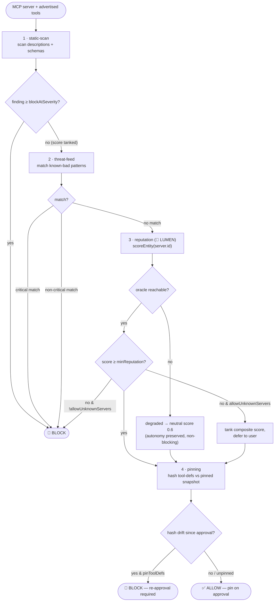
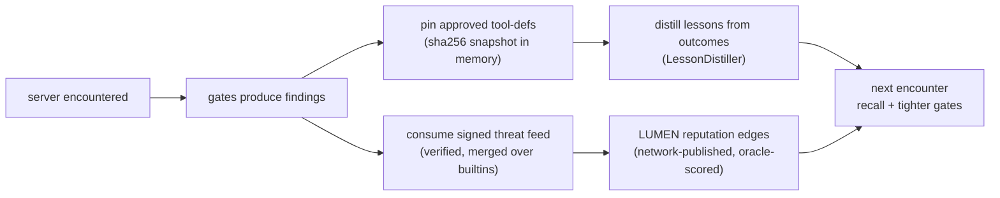

# 🛡️ WARDEN — the MCP firewall

> 🌐 Language: **English** · [Русский](./security-warden-ru.md) · [Español](./security-warden-es.md)

> Part of the ARGUS documentation set (`argus/docs/`):
> [architecture](./architecture.md) · **security-warden** · [economy-integration](./economy-integration.md) · [token-economy](./token-economy.md) · [autonomy](./autonomy.md)

MCP servers are third-party code that injects **attacker-controllable text**
(tool names, descriptions, input schemas) straight into the model's context as
trusted instructions, and then executes tools on the user's machine and wallet.
WARDEN is the gate every MCP server must clear before a single token of its
tool definitions reaches the model or a single tool runs.

WARDEN is part of Layer 4 in the [architecture](./architecture.md#the-five-layers)
and runs entirely offline — its one economy-adjacent input, LUMEN reputation,
degrades to neutral rather than failing closed.

---

## Threat model

| Threat | What it looks like | Gate that catches it |
|--------|--------------------|----------------------|
| **Tool poisoning / prompt injection** | Imperative directives hidden in a tool *description* or schema ("ignore previous instructions", `<system>` tags, "do not tell the user"). | static-scan |
| **Rug-pull / tool-def drift** | A server advertises benign tools at approval, then silently swaps in a poisoned definition later. | pinning |
| **Cross-server shadowing** | One server's tool description tries to redirect or override another server's tools ("instead of X, call Y"). | static-scan (injection signatures) + per-server pinning |
| **Silent exfiltration** | Descriptions that instruct the model to POST/forward/upload results to an external URL. | static-scan (exfil signatures) + `EgressGuard` at runtime |
| **Secret / credential harvesting** | Schema fields or prose asking for API keys, private keys, seed phrases, `.env`, `~/.ssh`. | static-scan (secret signatures) + threat-feed builtins |
| **Known-bad actor** | A server matching a known-malicious pattern (SSH-key read, `rm -rf`, fork bomb, crypto-drainer, typosquat). | threat-feed |
| **Low/no standing** | A clean-*looking* server with no trust in the network. | reputation (LUMEN) |

---

## The gate chain

Gates run in order. Each returns findings plus a per-gate score in `[0,1]`;
a gate may declare itself **fatal** to short-circuit and block immediately.
The composite verdict allows only if no fatal block fired and no finding meets
`policy.blockAtSeverity`.



`sandbox.ts` enforces two runtime complements to the chain: `classifyTools()`
flags tools matching `sensitiveToolPatterns` as approval-required, and
`EgressGuard` enforces an outbound-host allowlist so a tool that slipped through
still cannot exfiltrate to an arbitrary host.

---

## Why oracle reputation beats blocklists

A static blocklist only knows the bad actors someone already catalogued. It is
blind to a freshly-published, clean-looking malicious server, and it is a
single curated list that every defender must trust and keep current.

The reputation gate asks the **LUMEN oracle** (🔮 PageRank / EigenTrust over the
service mesh's trust graph) for the server's standing. That is *earned,
verifiable, network-derived* trust:

- **Catches novelty.** A brand-new poisoned server has no inbound trust edges,
  so it scores low even though no blocklist has heard of it.
- **Verifiable, not asserted.** Every `lumen.reputation@v1` result rides in a
  signed oracle-core receipt whose `input_hash` commits to the exact graph scored,
  so anyone can re-run the PageRank power-iteration and reproduce the score rather
  than take it on faith.
- **Hard to forge.** Faking a high score means manufacturing trust edges from
  reputable nodes across an oracle network with a settlement layer underneath —
  not editing a text file. Replication requires the same oracle network and settlement layer.

The threat-feed (a blocklist) and reputation are complementary: the feed
answers *"is this a known bad actor?"*; reputation answers *"does this server
have any standing at all?"*. WARDEN runs both.

Critically, reputation is **advisory to autonomy**: if LUMEN is unreachable the
gate returns a `degraded` neutral score (`0.6`) and a `REPUTATION_UNAVAILABLE`
info finding, never a block. See [autonomy.md](./autonomy.md#the-two-switches).

---

## WardenPolicy

Defined in `src/types.ts` (`WardenPolicy`), defaulted in `src/config.ts`, and
overridable in `argus.config.json` under `warden`.

| Field | Type | Default | Meaning |
|-------|------|---------|---------|
| `minReputation` | `number` (0..1) | `0.25` | Servers scoring below this on LUMEN are flagged; fatal only when `allowUnknownServers` is `false`. |
| `blockAtSeverity` | `Severity` | `"high"` | Any finding at or above this severity blocks the whole connection. |
| `sensitiveToolPatterns` | `string[]` | `["*delete*","*write*","*exec*","*shell*","*payment*","*transfer*","*email*","*send*"]` | Glob patterns for tools that always require explicit per-call user approval. |
| `allowUnknownServers` | `boolean` | `true` | Permit connecting to servers with no reputation yet (low scores tank the composite but defer to the user instead of hard-blocking). Set `false` for fail-closed. |
| `pinToolDefs` | `boolean` | `true` | Require re-approval when a server's tool-def hash changes after pinning (rug-pull defence). |

`threatFeedUrl` (optional, from `ARGUS_THREAT_FEED_URL`) and `oracleFamilyUrl`
(LUMEN endpoint) sit on `WardenConfig` alongside the policy.

---

## The self-learning security loop — scoped honestly

WARDEN improves over time through **bounded, testable mechanisms** — not an
agent that "roams the internet". Concretely:



What this does and does not mean:

- **Threat feed is pull-only and signed.** ARGUS fetches a feed *you* point it
  at; the built-in deny-list is the floor and a feed outage, non-200, or
  malformed payload is swallowed silently (`ThreatFeed.load`) so security
  tooling never crashes a connection or weakens the builtins.
- **Reputation edges are network-published, not self-asserted.** Trust comes
  from LUMEN's scored graph, with a `graph_commitment` for verification. ARGUS
  reads scores; it does not get to mint its own trust.
- **Pins are local and deterministic.** A sha256 over the canonical tool-def
  set (sorted, key-stable) detects drift; nothing leaves the machine.
- **Lessons are bounded.** `LessonDistiller` dedupes by topic and caps new
  lessons per run — it accumulates retrievable advice, it does not touch model
  weights.

Everything here is deterministic and unit-testable. There is no autonomous
network crawling, no self-modifying policy, no unbounded background process.

---

## Finding codes

`WardenFinding.code` is a stable machine code (see `src/types.ts`). Codes by gate:

| Code | Gate | Severity (typical) | Meaning |
|------|------|--------------------|---------|
| `TOOL_DEF_INJECTION` | static-scan | medium–critical | Imperative/injection directive in a description or schema ("ignore previous", `<system>`, "do not tell the user"). |
| `TOOL_DEF_EXFIL` | static-scan | high–critical | Phrasing instructing the model to send/post/upload results to an external destination. |
| `TOOL_DEF_SECRET_REQUEST` | static-scan | medium–critical | Asks for API keys, private keys, seed phrases, passwords, `.env`, or `~/.ssh`. |
| `TOOL_DEF_DATA_URL` | static-scan | high | `data:…;base64,` or `javascript:` URL scheme embedded in text. |
| `TOOL_DEF_BASE64_BLOB` | static-scan | high | Long base64-ish run — possible hidden payload / encoded instructions. |
| `TOOL_DEF_HIDDEN_UNICODE` | static-scan | high | Zero-width / bidi / BOM characters hiding text from human review. |
| `THREAT_SSH_KEY_READ` | threat-feed | critical | Server references `~/.ssh` or `id_rsa`. |
| `THREAT_DESTRUCTIVE_CMD` | threat-feed | critical | Command performs a destructive recursive delete (`rm -rf`). |
| `THREAT_FORK_BOMB` | threat-feed | critical | Command contains a shell fork bomb. |
| `THREAT_CRYPTO_DRAINER` | threat-feed | critical | Wallet-drainer / fund-sweep keyword in server identity. |
| `THREAT_SEED_PHRASE` | threat-feed | high | References wallet seed phrases. |
| `THREAT_ENV_EXFIL` | threat-feed | critical | References exfiltrating environment files. |
| `THREAT_TYPOSQUAT` | threat-feed | medium–high | Name mimics an official reference server (`offical-mcp`, `filesytem`, …). |
| `REPUTATION_OK` | reputation | info | LUMEN score meets `minReputation`. |
| `REPUTATION_LOW` | reputation | high | LUMEN score below `minReputation` (fatal when `allowUnknownServers` is `false`). |
| `REPUTATION_UNAVAILABLE` | reputation | info | Oracle unreachable; proceeding on a neutral score, autonomy preserved. |
| `TOOL_DEF_UNPINNED` | pinning | info | First contact — no snapshot yet; will be pinned on approval. |
| `TOOL_DEF_DRIFT` | pinning | high | Tool-defs changed since approval; possible rug-pull, re-approval required (fatal when `pinToolDefs` is `true`). |

Severity ranks `info < low < medium < high < critical`; the static-scan gate
scores `1 − penalty(worst severity)`, so a single finding tanks the score
without necessarily severing the connection.

## Wallet at rest: the encrypted vault

WARDEN defends the *runtime*; the **keystore vault** defends the *wallet secret*
at rest. When crypto is enabled, ARGUS needs a private key — and the worst place
for it is a plaintext `ARGUS_WALLET_KEY` in `.env`, where any backup, log scrape,
or shoulder-surf leaks it forever.

The vault stores the seed + key encrypted with **AES-256-GCM** under a key
derived from a passphrase via **scrypt** (`N=2¹⁵, r=8, p=1`). The plaintext is
never written to disk: it is decrypted into memory only when a wallet is actually
needed, and only the public address is ever surfaced.

```
argus keystore create            # new seed, or --import an existing one
argus keystore address           # print the public address (never the secret)
```

- File: `~/.argus/keystore.json`, written **mode 600**. Holds only the GCM
  ciphertext, salt, IV, auth tag, and (as a convenience) the public address.
- Unlock: set `ARGUS_KEYSTORE_PASSPHRASE` (env var or secret manager) at runtime.
  `.env` then holds only the passphrase, not the key.
- **Fail-safe by design:** a wrong/absent passphrase, or a tampered file (GCM
  auth failure), leaves the wallet *locked* — `resolveWalletKey()` returns
  `undefined` and the economy simply stays **off**. ARGUS never crashes and never
  falls back to an unprotected key.
- **Resolution order:** vault (decrypted) → plaintext `ARGUS_WALLET_KEY` (dev /
  legacy). The vault always wins when present.
- `argus doctor` reports the wallet's storage state: `🔒 encrypted vault`,
  `vault — LOCKED`, `⚠ plaintext`, or `none`.

For non-interactive server migration, `argus keystore create` runs headless from
`ARGUS_KEYSTORE_PASSPHRASE` + `ARGUS_WALLET_MNEMONIC`/`ARGUS_WALLET_KEY`; drop the
plaintext vars from `.env` afterward.

> The vault matters even with WARDEN: WARDEN stops a *malicious MCP server* from
> asking for your seed, but it can't protect a key you left in plaintext on disk.
> The two are complementary — one guards the front door, the other the safe.

---

## Limitations (honest) — not a production firewall yet

External review (~7.5/10) is fair: WARDEN is **strong against textbook MCP poisoning** but
**two months is insufficient** for sophisticated, targeted attacks. Tracked as Factory
[KI-9](../../docs/known-issues.md#ki-9--argus-warden-vs-sophisticated-mcp-attacks).

| Gap | What can go wrong | Mitigation today |
|-----|-------------------|------------------|
| **Obfuscated injection** | Unicode homoglyphs, zero-width joins, base64 in schema descriptions may evade static signatures | Human approval on sensitive tools; tighten `blockAtSeverity`; red-team fixtures in CI |
| **Post-approval drift** | Pinning catches tool-def hash change — not **behavior** change on same hash (malicious server binary) | Re-vet periodically; prefer pinned server versions; run MCP in sandbox |
| **Model-side bypass** | WARDEN clears tool *definitions*; the **LLM** may still follow poison in user content or prior turns | ARGUS system prompt + budget limits; don't treat vet as prompt-injection cure-all |
| **Runtime-only exfil** | Tool runs clean at vet time, exfiltrates via network at invoke | `EgressGuard` allowlist; block `*fetch*` to unknown hosts |
| **LUMEN unreachable** | Reputation gate → **neutral 0.6** (autonomy preserved, not fail-closed) | Set `allowUnknownServers: false` for high-security; require LUMEN reachability |
| **Unknown servers allowed** | Default policy may allow low-reputation servers with warning | High-security preset: deny unknown + require pin approval |
| **Multi-hop chains** | Server A's output feeds server B; composite attack spans tools | Limit MCP fan-out; WARDEN per server, not cross-chain composition analysis |

**High-security profile (operator):**

```json
{
  "warden": {
    "allowUnknownServers": false,
    "minReputation": 0.5,
    "blockAtSeverity": "medium",
    "pinToolDefs": true
  }
}
```

**Red-team corpus:** `argus/test/adversarial-warden.test.ts` — documents at least one known
evasion class; expand under KI-9.

**Public MCP benchmark (2026-07-16):** [EN](./warden-scan-report.md) · [RU](./warden-scan-report-ru.md) · [ES](./warden-scan-report-es.md) — 10 servers,
one row each (8 allow · 1 blocked · 1 unreachable).

See also [`docs/ecosystem-maturity-review.en.md`](../../docs/ecosystem-maturity-review.en.md).
