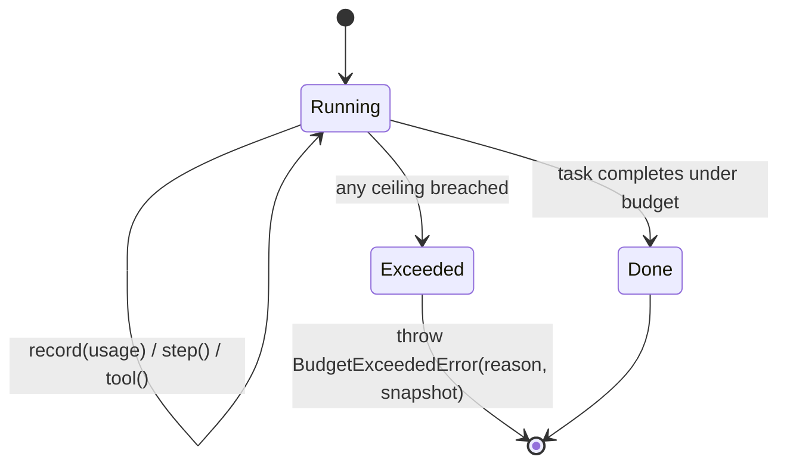

# Economía de tokens — por qué ARGUS es frugal

> 🌐 Idiomas: [English](./token-economy.md) · [Русский](./token-economy-ru.md) · **Español**

> Parte del conjunto de documentación de ARGUS (`argus/docs/`):
> [architecture](./architecture-es.md) · [security-warden](./security-warden.md) · [economy-integration](./economy-integration.md) · **token-economy** · [autonomy](./autonomy-es.md)

Un agente autónomo de larga duración que «piensa en voz alta» para siempre quema tokens — a menudo del presupuesto de *otra persona* una vez que entra la economía. ARGUS adopta la postura opuesta: cada paso está **acotado y medido**, el coste es **auditable en vivo**, y el trabajo barato se ejecuta en modelos baratos. Nada de esto es aspiracional — cada control se corresponde con un lugar concreto en el código.

Esto complementa [architecture.md](./architecture-es.md#the-bounded-agent-loop) (dónde se sitúan estos controles en el bucle) y [economy-integration.md](./economy-integration.md) (el gasto por llamada que acotan).

---

## Los controles

| Control | Mecanismo | Dónde se implementa |
|---------|-----------|---------------------|
| **Governor de presupuesto de razonamiento** | Techos estrictos de `$` + tokens + pasos + llamadas a herramientas; superar cualquiera lanza `BudgetExceededError` y termina la tarea limpiamente. | `src/core/budget.ts` (`Budget.step`, `Budget.tool`, `enforce`) |
| **Medidor de tokens en vivo** | El usage de cada llamada LLM se registra con el precio del modelo; el coste es consultable en cualquier momento. | `src/core/budget.ts` (`Budget.record`, `snapshot`, `format`) |
| **Niveles de modelo** | Triage en un modelo barato (a menudo local, $0), escalada a core, heavy reservado para subtareas genuinamente difíciles. | `src/providers/router.ts` (`resolveTier`); niveles en `argus.config.json` `models.*` |
| **Anthropic cache_control** | El system prompt estable + definiciones de herramientas se marcan `ephemeral` para cachearse en cada paso de una tarea. | `src/providers/anthropic.ts` (`cache_control: { type: "ephemeral" }`) |
| **Traspaso de contexto curado** | Lecciones recuperadas por tarea y resultados destilados en consejo duradero en lugar de rederivar cada ejecución; solo se lleva contexto relevante. | `src/memory/store.ts` (`recall`), `src/memory/lessons.ts` (`distill`) |
| **Compactación de contexto** | Acuñación acotada de lecciones (deduplicación por tema, tope por ejecución) mantiene el contexto recuperado pequeño con el tiempo. | `src/memory/lessons.ts` (`MAX_NEW_PER_CALL`, topic dedupe) |

---

## Budget governor + medidor de tokens

La clase `Budget` es a la vez medidor y governor. Los límites provienen de `budget` en `argus.config.json` (`BudgetLimits` en `src/types.ts`):

```json
"budget": { "maxUsdPerTask": 0.5, "maxTokensPerTask": 200000, "maxSteps": 24, "maxToolCalls": 40 }
```

- `Budget.record(usage, pricing)` actualiza los conteos de tokens input/output/cached y acumula el coste en USD. El input fresco se factura a `inputPerM`, las lecturas de caché al más barato `cachedInputPerM` (o `inputPerM × 0.1` si no está definido), el output a `outputPerM`.
- `Budget.step()` se ejecuta antes de cada paso del agente; `Budget.tool()` antes de cada llamada a herramienta. Cada uno llama a `enforce()`, que lanza `BudgetExceededError` en el momento en que se supera cualquier techo — pasos, llamadas a herramientas, tokens totales o dólares.



`BudgetExceededError` lleva tanto el `reason` (p. ej. `maxUsdPerTask ($0.5)`) como el `MeterSnapshot` en el momento de la infracción, de modo que una parada es explicable, no silenciosa.

---

## Lectura del medidor en vivo

`Budget.format()` devuelve un resumen auditable de una línea:

```
tokens in/out 18432/2109 (cache 71%) · steps 6 · tools 4 · $0.0461
```

Esa línea es el punto: la afirmación de que «ARGUS es más barato» es **comprobable**, no marketing. `cache 71%` es la proporción de tokens de entrada servidos desde la caché del prompt (impulsada por `cache_control`); una alta tasa de caché en una tarea de varios pasos es el mayor ahorro de coste. `$0.0461` es el coste acumulado frente al techo `maxUsdPerTask`. `Budget.usedFraction` expone lo mismo como fracción `0..1` para avisos suaves antes de la parada dura.

---

## Niveles (tiering)

`ProviderRouter.resolveTier(tier)` elige el modelo + proveedor para un nivel y hace fallback con gracia (`heavy → core`, `triage → core`, y finalmente cualquier proveedor disponible). Los niveles por defecto en `argus.config.json`:

| Tier | Modelo por defecto | Precios (in/out por 1M) | Uso |
|------|-------------------|-------------------------|-----|
| `triage` | `local/llama3.1` | $0 / $0 | Enrutamiento, clasificación, primeros pases baratos — a menudo gratis y sin conexión. |
| `core` | `anthropic/claude-sonnet-4-6` | $3 / $15 (cached in $0.3) | El modelo de trabajo por defecto para tareas reales. |
| `heavy` | `anthropic/claude-opus-4-8` | $15 / $75 (cached in $1.5) | Reservado para subtareas genuinamente difíciles. |

Hacer triage en un modelo local gratuito y reservar el modelo heavy para los pocos pasos que lo necesitan es el control más barato disponible — la mayoría de pasos nunca tocan el nivel caro. Edite los bloques `pricing` con sus tarifas reales para que el medidor siga siendo preciso.

---

## cache_control

`AnthropicProvider` marca el prefijo estable como cacheable cuando `cachePrefix` está definido en la petición: el system prompt se convierte en un bloque de texto `cache_control: { type: "ephemeral" }`, y la **última** definición de herramienta se marca para que todo el bloque de herramientas se cachee. Como system + tools son la parte más grande y estable del contexto de un agente y se repiten en cada paso de una tarea, cachearlos convierte la mayor parte del input por paso en baratos `cache_read_input_tokens` — reflejado en el medidor como `cache %`.

---

## Traspaso curado + compactación

En lugar de rederivar todo cada ejecución, ARGUS recupera un pequeño conjunto de lecciones relevantes (`MemoryStore.recall`) y, ante un fallo, destila resultados en consejo duradero (`LessonDistiller.distill`). La destilación está deliberadamente acotada: deduplica por tema (reforzando peso en coincidencia en lugar de reacuñar) y limita lecciones nuevas por ejecución a `MAX_NEW_PER_CALL`. El efecto es un contexto que se mantiene pequeño y de alta señal con el tiempo en lugar de inflarse — compactación por construcción.

---

## Contraste: autorreflexión sin límites

| Bucle reflexivo sin límites | ARGUS |
|-----------------------------|-------|
| Reflexiona hasta «satisfacción» — sin parada dura. | Techos estrictos de `$` / tokens / pasos / herramientas; `BudgetExceededError` lo termina. |
| El coste se descubre a posteriori (o nunca). | Línea de medidor en vivo; coste auditable a mitad de tarea. |
| Cada paso en el modelo más capaz (más caro). | Triage en gratis/local, escalada solo según necesidad. |
| Reenvía el prompt completo cada paso a precio completo. | Prefijo estable cacheado vía `cache_control`. |
| El contexto crece sin límite entre ejecuciones. | Recall de lecciones acotado, deduplicado y con tope. |

El governor es la respuesta estructural a «nada de autorreflexión con el presupuesto de otro»: no puede gastar de más porque el techo lanza una excepción.
