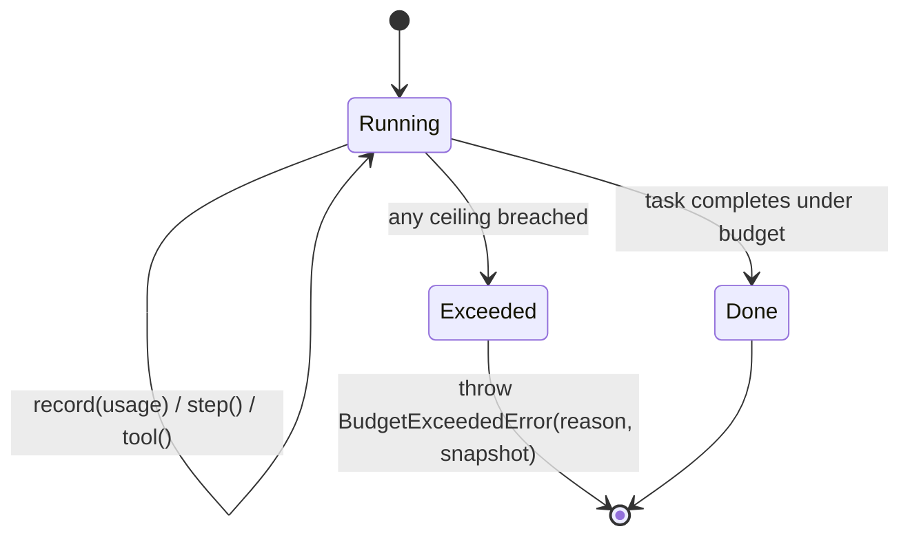

# Экономика токенов — почему ARGUS бережлив

> 🌐 Язык: [English](./token-economy.md) · **Русский** · [Español](./token-economy-es.md)

> Часть набора документации ARGUS (`argus/docs/`):
> [architecture](./architecture-ru.md) · [security-warden](./security-warden.md) · [economy-integration](./economy-integration.md) · **token-economy** · [autonomy](./autonomy-ru.md)

Долгоживущий автономный агент, который «думает вслух» бесконечно, сжигает токены — часто из *чужого* бюджета, когда подключается экономика. ARGUS занимает противоположную позицию: каждый шаг **ограничен и измеряется**, стоимость **аудируется в реальном времени**, а дешёвая работа выполняется на дешёвых моделях. Ничто из этого не декларативно — каждый рычаг соответствует конкретному месту в коде.

Это дополняет [architecture.md](./architecture-ru.md#the-bounded-agent-loop) (где эти рычаги находятся в цикле) и [economy-integration.md](./economy-integration.md) (расход на вызов, который они ограничивают).

---

## Рычаги

| Рычаг | Механизм | Где реализовано |
|-------|----------|-----------------|
| **Governor бюджета рассуждений** | Жёсткие потолки `$` + токенов + шагов + вызовов инструментов; превышение любого выбрасывает `BudgetExceededError` и корректно завершает задачу. | `src/core/budget.ts` (`Budget.step`, `Budget.tool`, `enforce`) |
| **Живой счётчик токенов** | Usage каждого вызова LLM записывается с ценами модели; стоимость запрашивается в любой момент. | `src/core/budget.ts` (`Budget.record`, `snapshot`, `format`) |
| **Уровни моделей** | Triage на дешёвой (часто локальной, $0) модели, эскалация на core, heavy — только для действительно сложных подзадач. | `src/providers/router.ts` (`resolveTier`); уровни в `argus.config.json` `models.*` |
| **Anthropic cache_control** | Стабильный system prompt + определения инструментов помечены `ephemeral`, чтобы кэшироваться на каждом шаге задачи. | `src/providers/anthropic.ts` (`cache_control: { type: "ephemeral" }`) |
| **Курируемая передача контекста** | Уроки, извлекаемые для задачи, и результаты, дистиллированные в долговременные советы, вместо повторного вывода каждый запуск; переносится только релевантный контекст. | `src/memory/store.ts` (`recall`), `src/memory/lessons.ts` (`distill`) |
| **Компактификация контекста** | Ограниченное создание уроков (дедупликация по теме, лимит за запуск) держит извлекаемый контекст компактным со временем. | `src/memory/lessons.ts` (`MAX_NEW_PER_CALL`, topic dedupe) |

---

## Budget governor + счётчик токенов

Класс `Budget` одновременно счётчик и governor. Лимиты берутся из `budget` в `argus.config.json` (`BudgetLimits` в `src/types.ts`):

```json
"budget": { "maxUsdPerTask": 0.5, "maxTokensPerTask": 200000, "maxSteps": 24, "maxToolCalls": 40 }
```

- `Budget.record(usage, pricing)` обновляет счётчики input/output/cached токенов и накапливает стоимость в USD. Свежий input тарифицируется по `inputPerM`, чтение из кэша — по более дешёвому `cachedInputPerM` (или `inputPerM × 0.1`, если не задано), output — по `outputPerM`.
- `Budget.step()` выполняется перед каждым шагом агента; `Budget.tool()` — перед каждым вызовом инструмента. Каждый вызывает `enforce()`, который выбрасывает `BudgetExceededError` в момент превышения любого потолка — шагов, вызовов инструментов, общих токенов или долларов.



`BudgetExceededError` несёт и `reason` (напр. `maxUsdPerTask ($0.5)`), и `MeterSnapshot` в момент нарушения, поэтому остановка объяснима, а не безмолвна.

---

## Чтение живого счётчика

`Budget.format()` возвращает однострочную аудируемую сводку:

```
tokens in/out 18432/2109 (cache 71%) · steps 6 · tools 4 · $0.0461
```

Эта строка — вся суть: утверждение «ARGUS дешевле» **проверяемо**, а не маркетинг. `cache 71%` — доля input-токенов, обслуженных из кэша промпта (за счёт `cache_control`); высокий cache rate на многошаговой задаче — главный экономитель. `$0.0461` — текущая стоимость относительно потолка `maxUsdPerTask`. `Budget.usedFraction` выдаёт то же как долю `0..1` для мягких предупреждений до жёсткой остановки.

---

## Уровни (tiering)

`ProviderRouter.resolveTier(tier)` выбирает модель + провайдер для уровня и откатывается gracefully (`heavy → core`, `triage → core`, и наконец любой доступный провайдер). Уровни по умолчанию в `argus.config.json`:

| Tier | Модель по умолчанию | Цены (in/out за 1M) | Назначение |
|------|---------------------|---------------------|------------|
| `triage` | `local/llama3.1` | $0 / $0 | Маршрутизация, классификация, дешёвые первые проходы — часто бесплатно и офлайн. |
| `core` | `anthropic/claude-sonnet-4-6` | $3 / $15 (cached in $0.3) | Рабочая модель по умолчанию для реальных задач. |
| `heavy` | `anthropic/claude-opus-4-8` | $15 / $75 (cached in $1.5) | Зарезервирована для действительно сложных подзадач. |

Triage на бесплатной локальной модели и heavy только для шагов, которым это нужно — самый дешёвый рычаг; большинство шагов никогда не касаются дорогого уровня. Отредактируйте блоки `pricing` под реальные тарифы, чтобы счётчик оставался точным.

---

## cache_control

`AnthropicProvider` помечает стабильный префикс как кэшируемый, когда в запросе задан `cachePrefix`: system prompt становится текстовым блоком `cache_control: { type: "ephemeral" }`, а **последнее** определение инструмента помечается, чтобы весь блок инструментов кэшировался. Поскольку system + tools — самая большая и стабильная часть контекста агента и повторяется на каждом шаге задачи, их кэширование превращает большую часть per-step input в дешёвые `cache_read_input_tokens` — отражается в счётчике как `cache %`.

---

## Курируемая передача + компактификация

Вместо повторного вывода всего каждый запуск ARGUS извлекает небольшой набор релевантных уроков (`MemoryStore.recall`) и при сбое дистиллирует результаты в долговременные советы (`LessonDistiller.distill`). Дистилляция намеренно ограничена: дедупликация по теме (усиление веса при совпадении вместо повторного создания) и лимит новых уроков за запуск `MAX_NEW_PER_CALL`. Эффект — контекст остаётся компактным и высокосигнальным со временем, а не раздувается — компактификация по конструкции.

---

## Контраст: неограниченная саморефлексия

| Неограниченный рефлексивный цикл | ARGUS |
|----------------------------------|-------|
| Рефлексирует до «удовлетворения» — без жёсткой остановки. | Жёсткие потолки `$` / токенов / шагов / инструментов; `BudgetExceededError` завершает. |
| Стоимость обнаруживается постфактум (или никогда). | Живая строка счётчика; стоимость аудируется в ходе задачи. |
| Каждый шаг на самой способной (самой дорогой) модели. | Triage на бесплатной/локальной, эскалация только по необходимости. |
| Полный промпт переотправляется каждый шаг по полной цене. | Стабильный префикс кэшируется через `cache_control`. |
| Контекст растёт неограниченно между запусками. | Ограниченный, дедуплицированный, с лимитом recall уроков. |

Governor — структурный ответ на «никакой саморефлексии за чужой бюджет»: перерасход невозможен, потому что потолок выбрасывает исключение.
