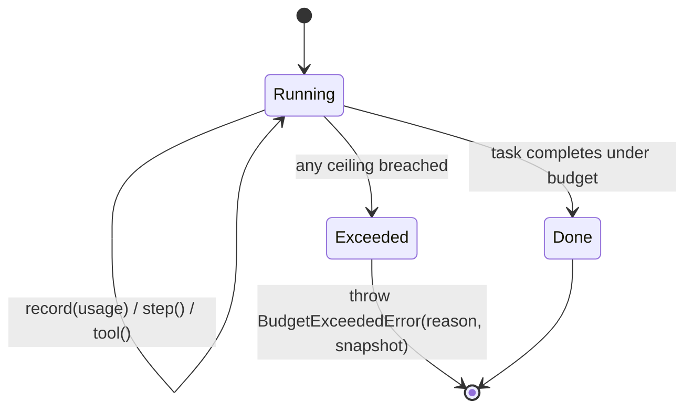

# Token economy — why ARGUS is frugal

> 🌐 Language: **English** · [Русский](./token-economy-ru.md) · [Español](./token-economy-es.md)

> Part of the ARGUS documentation set (`argus/docs/`):
> [architecture](./architecture.md) · [security-warden](./security-warden.md) · [economy-integration](./economy-integration.md) · **token-economy** · [autonomy](./autonomy.md)

A long-lived autonomous agent that "thinks out loud" forever burns tokens —
often on *someone else's* budget once the economy is involved. ARGUS takes the
opposite stance: every step is **bounded and metered**, the cost is **auditable
live**, and cheap work runs on cheap models. None of this is aspirational — each
lever maps to a specific place in the code.

This complements [architecture.md](./architecture.md#the-bounded-agent-loop)
(where these levers sit in the loop) and
[economy-integration.md](./economy-integration.md) (the per-call spend they
bound).

---

## The levers

| Lever | Mechanism | Where implemented |
|-------|-----------|-------------------|
| **Reasoning-budget governor** | Hard `$` + token + step + tool-call ceilings; exceeding any throws `BudgetExceededError` and ends the task cleanly. | `src/core/budget.ts` (`Budget.step`, `Budget.tool`, `enforce`) |
| **Live token meter** | Every LLM call's usage is recorded with the model's pricing; cost is queryable at any time. | `src/core/budget.ts` (`Budget.record`, `snapshot`, `format`) |
| **Model tiering** | Triage on a cheap (often local, $0) model, escalate to core, reserve heavy for genuinely hard sub-tasks. | `src/providers/router.ts` (`resolveTier`); tiers in `argus.config.json` `models.*` |
| **Anthropic cache_control** | The stable system prompt + tool definitions are marked `ephemeral` so they are cached across every step of a task. | `src/providers/anthropic.ts` (`cache_control: { type: "ephemeral" }`) |
| **Curated context handoff** | Lessons recalled per task and outcomes distilled to durable advice instead of re-deriving every run; only relevant context is carried. | `src/memory/store.ts` (`recall`), `src/memory/lessons.ts` (`distill`) |
| **Context compaction** | Bounded lesson minting (dedupe by topic, cap per run) keeps recalled context small over time. | `src/memory/lessons.ts` (`MAX_NEW_PER_CALL`, topic dedupe) |

---

## Budget governor + token meter

The `Budget` class is both the meter and the governor. Limits come from
`budget` in `argus.config.json` (`BudgetLimits` in `src/types.ts`):

```json
"budget": { "maxUsdPerTask": 0.5, "maxTokensPerTask": 200000, "maxSteps": 24, "maxToolCalls": 40 }
```

- `Budget.record(usage, pricing)` updates input/output/cached token counts and
  accrues USD cost. Fresh input is billed at `inputPerM`, cache reads at the
  cheaper `cachedInputPerM` (or `inputPerM × 0.1` if unset), output at
  `outputPerM`.
- `Budget.step()` runs before every agent step; `Budget.tool()` before every
  tool call. Each calls `enforce()`, which throws `BudgetExceededError` the
  moment any ceiling is breached — steps, tool calls, total tokens, or dollars.



`BudgetExceededError` carries both the `reason` (e.g. `maxUsdPerTask ($0.5)`)
and the `MeterSnapshot` at the moment of the breach, so a halt is explainable,
not silent.

---

## Reading the live meter

`Budget.format()` returns a one-line, auditable summary:

```
tokens in/out 18432/2109 (cache 71%) · steps 6 · tools 4 · $0.0461
```

That line is the whole point: the "ARGUS is cheaper" claim is **checkable**, not
marketing. `cache 71%` is the share of input tokens served from the prompt
cache (driven by `cache_control`); a high cache rate on a multi-step task is the
single biggest cost saver. `$0.0461` is the running cost against the
`maxUsdPerTask` ceiling. `Budget.usedFraction` exposes the same as a `0..1`
fraction for soft warnings before the hard stop.

---

## Tiering

`ProviderRouter.resolveTier(tier)` picks the model + provider for a tier and
falls back gracefully (`heavy → core`, `triage → core`, and finally any
available provider). The default tiers in `argus.config.json`:

| Tier | Default model | Pricing (in/out per 1M) | Use |
|------|---------------|-------------------------|-----|
| `triage` | `local/llama3.1` | $0 / $0 | Routing, classification, cheap first passes — often free and offline. |
| `core` | `anthropic/claude-sonnet-4-6` | $3 / $15 (cached in $0.3) | The default working model for real tasks. |
| `heavy` | `anthropic/claude-opus-4-8` | $15 / $75 (cached in $1.5) | Reserved for genuinely hard sub-tasks. |

Doing triage on a free local model and reserving the heavy model for the few
steps that need it is the cheapest lever available — most steps never touch the
expensive tier. Edit the `pricing` blocks to your real rates so the meter stays
accurate.

---

## cache_control

`AnthropicProvider` marks the stable prefix as cacheable when `cachePrefix` is
set on the request: the system prompt becomes a `cache_control: { type:
"ephemeral" }` text block, and the **last** tool definition is marked so the
whole tool block is cached. Because system + tools are the largest, most stable
part of an agent's context and they recur on every step of a task, caching them
turns most of the per-step input into cheap `cache_read_input_tokens` — surfaced
back in the meter as the `cache %`.

---

## Curated handoff + compaction

Instead of re-deriving everything each run, ARGUS recalls a small set of
relevant lessons (`MemoryStore.recall`) and, on failure, distills outcomes into
durable advice (`LessonDistiller.distill`). Distillation is deliberately
bounded: it dedupes by topic (reinforcing weight on a hit rather than re-minting)
and caps new lessons per run at `MAX_NEW_PER_CALL`. The effect is a context that
stays small and high-signal over time rather than ballooning — compaction by
construction.

---

## Contrast: unbounded self-reflection

| Unbounded reflective loop | ARGUS |
|---------------------------|-------|
| Reflects until "satisfied" — no hard stop. | Hard `$` / token / step / tool ceilings; `BudgetExceededError` ends it. |
| Cost discovered after the fact (or never). | Live meter line; cost auditable mid-task. |
| Every step on the most capable (most expensive) model. | Triage on free/local, escalate only as needed. |
| Re-sends the full prompt each step at full price. | Stable prefix cached via `cache_control`. |
| Context grows unbounded across runs. | Bounded, deduped, capped lesson recall. |

The governor is the structural answer to "no self-reflection on someone else's
budget": it cannot overspend because the ceiling throws.
