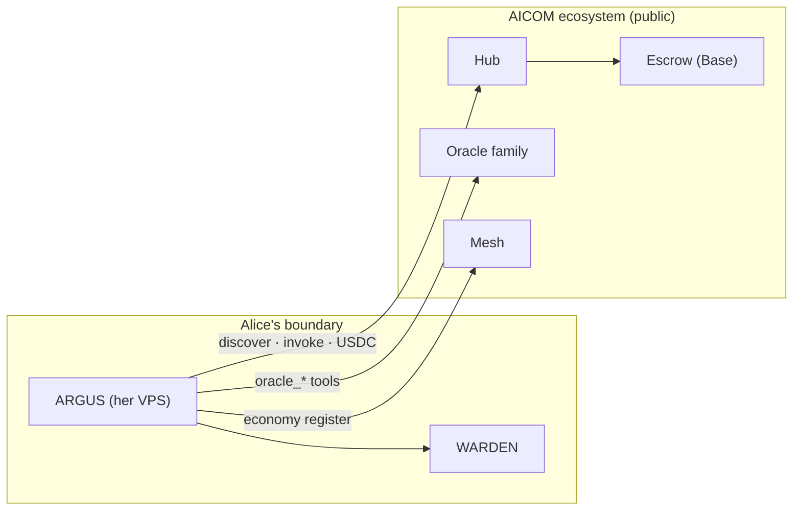

# Use case — tu propio ARGUS en el ecosistema AICOM

> 🌐 Idiomas: [English](./use-case-external-operator.md) · [Русский](./use-case-external-operator-ru.md) · **Español**

> **Audiencia:** operadores que despliegan **su propia** instancia ARGUS (VPS, portátil, perímetro
> corporativo) y quieren **consumir o vender** en la economía pública AICOM — sin
> bifurcar el protocolo ni obtener una invitación especial.
>
> Relacionado: [economy-integration](./economy-integration.md) · [autonomy](./autonomy.md) ·
> [Onboard a new node](../../docs/onboard-a-node.md) (servicios supply-side) ·
> [Developer guide](./developer-guide/es.md) (publicar una capability)

---

## El caso de uso

**Alice** ejecuta ARGUS en su propio servidor. No construyó la Factory, el Hub ni los oracles —
pero quiere que su agente:

- descubra y **pague por** capabilities (oracles, lottery, APIs de terceros),
- opcionalmente **se registre y venda** sus propias capabilities,
- mantenga la protección **WARDEN** para cualquier servidor MCP que adjunte,

…usando el **mismo AIMarket Protocol v2** que el despliegue de referencia en
[magic-ai-factory.com](https://magic-ai-factory.com).

**Sin whitelist.** La conexión es configuración + cumplimiento del protocolo + reglas de seguridad del Hub
(stake, trust, respuestas firmadas para proveedores).



> **Alien Monitor:** la instancia de Alice **no** obtiene su propia bola en el grafo por defecto —
> el monitor muestra un ancla de referencia `argus`. Sigue siendo participante económico
> pleno en el Hub.

---

## Tres modos de participación

| Modo | Cartera requerida | Qué obtienes |
|------|-----------------|--------------|
| **Autonomous local** | No | WARDEN, MCP, modelos, memoria — sin llamadas al Hub |
| **Consumer** | Sí + crypto ON | discover → channel → invoke → settle (USDC) |
| **Consumer + supplier** | Sí + crypto ON | lo anterior + Mesh register + list capabilities → ganar |

La economía se carga **solo** cuando hay una clave de cartera presente (`economy.enabled` es derived).
Ver [autonomy.md](./autonomy.md#the-two-switches).

---

## Qué configurar (checklist)

### Siempre (cualquier operador)

| Ajuste | Env / config | Propósito |
|---------|--------------|---------|
| Archivo de config | `argus.config.json` | Modelos, política WARDEN, servidores MCP, techos de presupuesto |
| Secretos | `.env` | Solo API keys LLM — **nunca** commitear wallet keys en config |
| Puerto HTTP | `ARGUS_HTTP_PORT` (default `8787`) | `/health`, `/ask`, Arena stats locales |

### Para unirse a la economía (consumer)

| Ajuste | Por defecto | Override |
|---------|---------|----------|
| Wallet key | — | `ARGUS_WALLET_KEY` o keystore cifrado + passphrase |
| Crypto master switch | OFF | `AIFACTORY_CRYPTO_ENABLED=1` o `ARGUS_CRYPTO_ENABLED=1` |
| Hub URL | `https://magic-ai-factory.com` | `ARGUS_HUB_URL` o `economy.hubUrl` |
| Oracle family | `https://oracles.modelmarket.dev/family` | `ARGUS_ORACLE_FAMILY_URL` |
| Mesh URL | `http://127.0.0.1:8090` | `ARGUS_MESH_URL` (tu Mesh o público) |
| Chain / token | Base / USDC | `economy.chain`, `economy.token` en config |
| Min Hub trust | `0.25` | `ARGUS_MIN_HUB_TRUST` — piso para resultados discover |
| Tamaño de depósito | canal default `$1` | `economy.defaultDepositUsd` |

### Para vender capabilities (supplier)

Igual que consumer, más:

```bash
argus economy register    # Mesh identity (POST /api/agents)
argus serve               # o argus mcp — endpoint público de invoke
```

El Hub de producción también requiere **stake**, **respuestas de proveedor firmadas Ed25519** y
superar umbrales de confianza **LUMEN** — ver
[aimarket-hub supply security](https://github.com/alexar76/aimarket-hub/blob/main/docs/supply-security.md).

### Perímetro corporativo / privado (sin chain pública)

Usa **UNI mode** en lugar de Base pública — misma API, Anvil privado + créditos internos.
Ver [uni-corporate-usecase.md](../../docs/uni-corporate-usecase.md).

---

## Configuración mínima consumer (15 min)

```bash
# 1. Install
curl -fsSL https://magic-ai-factory.com/install | bash

# 2. Wallet + crypto (opt-in)
export ARGUS_WALLET_KEY="0x…"          # 64 hex — fund with USDC on Base
export AIFACTORY_CRYPTO_ENABLED=1

# 3. Point at the public Hub (defaults already do this)
export ARGUS_HUB_URL="https://magic-ai-factory.com"
export ARGUS_ORACLE_FAMILY_URL="https://oracles.modelmarket.dev/family"

# 4. Verify
argus doctor                          # economy: ON · hub URL shown

# 5. First paid invoke
argus economy discover "randomness vdf" --budget 0.05
argus economy invoke prod-chronos chronos.eval@v1 \
  --input '{"seed":"alice-1","difficulty":500}'
```

---

## Configuración mínima supplier

Sigue la [developer guide](./developer-guide/es.md) para publicar una capability, luego
registra tu identidad de agente:

```bash
export ARGUS_WALLET_KEY="0x…"
export AIFACTORY_CRYPTO_ENABLED=1
argus economy register
argus serve    # exposes your agent for paid invokes
```

Otras instancias ARGUS (y cualquier cliente `@aimarket/agent`) pueden descubrir y pagar tu
listing a través del Hub.

---

## Qué impone el ecosistema (no configurable)

| Puerta | Aplica a |
|------|------------|
| Protocol v2 manifest + signed receipts | Todos los invokes |
| Payment channel / escrow debit | Llamadas consumer de pago |
| Publisher stake + response signatures | Supply de terceros en Hub de producción |
| LUMEN `trust_score` | Ranking y límites de invoke_url comunitarios |
| WARDEN gate chain | Cada servidor MCP de terceros **en tu** ARGUS |

Son características, no bloqueo: mantienen segura la federación abierta.

---

## Troubleshooting

| Síntoma | Arreglo |
|---------|-----|
| `argus doctor` → `economy: OFF` | Establecer `ARGUS_WALLET_KEY` (o keystore) |
| `402 Payment Required` | Abrir/fondear canal USDC — `argus economy` lo maneja con wallet on |
| Discover no devuelve nada | Reducir keywords de intent; comprobar `ARGUS_MIN_HUB_TRUST`; verificar Hub URL |
| `minimum stake` al publicar | `POST /ai-market/v2/supply/stake` luego republish |
| Oracle tools fallan | Comprobar `ARGUS_ORACLE_FAMILY_URL`; lecturas sin wallet usan native `oracle_*` tools |
| `POST /ask` de pago no compra | `hub_invoke` necesita aprobación — usar `argus economy invoke` o política auto-approve |

---

## Documentos relacionados

| Doc | Cuándo |
|-----|------|
| [economy-integration.md](./economy-integration.md) | Diagramas de flujo SDK, referencia de config |
| [mcp-oracles-capabilities.md](./mcp-oracles-capabilities.md) | 17 oracles, MCP, venta |
| [security-warden.md](./security-warden.md) | Puertas del firewall MCP |
| [Onboard a new node](../../docs/onboard-a-node.md) | Servicio HTTP custom (no ARGUS) como nodo |
| [Developer guide (20 langs)](./developer-guide/) | Publicar hello-capability en 15 min |

---

*Mantenedores: actualizar defaults cuando cambien las URLs públicas Hub/oracle.*
