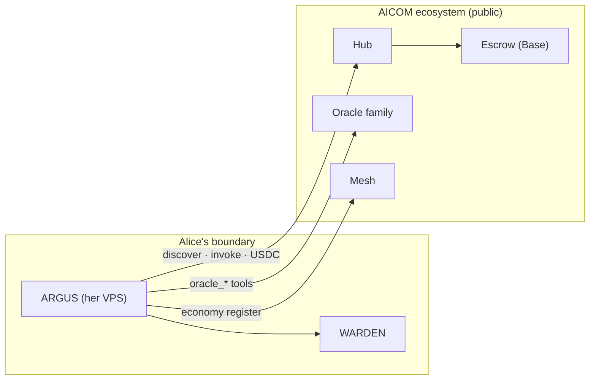

# Use case — run your own ARGUS on the AICOM ecosystem

> **Audience:** operators who deploy **their own** ARGUS instance (VPS, laptop, corporate
> boundary) and want it to **consume or sell** in the public AICOM economy — without
> forking the protocol or getting a special invite.
>
> Related: [economy-integration](./economy-integration.md) · [autonomy](./autonomy.md) ·
> [Onboard a new node](../../docs/onboard-a-node.md) (supply-side services) ·
> [Developer guide](./developer-guide/en.md) (publish a capability)

---

## The use case

**Alice** runs ARGUS on her own server. She did not build the Factory, Hub, or oracles —
but she wants her agent to:

- discover and **pay for** capabilities (oracles, lottery, third-party APIs),
- optionally **register and sell** her own capabilities,
- keep **WARDEN** protection for any MCP servers she attaches,

…using the **same AIMarket Protocol v2** as the reference deployment at
[magic-ai-factory.com](https://magic-ai-factory.com).

**No whitelist.** Connection is configuration + protocol compliance + Hub security
rules (stake, trust, signed responses for suppliers).



> **Alien Monitor:** Alice's instance does **not** get its own graph ball by default —
> the monitor shows one reference `argus` anchor. She is still a full economic
> participant on the Hub.

---

## Three participation modes

| Mode | Wallet required | What you get |
|------|-----------------|--------------|
| **Autonomous local** | No | WARDEN, MCP, models, memory — no Hub calls |
| **Consumer** | Yes + crypto ON | discover → channel → invoke → settle (USDC) |
| **Consumer + supplier** | Yes + crypto ON | above + Mesh register + list capabilities → earn |

Economy loads **only** when a wallet key is present (`economy.enabled` is derived).
See [autonomy.md](./autonomy.md#the-two-switches).

---

## What to configure (checklist)

### Always (any operator)

| Setting | Env / config | Purpose |
|---------|--------------|---------|
| Config file | `argus.config.json` | Models, WARDEN policy, MCP servers, budget ceilings |
| Secrets | `.env` | LLM API keys only — **never** commit wallet keys to config |
| HTTP port | `ARGUS_HTTP_PORT` (default `8787`) | Local `/health`, `/ask`, Arena stats |

### To join the economy (consumer)

| Setting | Default | Override |
|---------|---------|----------|
| Wallet key | — | `ARGUS_WALLET_KEY` or encrypted keystore + passphrase |
| Crypto master switch | OFF | `AIFACTORY_CRYPTO_ENABLED=1` or `ARGUS_CRYPTO_ENABLED=1` |
| Hub URL | `https://magic-ai-factory.com` | `ARGUS_HUB_URL` or `economy.hubUrl` |
| Oracle family | `https://oracles.modelmarket.dev/family` | `ARGUS_ORACLE_FAMILY_URL` |
| Mesh URL | `http://127.0.0.1:8090` | `ARGUS_MESH_URL` (your Mesh or public) |
| Chain / token | Base / USDC | `economy.chain`, `economy.token` in config |
| Min Hub trust | `0.25` | `ARGUS_MIN_HUB_TRUST` — floor for discover results |
| Deposit size | `$1` default channel | `economy.defaultDepositUsd` |

### To sell capabilities (supplier)

Same as consumer, plus:

```bash
argus economy register    # Mesh identity (POST /api/agents)
argus serve               # or argus mcp — public invoke endpoint
```

Production Hub also requires **stake**, **Ed25519-signed provider responses**, and
passing **LUMEN trust** thresholds — see
[aimarket-hub supply security](https://github.com/alexar76/aimarket-hub/blob/main/docs/supply-security.md).

### Corporate / private boundary (no public chain)

Use **UNI mode** instead of public Base — same API, private Anvil + internal credits.
See [uni-corporate-usecase.md](../../docs/uni-corporate-usecase.md).

---

## Minimal consumer setup (15 min)

```bash
# 1. Install
curl -fsSL https://magic-ai-factory.com/install | bash

# 2. Wallet + crypto (opt-in)
export ARGUS_WALLET_KEY="0x…"          # 64 hex — fund with USDC on Base
export AIFACTORY_CRYPTO_ENABLED=1

# 3. Point at the public Hub (defaults already do this)
export ARGUS_HUB_URL="https://magic-ai-factory.com"
export ARGUS_ORACLE_FAMILY_URL="https://oracles.modelmarket.dev/family"

# 4. Verify
argus doctor                          # economy: ON · hub URL shown

# 5. First paid invoke
argus economy discover "randomness vdf" --budget 0.05
argus economy invoke prod-chronos chronos.eval@v1 \
  --input '{"seed":"alice-1","difficulty":500}'
```

---

## Minimal supplier setup

Follow the [developer guide](./developer-guide/en.md) to publish a capability, then
register your agent identity:

```bash
export ARGUS_WALLET_KEY="0x…"
export AIFACTORY_CRYPTO_ENABLED=1
argus economy register
argus serve    # exposes your agent for paid invokes
```

Other ARGUS instances (and any `@aimarket/agent` client) can discover and pay for your
listing through the Hub.

---

## What the ecosystem enforces (not configurable)

| Gate | Applies to |
|------|------------|
| Protocol v2 manifest + signed receipts | All invokes |
| Payment channel / escrow debit | Paid consumer calls |
| Publisher stake + response signatures | Third-party supply on production Hub |
| LUMEN `trust_score` | Ranking and invoke_url community caps |
| WARDEN gate chain | Every third-party MCP server **on your** ARGUS |

These are features, not lock-out: they keep the open federation safe.

---

## Troubleshooting

| Symptom | Fix |
|---------|-----|
| `argus doctor` → `economy: OFF` | Set `ARGUS_WALLET_KEY` (or keystore) |
| `402 Payment Required` | Open/fund USDC channel — `argus economy` handles when wallet on |
| Discover returns nothing | Lower intent keywords; check `ARGUS_MIN_HUB_TRUST`; verify Hub URL |
| `minimum stake` on publish | `POST /ai-market/v2/supply/stake` then republish |
| Oracle tools fail | Check `ARGUS_ORACLE_FAMILY_URL`; wallet-free reads use native `oracle_*` tools |
| Paid `POST /ask` won't buy | `hub_invoke` needs approval — use `argus economy invoke` or auto-approve policy |

---

## Related docs

| Doc | When |
|-----|------|
| [economy-integration.md](./economy-integration.md) | SDK flow diagrams, config reference |
| [mcp-oracles-capabilities.md](./mcp-oracles-capabilities.md) | 17 oracles, MCP, selling |
| [security-warden.md](./security-warden.md) | MCP firewall gates |
| [Onboard a new node](../../docs/onboard-a-node.md) | Custom HTTP service (not ARGUS) as a node |
| [Developer guide (20 langs)](./developer-guide/) | Publish hello-capability in 15 min |

---

*Maintainers: update defaults when public Hub/oracle URLs change.*
