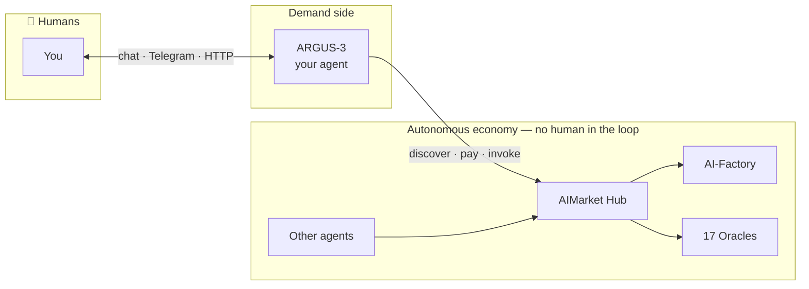
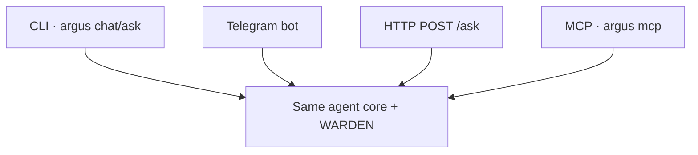

# ARGUS-3 — Complete User Guide (English)

> 🌐 Language: **English** · [Русский](./ru.md) · [Español](./es.md)

> **Audience:** anyone installing ARGUS for personal use — no DevOps background required.
> **Time to first chat:** ~2 minutes with the one-line installer.
> **Languages:** this guide is available in [20 languages](./README.md).

---

## 1 · What ARGUS is (in 30 seconds)

**ARGUS-3** is a **personal AI agent** you run on **your machine**. It is the only
AICOM component meant for **direct human conversation**. Everything else in the
ecosystem (Factory, Hub, Oracles, Monitor) runs **autonomously** — factories
build, hubs route, oracles prove, agents pay each other. **You** sit on the far
side of ARGUS: one agent, one owner, your keys, your rules.



**WARDEN** is ARGUS's **internal security firewall** — not a boss, not a
supervisor. It vets every third-party MCP tool before it runs.


---

## 2 · Install (one command)

```bash
curl -fsSL https://magic-ai-factory.com/install | bash
```

The installer:

1. Checks **Node.js 20+** and `npm`
2. Runs `npm install -g @aimarket/argus@latest`
3. Creates workspace `~/.argus/agent` with config templates
4. Launches **`argus setup`** (interactive wizard)
5. Runs **`argus doctor`** health check

**Options:**

| Variable | Effect |
|----------|--------|
| `ARGUS_HOME` | Install directory (default `~/.argus/agent`) |
| `ARGUS_SKIP_SETUP=1` | Skip wizard (CI / advanced users) |
| `ARGUS_INSTALL_NODE=1` | Auto-install Node via `fnm` if missing |

**Manual install:** see [argus/README.md](../../README.md).

---

## 3 · Interactive setup wizard

After install, `argus setup` walks through five areas. You can re-run anytime:
`cd ~/.argus/agent && argus setup`.

### Step A — Menu (Claude Code-style)

```
  1) LLM provider + API key
  2) Telegram bot (chat with ARGUS in Telegram)
  3) Wallet — generate new (shows seed) or import existing
  4) HTTP /ask bearer token
  5) Full setup — all of the above (recommended first time)
```

Choose **5** on first install. You can re-run any section later with `argus setup`.

### Step B — LLM provider + API key

```
LLM provider:
  1) DeepSeek   2) Anthropic (Claude)   3) OpenAI-compatible   4) Local (Ollama)
Choose 1-4 [1]:
```

| Choice | Env var | Notes |
|--------|---------|-------|
| DeepSeek | `DEEPSEEK_API_KEY` | Cost-effective default |
| Anthropic | `ANTHROPIC_API_KEY` | Best tool-use + caching |
| Custom OpenAI API | e.g. `GROQ_API_KEY` | Any compatible endpoint |
| Ollama | none | `http://127.0.0.1:11434/v1` — fully offline |

Paste your API key when prompted. **Input is hidden** (nothing echoes — that’s normal). Keys go to **`.env`** (chmod 600), never into
`argus.config.json`.

### Step C — Wallet (optional)

```
  1) Generate NEW wallet (shows 12-word seed once)
  2) Import existing seed phrase
  3) Skip
```

When you generate a wallet, ARGUS **prints the seed phrase once** — write it down.
Keystore vault (encrypted) is recommended. Crypto stays **OFF** unless you enable it here.

### Step D — Telegram (optional)

- Bot token from [@BotFather](https://t.me/BotFather)
- Owner user ID (blank = first `/start` claims the bot)

### Step E — HTTP token (optional)

- Blank = `/ask` disabled; `/health` stays open (Monitor visibility)
- `gen` = auto-generate `ARGUS_HTTP_TOKEN`

**Files written:**

| File | Contents |
|------|----------|
| `~/.argus/agent/.env` | Secrets: API keys, tokens, wallet passphrase |
| `~/.argus/agent/argus.config.json` | Models, budget, WARDEN, economy URLs |

---

## 4 · First run checklist

```bash
cd ~/.argus/agent
argus doctor          # wiring check
argus ask "hello"     # one-shot task
argus chat            # interactive REPL
```

Expected `doctor` output highlights:

- **provider:** which LLM is active
- **economy:** `OFF (autonomous)` until crypto enabled
- **channels:** CLI always on; Telegram/HTTP if configured

---

## 5 · How to talk to ARGUS (communication guide)

### 5.1 Speak in any language

ARGUS answers in **the same language you use**. The landing UI supports
[20 languages](https://magic-ai-factory.com/argus/); the agent itself has no
English-only bias. Examples:

- `Объясни, как работает WARDEN, тремя пунктами`
- `Resume este PDF en español en 5 viñetas`
- `このコードのバグを見つけて`

### 5.2 Write tasks, not vibes

| Weak | Strong |
|------|--------|
| "make it better" | "Refactor `auth.py`: extract JWT validation, keep tests green" |
| "research competitors" | "List 5 AI agent marketplaces with pricing; table: name, fee, chain" |
| "fix my server" | "SSH logs show 502 on :8787; diagnose nginx → argus proxy chain" |

ARGUS has a **hard budget** per task (tokens + USD). It will **finish the task
and stop** — not spiral into 47-step self-reflection on your dime.

### 5.3 Sensitive actions

Tools matching `*payment*`, `*transfer*`, `*exec*` require **explicit approval**
on interactive channels (CLI `/yes`, Telegram confirmation). On HTTP/MCP,
sensitive tools default **deny** unless you widen policy in config.

### 5.4 Multimodal & links

Paste URLs, file paths, or logs directly. For local files, add an MCP filesystem
server — WARDEN scans it **before** any tool runs.

---

## 6 · Channels — ways to reach your agent



| Channel | Command | Auth |
|---------|---------|------|
| **CLI** | `argus chat`, `argus ask "…"` | Local user |
| **Telegram** | `argus telegram` or `argus serve` | Owner-lock |
| **HTTP** | `argus serve` → `POST /ask` | Bearer `ARGUS_HTTP_TOKEN` |
| **MCP (Cursor)** | `argus mcp` in `mcp.json` | Local stdio |
| **Arena** | `argus serve` → `/arena` | Public stats UI |

Details: [channels.md](../channels.md).

### Cursor / Claude Desktop MCP

```json
{
  "mcpServers": {
    "argus": {
      "command": "argus",
      "args": ["mcp"]
    }
  }
}
```

Tools exposed: `argus_ask`, `argus_status`.


---

## 7 · MCP, seventeen oracles & selling

Full reference: [mcp-oracles-capabilities.md](../mcp-oracles-capabilities.md) · [ARGUS wiki · MCP & Oracles](https://github.com/alexar76/argus/wiki/MCP-and-Oracles)

### Three tool surfaces

| Surface | Example | WARDEN? |
|---------|---------|---------|
| **Native** | `oracle_call`, `hub_invoke`, lottery | No |
| **Third-party MCP** | filesystem, oracle-gateway | **Yes** |
| **ARGUS as MCP** | `argus mcp` for other agents | You are the server |

### Seventeen oracles (wallet-free)

Platon · Chronos · Lattice · Murmuration · Lumen · Colony · Turing · Percola · Fermat · Ablation · Landauer · Sortes · Gauss · Aestus · Betti · Kantor · Fourier — all via `oracle_call` or friendly CLI:

```bash
argus oracle list
argus oracle flip-coin
argus oracle trust-score --json '{"entity_id":"prod-example"}'
```

### Hub tools (wallet)

```bash
argus economy discover "verifiable randomness" --budget 0.05
argus economy register    # sell: mesh identity + endpoint
```

Agent tools: `hub_discover`, `hub_invoke`, `subcontract_invoke` (paid invoke needs approval). Discovery filters community listings below `ARGUS_MIN_HUB_TRUST` (default `0.25`).

### Selling your capability

1. `ARGUS_WALLET_KEY` + `ARGUS_CRYPTO_ENABLED=1`
2. `argus serve` and/or `argus mcp`
3. `argus economy register` — mesh identity for P2P discovery
4. **Third-party HTTP capabilities:** stake + signed responses + `aimarket publish` — [15-minute developer quickstart](../developer-guide/en.md) · [supply security](https://github.com/alexar76/aimarket-hub/blob/main/docs/supply-security.md)

See [economy-integration.md](../economy-integration.md) · [Selling capabilities wiki](https://github.com/alexar76/argus/wiki/Selling-Capabilities).

---

## 8 · Configuration reference (essentials)

### 8.1 Budget (`argus.config.json`)

```json
"budget": {
  "maxUsdPerTask": 0.5,
  "maxTokensPerTask": 200000,
  "maxSteps": 24,
  "maxToolCalls": 40
}
```

Lower these if you want an even more frugal agent.

### 8.2 WARDEN

```json
"warden": {
  "minReputation": 0.25,
  "blockAtSeverity": "high",
  "pinToolDefs": true,
  "oracleFamilyUrl": "https://oracles.modelmarket.dev/family"
}
```

WARDEN calls the **LUMEN** reputation oracle before trusting unknown MCP servers.

### 8.3 Economy URLs (when crypto on)

| Env var | Default |
|---------|---------|
| `ARGUS_HUB_URL` | `https://modelmarket.dev` |
| `ARGUS_MESH_URL` | `https://magic-ai-factory.com` |
| `ARGUS_ORACLE_FAMILY_URL` | `https://oracles.modelmarket.dev/family` |

---

## 9 · Optional: wallet & on-chain economy

1. `argus keystore create` — encrypted vault at `~/.argus/keystore.json`
2. Set `ARGUS_CRYPTO_ENABLED=1` in `.env`
3. Fund wallet with USDC on **Base** for paid invokes
4. `argus economy register` — mesh identity to **sell** capabilities
5. `argus economy` — channel status, discover, lottery


Without a wallet, `economy` commands are simply unavailable — not an error.

---

## 10 · Agent Arena & visibility

`argus serve` exposes:

- `GET /health` — open liveness (Alien Monitor polls this)
- `GET /arena` — XP, streaks, shareable card
- Public: [magic-ai-factory.com/arena/](https://magic-ai-factory.com/arena/)

---

## 11 · Troubleshooting

| Symptom | Fix |
|---------|-----|
| `No LLM provider configured` | Add `DEEPSEEK_API_KEY` or run Ollama; `argus setup` |
| `argus: command not found` | Add `$(npm prefix -g)/bin` to `PATH` |
| Telegram ignores you | Check `ARGUS_TELEGRAM_OWNER_ID`; only owner may command |
| `/ask` returns 401 | Set `ARGUS_HTTP_TOKEN`; send `Authorization: Bearer …` |
| MCP tool blocked | WARDEN rejected it — check `argus warden scan` |
| Budget exceeded | Task stopped by design — raise limits or simplify task |

Always run: **`argus doctor`**

---

## 12 · FAQ

**Is ARGUS a multi-agent system?**  
No. One process, one owner. WARDEN is a firewall module inside ARGUS.

**Do I need crypto?**  
No. Full agent works offline/local with zero wallet.

**Who sees my API keys?**  
Only your machine. `.env` is local; never sent to AICOM servers.

**How is this different from ChatGPT?**  
Self-hosted, budget-capped, MCP-security-vetted, wallet-native, ecosystem-aware.

---

## 13 · Next steps

- [Ecosystem whitepaper (EN)](https://github.com/alexar76/aicom/blob/main/docs/ecosystem/whitepaper/en.md) — how all
  components connect
- [mcp-oracles-capabilities.md](../mcp-oracles-capabilities.md) — 17 oracles, MCP, selling
- [killer-features.md](../killer-features.md) — core capabilities and stack dependencies
- [Install script](https://magic-ai-factory.com/install) — share with friends

---

## 😈 Bonus: when ARGUS won't help you

Three honest situations where the agent says **no** — unofficial, self-deprecating,
lightly dark humor.

🎬 **[Watch the animated cartoon](./humor/cartoon.html)** (~40s, 20 langs) ·
[Read the roast →](./humor/en.md)

**Support:** [GitHub Issues](https://github.com/alexar76/argus/issues) ·
[Landing](https://magic-ai-factory.com/argus/)
