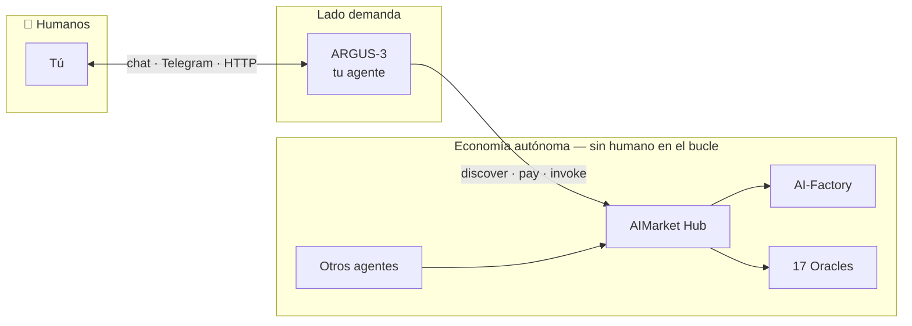
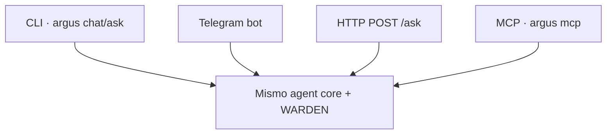

# ARGUS-3 — Guía completa de usuario (Español)

> 🌐 Idiomas: [English](./en.md) · [Русский](./ru.md) · **Español**

> **Audiencia:** cualquiera que instale ARGUS para uso personal — no se requiere experiencia DevOps.
> **Tiempo hasta el primer chat:** ~2 minutos con el instalador de una línea.
> **Idiomas:** esta guía está disponible en [20 idiomas](./README.md).

---

## 1 · Qué es ARGUS (en 30 segundos)

**ARGUS-3** es un **agente de IA personal** que ejecutas **en tu máquina**. Es el único
componente de AICOM pensado para **conversación directa con humanos**. Todo lo demás en la
ecosistema (Factory, Hub, Oracles, Monitor) funciona **de forma autónoma** — las fábricas
construyen, los hubs enrutan, los oráculos prueban, los agentes se pagan entre sí. **Tú** estás al otro
lado de ARGUS: un agente, un dueño, tus claves, tus reglas.



**WARDEN** es el **firewall de seguridad interno** de ARGUS — no un jefe, no un
supervisor. Examina cada herramienta MCP de terceros antes de ejecutarla.


---

## 2 · Instalación (un comando)

```bash
curl -fsSL https://magic-ai-factory.com/install | bash
```

El instalador:

1. Comprueba **Node.js 20+** y `npm`
2. Ejecuta `npm install -g @aimarket/argus@latest`
3. Crea workspace `~/.argus/agent` con plantillas de config
4. Lanza **`argus setup`** (asistente interactivo)
5. Ejecuta **`argus doctor`** — chequeo de salud

**Opciones:**

| Variable | Efecto |
|----------|--------|
| `ARGUS_HOME` | Directorio de instalación (por defecto `~/.argus/agent`) |
| `ARGUS_SKIP_SETUP=1` | Omitir asistente (CI / usuarios avanzados) |
| `ARGUS_INSTALL_NODE=1` | Auto-instalar Node vía `fnm` si falta |

**Instalación manual:** ver [argus/README.md](../../README.md).

---

## 3 · Asistente de configuración interactivo

Tras instalar, `argus setup` recorre cinco áreas. Puedes relanzarlo en cualquier momento:
`cd ~/.argus/agent && argus setup`.

### Paso A — Menú (estilo Claude Code)

```
  1) LLM provider + API key
  2) Telegram bot (chatea con ARGUS en Telegram)
  3) Wallet — generate new (shows seed) or import existing
  4) HTTP /ask bearer token
  5) Full setup — all of the above (recommended first time)
```

Elige **5** en la primera instalación. Puedes relanzar cualquier sección después con `argus setup`.

### Paso B — LLM provider + API key

```
LLM provider:
  1) DeepSeek   2) Anthropic (Claude)   3) OpenAI-compatible   4) Local (Ollama)
Choose 1-4 [1]:
```

| Elección | Env var | Notas |
|--------|---------|-------|
| DeepSeek | `DEEPSEEK_API_KEY` | Opción económica por defecto |
| Anthropic | `ANTHROPIC_API_KEY` | Mejor tool-use + caching |
| Custom OpenAI API | p. ej. `GROQ_API_KEY` | Cualquier endpoint compatible |
| Ollama | none | `http://127.0.0.1:11434/v1` — totalmente offline |

Pega tu API key cuando se solicite. **La entrada está oculta** (nada se muestra — es normal). Las claves van a **`.env`** (chmod 600), nunca a
`argus.config.json`.

### Paso C — Wallet (opcional)

```
  1) Generate NEW wallet (shows 12-word seed once)
  2) Import existing seed phrase
  3) Skip
```

Al generar wallet, ARGUS **imprime la seed phrase una vez** — anótala.
Keystore vault (cifrado) recomendado. Crypto permanece **OFF** salvo que lo habilites aquí.

### Paso D — Telegram (opcional)

- Bot token de [@BotFather](https://t.me/BotFather)
- Owner user ID (vacío = el primer `/start` reclama el bot)

### Paso E — HTTP token (opcional)

- Vacío = `/ask` deshabilitado; `/health` permanece abierto (visibilidad Monitor)
- `gen` = auto-generar `ARGUS_HTTP_TOKEN`

**Archivos escritos:**

| Archivo | Contenido |
|------|----------|
| `~/.argus/agent/.env` | Secretos: API keys, tokens, wallet passphrase |
| `~/.argus/agent/argus.config.json` | Models, budget, WARDEN, economy URLs |

---

## 4 · Checklist del primer arranque

```bash
cd ~/.argus/agent
argus doctor          # chequeo de cableado
argus ask "hello"     # tarea única
argus chat            # REPL interactivo
```

Highlights esperados de `doctor`:

- **provider:** qué LLM está activo
- **economy:** `OFF (autonomous)` hasta habilitar crypto
- **channels:** CLI siempre activo; Telegram/HTTP si configurado

---

## 5 · Cómo hablar con ARGUS (guía de comunicación)

### 5.1 Habla en cualquier idioma

ARGUS responde **en el mismo idioma que uses**. La landing UI soporta
[20 idiomas](https://magic-ai-factory.com/argus/); el agente en sí no tiene
sesgo solo-inglés. Ejemplos:

- `Объясни, как работает WARDEN, тремя пунктами`
- `Resume este PDF en español en 5 viñetas`
- `このコードのバグを見つけて`

### 5.2 Escribe tareas, no vibes

| Débil | Fuerte |
|------|--------|
| "make it better" | "Refactor `auth.py`: extract JWT validation, keep tests green" |
| "research competitors" | "List 5 AI agent marketplaces with pricing; table: name, fee, chain" |
| "fix my server" | "SSH logs show 502 on :8787; diagnose nginx → argus proxy chain" |

ARGUS tiene un **presupuesto duro** por tarea (tokens + USD). **Terminará la tarea
y parará** — no entrará en autorreflexión de 47 pasos a tu costa.

### 5.3 Acciones sensibles

Herramientas que coinciden con `*payment*`, `*transfer*`, `*exec*` requieren **aprobación explícita**
en canales interactivos (CLI `/yes`, confirmación Telegram). En HTTP/MCP,
herramientas sensibles por defecto **deny** salvo que amplíes la política en config.

### 5.4 Multimodal y enlaces

Pega URLs, rutas de archivo o logs directamente. Para archivos locales, añade un MCP filesystem
server — WARDEN lo escanea **antes** de ejecutar cualquier herramienta.

---

## 6 · Canales — formas de alcanzar tu agente



| Canal | Comando | Auth |
|---------|---------|------|
| **CLI** | `argus chat`, `argus ask "…"` | Local user |
| **Telegram** | `argus telegram` or `argus serve` | Owner-lock |
| **HTTP** | `argus serve` → `POST /ask` | Bearer `ARGUS_HTTP_TOKEN` |
| **MCP (Cursor)** | `argus mcp` in `mcp.json` | Local stdio |
| **Arena** | `argus serve` → `/arena` | Public stats UI |

Detalles: [channels.md](../channels.md).

### Cursor / Claude Desktop MCP

```json
{
  "mcpServers": {
    "argus": {
      "command": "argus",
      "args": ["mcp"]
    }
  }
}
```

Herramientas expuestas: `argus_ask`, `argus_status`.


---

## 7 · MCP, diecisiete oracles y venta

Referencia completa: [mcp-oracles-capabilities.md](../mcp-oracles-capabilities.md) · [ARGUS wiki · MCP & Oracles](https://github.com/alexar76/argus/wiki/MCP-and-Oracles)

### Tres superficies de herramientas

| Superficie | Ejemplo | WARDEN? |
|---------|---------|---------|
| **Native** | `oracle_call`, `hub_invoke`, lottery | No |
| **Third-party MCP** | filesystem, oracle-gateway | **Yes** |
| **ARGUS as MCP** | `argus mcp` for other agents | You are the server |

### Diecisiete oracles (sin wallet)

Platon · Chronos · Lattice · Murmuration · Lumen · Colony · Turing · Percola · Fermat · Ablation · Landauer · Sortes · Gauss · Aestus · Betti · Kantor · Fourier — todos vía `oracle_call` o CLI amigable:

```bash
argus oracle list
argus oracle flip-coin
argus oracle trust-score --json '{"entity_id":"prod-example"}'
```

### Hub tools (con wallet)

```bash
argus economy discover "verifiable randomness" --budget 0.05
argus economy register    # sell: mesh identity + endpoint
```

Agent tools: `hub_discover`, `hub_invoke`, `subcontract_invoke` (invoke pagado necesita aprobación). Discovery filtra listados community por debajo de `ARGUS_MIN_HUB_TRUST` (por defecto `0.25`).

### Vender tu capability

1. `ARGUS_WALLET_KEY` + `ARGUS_CRYPTO_ENABLED=1`
2. `argus serve` and/or `argus mcp`
3. `argus economy register` — mesh identity para P2P discovery
4. **Capabilities HTTP de terceros:** stake + signed responses + `aimarket publish` — [quickstart desarrollador 15 min](../developer-guide/es.md) · [supply security](https://github.com/alexar76/aimarket-hub/blob/main/docs/supply-security.md)

Ver [economy-integration.md](../economy-integration.md) · [Selling capabilities wiki](https://github.com/alexar76/argus/wiki/Selling-Capabilities).

---

## 8 · Referencia de configuración (esencial)

### 8.1 Budget (`argus.config.json`)

```json
"budget": {
  "maxUsdPerTask": 0.5,
  "maxTokensPerTask": 200000,
  "maxSteps": 24,
  "maxToolCalls": 40
}
```

Baja estos valores si quieres un agente aún más frugal.

### 8.2 WARDEN

```json
"warden": {
  "minReputation": 0.25,
  "blockAtSeverity": "high",
  "pinToolDefs": true,
  "oracleFamilyUrl": "https://oracles.modelmarket.dev/family"
}
```

WARDEN llama al reputation oracle **LUMEN** antes de confiar en MCP servers desconocidos.

### 8.3 Economy URLs (con crypto activo)

| Env var | Default |
|---------|---------|
| `ARGUS_HUB_URL` | `https://modelmarket.dev` |
| `ARGUS_MESH_URL` | `https://magic-ai-factory.com` |
| `ARGUS_ORACLE_FAMILY_URL` | `https://oracles.modelmarket.dev/family` |

---

## 9 · Opcional: wallet y economía on-chain

1. `argus keystore create` — vault cifrado en `~/.argus/keystore.json`
2. Configura `ARGUS_CRYPTO_ENABLED=1` en `.env`
3. Financia wallet con USDC en **Base** para invokes pagados
4. `argus economy register` — mesh identity para **vender** capabilities
5. `argus economy` — channel status, discover, lottery


Sin wallet, los comandos `economy` simplemente no están disponibles — no es un error.

---

## 10 · Agent Arena y visibilidad

`argus serve` expone:

- `GET /health` — liveness abierto (Alien Monitor consulta esto)
- `GET /arena` — XP, streaks, shareable card
- Público: [magic-ai-factory.com/arena/](https://magic-ai-factory.com/arena/)

---

## 11 · Solución de problemas

| Síntoma | Solución |
|---------|-----|
| `No LLM provider configured` | Añade `DEEPSEEK_API_KEY` o ejecuta Ollama; `argus setup` |
| `argus: command not found` | Añade `$(npm prefix -g)/bin` a `PATH` |
| Telegram te ignora | Comprueba `ARGUS_TELEGRAM_OWNER_ID`; solo el owner puede mandar |
| `/ask` devuelve 401 | Configura `ARGUS_HTTP_TOKEN`; envía `Authorization: Bearer …` |
| MCP tool blocked | WARDEN lo rechazó — comprueba `argus warden scan` |
| Budget exceeded | Tarea detenida por diseño — sube límites o simplifica la tarea |

Siempre ejecuta: **`argus doctor`**

---

## 12 · FAQ

**¿ARGUS es un sistema multi-agente?**  
No. Un proceso, un dueño. WARDEN es un módulo firewall dentro de ARGUS.

**¿Necesito crypto?**  
No. El agente completo funciona offline/local sin wallet.

**¿Quién ve mis API keys?**  
Solo tu máquina. `.env` es local; nunca se envía a servidores AICOM.

**¿En qué se diferencia de ChatGPT?**  
Self-hosted, budget-capped, MCP-security-vetted, wallet-native, ecosystem-aware.

---

## 13 · Próximos pasos

- [Ecosystem whitepaper (EN)](https://github.com/alexar76/aicom/blob/main/docs/ecosystem/whitepaper/en.md) — cómo se conectan todos
  los componentes
- [mcp-oracles-capabilities.md](../mcp-oracles-capabilities.md) — 17 oracles, MCP, selling
- [killer-features.md](../killer-features.md) — core capabilities y stack dependencies
- [Install script](https://magic-ai-factory.com/install) — comparte con amigos

---

## 😈 Bonus: cuando ARGUS no te ayudará

Tres situaciones honestas donde el agente dice **no** — no oficial, autocrítico,
con humor negro ligero.

🎬 **[Ver el cartoon animado](./humor/cartoon.html)** (~40s, 20 langs) ·
[Leer el roast →](./humor/es.md)

**Soporte:** [GitHub Issues](https://github.com/alexar76/argus/issues) ·
[Landing](https://magic-ai-factory.com/argus/)
