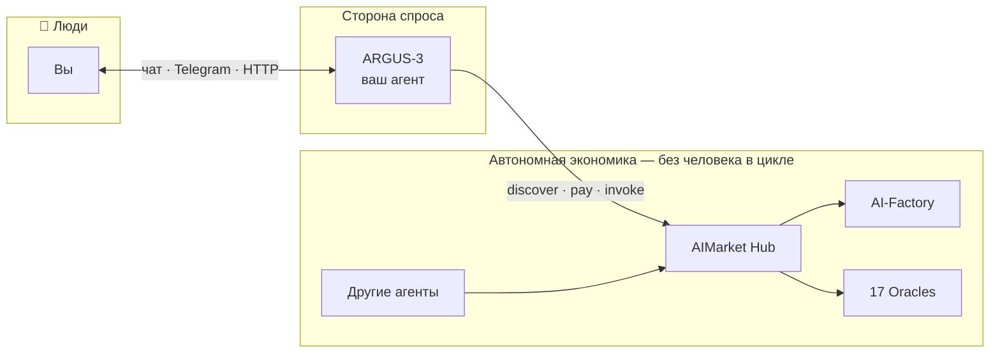
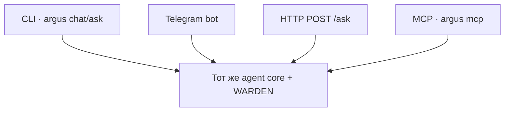

# ARGUS-3 — Полное руководство пользователя (Русский)

> 🌐 Язык: [English](./en.md) · **Русский** · [Español](./es.md)

> **Аудитория:** все, кто устанавливает ARGUS для личного использования — DevOps-опыт не требуется.
> **Время до первого чата:** ~2 минуты с однострочным установщиком.
> **Языки:** это руководство доступно на [20 языках](./README.md).

---

## 1 · Что такое ARGUS (за 30 секунд)

**ARGUS-3** — **персональный AI-агент**, который вы запускаете **на своей машине**. Это единственный
компонент AICOM, предназначенный для **прямого общения с человеком**. Всё остальное в
экосистеме (Factory, Hub, Oracles, Monitor) работает **автономно** — фабрики
строят, хабы маршрутизируют, оракулы доказывают, агенты платят друг другу. **Вы** находитесь на дальней
стороне ARGUS: один агент, один владелец, ваши ключи, ваши правила.



**WARDEN** — **внутний брандмауэр безопасности** ARGUS — не начальник и не
надзиратель. Он проверяет каждый сторонний MCP-инструмент перед запуском.


---

## 2 · Установка (одна команда)

```bash
curl -fsSL https://magic-ai-factory.com/install | bash
```

Установщик:

1. Проверяет **Node.js 20+** и `npm`
2. Запускает `npm install -g @aimarket/argus@latest`
3. Создаёт workspace `~/.argus/agent` с шаблонами конфигурации
4. Запускает **`argus setup`** (интерактивный мастер)
5. Запускает **`argus doctor`** — проверку здоровья

**Опции:**

| Переменная | Эффект |
|----------|--------|
| `ARGUS_HOME` | Каталог установки (по умолчанию `~/.argus/agent`) |
| `ARGUS_SKIP_SETUP=1` | Пропустить мастер (CI / продвинутые пользователи) |
| `ARGUS_INSTALL_NODE=1` | Автоустановка Node через `fnm`, если отсутствует |

**Ручная установка:** см. [argus/README.md](../../README.md).

---

## 3 · Интерактивный мастер настройки

После установки `argus setup` проходит пять областей. Можно перезапустить в любой момент:
`cd ~/.argus/agent && argus setup`.

### Шаг A — Меню (в стиле Claude Code)

```
  1) LLM provider + API key
  2) Telegram bot (чат с ARGUS в Telegram)
  3) Wallet — generate new (shows seed) or import existing
  4) HTTP /ask bearer token
  5) Full setup — all of the above (recommended first time)
```

При первой установке выберите **5**. Любой раздел можно перезапустить позже через `argus setup`.

### Шаг B — LLM provider + API key

```
LLM provider:
  1) DeepSeek   2) Anthropic (Claude)   3) OpenAI-compatible   4) Local (Ollama)
Choose 1-4 [1]:
```

| Выбор | Env var | Примечания |
|--------|---------|-------|
| DeepSeek | `DEEPSEEK_API_KEY` | Экономичный вариант по умолчанию |
| Anthropic | `ANTHROPIC_API_KEY` | Лучший tool-use + caching |
| Custom OpenAI API | напр. `GROQ_API_KEY` | Любой совместимый endpoint |
| Ollama | none | `http://127.0.0.1:11434/v1` — полностью offline |

Вставьте API key по запросу. **Ввод скрыт** (ничего не отображается — это нормально). Ключи попадают в **`.env`** (chmod 600), никогда в
`argus.config.json`.

### Шаг C — Wallet (опционально)

```
  1) Generate NEW wallet (shows 12-word seed once)
  2) Import existing seed phrase
  3) Skip
```

При генерации кошелька ARGUS **печатает seed phrase один раз** — запишите его.
Keystore vault (зашифрованный) рекомендуется. Crypto остаётся **ВЫКЛ**, если вы не включите его здесь.

### Шаг D — Telegram (опционально)

- Bot token от [@BotFather](https://t.me/BotFather)
- Owner user ID (пусто = первый `/start` закрепляет бота)

### Шаг E — HTTP token (опционально)

- Пусто = `/ask` отключён; `/health` остаётся открытым (видимость для Monitor)
- `gen` = автогенерация `ARGUS_HTTP_TOKEN`

**Записываемые файлы:**

| Файл | Содержимое |
|------|----------|
| `~/.argus/agent/.env` | Секреты: API keys, tokens, wallet passphrase |
| `~/.argus/agent/argus.config.json` | Models, budget, WARDEN, economy URLs |

---

## 4 · Чеклист первого запуска

```bash
cd ~/.argus/agent
argus doctor          # проверка подключений
argus ask "hello"     # одноразовая задача
argus chat            # интерактивный REPL
```

Ожидаемые highlights вывода `doctor`:

- **provider:** какой LLM активен
- **economy:** `OFF (autonomous)` до включения crypto
- **channels:** CLI всегда включён; Telegram/HTTP при настройке

---

## 5 · Как общаться с ARGUS (руководство по коммуникации)

### 5.1 Говорите на любом языке

ARGUS отвечает **на том же языке, что и вы**. Landing UI поддерживает
[20 языков](https://magic-ai-factory.com/argus/); сам агент не
привязан к английскому. Примеры:

- `Объясни, как работает WARDEN, тремя пунктами`
- `Resume este PDF en español en 5 viñetas`
- `このコードのバグを見つけて`

### 5.2 Формулируйте задачи, а не «настроение»

| Слабо | Сильно |
|------|--------|
| "make it better" | "Refactor `auth.py`: extract JWT validation, keep tests green" |
| "research competitors" | "List 5 AI agent marketplaces with pricing; table: name, fee, chain" |
| "fix my server" | "SSH logs show 502 on :8787; diagnose nginx → argus proxy chain" |

У ARGUS **жёсткий бюджет** на задачу (tokens + USD). Он **завершит задачу
и остановится** — не уйдёт в 47-шаговую саморефлексию за ваш счёт.

### 5.3 Чувствительные действия

Инструменты, совпадающие с `*payment*`, `*transfer*`, `*exec*`, требуют **явного одобрения**
на интерактивных каналах (CLI `/yes`, подтверждение в Telegram). На HTTP/MCP
чувствительные инструменты по умолчанию **deny**, если вы не расширите политику в config.

### 5.4 Мультимодальность и ссылки

Вставляйте URL, пути к файлам или логи напрямую. Для локальных файлов добавьте MCP filesystem
server — WARDEN сканирует его **до** запуска любого инструмента.

---

## 6 · Каналы — способы связи с агентом



| Канал | Команда | Auth |
|---------|---------|------|
| **CLI** | `argus chat`, `argus ask "…"` | Local user |
| **Telegram** | `argus telegram` or `argus serve` | Owner-lock |
| **HTTP** | `argus serve` → `POST /ask` | Bearer `ARGUS_HTTP_TOKEN` |
| **MCP (Cursor)** | `argus mcp` in `mcp.json` | Local stdio |
| **Arena** | `argus serve` → `/arena` | Public stats UI |

Подробности: [channels.md](../channels.md).

### Cursor / Claude Desktop MCP

```json
{
  "mcpServers": {
    "argus": {
      "command": "argus",
      "args": ["mcp"]
    }
  }
}
```

Экспонируемые инструменты: `argus_ask`, `argus_status`.


---

## 7 · MCP, семнадцать oracles и продажа

Полный справочник: [mcp-oracles-capabilities.md](../mcp-oracles-capabilities.md) · [ARGUS wiki · MCP & Oracles](https://github.com/alexar76/argus/wiki/MCP-and-Oracles)

### Три поверхности инструментов

| Поверхность | Пример | WARDEN? |
|---------|---------|---------|
| **Native** | `oracle_call`, `hub_invoke`, lottery | No |
| **Third-party MCP** | filesystem, oracle-gateway | **Yes** |
| **ARGUS as MCP** | `argus mcp` for other agents | You are the server |

### Семнадцать oracles (без кошелька)

Platon · Chronos · Lattice · Murmuration · Lumen · Colony · Turing · Percola · Fermat · Ablation · Landauer · Sortes · Gauss · Aestus · Betti · Kantor · Fourier — все через `oracle_call` или дружелюбный CLI:

```bash
argus oracle list
argus oracle flip-coin
argus oracle trust-score --json '{"entity_id":"prod-example"}'
```

### Hub tools (с кошельком)

```bash
argus economy discover "verifiable randomness" --budget 0.05
argus economy register    # sell: mesh identity + endpoint
```

Agent tools: `hub_discover`, `hub_invoke`, `subcontract_invoke` (платный invoke требует одобрения). Discovery фильтрует community listings ниже `ARGUS_MIN_HUB_TRUST` (по умолчанию `0.25`).

### Продажа вашей capability

1. `ARGUS_WALLET_KEY` + `ARGUS_CRYPTO_ENABLED=1`
2. `argus serve` and/or `argus mcp`
3. `argus economy register` — mesh identity для P2P discovery
4. **Сторонние HTTP capabilities:** stake + signed responses + `aimarket publish` — [15-минутный developer quickstart](../developer-guide/ru.md) · [supply security](https://github.com/alexar76/aimarket-hub/blob/main/docs/supply-security.md)

См. [economy-integration.md](../economy-integration.md) · [Selling capabilities wiki](https://github.com/alexar76/argus/wiki/Selling-Capabilities).

---

## 8 · Справочник конфигурации (основное)

### 8.1 Budget (`argus.config.json`)

```json
"budget": {
  "maxUsdPerTask": 0.5,
  "maxTokensPerTask": 200000,
  "maxSteps": 24,
  "maxToolCalls": 40
}
```

Уменьшите значения, если нужен ещё более экономный агент.

### 8.2 WARDEN

```json
"warden": {
  "minReputation": 0.25,
  "blockAtSeverity": "high",
  "pinToolDefs": true,
  "oracleFamilyUrl": "https://oracles.modelmarket.dev/family"
}
```

WARDEN вызывает reputation oracle **LUMEN** перед доверием неизвестным MCP servers.

### 8.3 Economy URLs (при включённой crypto)

| Env var | Default |
|---------|---------|
| `ARGUS_HUB_URL` | `https://modelmarket.dev` |
| `ARGUS_MESH_URL` | `https://magic-ai-factory.com` |
| `ARGUS_ORACLE_FAMILY_URL` | `https://oracles.modelmarket.dev/family` |

---

## 9 · Опционально: кошелёк и on-chain economy

1. `argus keystore create` — зашифрованный vault в `~/.argus/keystore.json`
2. Установите `ARGUS_CRYPTO_ENABLED=1` в `.env`
3. Пополните wallet USDC в **Base** для платных invokes
4. `argus economy register` — mesh identity для **продажи** capabilities
5. `argus economy` — channel status, discover, lottery


Без кошелька команды `economy` просто недоступны — это не ошибка.

---

## 10 · Agent Arena и видимость

`argus serve` экспонирует:

- `GET /health` — открытый liveness (Alien Monitor опрашивает это)
- `GET /arena` — XP, streaks, shareable card
- Публично: [magic-ai-factory.com/arena/](https://magic-ai-factory.com/arena/)

---

## 11 · Устранение неполадок

| Симптом | Решение |
|---------|-----|
| `No LLM provider configured` | Добавьте `DEEPSEEK_API_KEY` или запустите Ollama; `argus setup` |
| `argus: command not found` | Добавьте `$(npm prefix -g)/bin` в `PATH` |
| Telegram вас игнорирует | Проверьте `ARGUS_TELEGRAM_OWNER_ID`; команды только от owner |
| `/ask` возвращает 401 | Установите `ARGUS_HTTP_TOKEN`; отправьте `Authorization: Bearer …` |
| MCP tool blocked | WARDEN отклонил — проверьте `argus warden scan` |
| Budget exceeded | Задача остановлена по дизайну — поднимите лимиты или упростите задачу |

Всегда запускайте: **`argus doctor`**

---

## 12 · FAQ

**ARGUS — это multi-agent система?**  
Нет. Один процесс, один владелец. WARDEN — модуль firewall внутри ARGUS.

**Нужна ли crypto?**  
Нет. Полный агент работает offline/local без кошелька.

**Кто видит мои API keys?**  
Только ваша машина. `.env` локален; никогда не отправляется на серверы AICOM.

**Чем это отличается от ChatGPT?**  
Self-hosted, budget-capped, MCP-security-vetted, wallet-native, ecosystem-aware.

---

## 13 · Следующие шаги

- [Ecosystem whitepaper (EN)](https://github.com/alexar76/aicom/blob/main/docs/ecosystem/whitepaper/en.md) — как все
  компоненты связаны
- [mcp-oracles-capabilities.md](../mcp-oracles-capabilities.md) — 17 oracles, MCP, selling
- [killer-features.md](../killer-features.md) — core capabilities и stack dependencies
- [Install script](https://magic-ai-factory.com/install) — поделитесь с друзьями

---

## 😈 Бонус: когда ARGUS вам не поможет

Три честные ситуации, где агент говорит **нет** — неофициально, с самоиронией
и лёгким чёрным юмором.

🎬 **[Смотреть анимированный мультфильм](./humor/cartoon.html)** (~40s, 20 langs) ·
[Читать roast →](./humor/ru.md)

**Поддержка:** [GitHub Issues](https://github.com/alexar76/argus/issues) ·
[Landing](https://magic-ai-factory.com/argus/)
