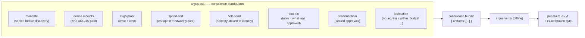
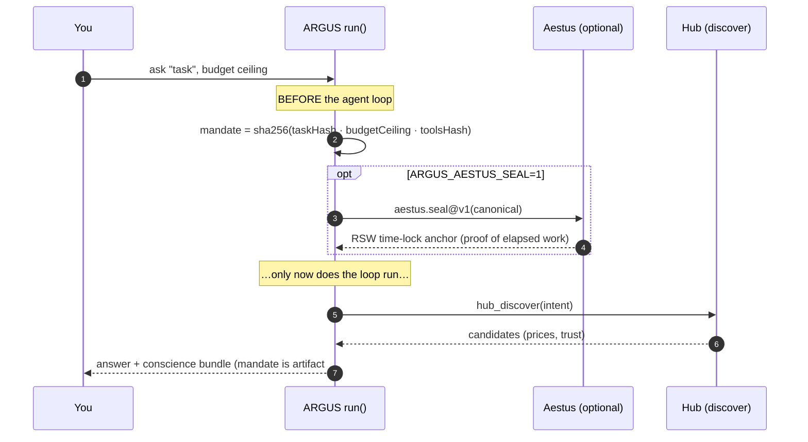
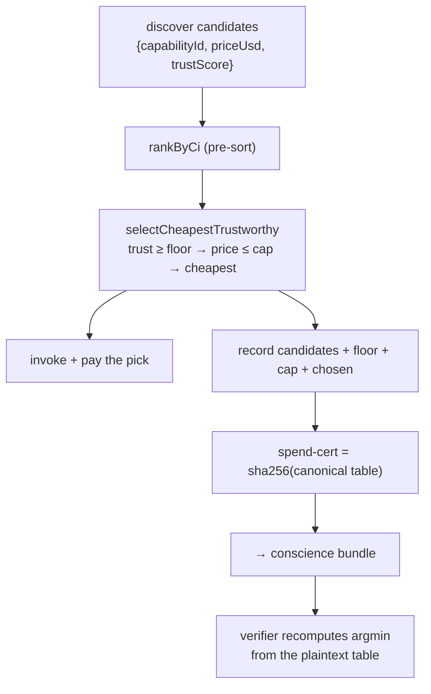
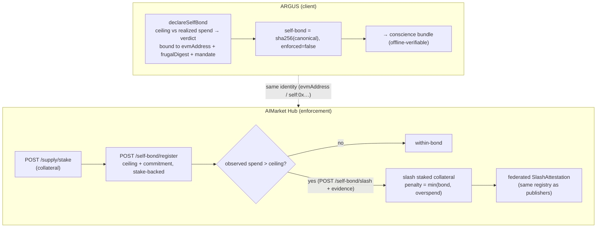

# La conciencia verificable

> 🌐 Idiomas: [English](./verifiable-conscience.md) · [Русский](./verifiable-conscience-ru.md) · **Español**

> **Todo otro agente te pide que _confíes_ en él. ARGUS te entrega una prueba y te desafía a _refutarla_.**

La superpotencia definitoria de ARGUS es que las cosas consecuentes que hace en un run vienen empaquetadas
en **un artefacto offline-recheckable** — un *conscience bundle*. Un tercero que no confía
ni en ARGUS, ni en la red, ni en AICOM ejecuta `argus verify <bundle>` y obtiene un **pass/fail por
cada claim**, usando criptografía local pura (Ed25519 verify + SHA-256 recompute): **cero red,
sin cartera**. Si una prueba no se re-verifica aquí, era un claim — no una prueba.

Este documento describe cada mecanismo con diagramas de bloques, luego el alcance honesto de cada uno.

---

## 1. Qué hay en el bundle



Cada artefacto es uno de cinco tipos de verificador — `oracle-receipt`, `commitment`, `tool-pin`,
`sealed-chain`, `attestation`. `mandate`, `spend-cert` y `self-bond` viajan como artefactos **`commitment`**
(un SHA-256 sobre un canonical plaintext), así que el verificador **no necesita código nuevo** ni
clave pública para ellos — cualquiera recalcula `sha256(preimage) == hash` y re-deriva la
aritmética embebida a mano.

| Artifact | Prueba | Re-check (offline) |
|---|---|---|
| `mandate` | la tarea+presupuesto+tools quedaron fijados **antes** del discovery | sha256(canonical) |
| `oracle-receipt` | el resultado firmado de un proveedor es auténtico | Ed25519 over the 7-field receipt |
| `frugalproof` | el digest de coste de la sesión | sha256(canonical) |
| `spend-cert` | cada subcontrato compró la opción confiable más barata mostrada | sha256 + hand-recomputed argmin |
| `self-bond` | frugalidad+conducta apostadas a la identidad de ARGUS | sha256(canonical) |
| `tool-pin` | las tools que corrieron == las aprobadas | canonical tool-def hash |
| `sealed-chain` | la cadena de consentimiento está intacta (reordenar/editar ⇒ `brokenAt`) | re-derive chain + Ed25519 head seal |
| `attestation` | las garantías negativas se cumplieron | Ed25519 over the signed canonical |

---

## 2. Seal-before-discover (el mandate)

ARGUS se compromete a **lo que estaba autorizado a hacer** antes de ver **a quién pagará** —
así ningún pitch o precio de proveedor puede reorientar la tarea a mitad del run.



- **Núcleo offline:** un SHA-256 commitment sobre `{taskHash, budgetUsd, toolsHash, sealedAt}` —
  instantáneo, zero-dependency, genuinamente before-discover (calculado al inicio del run).
- **Ancla opcional:** `ARGUS_AESTUS_SEAL=1` además envuelve el canonical en un Aestus RSW
  time-lock (un mínimo de elevaciones secuenciales reales) — un ancla *online*, no parte del
  check offline.

---

## 3. Spend-cert (elección confiable más barata)

Cuando ARGUS subcontrata (`subcontract_invoke`), registra el conjunto de candidatos + regla + la elección,
para que un verificador confirme que pagó la **opción más barata por encima del piso de confianza** que se le mostró.



> **Alcance honesto.** Esto es un **ARGMIN sobre el conjunto registrado**, *no* un certificado
> Fermat/Kantor LP-dual (esos son para enrutamiento multi-hop, que la ruta spend de una capability por llamada
> no hace). Asume que el hub devolvió un conjunto completo a precios honestos; prueba la elección sobre
> **lo que se registró**, no optimalidad global, ni el precio liquidado. La misma
> función `selectCheapestTrustworthy` toma la decisión en vivo y forma el cert, así el cert prueba la
> elección *real*. Un `hub_invoke` plano (capability elegida por LLM sin regla) no produce
> spend-cert — y el bundle lo dice.

---

## 4. Self-bond + hub self-slash (honestidad bajo el mismo tribunal)

ARGUS apuesta sus **propias** claims de frugalidad/conducta bajo el mismo slashing court con el que juzga
a otros. Hay dos mitades: una **declaración cliente** (siempre offline-verifiable) y la
**aplicación hub** (stake real + slash).



- **Cliente (`ARGUS_SELF_BOND_USD>0` + wallet):** un SHA-256 self-indictment que vincula el digest
  de coste, hash de attestation, commitment mandate, techo declarado y gasto realizado a la
  identidad de cartera de ARGUS, con un veredicto auto-puntuado. `enforced` es **siempre false** aquí — es una
  declaración que un extraño puede refutar offline, **no** un stake financiero en vivo. No se mueven fondos.
- **Hub (`/ai-market/v2/self-bond/*`):** el bond debe estar respaldado por collateral real en stake
  (`/supply/stake`). En una **brecha declared-ceiling-vs-observed-spend**, el hub corta ese
  collateral (`penalty = min(bond, overspend)`) y **federiza** la slash attestation por el mismo registry que usan los slashes de publishers.

> **Alcance honesto.** El hub corta contra el observed spend **enviado con la disputa**
> (espejo de un `ProofOfMisbehavior`); contrastarlo con **settlement receipts** emitidos por el hub
> es el follow-up más profundo. El hub no ve el token spend off-hub de ARGUS — solo lo que fluyó
> por él — así que corta sobre valores **hub-observables**, nunca sobre un número que no puede verificar.

### Endpoints Hub

| Method | Path | Propósito |
|---|---|---|
| `POST` | `/ai-market/v2/self-bond/register` | stake-backed bond: agent_id, evm_address, ceiling_usd, bond_usd, commitment |
| `POST` | `/ai-market/v2/self-bond/slash` | slash en breach: agent_id, observed_spend_usd, evidence (open, dispute-style) |
| `GET` | `/ai-market/v2/self-bond/{agent_id}` | leer el estado de un bond |

---

## 5. Verificar un bundle

```bash
argus ask "summarize doc X" --budget 0.01 --conscience bundle.json   # produce
argus verify bundle.json                                              # re-check, offline
```

`argus verify` recorre los artefactos e imprime una línea por claim — `Ed25519 signature valid`,
`sha256 matches`, `tool-def hash matches`, `consent chain intact`, … — y devuelve no-cero en el
primer fallo, nombrando el claim roto (p. ej. la sealed chain reporta `brokenAt` el índice exacto
reordenado/editado). Cambia un céntimo en un cost snapshot, intercambia un proveedor más barato pero no confiable
en un spend-cert, o re-firma un consent head, y el claim relevante pasa a ✗.

---

## 6. El hilo conductor

El asombro es real porque las matemáticas son reales. Cada artefacto descansa sobre un primitivo que realmente
se envía — Ed25519 oracle receipts, SHA-256 commitments, el WARDEN tool-def hash, la sealed
consent chain, y (para self-slash) la maquinaria stake/slash/federated-attestation del hub.
Donde un mecanismo es una **declaración** en lugar de enforcement (el self-bond cliente) o un
**argmin** en lugar de un dual certificate (spend-cert), las etiquetas lo dicen con claridad. ARGUS es
el agente en el que no tienes que confiar — porque puedes comprobarlo, y donde aún no puedes, te
dice exactamente dónde está el límite de confianza.
