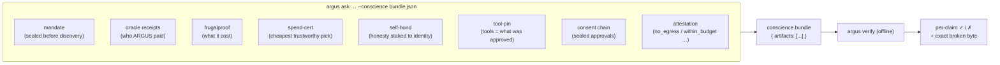
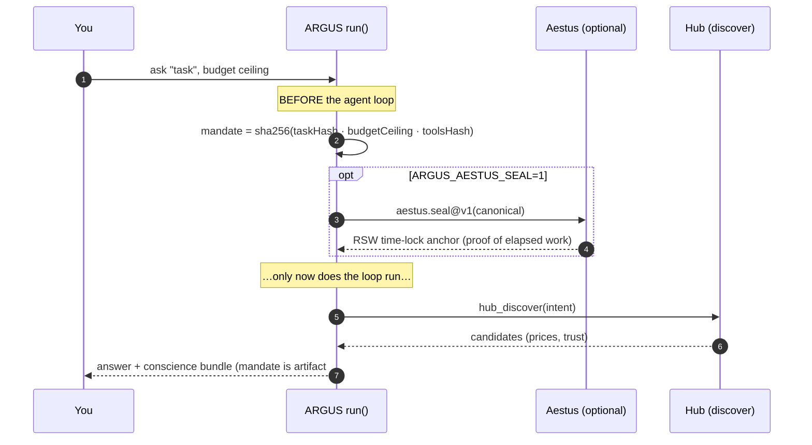
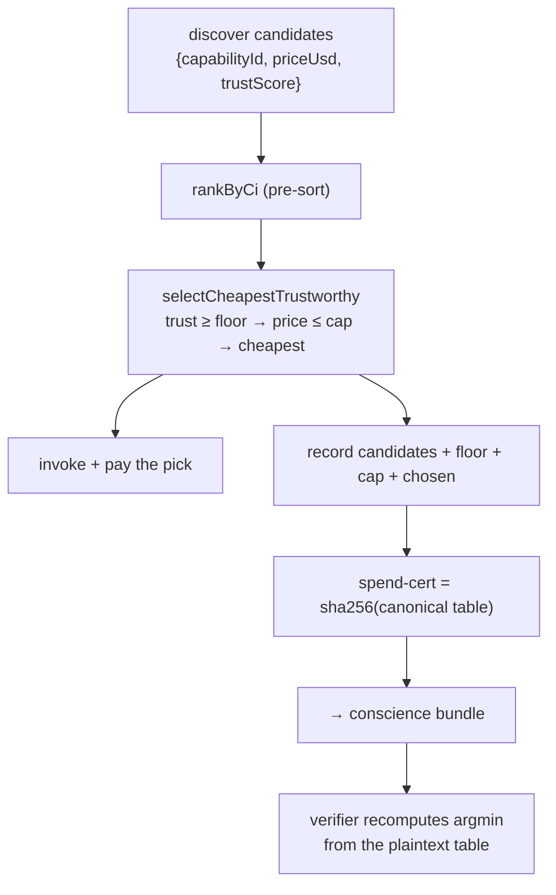
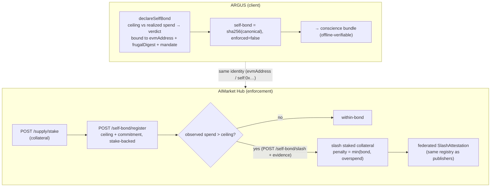

# Верифицируемая совесть

> 🌐 Язык: [English](./verifiable-conscience.md) · **Русский** · [Español](./verifiable-conscience-es.md)

> **Любой другой агент просит вас ему _доверять_. ARGUS даёт вам доказательство и бросает вызов _опровергнуть_ его.**

Определяющая суперсила ARGUS в том, что значимые действия в ходе запуска упаковываются в **один офлайн-перепроверяемый артефакт** — *conscience bundle*. Третья сторона, не доверяющая ни ARGUS, ни сети, ни AICOM, запускает `argus verify <bundle>` и получает **pass/fail по каждому утверждению**, используя чистую локальную криптографию (Ed25519 verify + SHA-256 recompute): **ноль сети, без кошелька**. Если доказательство здесь не перепроверяется — это было утверждение, а не доказательство.

Этот документ описывает каждый механизм с блочными диаграммами, затем — честный охват каждого.

---

## 1. Что в bundle



Каждый артефакт — один из пяти типов верификатора: `oracle-receipt`, `commitment`, `tool-pin`, `sealed-chain`, `attestation`. `mandate`, `spend-cert` и `self-bond` идут как артефакты **`commitment`** (SHA-256 над каноническим plaintext), поэтому верификатору **не нужен новый код** и публичный ключ для них — любой пересчитывает `sha256(preimage) == hash` и вручную воспроизводит вложенную арифметику.

| Artifact | Доказывает | Перепроверка (офлайн) |
|---|---|---|
| `mandate` | задача+бюджет+инструменты были зафиксированы **до** discovery | sha256(canonical) |
| `oracle-receipt` | подписанный результат провайдера подлинен | Ed25519 over the 7-field receipt |
| `frugalproof` | дайджест стоимости сессии | sha256(canonical) |
| `spend-cert` | каждый субконтракт купил самый дешёвый доверенный вариант из показанных | sha256 + hand-recomputed argmin |
| `self-bond` | бережливость+поведение привязаны к идентичности ARGUS | sha256(canonical) |
| `tool-pin` | запущенные инструменты == одобренным | canonical tool-def hash |
| `sealed-chain` | цепочка согласия цела (перестановка/правка ⇒ `brokenAt`) | re-derive chain + Ed25519 head seal |
| `attestation` | отрицательные гарантии соблюдены | Ed25519 over the signed canonical |

---

## 2. Seal-before-discover (mandate)

ARGUS фиксирует **на что ему разрешено действовать** до того, как увидит **кому будет платить** — чтобы ни pitch, ни цена провайдера не могли переориентировать задачу в ходе запуска.



- **Офлайн-ядро:** SHA-256 commitment над `{taskHash, budgetUsd, toolsHash, sealedAt}` — мгновенно, без зависимостей, действительно до-discovery (вычисляется при старте запуска).
- **Опциональный якорь:** `ARGUS_AESTUS_SEAL=1` дополнительно оборачивает canonical в Aestus RSW time-lock (минимум реальных последовательных возведений в квадрат) — *онлайн*-якорь, не часть офлайн-проверки.

---

## 3. Spend-cert (самый дешёвый доверенный выбор)

Когда ARGUS субконтрактирует (`subcontract_invoke`), он записывает набор кандидатов + правило + выбор, чтобы верификатор подтвердил оплату **самого дешёвого варианта выше порога доверия** из показанных.



> **Честный охват.** Это **ARGMIN по записанному набору**, *не* сертификат Fermat/Kantor LP-dual (те — для многоходовой маршрутизации, которую путь spend с одной capability на вызов не делает). Предполагается, что hub вернул полный набор по честным ценам; доказывается выбор по **тому, что записано**, а не глобальная оптимальность и не урегулированная цена. Та же функция `selectCheapestTrustworthy` принимает живое решение и формирует cert, поэтому cert доказывает *фактический* выбор. Обычный `hub_invoke` (capability, выбранная LLM, без правила) не производит spend-cert — и bundle это указывает.

---

## 4. Self-bond + hub self-slash (честность под тем же судом)

ARGUS ставит **собственные** утверждения о бережливости/поведении под тот же slashing court, которым судит других. Две половины: **клиентская декларация** (всегда офлайн-верифицируемая) и **принуждение hub** (реальный stake + slash).



- **Клиент (`ARGUS_SELF_BOND_USD>0` + wallet):** SHA-256 self-indictment, связывающий дайджест стоимости, хеш attestation, commitment mandate, объявленный потолок и фактический расход с идентичностью кошелька ARGUS, с самооценённым вердиктом. `enforced` здесь **всегда false** — это декларация, которую посторонний может опровергнуть офлайн, **не** живой финансовый stake. Средства не двигаются.
- **Hub (`/ai-market/v2/self-bond/*`):** bond должен быть обеспечен реальным застейканным collateral (`/supply/stake`). При **нарушении declared-ceiling-vs-observed-spend** hub срезает этот collateral (`penalty = min(bond, overspend)`) и **федерализует** slash attestation через тот же registry, что и slash издателей.

> **Честный охват.** Hub режет по observed spend, **переданному с dispute** (зеркало `ProofOfMisbehavior`); перекрёстная проверка с **settlement receipts**, выданными hub, — более глубокий follow-up. Hub не видит off-hub token spend ARGUS — только то, что прошло через него — поэтому режет по **hub-наблюдаемым** значениям, никогда по числу, которое не может верифицировать.

### Эндпоинты Hub

| Method | Path | Назначение |
|---|---|---|
| `POST` | `/ai-market/v2/self-bond/register` | stake-backed bond: agent_id, evm_address, ceiling_usd, bond_usd, commitment |
| `POST` | `/ai-market/v2/self-bond/slash` | slash при нарушении: agent_id, observed_spend_usd, evidence (open, dispute-style) |
| `GET` | `/ai-market/v2/self-bond/{agent_id}` | чтение состояния bond |

---

## 5. Верификация bundle

```bash
argus ask "summarize doc X" --budget 0.01 --conscience bundle.json   # produce
argus verify bundle.json                                              # re-check, offline
```

`argus verify` проходит по артефактам и печатает одну строку на утверждение — `Ed25519 signature valid`, `sha256 matches`, `tool-def hash matches`, `consent chain intact`, … — и возвращает ненулевой код при первом сбое, называя сломанное утверждение (напр. sealed chain сообщает `brokenAt` точный переупорядоченный/отредактированный индекс). Измените одну копейку в cost snapshot, подставьте более дешёвого, но недоверенного вендора в spend-cert или переподпишите consent head — соответствующее утверждение станет ✗.

---

## 6. Сквозная линия

Впечатление реально, потому что математика реальна. Каждый артефакт опирается на примитив, который действительно поставляется — Ed25519 oracle receipts, SHA-256 commitments, WARDEN tool-def hash, sealed consent chain и (для self-slash) stake/slash/federated-attestation machinery hub. Где механизм — **декларация**, а не принуждение (клиентский self-bond), или **argmin**, а не dual certificate (spend-cert), метки говорят об этом прямо. ARGUS — агент, которому не нужно доверять — потому что вы можете проверить, а где пока нельзя — он точно указывает границу доверия.
