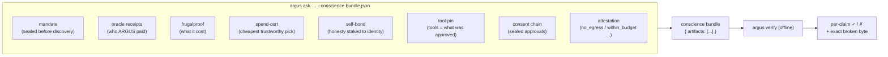
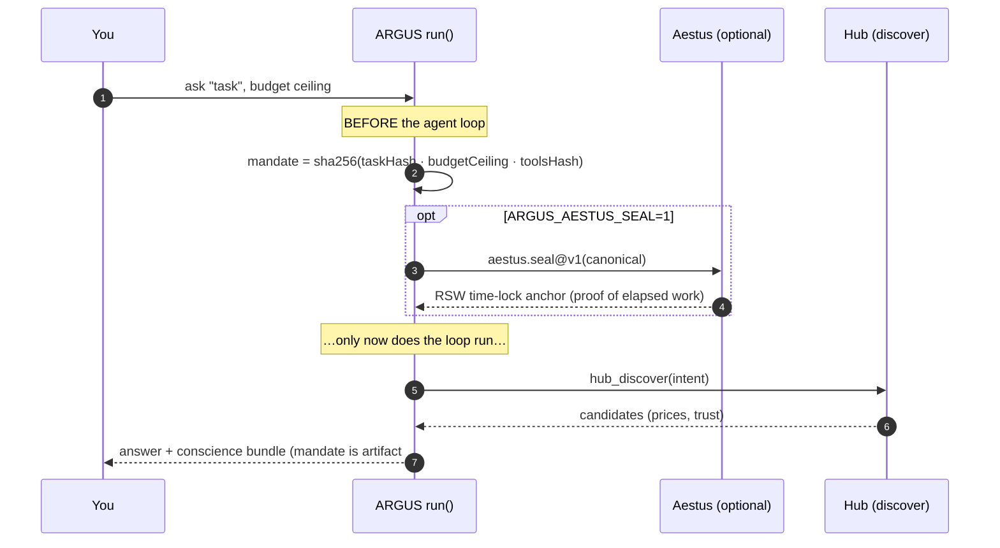
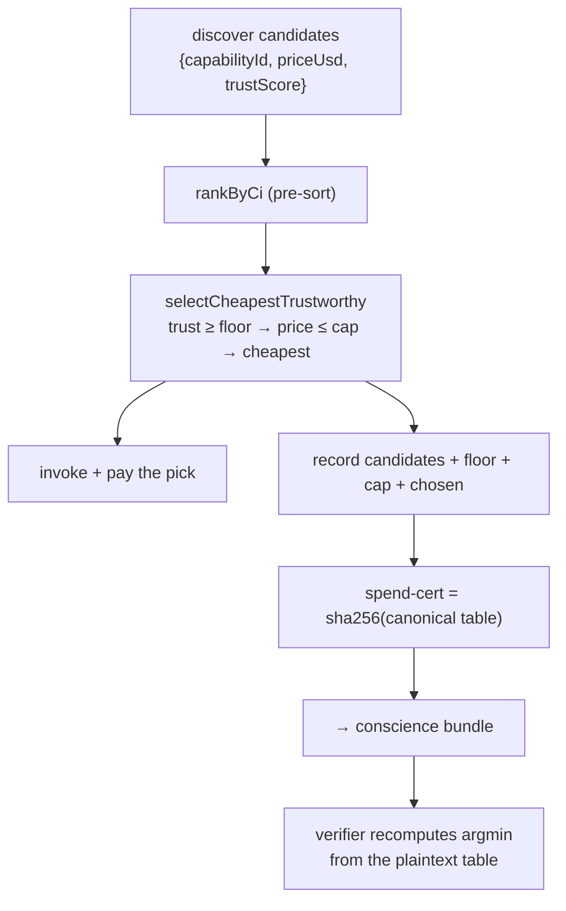
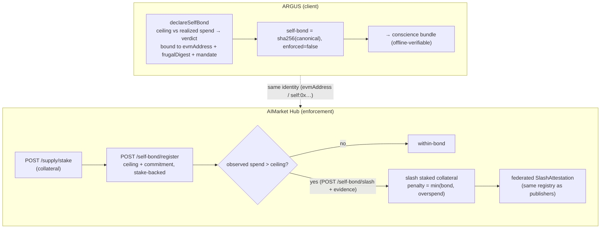

# The Verifiable Conscience

> **Every other agent asks you to _trust_ it. ARGUS hands you a proof and dares you to _refute_ it.**

ARGUS's defining super-power is that the consequential things it does in a run come bundled
into **one offline-recheckable artifact** — a *conscience bundle*. A third party who trusts
neither ARGUS, the network, nor AICOM runs `argus verify <bundle>` and gets a **pass/fail per
claim**, using pure local cryptography (Ed25519 verify + SHA-256 recompute): **zero network,
no wallet**. If a proof doesn't re-verify here, it was a claim — not a proof.

This document describes each mechanism with block diagrams, then the honest scope of each.

---

## 1. What's in the bundle



Each artifact is one of five verifier types — `oracle-receipt`, `commitment`, `tool-pin`,
`sealed-chain`, `attestation`. `mandate`, `spend-cert` and `self-bond` ride as **`commitment`**
artifacts (a SHA-256 over a plaintext canonical), so the verifier needs **no new code** and no
public key for them — anyone recomputes `sha256(preimage) == hash` and re-derives the embedded
arithmetic by hand.

| Artifact | Proves | Re-check (offline) |
|---|---|---|
| `mandate` | the task+budget+tools were fixed **before** discovery | sha256(canonical) |
| `oracle-receipt` | a provider's signed result is authentic | Ed25519 over the 7-field receipt |
| `frugalproof` | the session's cost digest | sha256(canonical) |
| `spend-cert` | each subcontract bought the cheapest trustworthy option shown | sha256 + hand-recomputed argmin |
| `self-bond` | frugality+conduct staked to ARGUS's identity | sha256(canonical) |
| `tool-pin` | the tools that ran == what was approved | canonical tool-def hash |
| `sealed-chain` | the consent chain is intact (reorder/edit ⇒ `brokenAt`) | re-derive chain + Ed25519 head seal |
| `attestation` | negative guarantees held | Ed25519 over the signed canonical |

---

## 2. Seal-before-discover (the mandate)

ARGUS commits to **what it was authorized to do** before it ever sees **who will be paid** —
so no provider's pitch or price can re-aim the task mid-run.



- **Offline core:** a SHA-256 commitment over `{taskHash, budgetUsd, toolsHash, sealedAt}` —
  instant, zero-dependency, genuinely before-discover (computed at run start).
- **Optional anchor:** `ARGUS_AESTUS_SEAL=1` additionally wraps the canonical in an Aestus RSW
  time-lock (a minimum of real sequential squarings) — an *online* anchor, not part of the
  offline check.

---

## 3. Spend-cert (cheapest trustworthy pick)

When ARGUS subcontracts (`subcontract_invoke`), it records the candidate set + rule + the pick,
so a verifier confirms it paid the **cheapest option above the trust floor** it was shown.



> **Honest scope.** This is an **ARGMIN over the recorded set**, *not* a Fermat/Kantor LP-dual
> certificate (those are for multi-hop routing, which the one-capability-per-call spend path
> doesn't do). It assumes the hub returned a complete set at honest prices; it proves the choice
> over **what was recorded**, not global optimality, and not the settled price. The same
> `selectCheapestTrustworthy` function makes the live decision and the cert, so the cert proves
> the *actual* pick. Plain `hub_invoke` (an LLM-chosen capability with no rule) produces no
> spend-cert — and the bundle says so.

---

## 4. Self-bond + hub self-slash (honesty under the same court)

ARGUS stakes its **own** frugality/conduct claims under the same slashing court it judges
others by. There are two halves: a **client declaration** (always offline-verifiable) and the
**hub enforcement** (real stake + slash).



- **Client (`ARGUS_SELF_BOND_USD>0` + wallet):** a SHA-256 self-indictment binding the cost
  digest, attestation hash, mandate commitment, declared ceiling and realized spend to ARGUS's
  wallet identity, with a self-scored verdict. `enforced` is **always false** here — it's a
  declaration a stranger can refute offline, **not** a live financial stake. No funds move.
- **Hub (`/ai-market/v2/self-bond/*`):** the bond must be backed by real staked collateral
  (`/supply/stake`). On a **declared-ceiling-vs-observed-spend breach**, the hub slashes that
  collateral (`penalty = min(bond, overspend)`) and **federates** the slash attestation through
  the same registry publishers' slashes use.

> **Honest scope.** The hub slashes against the observed spend **submitted with the dispute**
> (mirroring a `ProofOfMisbehavior`); cross-checking it against hub-issued **settlement receipts**
> is the deeper follow-up. The hub cannot see ARGUS's off-hub token spend — only what flowed
> through it — so it slashes on **hub-observable** values, never on a number it can't verify.

### Hub endpoints

| Method | Path | Purpose |
|---|---|---|
| `POST` | `/ai-market/v2/self-bond/register` | stake-backed bond: agent_id, evm_address, ceiling_usd, bond_usd, commitment |
| `POST` | `/ai-market/v2/self-bond/slash` | slash on breach: agent_id, observed_spend_usd, evidence (open, dispute-style) |
| `GET` | `/ai-market/v2/self-bond/{agent_id}` | read a bond's state |

---

## 5. Verifying a bundle

```bash
argus ask "summarize doc X" --budget 0.01 --conscience bundle.json   # produce
argus verify bundle.json                                              # re-check, offline
```

`argus verify` walks the artifacts and prints one line per claim — `Ed25519 signature valid`,
`sha256 matches`, `tool-def hash matches`, `consent chain intact`, … — and returns non-zero on
the first failure, naming the broken claim (e.g. the sealed chain reports `brokenAt` the exact
reordered/edited index). Flip one cent in a cost snapshot, swap a cheaper-but-untrusted vendor
into a spend-cert, or re-sign a consent head, and the relevant claim flips to ✗.

---

## 6. The through-line

The awe is real because the math is real. Each artifact rests on a primitive that actually
ships — Ed25519 oracle receipts, SHA-256 commitments, the WARDEN tool-def hash, the sealed
consent chain, and (for self-slash) the hub's stake/slash/federated-attestation machinery.
Where a mechanism is a **declaration** rather than enforcement (the client self-bond) or an
**argmin** rather than a dual certificate (spend-cert), the labels say so plainly. ARGUS is
the agent you don't have to trust — because you can check it, and where you can't yet, it
tells you exactly where the trust boundary is.
